(each Module has many Sections)

Module objectives:
At the end of this module, you should be able to:
- Define cloud architecture
- Describe how to design and evaluate architectures using the `AWS Well-Architected Framework`
- Explain `best practices for building solutions on AWS`
- Describe how to make informed (cho biết) decisions on where to place AWS resources

# introducing cloud architecting (what is cloud architecting?)
key takeaways:
-   Cloud architecture is the practice of applying cloud characteristics to a solution that uses cloud services and features to meet an organization’s technical needs and business use cases

-   You can use AWS services to create highly available, scalable, and reliable architectures

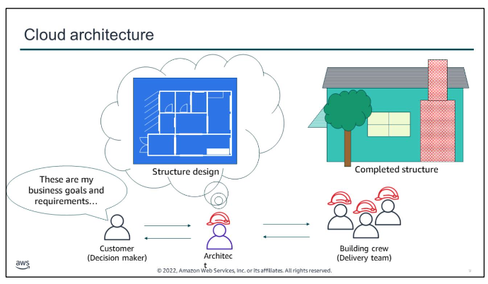  
(slide 12) 
So, what is cloud architecture? 

**Cloud architecture is the practice of applying cloud characteristics to a solution that uses cloud services and features to meet an organization’s technical needs and business use cases. A solution is similar to a blueprint (bản thiết kế) for a building**.

Software systems require architects to manage their size and complexity.

Cloud architects:
- Engage with decision makers to identify the business goals and the capabilities that need improvement.
- Ensure alignment between technology deliverables of a solution and the business goals.
- Work with delivery teams that are implementing the solution to ensure that the technology features are appropriate.

Having well-architected systems increases the likelihood that the technology deliverables will help meet business goals.

# The AWS Architected Framework
key takeaways:

-   The AWS Well-Architected Framework provides a `consistent approach` to evaluate cloud architectures and guidance to help i`mplement designs.
    
-   The AWS Well-Architected Framework is organized into `five pillars`.
    
-   Each pillar documents a `set of foundational questions` that enable you to understand if a specific architecture aligns well with cloud best practices.
    
-   The `AWS Well-Architected Tool` helps you review the state of your workloads and compares them to the latest AWS architectural best practices.

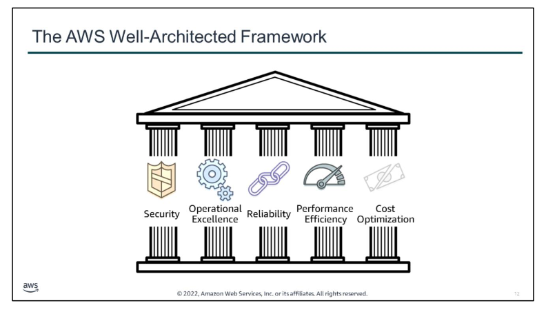
The AWS Well-Architected Framework is a guide that is designed to help you build the most secure, high-performing, resilient, and efficient infrastructure possible for your cloud applications and workloads. 

It provides a consistent approach to evaluate cloud architectures, and guidance to help implement designs. It documents a set of foundational questions and best practices that enable you to understand if a specific architecture aligns well with cloud best practices. AWS developed this framework after reviewing thousands of customer architectures on AWS. [AWS Well-Architected Framework - AWS Well-Architected Framework (amazon.com)](https://docs.aws.amazon.com/wellarchitected/latest/framework/welcome.html) 

The AWS Well-Architected Framework is organized into five pillars: Operational Excellence, Security, Reliability, Performance Efficiency, and Cost Optimization.

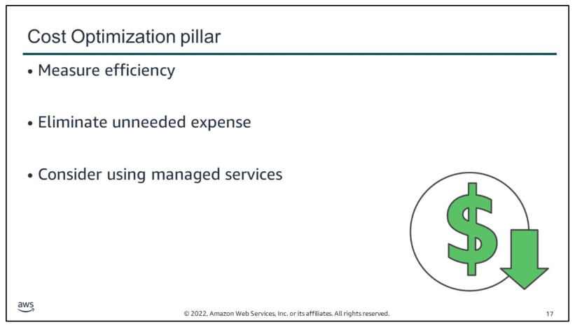
Cost optimization is an ongoing requirement of any good architectural design. The process is iterative (lặp lại), and it should be refined (tinh chỉnh) and improved throughout your production lifetime. 

`Understanding how efficient your current architecture` is in relation to your goals can `remove unneeded expense`. `Consider using managed services` because they operate at cloud scale, and they can offer a lower cost per transaction or service.

For more information, see the Cost Optimization Pillar whitepaper.

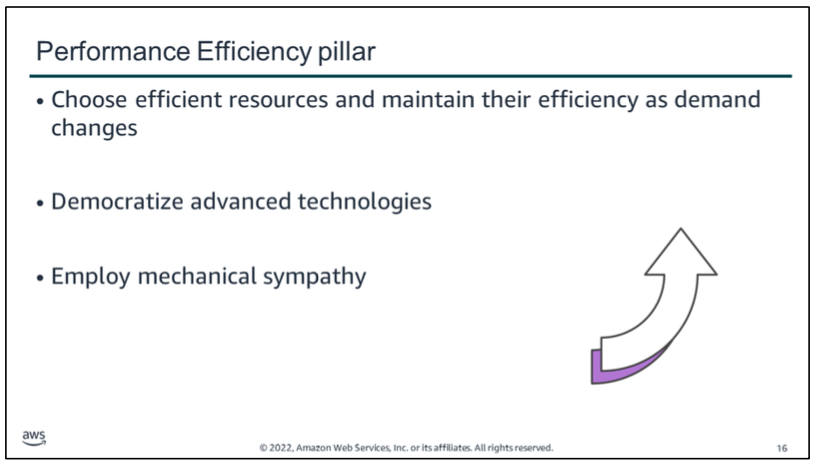

When you consider performance, you want to maximize your performance by using computation resources efficiently. You also want to `maintain that efficiency as the demand changes`.

It is also important to `democratize advanced technologies`. In situations where technology is difficult to implement yourself, consider using a vendor. By implementing the technology for you, the vendor handles the complexity and the knowledge, freeing your team to focus on more value-added work.

`Mechanical sympathy` is when you use a tool or system with an understanding of how it operates best. Use the technology approach that aligns best to what you are trying to achieve. For example, consider data access patterns when you select database or storage approaches.

For more information about performance best practices, see the Performance Efficiency Pillar whitepaper. [Performance Efficiency Pillar - AWS Well-Architected Framework - Performance Efficiency Pillar (amazon.com)](https://docs.aws.amazon.com/wellarchitected/latest/performance-efficiency-pillar/welcome.html)

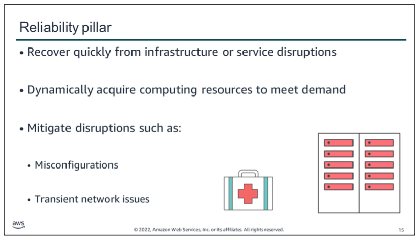

The Reliability pillar addresses the **ability of a system to `recover from infrastructure or service disruptions` and `dynamically acquire computing resources to meet demand`. It also addresses the ability of a system to `mitigate disruptions such as misconfigurations or transient network issues`**.

It can be difficult to ensure reliability in a traditional environment. Issues arise from single points of failure, lack of automation, and lack of elasticity. By applying the best practices outlined in the Reliability pillar, you can prevent many of these issues. It will help you and your customers to have a properly designed architecture with respect to high availability, fault tolerance, and overall redundancy.

For more information about reliability best practices, see the Reliability Pillar whitepaper.

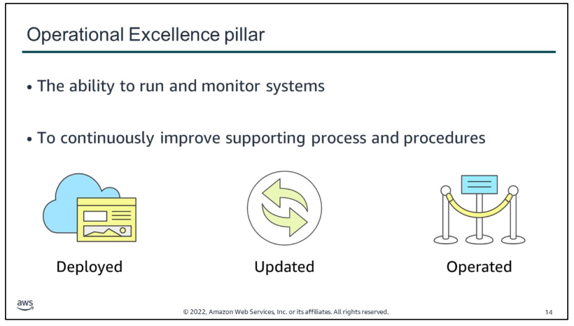
The Operational Excellence pillar addresses the **ability to run systems and gain insight into their operations to deliver business value. It also addresses the ability to continuously improve supporting processes and procedures**.

When you design a workload for operations, you must be aware of how it will be `deployed, updated, and operated`. Implement engineering practices that align with defect reductions and quick, safe fixes. Enable observation with logging, instrumentation, and business and technical metrics so that you can gain insight into what is happening inside your architecture.

In AWS, you can view your entire workload (applications, infrastructure, policy, governance, and operations) as code. It can all be defined in and updated using code. This means that *you can apply the same engineering discipline that you use for application code to every element of your stack*.

For more information about operational excellence best practices, see the Operational Excellence Pillar whitepaper.

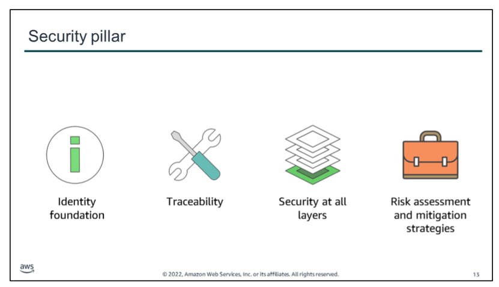
	The Security pillar addresses the ability to **protect information, systems, and assets while delivering business value** through `risk assessments and mitigation strategies`.

Your architecture will present a much stronger security presence if you implement a strong `identity foundation, enable traceability, apply security at all layers, automate security best practices, and protect data in transit and at rest`.

For more information about security best practices, see the Security Pillar whitepaper.
[Security Pillar - AWS Well-Architected Framework - Security Pillar (amazon.com)](https://docs.aws.amazon.com/wellarchitected/latest/security-pillar/welcome.html)

If you would like help with designing a well-architected solution, you can use the AWS Well- Architected Tool. **The AWS Well-Architected Tool is a self-service tool that provides you with on- demand access to current AWS best practices. These best practices can help you build secure, high-performing, resilient, and efficient application infrastructure on AWS.** 

The AWS Well-Architected Tool `helps you review the state of your workloads and compare them to the latest AWS architectural best practices`. It gives you access to knowledge and best practices used by AWS architects, when you need it.

This tool is available in the AWS Management Console. You define your workload and answer a series of questions in the areas of operational excellence, security, reliability, performance efficiency, and cost optimization. The AWS Well-Architected Tool then `delivers an action plan with step-by-step guidance on how to improve your workload for the cloud`.

The AWS Well-Architected Tool `provides a consistent process for you to review and measure your cloud architectures`. You can use the results that the tool provides to identify next steps for improvement, drive architectural decisions, and bring architecture considerations into your corporate governance process.

To learn more about the AWS Well-Architected Tool, see the AWS Well-Architected Tool website. [Optimized IT Architecture Tools – AWS Well-Architected Tool – Amazon Web Services](https://aws.amazon.com/well-architected-tool/)

# Best practices for builiding solutions on AWS
Key takeaways:

-   As you design solutions, evaluate (phỏng đoán) tradeoffs (đánh đổi) and base your decisions on empirical (thực nghiệm, kinh nghiệm) data
    
-   Follow these best practices when building solutions on AWS:
    
    -   Enable scalability (khả năng mở rộng)
        
    -   Automate your environment
        
    -   Treat resources as disposable (đồ dùng một lần)
        
    -   Use loosely-coupled (liên kết lỏng lẻo) components 
        
    -   Design services, not servers
        
    -   Choose the right database solution
        
    -   Avoid single points of failure
        
    -   Optimize for cost
        
    -   Use caching (bộ nhớ đệm)
        
    -   Secure your entire (toàn bộ) infrastructure

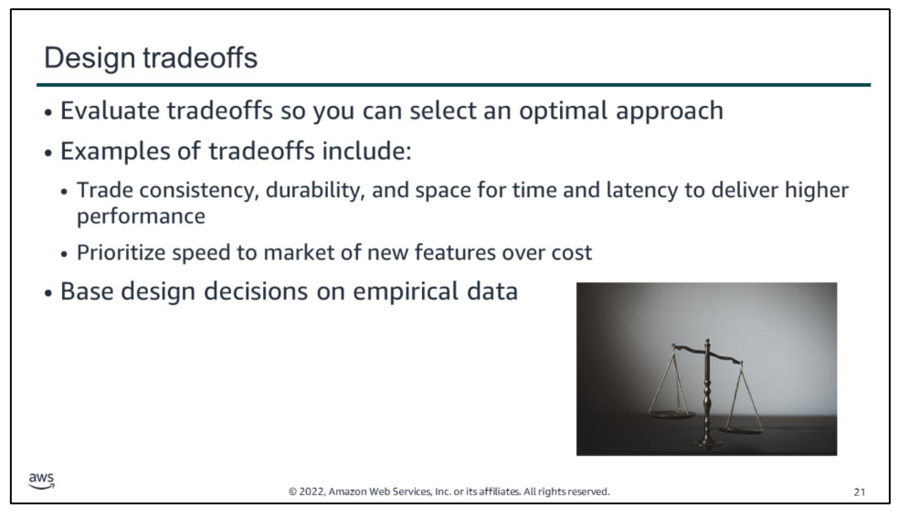
As you design a solution, think carefully about `tradeoffs so that you can select an optimal approach`. 
For example, you might trade consistency, durability, and space for time and latency to deliver higher performance. Or, you might prioritize speed to market over cost.

Tradeoffs can *increase the cost and complexity of your architecture*, so `your design decisions should be based on empirical data`. 
For example, you might need to perform load testing to ensure that a measurable benefit is obtained in performance. Or, you might need to perform benchmarking to achieve the most cost-optimal workload over time. When you evaluate performance-related improvements, you will also want to consider how your architecture design choices will impact customers and workload efficiencies.

In this section, you will learn about best practices for designing solutions on AWS. You will also learn about anti-patterns (or bad solution designs) to avoid.

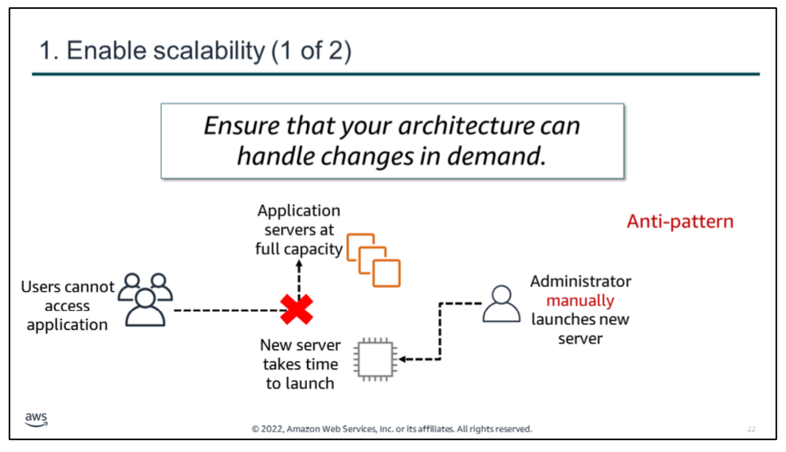
When you run your workloads on the AWS Cloud, you can scale your infrastructure quickly and proactively. Make sure that you implement *scalability at every layer of your infrastructure*.

To understand the importance of scalability, consider this anti-pattern, where scaling is done reactively and manually.

In this scenario, when application servers reach full capacity, users are prevented from accessing the application. Administrators then manually launch one or more new instances to manage the load. Unfortunately, it takes a few minutes for an instance to become available for use after it’s launched. That increases the time that users can’t access the application.

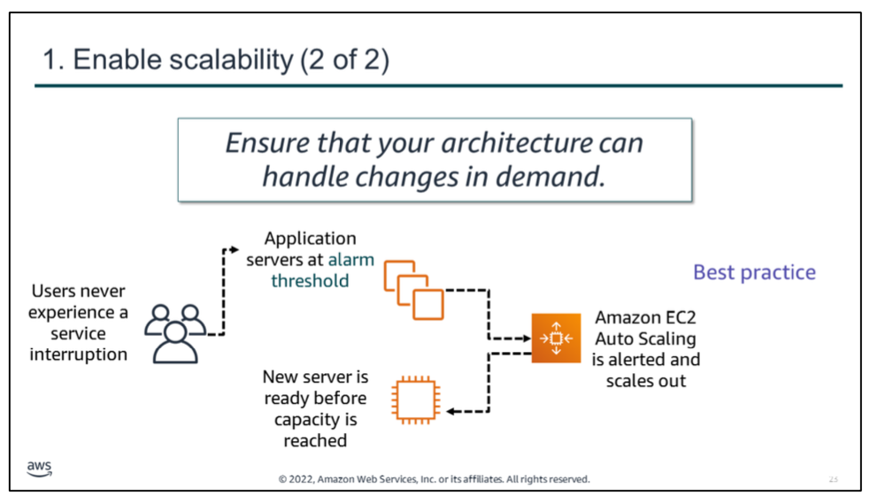

By enabling scalability, you can improve your design to anticipate the need for more capacity and deliver it before it's too late.

For example, you can *use a monitoring solution like Amazon CloudWatch to detect whether the total load across your fleet of servers has reached a specified threshold*. You can define this threshold to be Stayed above 60% CPU utilization for longer than 5 minutes, or anything related to the use of resources. With CloudWatch, you can also design custom metrics based on specific applications that can trigger the resource scaling that is required.

When an alarm is triggered, Amazon EC2 Auto Scaling immediately launches a new instance. That instance is then ready before capacity is reached, which provides a seamless experience for users.

Ideally, you should also design your system to scale in when demand drops off so that you're not running (and paying for) instances that you no longer need.

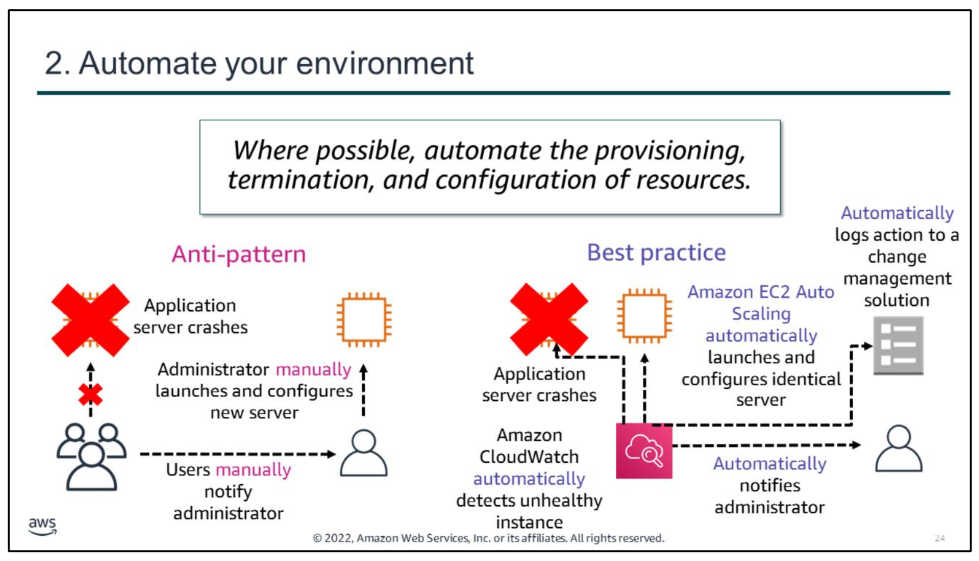
*AWS offers built-in monitoring and automation tools at virtually every layer of your infrastructure*. Take advantage of these tools to ensure that your infrastructure can respond quickly to changes.

You can use tools like CloudWatch and Amazon EC2 Auto Scaling to detect unhealthy resources and automate the launch of replacement resources. You can also be notified when resource allocations change.

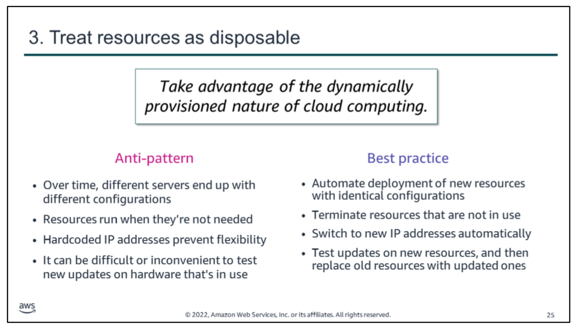
The best practice of treating resources as disposable refers to the idea of thinking about your infrastructure as software instead of hardware.

With hardware, it's easy to buy more specific components than you need so that you are prepared for spikes in usage. That’s expensive and inflexible—it’s harder to upgrade because of the sunk cost.

Instead, when you treat your resources as disposable, migrating between instances or other discrete resources is fairly straightforward. You can quickly respond to changes in capacity needs, upgrade applications, and manage the underlying software.

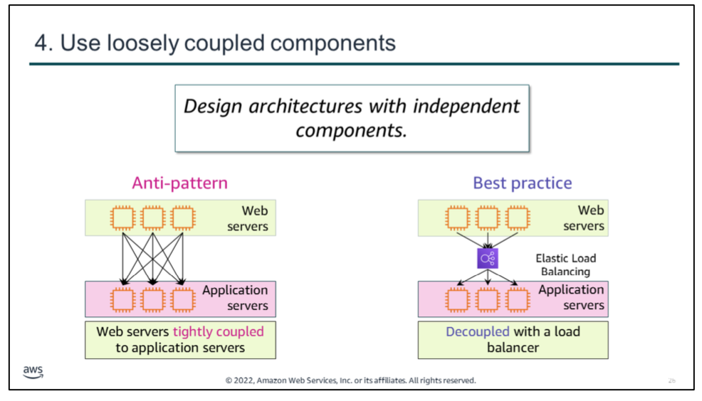
Traditional infrastructures have chains of tightly integrated servers, each with a specific purpose. The problem is that when one of those components or layers goes down, the disruption to the system can be fatal. It also impedes scaling. If you add or remove servers at one layer, you must also connect every server on each connecting layer.

The example on the left illustrates a collection of web and application servers that are tightly coupled. If one application server goes down, an error will be caused because the web servers try and fail to connect to it.

With `loose coupling`, you use managed solutions as intermediaries between the layers of your system. With this design, the intermediary automatically handles both failures and the scaling of components or layers.

The example on the right shows a load balancer (in this case, an Elastic Load Balancing load balancer) that routes requests between the web servers and the application servers. If one application server goes down, the load balancer will automatically start directing all traffic to the two healthy servers.

Two primary solutions for decoupling your components are `load balancers` and `message queues`.

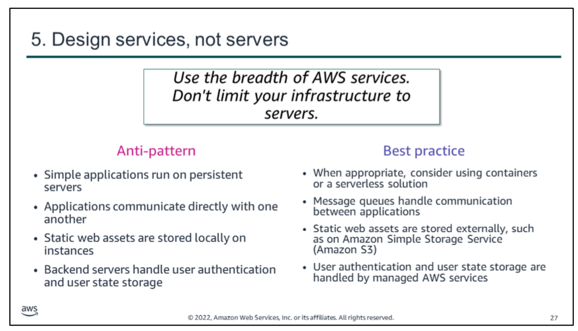
The next best practice is to design services, not servers. Although Amazon Elastic Compute Cloud (Amazon EC2) offers tremendous flexibility for designing and setting up your solution, it shouldn’t always be the first (or only) solution that you use for every need. In some cases, containers or a serverless solution might be more appropriate. Therefore, it’s important to consider what your needs are and which solution is appropriate.

With AWS serverless solutions and managed services, you don’t need to provision, configure, and manage an entire Amazon EC2 instance.

Managed solutions that have a lower profile and are more performant can replace server-based solutions at a lower cost. A few examples are AWS Lambda, Amazon Simple Queue Service (Amazon SQS), Amazon DynamoDB, Elastic Load Balancing, Amazon Simple Email Service (Amazon SES), and Amazon Cognito.

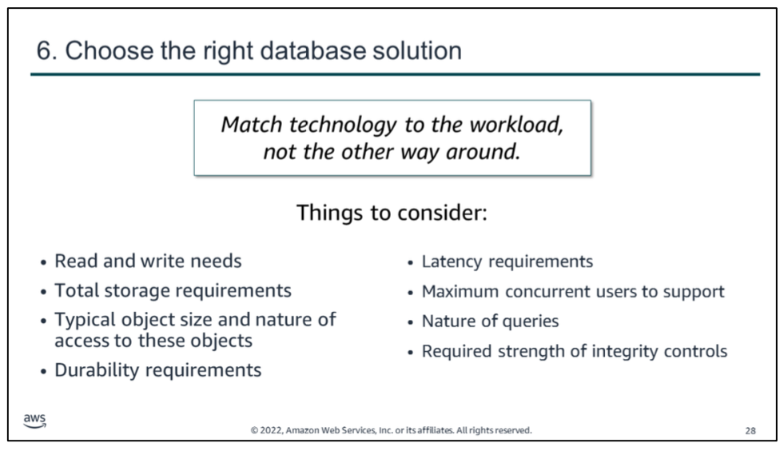
It is important that you choose the right database solution. In traditional data centers and on- premises environments, limits on available hardware and licenses can constrain your choice of a data store solution. AWS recommends that you choose a data store based on your needs for your application environment.

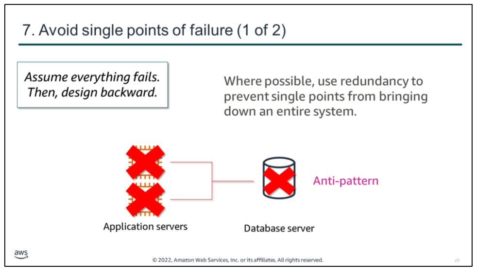

Where possible, eliminate (loại trừ) single points of failure from your architecture. This doesn't mean that you must always duplicate every component. *Depending on your downtime service-level agreements (SLAs), you can use automated solutions that only launch components when needed*. You can also use a managed service, where AWS automatically replaces malfunctioning (sự cố) underlying hardware for you.

This simple system shows two application servers connected to a single database server. `The database server represents a single point of failure and should be avoided`. When it goes down, the application servers also go down.

Application servers should continue to function even if the underlying physical hardware fails, is removed, or replaced.

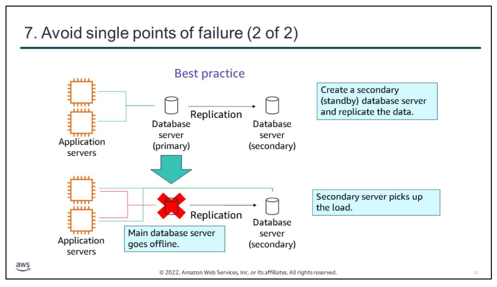

A common way to avoid single points of failure is to *create a secondary (standby) database server and replicate the data. This way, if the main database server goes offline, the secondary server can pick up the load*.

In this example, when the main database goes offline, the application servers automatically send their requests to the secondary database. This example also exemplifies (chứng minh bằng ví dụ) Best Practice #3: Treat resources as disposable, and design your applications to support changes in hardware.

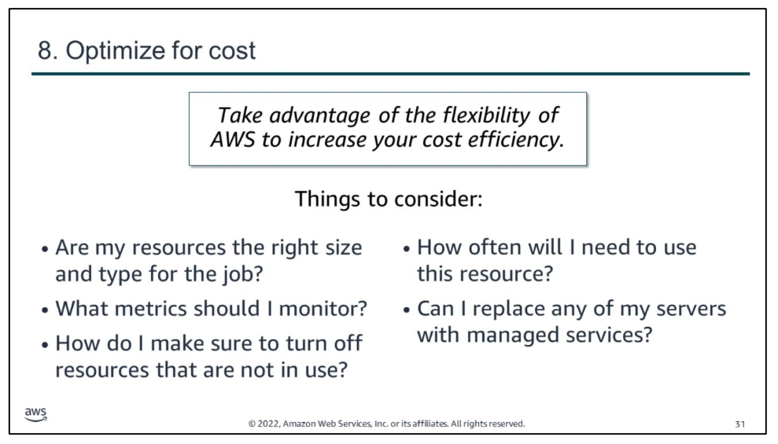

Cloud computing allows you to `trade capital expense for variable expense`. **Capital expenses (capex)** are funds that a company uses to acquire, upgrade, and maintain physical assets such as property, industrial buildings, or equipment. Under this model, you pay for the servers in the data center, whether they are active or not.

By contrast, AWS services use a *variable expense* cost model, which means that you pay only for the individual services you need, for as long as you use them. Within each service, you can optimize for cost. `Many services offer different pricing tiers, models, or configurations`.

Keep in mind that it can be very expense (phí tổn) to replicate an on-premises data center setup of servers running 24/7 in the cloud. Therefore, the best way to build your infrastructure, from a cost perspective (viễn cảnh), is to only provision the resources that you need and stop services when they are not being used.

`Caching` is a technique to make future requests faster and reduce network throughput by temporarily storing data in an intermediary location between the requester and the permanent storage.

In the anti-pattern example, no caching service is used. When anyone requests a file from one of the Amazon Simple Storage Service (Amazon S3) buckets, each request takes the same amount of time to complete, and each request costs the same.

In the best-practice-pattern example, the infrastructure uses Amazon CloudFront in front of Amazon S3 to providing caching. In this scenario, the initial (đầu tiên) request checks for the file in Amazon CloudFront. If it is not found, CloudFront requests the file from Amazon S3. CloudFront then stores a copy of the file at an edge location close to the user, and sends a copy to the user who made the request. Subsequent requests for the file are retrieved from the (now closer) edge location in CloudFront instead of Amazon S3.

**This reduces latency and cost because, after the first request, you no longer pay for the file to be transferred out of Amazon S3**.

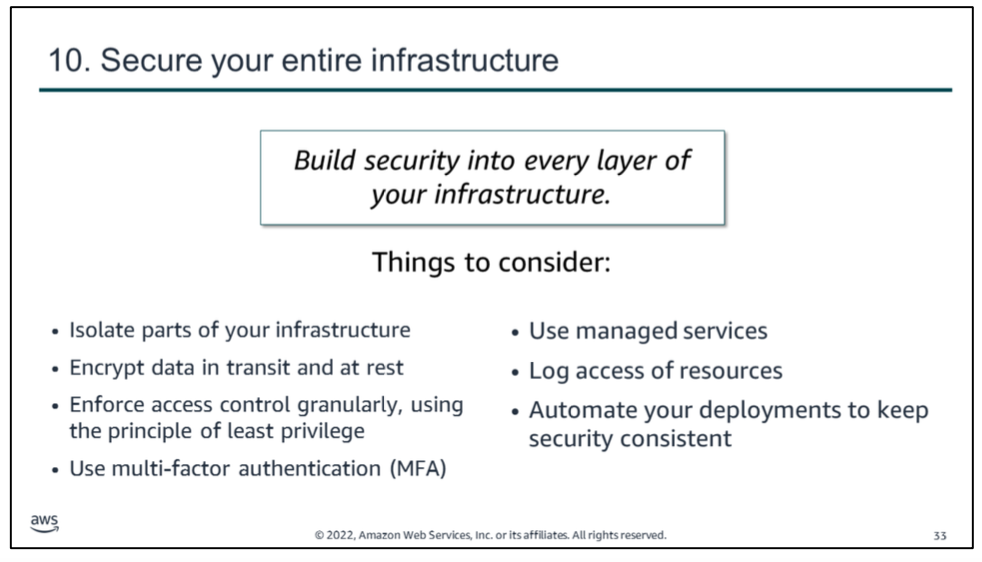
Security isn’t only about getting through the outer boundary of your infrastructure. It also involves ensuring that your individual environments and their components are secured from each other.

For example, in Amazon EC2, you can create security groups that allow you to determine (xác định) which ports on your instances can send and receive traffic. Security groups can also determine where that traffic can come from or go to.

You can use security groups to reduce the probability that a security threat on one instance will spread to every other instance in your environment. You should take similar precautions (đề phòng) with other services. Specific ways to implement this best practice are discussed throughout the course.

# AWS Global insfrastructure

key takeaways:

-   The AWS global infrastructure consists of Regions and Availability Zones, and edge locations.
    
-   Your choice of a Region is typically based on `compliance requirements` or to `reduce latency`.
    
-   Each Availability Zone is physically separate from other Availability Zones and has redundant (dư thừa) power, networking, and connectivity
    
-   Edge locations and Regional edge caches improve performance by caching content closer to users. 

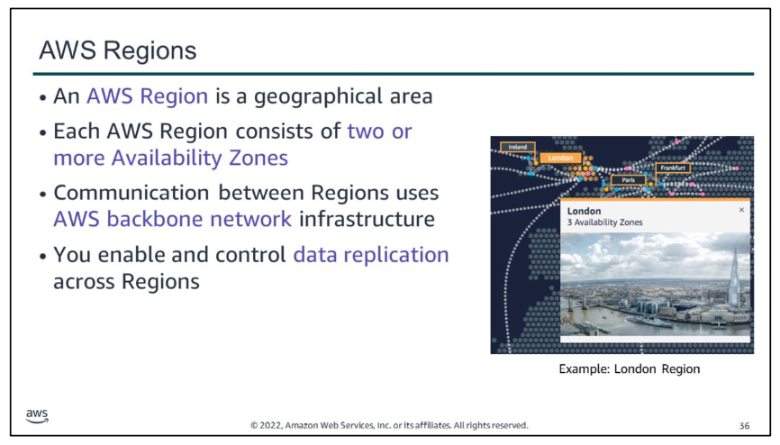
The AWS Cloud infrastructure is built around `Regions`. 
AWS has 22 Regions worldwide. An AWS Region `is a physical *geographical location* with two or more `Availability Zones. `Availability Zones` in turn consist of one or more `data centers`.

AWS Regions are connected to multiple Internet Service Providers (ISPs). Regions are also connected to a `private global network backbone`, which provides lower cost and more consistent cross-Region network latency when compared with the public internet.

AWS Regions that were introduced before March 20, 2019 are enabled by default. Regions that were introduced after March 20, 2019—such as Asia Pacific (Hong Kong) and Middle East (Bahrain)—are disabled by default. You must enable these Regions before you can use them. You can use the AWS Management Console to enable or disable a Region.

Some Regions have restricted access. An AWS (China) account provides access to the Beijing and Ningxia Regions only. To learn more about AWS in China, see the AWS in China page. The isolated AWS GovCloud (US) Region is designed to allow US government agencies and customers to move sensitive workloads into the cloud by addressing their specific regulatory and compliance requirements. 
https://www.amazonaws.cn/en/about-aws/china/ 

*To achieve fault tolerance and stability, Regions are isolated from one another. Resources in one Region are **not automatically replicated to other Regions***.
When you store data in a specific Region, it is not replicated outside that Region. It is your responsibility to replicate data across Regions, if your business needs require it. AWS provides information about the country and—where applicable—the state where each Region resides. You are responsible for selecting the Region where you should store data, based on your compliance and network latency requirements.

AWS products and services are available by Region, so you might not see all Regions available for a given service. For a list of AWS services offered by Region, see the Region Table. [AWS Regional Services (amazon.com)](https://aws.amazon.com/about-aws/global-infrastructure/regional-product-services/) 

For more information about the AWS global cloud infrastructure, see the Global Infrastructure website. For a current and interactive map of the AWS global infrastructure, see the Interactive AWS Global Infrastructure map. [Global Infrastructure Regions & AZs (amazon.com)](https://aws.amazon.com/about-aws/global-infrastructure/regions_az/) 

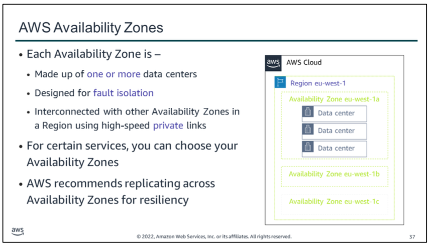

Each AWS Region consists of two or more isolated locations that are known as Availability Zones. Each Availability Zone comprises one or more data centers, with some Availability Zones having as many as six data centers. However, no data center can be a part of two Availability Zones.

Each Availability Zone is designed as an independent failure zone. This means that Availability Zones are physically separated within a typical metropolitan Region. They are also located in lower-risk flood plains (specific flood-zone categorization varies by Region). In addition to having a discrete uninterruptible power supply and onsite backup generation facilities, they are each fed via different grids from independent utilities to further reduce single points of failure. Availability Zones are all redundantly connected to multiple tier-1 transit providers.

An Availability Zone is the most granular level of specification that you can make for certain services, such as Amazon EC2.

You are responsible for selecting the Availability Zones where your systems will reside. **Systems can span multiple Availability Zones**. You should design your systems to survive temporary or prolonged failure of an Availability Zone if a disaster occurs. Distributing applications across multiple Availability Zones enables them to remain resilient in most failure situations, including natural disasters or system failures.

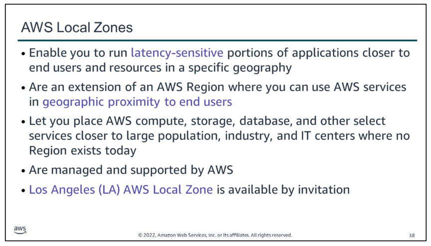

**AWS Local Zones are a new type of AWS infrastructure deployment that places AWS compute, storage, database, and other select services closer to large population, industry, and IT centers where no AWS Region exists today**. 
With AWS Local Zones, you can run latency-sensitive portions of applications closer to end users and resources in a specific geography. You can use AWS Local Zones to deliver single-digit millisecond latency for use cases such as media and entertainment content creation, real-time gaming, reservoir (kho, bể chứa) simulations (mô phỏng), electronic design automation, and machine learning.

**Each AWS Local Zone location is an extension of an AWS Region**. You can run latency-sensitive applications in an AWS Local Zone by using AWS services such as Amazon EC2, Amazon Virtual Private Cloud (Amazon VPC), Amazon Elastic Block Store (Amazon EBS), Amazon FSx, and Elastic Load Balancing in geographic proximity to end users. 
AWS Local Zones provide a high- bandwidth, secure connection between local workloads and workloads that run in the AWS Region. Thus, AWS Local Zones enable you to seamlessly (liền mạch) connect back to your other workloads that are running in AWS and connect to the full range of in-Region services through the same APIs and toolsets.

**AWS Local Zones are managed and supported by AWS, and provide you with all the elasticity, scalability, and security benefits of the cloud**. 
With AWS Local Zones, you can build and deploy latency-sensitive applications closer to your end users by using a consistent set of AWS services. You can also scale up or scale down, and you pay only for the resources that you use.

The Los Angeles AWS Local Zone is generally available by invitation today, and you can expect more Local Zones to come.

To learn more about AWS Local Zones, see the AWS Local Zones page. [Deployment –AWS Local Zones–Amazon Web Services](https://aws.amazon.com/about-aws/global-infrastructure/localzones/?p=ngi&loc=3) 

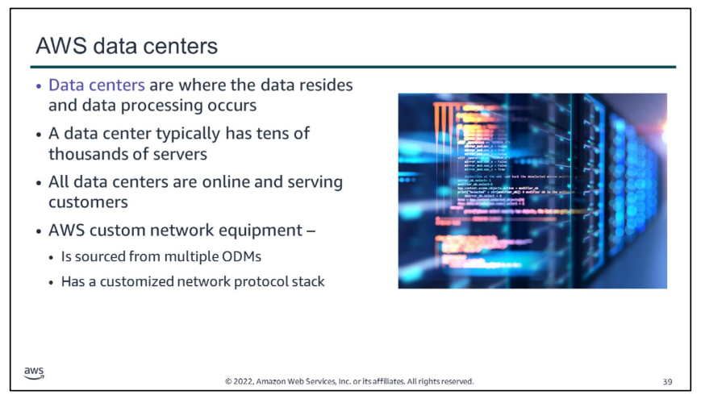

The foundation for the AWS infrastructure is the data centers. **You do not specify a data center for the deployment of resources**. However, a data center is the location where the actual data resides. Amazon operates state-of-the-art, highly available data centers. Though rare, failures that affect the availability of instances in the same location can occur. If you host all your instances in a single location that is affected by such a failure, none of your instances will be available.

All data centers are online and serving customers. In case of failure, automated processes move customer data traffic away from the affected area. Core applications are deployed in an N+1 configuration, so that in the event of a data center failure, there is sufficient (hợp lý) capacity to enable traffic to be load balanced to the remaining sites.

AWS uses custom network equipment sourced from multiple `original device manufacturers (ODMs)`. ODMs design and manufacture products based on specifications from a second company. The second company then rebrands the products for sale.

For more information about AWS data centers, see Learn how we secure AWS data centers by design. [AWS Data Centers - Amazon Web Services (AWS)](https://aws.amazon.com/compliance/data-center/) 

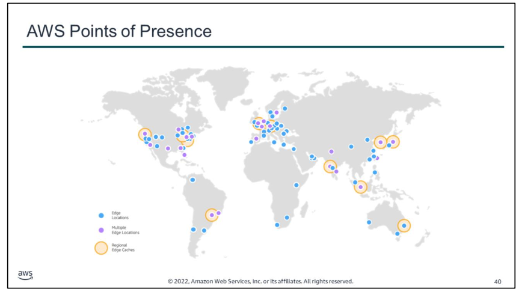
To deliver content to end users with lower latency, Amazon CloudFront uses a global network that includes over 200 Points of Presence (POP) that are comprised (bao gồm) of Edge Locations and Regional Edge Caches.

Edge locations are located in North America, Europe, Asia, Australia, South America, the Middle East, Africa, and China. Edge locations support AWS services like Amazon Route 53 and Amazon CloudFront.

**Regional edge caches are used by default with Amazon CloudFront**. They are used when you have content that is not accessed frequently enough to remain in an edge location. Regional edge caches absorb  (hấp thu) this content and provide an alternative to fetching the content from the origin server.

For more information about the Amazon CloudFront infrastructure, see Amazon CloudFront infrastructure at  [Key Features of a Content Delivery Network – Performance, Security – Amazon CloudFront](https://aws.amazon.com/cloudfront/features/?whats-new-cloudfront.sort-by=item.additionalFields.postDateTime&whats-new-cloudfront.sort-order=desc%2523Amazon_CloudFront_Infrastructure) 

# wrap-up
In summary, in this module, you learned how to:

-   Define cloud architecture
    
-   Describe how to design and evaluate architectures using the AWS Well-Architected Framework
    
-   Explain best practices for building solutions on AWS
    
-   Describe how to make informed decisions on where to place AWS resources

If you want to learn more about the topics covered in this module, you might find the following additional resources helpful:

-   AWS Global Infrastructure page
    [Global Infrastructure (amazon.com)](https://aws.amazon.com/about-aws/global-infrastructure/)
-   Interactive AWS Global Infrastructure map
    [Global Infrastructure Regions & AZs (amazon.com)](https://aws.amazon.com/about-aws/global-infrastructure/regions_az/) 
-   AWS Well-Architected Framework whitepaper
    [AWS Well-Architected Framework - AWS Well-Architected Framework (amazon.com)](https://docs.aws.amazon.com/wellarchitected/latest/framework/welcome.html)
-   Security Pillar whitepaper
    
-   Operational Excellence Pillar whitepaper
    
-   Reliability Pillar whitepaper
    
-   Performance Efficiency Pillar whitepaper
    
-   Cost Optimization Pillar whitepaper

# KC
