# Overview
Sections:

1.  The simplest architecture
2.  Using Amazon S3
3.  Storing data in Amazon S3
4.  Moving data to and from Amazon S3
5.  Choosing Regions for your architecture
    

Demonstrations :

-   An educator-led demonstration that will show you how the `Amazon S3 versioning` feature works.
    
-   An educator-led demonstration that will show you how to configure `Amazon S3 Transfer Acceleration`.

Labs: 
-   A hands-on guided lab, where detailed step-by-step instructions explain how to create an Amazon S3 bucket and configure it to `host a simple website`.
    
-   A hands-on `challenge lab` where you will `deploy a static website to support the café scenario`.
    

# objectives
At the end of this module, you should be able to:

-   Recognize the problems that Amazon Simple Storage Service (Amazon S3) can solve
-  Decribe how to store content efficiently by using Amazon S3
-   Recognize the various Amazon S3 storage classes and cost considerations
-   Describe how to move data to and from Amazon S3
-   Describe how to choose a Region
-   Create a static website

    
# section 1.  The simplest architecture

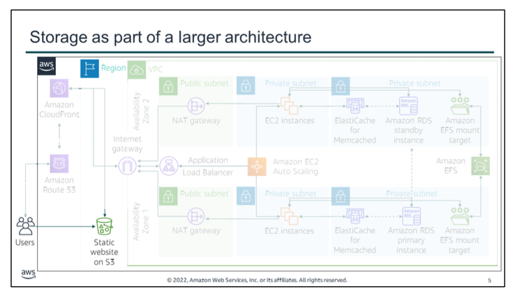
As each module introduces new features, those parts of this larger diagram will be revealed.

In this module, you start with one of the simplest of architectures that can be implemented on AWS, which is creating a static website by hosting it entirely on Amazon S3. You will also learn about the various Amazon S3 storage options and some key considerations for when you choose a Region on AWS.

# section  2. Using Amazon S3

key takeaways:

-   Buckets must have a `globally unique name` and are defined at the `Region level`
-   Buckets are *private and protected by default*
-   Amazon S3 security can be configured with IAM policies, bucket policies, access control lists, S3 access points, and `presigned URLs`
-   Amazon S3 is *strongly consistent* for all new and existing objects in all Regions
-   5 TB is the maximum size of a single object, but you can store a virtually unlimited number of objects
-   Amazon S3 is often used as a data store for computation and analytics, and as a backup and archive service for critical data.

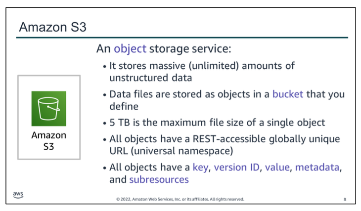

Amazon S3 is an `object` storage service. It enables you to `store virtually unlimited amounts of data`. 
Data files are stored as objects. You place objects in a `bucket`, which you define. Every bucket must have name that is globally unique across Regions. This means that the bucket name must be unique across all AWS customer accounts.

The objects you store can vary in size from 0 bytes to `5 TB`. Though individual objects cannot be larger than 5 TB, you can store as much total data as you need.

Each object has ***five consistent (nhất quán) characteristics.***
- First, it has a `key`, which is the *name* that you assign to an object. *You use the object key to retrieve the object*. In the AWS Management Console, you can create a directory inside a bucket, and upload an object to that directory. 
  However, in reality, Amazon S3 does not know about directories, so the *key value includes the full path relative to the bucket root.*
- Objects also include a `version ID`. *In a bucket, a key and version ID uniquely identify an object. *You will learn more about versioning later in this module.
- The `value` of the object is the actual content that you store. It can be any sequence of bytes. Object values are *immutable* (bất biến), which means that after you upload an object, you cannot modify the value. 
  If you want to modify the object, you must make a change outside of Amazon S3 and then reupload the object.
- Objects also include `metadata`, which is a *set of name-value pairs you can use to store information about the object*. You can assign metadata, which is referred to as user-defined metadata, to your objects in Amazon S3. *Amazon S3 also assigns system-metadata to these objects, which it uses for managing objects.*
- Finally, Amazon S3 also uses `subresources` to store additional object-specific information.

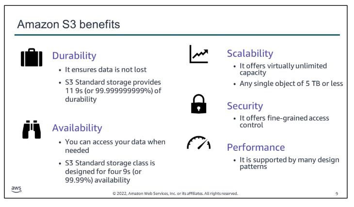
Amazon S3 provides many features that make it an important component of many solutions built on AWS.

- First, it provides `durability`, which describes the average annual expected loss of objects. 
  *11 9s of durability means that every year, there is a 0.000000001 percent chance of losing an object. *
  For example, if you store 10,000 objects on Amazon S3, you can expect to incur a loss of a single object once every 10,000,000 years on average. Amazon S3 redundantly stores your objects on multiple devices across multiple facilities in the Amazon S3 Region you designate. Amazon S3 is designed to sustain concurrent device failures by quickly detecting and repairing any lost redundancy. Amazon S3 also regularly verifies the integrity of your data by using checksums.
- Amazon S3 also provide four 9s (or 99.99 percent) of `availability`. Availability refers to your *ability to access your data quickly, when you want it*. 
  - It also provides a virtually unlimited capacity to store your data, so it is `scalable` 
  - Amazon S3 has robust (khỏe mạnh, ngay thẳng) `security` settings. 
  It provides *many ways to control access to the data that you store, and also enables you to encrypt* your data.
  - Finally, Amazon S3 is `highly performant`, with a first-byte latency that is measured in milliseconds for most storage classes. For more information about S3 `performance` design patterns, see the Amazon S3 Documentation. Common approaches include using caching for frequently accessed content; configurable retry and timeout logic for objects that receive significant request traffic in a short period of time; and horizontal scaling and request parallelization for high throughput across the network. [Performance Design Patterns for Amazon S3 - Amazon Simple Storage Service](https://docs.aws.amazon.com/AmazonS3/latest/userguide/optimizing-performance-design-patterns.html) 

WHAT PROBLEMS CAN YOU SOLVE BY USING AMAZON S3? YOU WILL NOW CONSIDER SOME USE CASES.

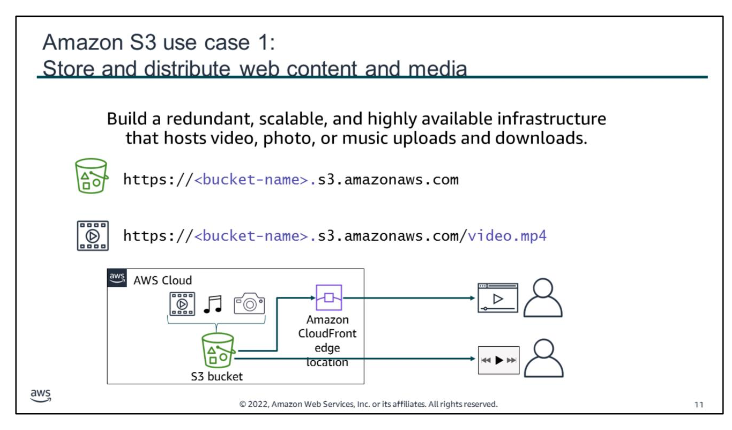
On common use scenario for Amazon S3 is to use it for *media hosting*. In this use case, Amazon S3 is used to store and distribute videos, photos, music files, and other media. This content can be delivered directly from Amazon S3 because each object in Amazon S3 has a unique HTTP URL.

Alternatively, Amazon S3 can serve as an origin store for a *content delivery network (CDN)*, such as *Amazon CloudFront.* The elasticity of Amazon S3 makes it well-suited for hosting web content that needs bandwidth to address extreme demand spikes. Also, because you do not need to provision storage for Amazon S3, it works well for fast growing websites that host data-intensive, user-generated content, such as video and photo-sharing sites.

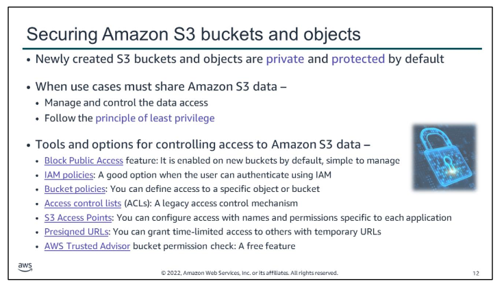
*By default, all S3 buckets are private and can be accessed only by users who are explicitly (rõ ràng) granted access. 
It is essential that you manage and control access to Amazon S3 data. 

AWS provides many **tools and options for controlling access to your S3 buckets or objects**, such as:

-   Using `Amazon S3 Block Public Access`. These settings override any other policies or object permissions. Enable Block Public Access for all buckets that *you don't want to be publicly accessible*. This feature provides a straightforward method for avoiding *unintended exposure (phơi bày không lường trước)* of Amazon S3 data.
-   Writing `AWS Identity and Access Management (IAM) policies` that *specify the users or roles* that can access specific buckets and objects.
-   Writing `bucket policies` that define access to specific buckets or objects. This option is typically used when the user or system cannot authenticate by using IAM. Bucket policies can be configured to grant access across AWS accounts or to grant public or anonymous access to Amazon S3 data. If bucket policies are used, they should be written carefully and tested fully. *You can specify a deny statement in a bucket policy to restrict access. Access will be restricted even if the users have permissions that are granted in an identity-based policy that is attached to the users*.
- Setting `access control lists (ACLs)` on your buckets and objects. ACLs are less commonly used (ACLs predate IAM). If you use ACLs, do not set access that is too open or permissive (dễ dãi, tùy ý).
-   Creating `S3 Access Points`. Access points are unique hostnames that enforce distinct permissions and network controls for requests that are made through it.
  Customers with shared datasets can scale access for many applications by creating individualized access points with names and permissions that are customized for each application.
-  `Presigned URLs` 
-   `AWS Trusted Advisor` provides a bucket permission check feature. It is a useful tool for discovering if any of the buckets in your account have permissions that grant global access.
- 

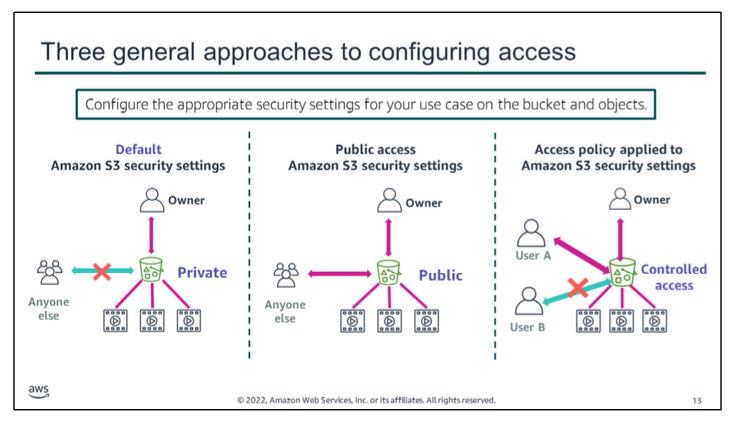
Here are three different general approaches to configuring access to objects in an S3 bucket.

*The scenario on the left* shows the default security settings for Amazon S3. *By default, all Amazon S3 buckets and the objects stored in them are private (protected)*. The only entities with access to a newly created, unmodified bucket are the account administrator and the AWS account root user. The resource owner can grant specific access permissions to others, but anyone not granted those permissions will not have access.

*The scenario in the middle* shows an occasion where S3 security settings have been disabled and anyone can publicly access the objects stored in the bucket.

**Caution**! Using an Amazon S3 bucket to host a static website is an example of setting up an AWS architecture quickly. However, for most Amazon S3 use cases, you would not want to grant public access to Amazon S3. Most use cases do not require public access. More often, you use Amazon S3 to store data that is used by an application that runs outside of Amazon S3, or to back up sensitive data. For these common use cases, public access to buckets that hold data should never be granted.

*The scenario on the right* shows a case where Amazon S3 was configured to provide controlled access. User A was granted access to the objects in the bucket, but User B was denied access. Controlled access scenarios are common. 
They can be configured by the bucket owner by using one or more of the tools or options for controlling access to Amazon S3 data this module discussed earlier.

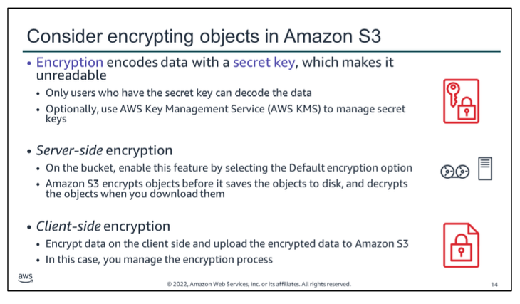
When your objective is to protect digital data, data `encryption` is an essential tool. Data encryption takes data that is legible and encodes. Encrypted data is unreadable to anyone who does not have access to the `secret key` that can be used to decode it. Thus, even if an attacker gains access to your data, they cannot make sense of it.

You have two primary options for encrypt data stored in Amazon S3.
- When you set the `Default encryption` option on a bucket, it enables `server-side encryption`. With this feature, *Amazon S3 encrypts your object before it saves the object to disk.* And then Amazon S3 will decrypt it when you download the object.
- `Client-side encryption` is the other option. When you use this approach, *you encrypt the data on the client side before you upload it to Amazon S3. In this case, you manage the encryption process, the encryption keys, and related tools*. 
  Like server-side encryption, client-side encryption can reduce risk by encrypting the data with a key that is stored in a different mechanism than the mechanism that stores the data itself.

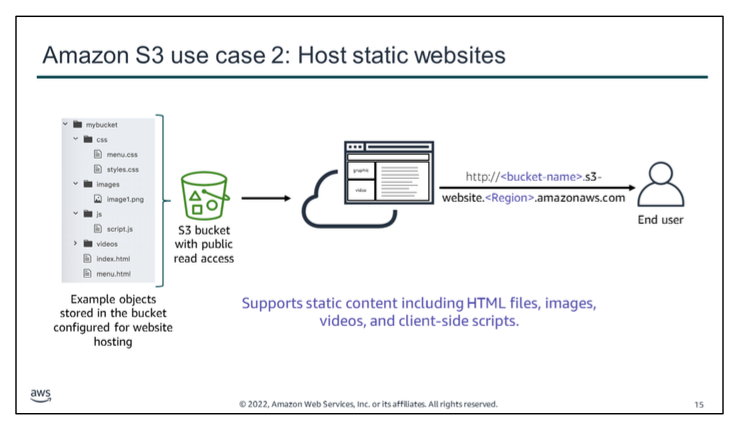
A second Amazon S3 use case is to use the service to host a static website. On a static website, individual webpages include static content. **They might also contain client-side scripts.**

By contrast, a `dynamic website` relies on `server-side processing`, which might involve database queries that run in response to server-side scripts, such as PHP, JSP, or ASP.NET. Amazon S3 does not support server-side scripting. However AWS offers other services that enable you to host dynamic websites.

To host a `static website`, configure an S3 bucket for website hosting. Then, upload your website content to the bucket.

The example shows that the static site might consist of HTML files, images, videos, and client-side scripts in formats such as JavaScript.

With this approach, you do not need to run a virtual machine that hosts a web server. In fact, you do not need to run a server. However, you can still host a website. **Amazon S3 provides a low-cost solution for web hosting that includes high performance, scalability, and availability**.

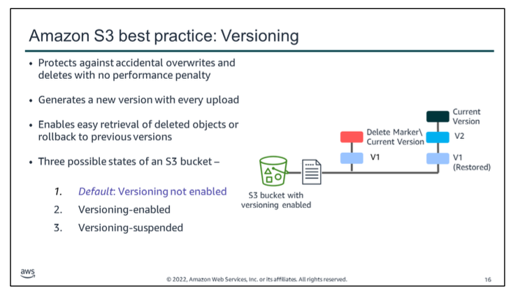
Amazon S3 provides customers with a highly secure and durable storage infrastructure. `Versioning` offers an additional level of protection. It provides a way to recover data if an application fails, or when customers accidentally overwrite or delete objects.

*Versioning is a method of keeping **multiple variants of an object** in the same bucket. You can use versioning to preserve, retrieve, and restore every version of every object stored in an S3 bucket*.
-   If you delete an object, instead of removing it permanently, Amazon S3 inserts a delete marker, which becomes the current object version. You can always restore the previous version.
-   Overwriting an object results in a new object version in the bucket. You can always restore the previous version.

Buckets can be in one of three states: `unversioned` (the default), `versioning-enabled`, or `versioning-suspended`. 
After you enable versioning for a bucket, you can never change it to an unversioned state. You can, however, suspend versioning on that bucket.

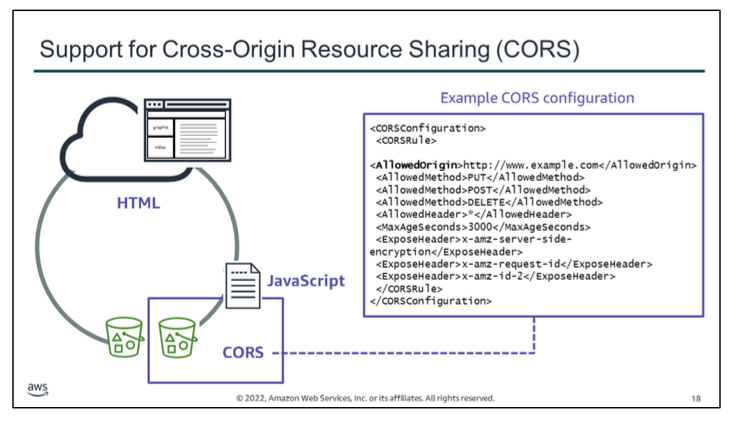

`Cross-origin resource sharing (CORS)` *defines a way for client web applications that are loaded in one domain to interact with resources in a different domain*. 
With CORS support, you can build rich client-side web applications with Amazon S3 and selectively allow cross-origin access to your Amazon S3 resources.

To configure your bucket to allow cross-origin requests, you create a CORS configuration. *A CORS configuration is an XML document with rules that identify*:
-   The origins that you will allow to access your bucket.
-   The operations (HTTP methods) that will support for each origin. 
    In this example, PUT, POST, and DELETE requests are allowed from the http://www.example.com origin, which could be configured using Amazon Route 53 to be another S3 bucket.
-   Other operation-specific information.

For more information about CORS, see the Cross-Origin Resource Sharing (CORS) AWS documentation.
[Using cross-origin resource sharing (CORS) - Amazon Simple Storage Service](https://docs.aws.amazon.com/AmazonS3/latest/userguide/cors.html) 

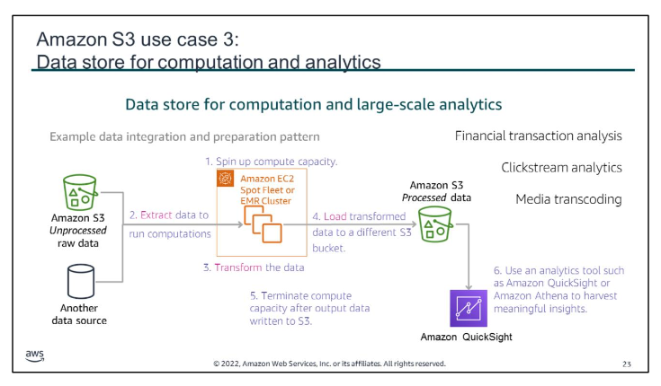
You can also use Amazon S3 as a data store for computation or large-scale analytics, such as financial transaction analysis, clickstream analytics, and media transcoding. 

Amazon S3 can support these workloads because of its horizontal scaling ability, which enables multiple concurrent (xảy ra đồng thời, sự đồng quy) transactions.

In the example here: 
- an Amazon Elastic Compute Cloud (Amazon EC2) Spot Fleet is spun up when the bid price for Spot Instances is low, or when an Amazon EMR cluster is spun up.
- Regardless, after the compute capacity is available, raw unprocessed data is extracted from Amazon S3 and also from another data source. 
- The data is run through compute algorithms that integrate and transform it. 
- The resulting processed data is loaded into a different Amazon S3 bucket. 
- Now that the data has been processed, the compute capacity is terminated to save on costs. 
- Finally, an analytics tool, such as Amazon QuickSight, might be used to harvest meaningful insights from the processed data.
This is just one example scenario of how Amazon S3 can play an essential role for data storage in a large-scale analytics solutions architecture.

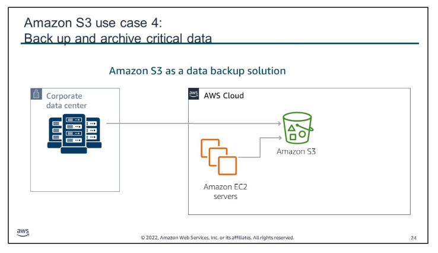
In the fourth and final use case discussed in this module, Amazon S3 is used as a data backup solution. Because of its highly durable and scalable nature, Amazon S3 works well as a data backup and archival tool.

In the scenario, data is backed up from an on-premises corporate data center, and also from a large number of Amazon EC2 servers. These servers run applications that generate data.

Additionally, *you can move long-term data from Amazon S3 standard storage to Amazon Simple Storage Service Glacier*. This process will discussed in further detail later in this module. Another Amazon S3 option you can configure on your buckets—to achieve even higher levels of durability—is cross-Region replication. 
In `cross-Region replication`, *objects that are uploaded to a bucket in one Region will be automatically copied to other S3 buckets in other Regions*.

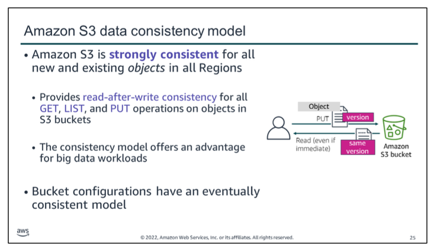
Many customers develop big data analytics applications that use Amazon S3 for object storage. These applications often require access to an object immediately after a write. Prior to December, 2020, Amazon S3 provided eventual consistency for overwrite PUTS and DELETES in all Regions. However, **Amazon S3 is now `strongly consistent` for all new and existing S3 objects in all AWS Regions.**

Amazon S3 achieves high availability by replicating data across multiple servers within AWS data centers. 
- If a PUT request is successful, the data is safely stored. 
- Any read (GET or LIST) that is initiated (bắt đầu) following a successful PUT response will return the data written by the PUT. 
This strong `read-after-write consistency` exists automatically for all applications, without changes to performance or availability.

Strong consistency simplifies the migration of on-premises analytics workloads by removing the need to make changes to support applications. 
It also removes the need for extra infrastructure, such as S3Guard, to provide strong consistency.

While objects are strongly consistent, Amazon S3 bucket configurations have an eventual (cuối cùng) consistency model. 
For example, if you delete a bucket and immediately list all buckets, the deleted bucket might still appear in the list. However, within a short period of time, if you run the list bucket command again, the deleted bucket will no longer appear in the list buckets results.

For more details, read the Amazon S3 strong consistency documentation. [Amazon S3 | Strong Consistency | Amazon Web Services](https://aws.amazon.com/s3/consistency/)

# section  3.  Storing data in Amazon S3

key takeaways:

-   `Amazon S3 storage classes` include – 
	- S3 standard,
	- S3 standard-Infrequent Access (IA), 
	- S3 One Zone-Infrequent Access (IA), 
	- S3 intelligent-Tiering, 
	- S3 Glacier, 
	- and S3 Glacier Deep Archive
-   An `Amazon S3 lifecycle policy` can delete or move objects to less expensive storage classes based on age
-   `Transferring data` in from the internet to Amazon S3 is free, but transferring out to other Regions or to the internet incurs a fee
    
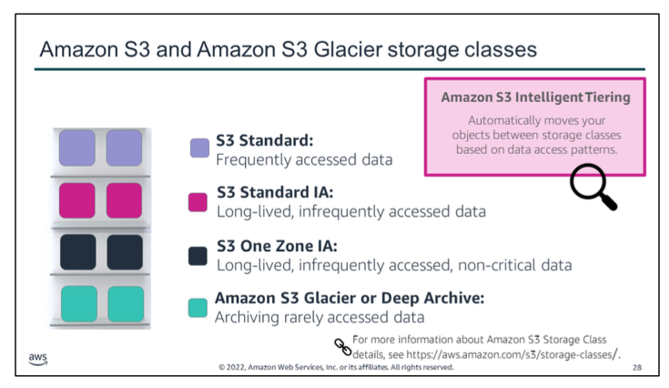
Here is a comparison of the different Amazon S3 storage classes and their characteristics.

`S3 Standard` offers high durability, availability, and performant object storage for *frequently accessed data*. Because it delivers low latency and high throughput, S3 Standard is appropriate for a wide variety of use cases, including cloud applications, dynamic websites, content distribution, mobile and gaming applications, and big data analytics. It provides durability across at least three Availability Zones.

`S3 Standard-Infrequent Access (S3 Standard-IA)` offers all the benefits of Amazon S3 Standard, but it runs on a different cost model to store *infrequently accessed data*, such as older digital images or older log files. *There is a 30-day minimum storage fee applied to any data placed in it, and also a higher cost to retrieve data from S3 Standard-IA than from S3 Standard storage*.

`S3 One Zone-IA` stores data in a single Availability Zone. *It is ideal for customers who want a lower-cost option and who do not need the availability and resilience of S3 Standard or S3 Standard-IA*. It’s a good choice for *storing secondary backup copies of on-premises data or easily re-creatable data*. You can also use it as cost-effective storage for *data that is replicated from another AWS Region*.

`S3 Intelligent-Tiering` is designed to optimize costs by *automatically moving data to the most cost- effective access tier, without performance impact or operational overhead*. 
For a small monthly monitoring and automation fee per object, Amazon S3 monitors *access patterns* of the objects in S3 Intelligent-Tiering. It moves objects that have not been accessed for 30 consecutive days to the infrequent access tier. If an object in the infrequent access tier is accessed, it is automatically moved back to the frequent access tier. There are no retrieval fees when using S3 Intelligent-Tiering and no additional tiering fees when objects are moved between tiers.

`Amazon S3 Glacier` is a secure, durable, and low-cost storage class for *data archiving*. You can reliably store any amount of data at costs that are competitive with or cheaper than on-premises solutions. 
To keep costs low, but suitable for different needs, you have **three options for retrieving data**, with varying access times and cost:
-   **Expedited retrievals** are typically made available within 1–5 minutes (KHẨN CẤP)
-   **Standard retrievals** typically complete within 3–5 hours 
-   **Bulk retrievals** typically complete within 5–12 hours (LƯỢNG LỚN)

`Amazon S3 Glacier Deep Archive` is ***the lowest-cost storage class for Amazon S3***. It supports the long- term retention (duy trì) and digital preservation for data that might be **accessed once or twice in a year**. 
Data is stored across at least three geographically dispersed Availability Zones, protected by 11 9s (99.999999999 percent) of durability, and can be restored **within 12 hours**.
    
For more details about Amazon S3 Storage Classes, see the AWS Documentation. 
    [Object Storage Classes – Amazon S3](https://aws.amazon.com/s3/storage-classes/)

## Performance across the S3 Storage Classes

|                                    | S3 Standard             | S3 Intelligent-Tiering* | S3 Standard-IA          | S3 One Zone-IA†         | S3 Glacier  Instant Retrieval | S3 Glacier Flexible Retrieval | S3 Glacier  Deep Archive |
|------------------------------------|-------------------------|-------------------------|-------------------------|-------------------------|-------------------------------|-------------------------------|--------------------------|
| Designed for durability            | 99.999999999%  (11 9’s) | 99.999999999%  (11 9’s) | 99.999999999%  (11 9’s) | 99.999999999%  (11 9’s) | 99.999999999%  (11 9’s)       | 99.999999999%  (11 9’s)       | 99.999999999%  (11 9’s)  |
| Designed for availability          | 99.99%                  | 99.9%                   | 99.9%                   | 99.5%                   | 99.9%                         | 99.99%                        | 99.99%                   |
| Availability SLA                   | 99,9%                   | 99%                     | 99%                     | 99%                     | 99%                           | 99.9%                         | 99.9%                    |
| Availability Zones                 | ≥3                      | ≥3                      | ≥3                      | 1                       | ≥3                            | ≥3                            | ≥3                       |
| Minimum capacity charge per object | N/A                     | N/A                     | 128 KB                  | 128 KB                  | 128 KB                        | 40 KB                         | 40 KB                    |
| Minimum storage duration charge    | N/A                     | N/A                     | 30 days                 | 30 days                 | 90 days                       | 90 days                       | 180 days                 |
| Retrieval charge                   | N/A                     | N/A                     | per GB retrieved        | per GB retrieved        | per GB retrieved              | per GB retrieved              | per GB retrieved         |
| First byte latency                 | milliseconds            | milliseconds            | milliseconds            | milliseconds            | milliseconds                  | minutes or hours              | hours                    |
| Storage type                       | Object                  | Object                  | Object                  | Object                  | Object                        | Object                        | Object                   |
| Lifecycle transitions              |           Yes           | Y                       | Y                       | Y                       | Y                             | Y                             | Y                        |

† Because S3 One Zone-IA stores data in a single AWS Availability Zone, data stored in this storage class will be lost in the event of Availability Zone destruction.  

* S3 Intelligent-Tiering charges a small monitoring and automation charge, and has a minimum eligible object size of 128KB for auto-tiering. Smaller objects may be stored, but will always be charged at the Frequent Access tier rates, and are not charged the monitoring and automation charge. See the [Amazon S3 Pricing](https://aws.amazon.com/s3/pricing/) for more information.

** Standard retrievals in archive access tier and deep archive access tier are free. Using the S3 console, you can pay for expedited retrievals if you need faster access to your data from the archive access tiers.

*** S3 Intelligent-Tiering first byte latency for frequent and infrequent access tier is milliseconds access time, and the archive access and deep archive access tiers first byte latency is minutes or hours.

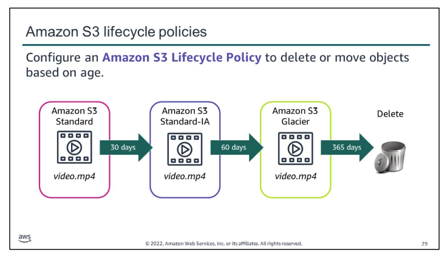
You can configure the lifecycle of your objects to manage how they are stored throughout their lifecycle. A `lifecycle configuration` is a *set of rules that define actions that Amazon S3 applies to a group of objects*.

After an S3 lifecycle policy is set, *your data will automatically transfer to a different storage class* without any changes to your application.

By using lifecycle policies, you can cycle data at regular intervals among different Amazon S3 storage types. This cycling reduces your overall cost because you pay less for data as it becomes less important over time. *In addition to being able to set lifecycle rules per object, you can also set lifecycle rules per bucket.*

For more information about object lifecycle management, see the Object Lifecycle Management AWS documentation details. [Managing your storage lifecycle - Amazon Simple Storage Service](https://docs.aws.amazon.com/AmazonS3/latest/userguide/object-lifecycle-mgmt.html) 

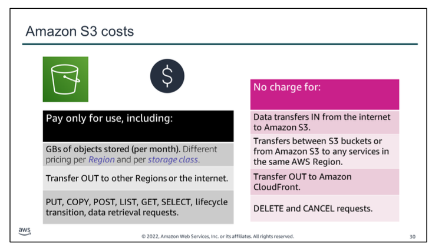

With Amazon S3, `you pay only for what you use.` 
There is no minimum fee. 
There are four cost components to consider when you decide which Amazon S3 storage class best fits your data profile—`storage pricing`, `request and data retrieval pricing`, `data transfer and transfer acceleration pricing`, and `data management features pricing`.

Details about Amazon S3 pricing can be found at Amazon S3 Pricing.
[Amazon S3 Simple Storage Service Pricing - Amazon Web Services](https://aws.amazon.com/s3/pricing/) 

# section  4.  Moving data to and from Amazon S3

key takeaways:
-   The  `S3 multipart upload` option is a good option for files larger than 100 MB and in situations where network connectivity might be inconsistent
- `Amazon S3 Transfer Acceleration` uses edge locations, and can significantly *increase the speed of uploads*
-   `AWS Snowball` provides a way to transfer `petabytes` of data, and `AWS Snowmobile` provides a way to transfer `exabytes` of data to AWS

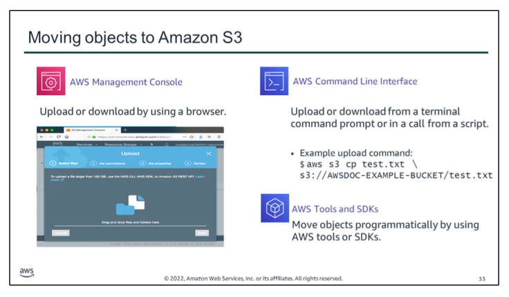

In the guided lab earlier in this module, you uploaded files to Amazon S3 by using the web browser interface provided by the `AWS Management Console`. It is the simplest way to move data in to or out of Amazon S3. It offers a wizard-based approach, including the option to drag and drop files that you want to copy into a bucket.

In this section of the module, you will learn about some additional options available for moving data into and out of Amazon S3.

Two of those options include using the `AWS Command Line Interface (AWS CLI)` or the `AWS SDKs`.
An example AWS CLI upload command is shown. In the command, you specify aws to invoke the AWS CLI, then you specify the service, which is S3. Next, you issue a cp (or copy) subcommand, followed by test.txt which is the local file (that exists on your computer) that should be copied. 
Finally, the s3://AWSDOC-EXAMPLE-BUCKET/test.txt parameter indicates the bucket where the file should be uploaded, and the key (AWSDOC-EXAMPLE-BUCKET/test.txt) where the object value (contents) should be stored.

The S3 AWS CLI Command Reference provides further details.
[Amazon Web Services Documentation](https://docs.aws.amazon.com/cli/latest/reference/s3/index.html%23cli-aws-s3) 

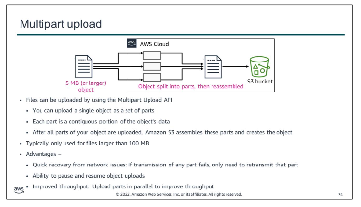
The `Multipart Upload API` enables you to *consistently upload large objects in manageable parts*. Benefits (advantages) include:
-   *Quick recovery from any network issues* – Smaller part sizes minimize the impact of restarting a failed upload due to a network error.
-   *Ability to pause and resume object uploads* – You can upload object parts over time. After you initiate a multipart upload, there is no expiration. You must explicitly complete or stop the multipart upload.
- *Improved throughput* – You can upload parts in parallel to improve throughput.
-   Ability to begin an upload before you know the final object size – You can upload an object as you are creating it.
-   Ability to *upload large objects* – By using the multipart upload API, you can upload large objects, up to 5 TB.  

Note that **files must be at least 5 MB in size** to use the multipart upload feature.
    
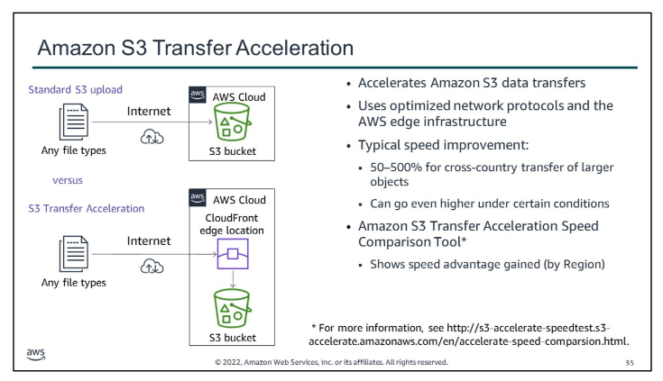
`Amazon S3 Transfer Acceleration` enables *fast and easy data transfer into an S3* bucket by taking advantage of `Amazon CloudFront and AWS edge locations (gọi chung AWS edge infrastructure?)`, which are globally distributed. This data is then routed to Amazon S3 over an optimized network path.

Use Transfer Acceleration when:
-   You have customers all around the world who upload to a centralized bucket
-   You transfer gigabytes or terabytes of data across continents on a regular basis
-   You underutilize the available bandwidth when you upload files to Amazon S3 over the internet
    
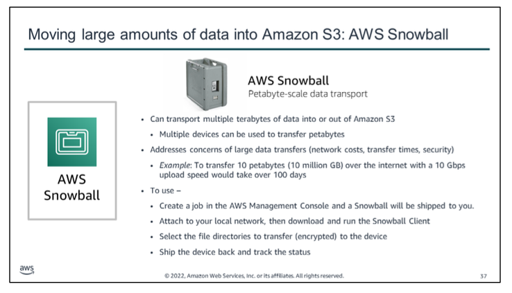
`AWS Snowball` is a *petabyte-scale data transport* option that doesn’t require you to write any code or purchase any hardware to transfer your data. 
All you need to do is:
- *create a job* in the AWS Management Console, and a *Snowball appliance will be shipped to you*
- Attach the appliance to your local network and transfer files directly onto it. 
- Then, ship it back and track the status of your shipment. 
When it arrives at the secure Amazon facility, **the data will be transferred into your AWS account**.

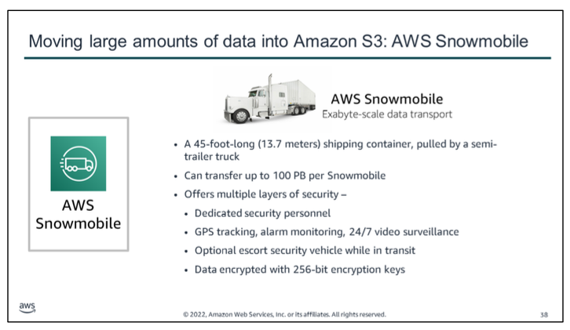

`AWS Snowmobile` is an even larger data transfer option that operates in *exabyte scale*. An exabyte is 1 million terabytes or 1 billion gigabytes. 
It should only be used to move extremely large amounts of data into AWS. A Snowmobile is a 45-foot-lonf (13.7 meters) ruggedized shipping container that is pulled by a semi-trailer truck. **You can transfer 100 PB per Snowmobile**.

If you tried to transfer 100 petabytes of data over the internet, with an upload speed of 10 Gbps (assuming a TCP/IP overhead of 10%), it would take approximately 1018 days (almost three years) to finish uploading the data. That would not be practical. In such cases, using AWS Snowmobile to transfer the data would be a better option. (1 PB xấp xỉ 10 ^6 GB)

Snowmobile uses multiple layers of security designed to protect your data, including dedicated security personnel, GPS tracking, alarm monitoring, 24/7 video surveillance, and an optional escort security vehicle while in transit. All data is encrypted with 256-bit encryption keys managed through `AWS Key Management Service (AWS KMS)` and designed to ensure both security and full chain-of-custody of your data.

# section  5.  Choosing Regions for your architecture

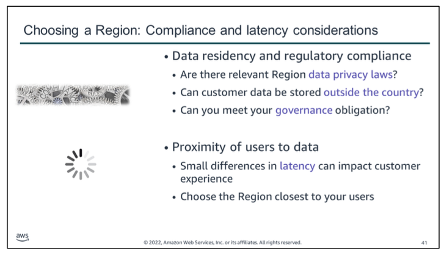
There are many considerations when you decide what Region to host your data in.

First, you should consider *data privacy laws and your regulatory compliance requirements*. 
Data you store on AWS is subject to the **laws of the country and locality where it is stored**. In addition, some laws dictate that if you are operating your business in their jurisdiction, you cannot store that data anywhere else. 
Similarly, compliance standards (such as the U.S. Health Insurance Portability and Accountability Act, or HIPAA) have strict guidelines on **how and where data can be stored**.

Second, *proximity* (lân cận) is an important factor in choosing your Region, especially when *latency* is a critical factor. In most cases, the latency difference between using the closest Region and the farthest Region is relatively small, but even small differences in latency can impact customer experience. 
Customers expect responsive environments, and as time passes and technology becomes more and more powerful, those expectations also rise.

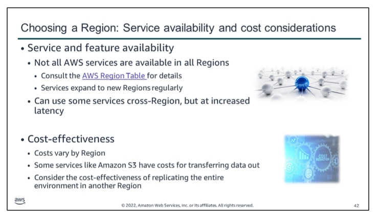
When you choose a Region, a third important consideration is the *availability* of AWS services and features. Though AWS strives to make services and features available everywhere, the complications that arise from having a global reach make it challenging to accomplish that goal. Instead of waiting until a service is available everywhere before launching it, services are released when they are ready. Service availability is then expanded as soon as possible.

A fourth consideration when you choose a Region is *cost*. Service costs can differ depending on which Region they are used in. 
For example, an Amazon EC2 instance in the us-east-1 Region might not cost the same as if it ran in the eu-west-1 Region. Typically, the difference in cost might not be enough to supersede the other three considerations. 
However, in cases where the latency, compliance, and service availability differences between Regions are minimal, you might be able to save by using the lower-cost Region for your environment.

Finally, in circumstances where your customers are in different areas of the world, consider optimizing their experience by replicating your environment in multiple Regions that are closer to them. Because you would then be distributing your load across multiple environments, your costs for components in each environment might go down even as you add more infrastructure. 
For example, adding a second application environment might allow you to cut your processing and storage capacity requirements in half in each environment. Because AWS is designed to enable that kind of flexibility, and because you only pay for what you use, you could scale your existing environment down as a way to mitigate the cost of adding another environment.
The downside (nhược điểm) to that approach is that you now have two environments to manage. Also, not all of your components will scale down enough to mitigate all the costs of the new components. 
Additionally, you might need to maintain one single storage source of truth in one Region, such as a primary Amazon Relational Database Service (Amazon RDS) instance. Your secondary Region would need to communicate with the storage instance, which might increase latency and cost for those operations.

# quiz

 

The following are the keywords to recognize: *durable storage solution, protects against users accidentally deleting, and which action will protect*.

The correct answer is B. If a versioned object is deleted, then it can still be recovered by retrieving the final version.

Incorrect answers:  
Response A would lose any changes that were committed since the previous snapshot. 
Storing the data in two S3 buckets (response C) would provide slightly more protection, but a user could still delete the object from both buckets. 
EC2 instance storage (response D) is `temporary storage` and should never be used for data requiring `durability`.

# additional resources
If you want to learn more about the topics covered in this module, you might find the following additional resources helpful:

-   Amazon S3 Developers Guide
    [What is Amazon S3? - Amazon Simple Storage Service](https://docs.aws.amazon.com/AmazonS3/latest/userguide//Welcome.html)
-   Amazon S3 FAQs
    [Amazon Simple Storage Service (S3) — Cloud Storage — AWS](https://aws.amazon.com/s3/faqs/)
-   Amazon S3 Common Use Scenarios
    
-   AWS Storage Services Whitepaper
    
-   Amazon S3 Storage Classes Comparison
    [Object Storage Classes – Amazon S3](https://aws.amazon.com/s3/storage-classes/)
-   Amazon S3 Block Public Access [Amazon S3 Block Public Access – Another Layer of Protection for Your Accounts and Buckets | AWS News Blog](https://aws.amazon.com/blogs/aws/amazon-s3-block-public-access-another-layer-of-protection-for-your-accounts-and-buckets/) 