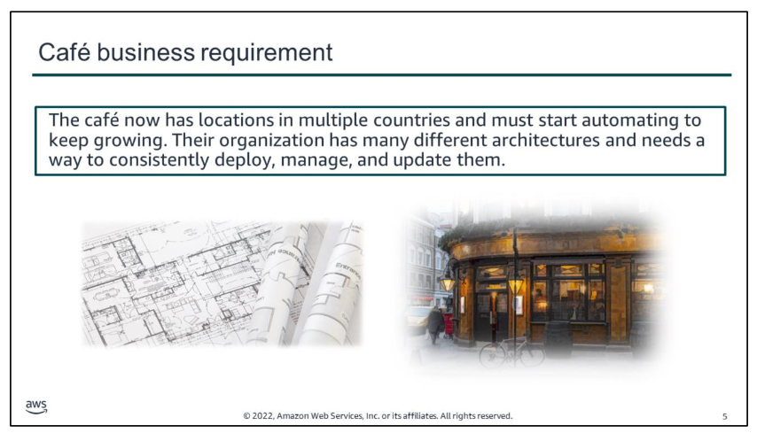
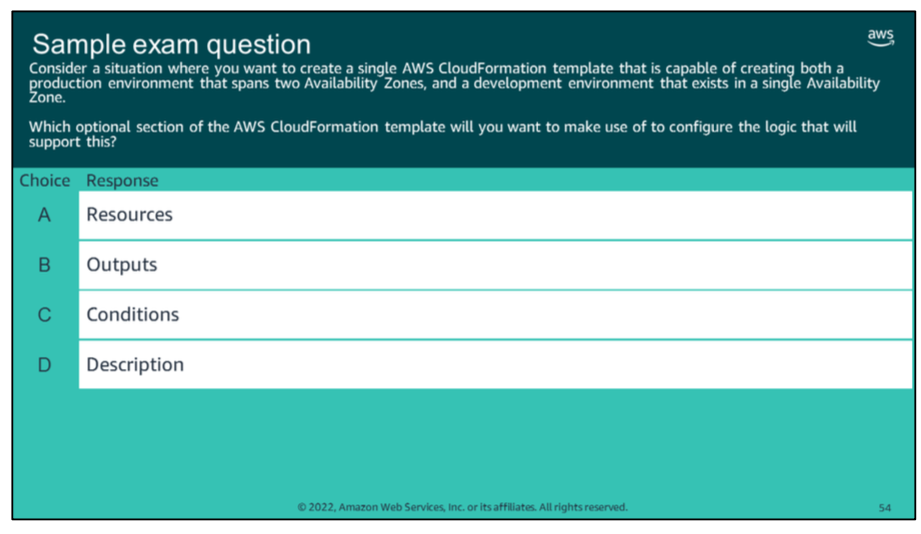

# overview
This module contains the following sections:

1.  Architectural need
2.  Reasons to automate
3.  Automating your infrastructure
4.  Automating deployments
5.  AWS Elastic Beanstalk

This module also includes:
-   An educator-led demonstration that starts with an analysis of the structure of an AWS CloudFormation template, and then creates a stack from the template.
-   A guided lab that provides hands-on practice with using AWS CloudFormation to create resources in your AWS account.
-   A challenge lab where you use AWS CloudFormation to create Amazon Web Services (AWS) resources that support the Café use case.

# module objectives

At the end of this module, you should be able to:
-   Recognize when to automate and why
-   Identify how to model, create, and manage a collection of AWS resources using AWS CloudFormation
-   Use the Quick Start AWS CloudFormation templates to set up an architecture
-   Indicate how to use AWS System Manager and AWS OpsWorks for infrastructure and deployment automation
-   Indicate how to use AWS Elastic Beanstalk to deploy simple applications

#  1.  Architectural need

Up to this point, the café created their AWS resources and configured their applications manually--mostly by using the AWS Management Console. This approach worked well as a way for the café to quickly develop a web presence and build out an infrastructure that supports the needs of employees and customers. However, they find it challenging to replicate their deployments to new AWS Regions so they can support new cafe locations in multiple countries.

They would also like to have separate development and production environments that reliably have matching configurations. They realize that they must start automating to support continued growth. Their organization has many different architectures, and it needs a way to consistently deploy, manage, and update these architectures quickly, consistently, and reliably.

In this module, you will learn about AWS services that provide automation, including AWS CloudFormation. By using AWS CloudFormation, you will be able to help the cafe meet these new business requirements.

#  2. Reasons to automate

# 3. Automating your infrastructure

key takeaways:
-   `AWS CloudFormation` is an infrastructure as code (`IaC`) service that enables you to `model, create`, and `manage` a collection of AWS resources
-   AWS CloudFormation IaC is defined in templates that are authored in `JSON` or `YAML`
-   A `stack` is what you create when you use a template to create AWS resources
-   Actions that are available on an existing stack include **update stack, detect drift**, and **delete stack**
-   **AWS Quick Starts** provides AWS CloudFormation templates that are built by solutions architects and that reflect AWS best practices

# 4. Automating deployments

# 5.  AWS Elastic Beanstalk
key takeaways:
-   **AWS Elastic Beanstalk** creates and manages a scalable and highly available web application environment that enables you to focus on the application code
-   You can author your Elastic Beanstalk application code in `Java, .NET, PHP, Node.js, Python, Ruby, Go, or Docker`
-   AWS resources that are created by Elastic Beanstalk are ***fully transparent***—they are visible in the AWS Management Console service page views
-   **No extra charge** for Elastic Beanstalk – you pay only for the underlying resources that are used

# quiz

Look at the answer choices and rule them out based on the keywords.

# link
If you want to learn more about the topics covered in this module, you might find the following additional resources helpful:

-   Overview of Deployment Options on AWS
    
-   Working with AWS CloudFormation Templates
    
-   AWS CloudFormation Sample Templates
    
-   AWS OpsWorks Stacks FAQs
    
-   AWS Systems Manager Features
    
-   AWS Elastic Beanstalk FAQs