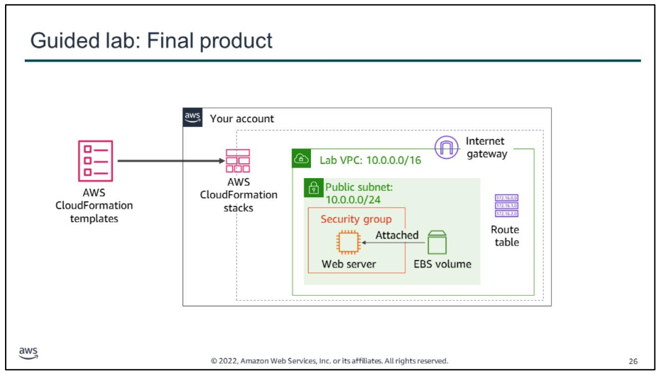
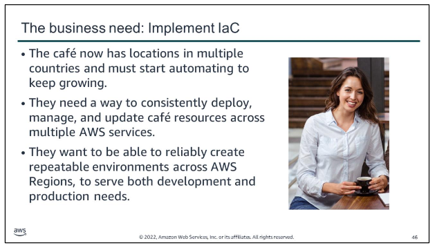
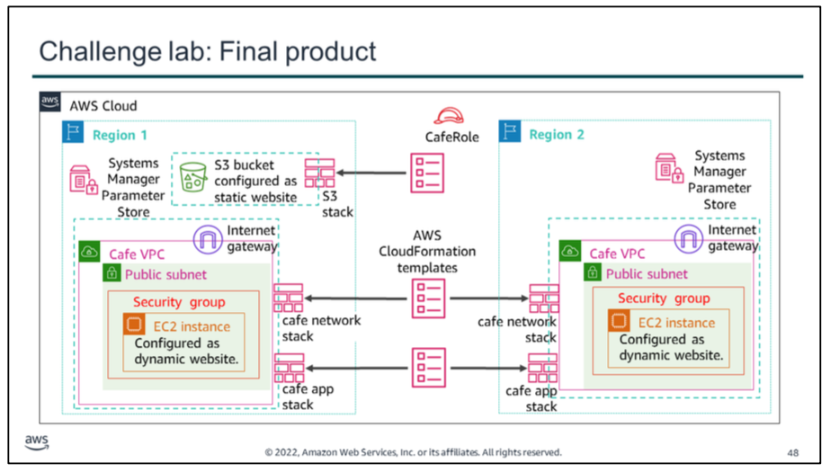

# Guided lab
In this guided lab, you will complete the following tasks:
1.  Deploying a networking layer
2.  Deploying an application layer
3.  Updating a stack
4.  Exploring templates with AWS CloudFormation Designer
5.  Deleting the stack

By the end of this guided lab, you will have used AWS CloudFormation to create the resources in the diagram. The resources in the network layer are created when you create the first stack. The EC2 instance, security group, and Amazon Elastic Block Store (Amazon EBS) volume are created when you create the second stack. The security group settings are then updated in the template that is used to create the second stack. This modification is applied to the security group resource when you run the update stack action.

# challenge lab

For too long, the café has been creating their AWS resources and configured their applications manually. That approach worked well as a way for the café to quickly develop a web presence and build out an infrastructure that supports the needs of employees and customers. However, they find it challenging to replicate their deployments to new AWS Regions so that they can support new cafe locations in multiple countries.

The café would also like to have separate development and production environments that reliably have matching configurations. They realize that they must start automating to support continued growth.

In this challenge lab, you will complete the following tasks:
1.  Creating an AWS CloudFormation template from scratch
2.  Configuring the bucket as a website and updating the stack
3.  Cloning a CodeCommit repository that contains AWS CloudFormation templates
4.  Creating a new network layer with AWS CloudFormation, CodeCommit, and CodePipeline
5.  Updating the network stack
6.  Defining an EC2 instance resource and creating the application stack
7.  Duplicating the café network and website to another AWS Region

This diagram shows the completed architecture that you will build in the challenge lab.

s