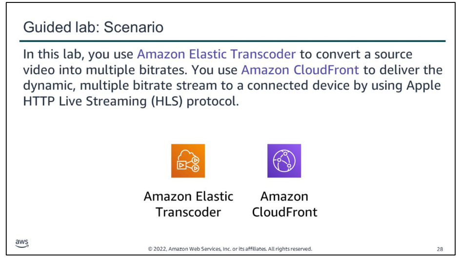
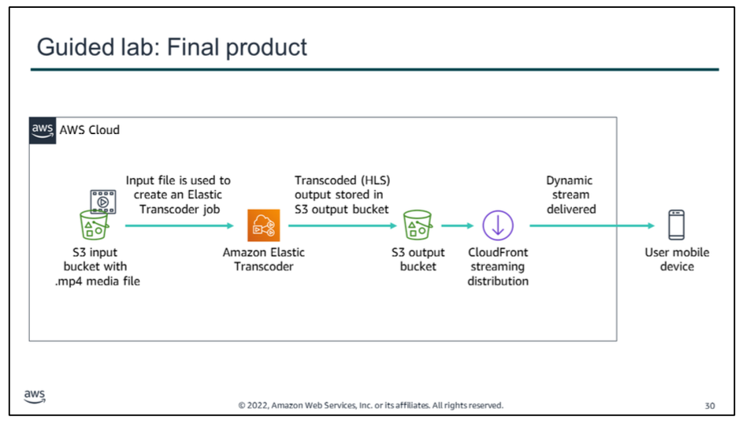

# guided lab

In this lab, you use Amazon Elastic Transcoder to convert a source video into multiple bitrates. You use Amazon CloudFront to deliver the dynamic, multiple-bitrate stream to a connected device by using Apple HTTP Live Streaming (HLS) protocol. The stream can be played on any browser that supports the HLS protocol.

Apple HLS can dynamically adjust movie playback quality to match the available speed of wired or wireless networks by using an ordinary web server. It works by creating different quality streams. Each stream is then broken into chunks that are streamed sequentially to a client device. On the client’s end, you can select streams of varying bitrates, which enable streaming sessions to adapt to different network speeds.

In this guided lab, you will complete the following tasks:
1.  Create an Amazon CloudFront distribution
2.  Create an Amazon Elastic Transcoder pipeline
3.  Test playback of the dynamic (multiple bitrate) stream

The diagram summarizes what you will have built after you complete the lab.

try!