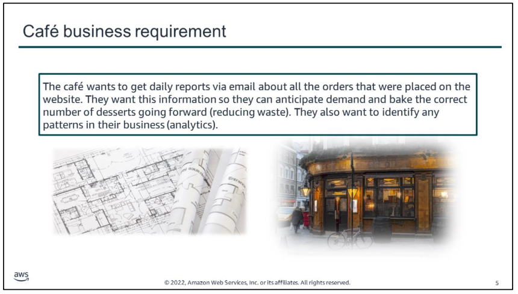
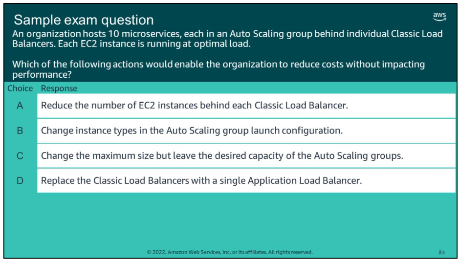

# overview
This module includes the following sections:  
	1. Architectural need 
	2. Introducing microservices  
	3.Building microservice applications with AWS container services 4.Introducing serverless architectures
	5.Building serverless architectures with AWS Lambda 
	6.Extending serverless architectures with Amazon API Gateway 7.Orchestrating microservices with AWS Step Functions

This module also includes:

-   Two AWS Lambda demonstrations
-   An optional guided lab where you refactor a monolithic application into microservices
-   A guided lab where you implement a serverless architecture on AWS with Amazon S3, AWS Lambda, Amazon DynamoDB, and Amazon SNS
-   A challenge lab where you use AWS Lambda and Amazon Simple Notification Service (Amazon SNS) to generate and send a daily sales report for the café.

# module objectives
At the end of this module, you should be able to:
-   Indicate the characteristics of microservices
-   Refactor a monolithic application into microservices and use Amazon ECS to deploy the containerized microservices
-   Explain serverless architecture
-   Implement a serverless architecture with AWS Lambda
-   Describe a common architecture for Amazon API Gateway
-   Describe the types of workflows that AWS Step Functions supports

# 1. Architectural need   

Frank and Martha want to get daily reports via email about all the orders that were placed on the website. Frank wants to anticipate demand so he can bake the correct number of desserts going forward (reducing waste). Martha wants to identify any patterns in the café‘s business (analytics). Currently, Sofía has set up a cron job on the web server instance that sends these daily order report email messages to Frank and Martha. However, the cron job is resource-intensive and reduces web server performance.

Olivia advises Sofía and Nikhil that non-business-critical reporting tasks should be kept separate. Sofía and Nikhil want to further decouple the architecture and move the cron job into a managed, serverless environment that will scale well and reduce costs.

# 2. Introducing microservices   

key takeaways:

-   Microservice applications are composed of ***independent services that communicate over well-defined APIs***
-   Microservices share the following characteristics –
    -   **Decentralized**: Microservices are decentralized in the way they are developed, deployed, managed, and operated
    -   **Independent**: Each component service in a microservices architecture can be developed, deployed, operated, and scaled without affecting the function of other services
    -   **Specialized**: Each component service is designed for a set of capabilities and focuses on solving a specific problem
    -   **Polyglot**: Microservice architectures take a heterogeneous approach to operating systems, programming languages, data stores, and tools
    -   **Black boxes**: The details of the complexity of microservice components are hidden from other components
    -   **You build it, you run it**: DevOps is a key organizational principle for microservices
    

# 3. Building microservice applications with AWS container services 

key takeaways:

-   **Amazon ECS** is a highly scalable, high-performance container management service. It supports Docker containers and enables you to easily run applications on a managed cluster of Amazon EC2 instances.
-   **Cluster** auto scaling gives you more control over how you scale tasks within a cluster.
-   **AWS Cloud Map** enables you to define custom names for your application resources. It maintains the updated location of these dynamically changing resources.
-   **AWS App Mesh** is a service mesh that provides application-level networking to make it easy for your services to communicate with each other across multiple types of compute infrastructure.
-   **AWS Fargate** is a fully managed container service that enables you to run containers without needing to manage servers or clusters.

# 4. Introducing serverless architectures 
key takeaways:
-   **Serverless computing** enables you to build and run applications and services without provisioning or managing servers
-   Serverless architectures offer the following **benefits** –
    -   Lower TCO
    -   You can focus on your application
    -   You can use them to build microservice applications

# 5. Building serverless architectures with AWS Lambda 
key takeaways:

-   **Lambda** is a serverless compute service that provides built-in fault tolerance and automatic scaling.
-   A **Lambda function** is custom code that you write that processes events.
-   A Lambda function is invoked by a `handler`, which takes an `event object` and `context object` as parameters.
-   An **event source** is an AWS service or developer-created application that triggers a Lambda function to run.
-   **Lambda layers** enable functions to share code and keep deployment packages small.

# 6. Extending serverless architectures with Amazon API Gateway
key takeaways:

-   **Amazon API Gateway** is a fully managed service that enables you to create, publish, maintain, monitor, and secure APIs at any scale.
-   Amazon API Gateway acts as an *entry point to backend resources for your applications*. It abstracts and exposes APIs that can call various backend applications. These applications include Lambda functions, Docker containers that run on EC2 instances, VPCs, or any publicly accessible endpoint.
-   Amazon API Gateway is *deeply integrated with Lambda*.

# 7. Orchestrating microservices with AWS Step Functions
key takeaways:
-   **AWS Step Functions** is a web service that enables you to coordinate components of distributed applications and microservices by using visual workflows
-   AWS Step Functions enables you to **create and automate your own state machines** within the AWS environment
-   AWS Step Functions **manages the logic of your application for you, and it implements basic primitives**, such as sequential or parallel branches, and timeouts
-   You define state machines by using the **Amazon States Language**

# quiz
Look at the answer choices and rule them out based on the keywords.

# links

If you want to learn more about the topics covered in this module, you might find the following additional resources helpful:

-   Break a Monolith Application into Microservices project
    
-   Serverless Architectures with AWS Lambda whitepaper
    
-   AWS Serverless Multi-Tier Architectures with Amazon API Gateway and AWS Lambda whitepaper
    
-   AWS Well-Architected Framework: Serverless Application Lens whitepaper
    
-   Creating and Using Lambda Functions tutorial