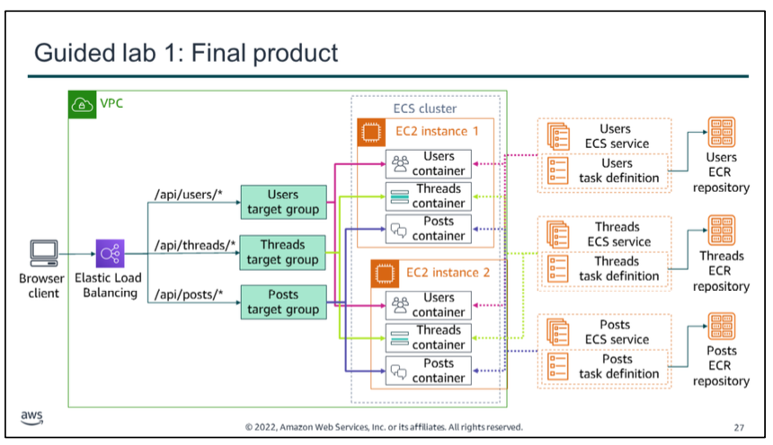
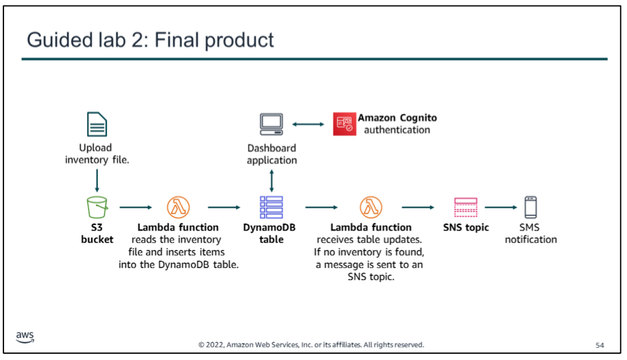
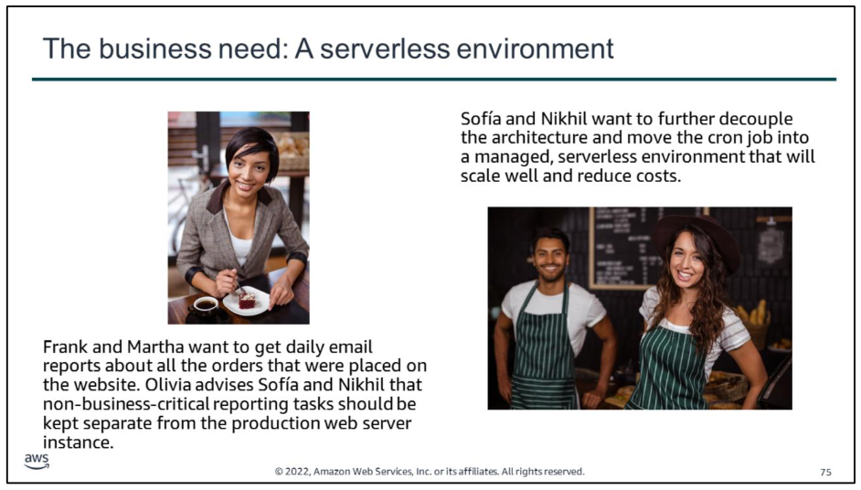

# Guided lab 1

In this guided lab, you will complete the following tasks:

1.  Prepare the AWS Cloud9 development environment
2.  Run a monolithic application on a basic Node.js server
3.  Containerize the monolith for Amazon ECS
4.  Deploy the monolith to Amazon ECS
5.  Refactor the monolith into containerized microservices
The diagram summarizes what you will have built after you complete the lab.

# Guided lab 2
In this guided lab, you will complete the following tasks:

1.  Create a Lambda function to load data
2.  Configure an Amazon S3 event
3.  Test the loading process
4.  Configure notifications
5.  Create a Lambda function to send notifications   
6.  Test the system
The diagram summarizes what you will have built after you complete the lab.

# Challenge lab

Frank and Martha want to get daily reports via email about all the orders that were placed on the website. Frank wants to anticipate demand so he can bake the correct number of desserts going forward (reducing waste). Martha wants to identify any patterns in the café‘s business (analytics). Currently, Sofía has set up a cron job on the web server instance that sends these daily order report email messages to Frank and Martha. However, the cron job is resource-intensive and reduces the performance of the web server.

Olivia advises Sofía and Nikhil that non-business-critical reporting tasks should be kept separate. Sofía and Nikhil want to further decouple the architecture and move the cron job into a managed, serverless environment that will scale well and reduce costs.

In this challenge lab, you will complete the following tasks:

1.  Downloading the source code
2.  Creating the DataExtractor Lambda function in the VPC
3.  Creating the salesAnalysisReport Lambda function
4.  Creating an SNS topic
5.  Creating an email subscription to the SNS topic
6.  Testing the salesAnalysisReport Lambda function
7.  Setting up an Amazon EventBridge event to trigger the Lambda function each day

The diagram summarizes what you will have built after you complete the lab.

**For accessibility**: Diagram of three-tier architecture with cafe application server in public subnet 1, sales analysis report data extractor Lambda function in private subnets 1 and 2, and primary DB instance in DB subnet group that spans private subnets 3 and 4. Daily event triggers the sales analysis report Lambda function, which triggers data extractor Lambda function, and also an email notification to be sent from SNS topic. 
**End of accessibility description.**