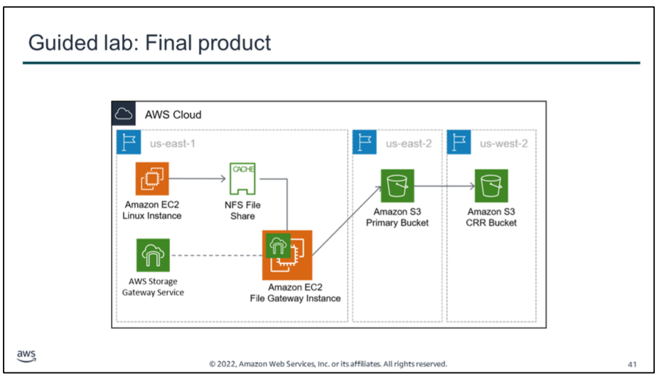

# Guided lab
In this guided lab, you will complete the following tasks:

1.  Reviewing the lab architecture
2.  Creating the primary and secondary S3 buckets
3.  Enabling Cross-Region Replication
4.  Configuring the file gateway and creating an NFS file share
5.  Mounting the file share to the Linux instance and migrating the data
6.  Verifying that the data is migrated

The diagram summarizes what you will have built after you complete the guided lab. You will have successfully migrated data to Amazon S3 by using the file gateway option in AWS Storage Gateway.

**For accessibility**: Diagram of NFS File Share cache processed by a File Gateway instance which loads data into an S3 bucket in another Region. Contents of the bucket are also copied to a third Region. 
**End of accessibility description**.

try!