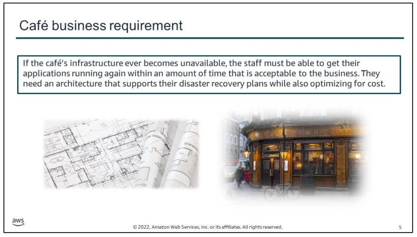
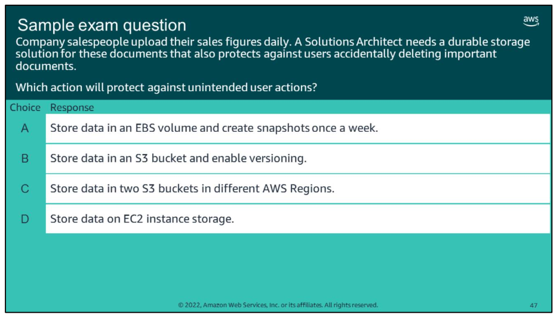

# overview

This module includes the following sections:

1.  Architectural need
2.  Disaster planning strategies
3.  Disaster recovery patterns
    

The module also includes a guided lab, where you will enable Amazon S3 cross-Region replication. You will configure a file gateway and mount the file share on an Amazon Elastic Compute Cloud (Amazon EC2) instance.

# module objectives
At the end of this module, you should be able to:

-   Identify strategies for disaster planning
-   Define recovery point objective (RPO) and Recovery Time Objective (RTO)
-   Describe four common patterns for backup and disaster recovery and how to implement them
-   Use AWS Storage Gateway for on-premises-to-cloud backup solutions

# 1.  Architectural need

By now, the café has implemented several applications that run on AWS. They are also storing a significant amount of business-critical data in the AWS Cloud. Sofía realizes that if the café’s infrastructure ever becomes unavailable, they must be able to get their applications running and accessible in an amount of time that’s acceptable to the business. Currently, the café’s staff hasn’t developed any comprehensive disaster recovery plans.

Sofía raised this concern with Frank and Martha. They all agreed that it’s important to put backup and disaster recovery plans into place. Their objective is to implement an architecture that supports their disaster recovery time objectives, while it also optimizes for cost. They also agreed that as their revenue grows, they will be able to afford a solution that supports a shorter recovery time objective.

In this module, you will learn about key AWS service features that support data backup and disaster recovery. With an understanding of these features, you should be able to help the café meet this essential business requirement.

# 2.  Disaster planning strategies

key takeaways:

-   To choose the correct **disaster recovery** strategy, first identify your recovery point objective (RPO) and recovery time objective (RTO)
-   Use features such as **S3 Cross-Region Replication, EBS volume snapshots**, and **RDS snapshots** to protect data
-   Use networking features—such as **Route 53 failover and Elastic Load Balancing**—to improve application availability
-   Use automation services—such as **AWS CloudFormation**—as part of your DR strategy to **quickly deploy duplicate environments** when necessary

# 3.  Disaster recovery patterns

key takeaways:
-   Common **disaster recovery patterns** on AWS include backup and restore, pilot light, warm standby, and multi-site.
-   **Backup and restore** is the most cost effective approach, but it has the highest RTO.
-   **Multi-site** provides the fastest RTO, but it costs the most because it provides a fully running production-ready duplicate.
-   **AWS Storage Gateway** provides three interfaces—file gateway, volume gateway, and tape gateway—for data backup and recovery between on-premises and the AWS Cloud.

# quiz

Look at the answer choices and rule them out based on the keywords.

# links
If you want to learn more about the topics that are covered in this module, you might find the following resources helpful:

-   Amazon S3 Replication
    
-   Amazon S3 Object Lifecycle Management
    
-   Amazon EBS Snapshots
    
-   Using AWS Lambda with Scheduled Events
    
-   Backup & Restore resource center
    
-   Disaster Recovery with AWS (video)