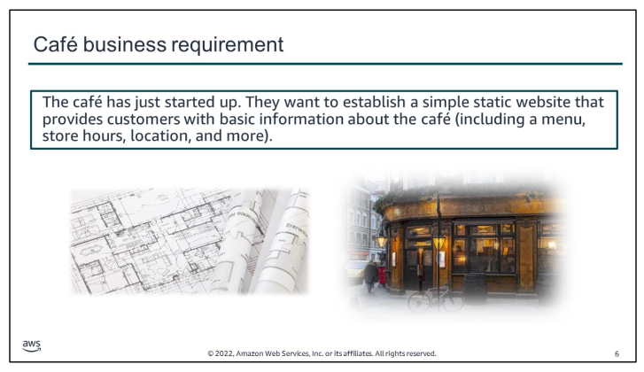
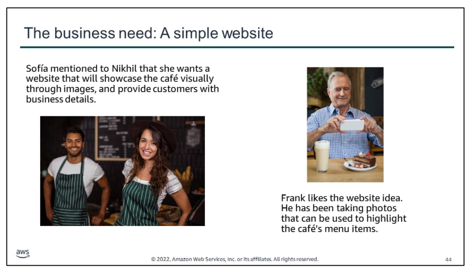
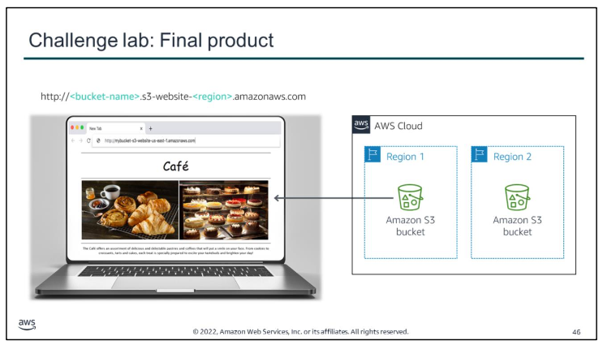

The café has a single location in a large city, where they sell desserts and coffee. The business is owned by Frank and Martha, a husband-and-wife team who work at the café. Their daughter, Sofía, and their other employee, Nikhil—who is a secondary school student—also work at the café.

The café currently doesn’t have a marketing strategy. They mostly gain new customers when someone walks by, notices the café, and decides to give it a try. The café has a reputation for high-quality desserts and coffees, but their reputation is limited to people who have visited, or who have heard about them from their customers.

Sofía suggested that they should expand community awareness of what the cafe has to offer. Frank and Martha agreed. The café doesn’t have a web presence yet, and they don’t currently use any cloud computing services. However, that situation is about to change. The first challenge will be to create a basic website for the café.

You will learn more details about the business requirements—and how to use Amazon Web Services to meet those business requirements—throughout this module.

# Module 3 – Guided Lab: Hosting a Static Website

In this guided lab, you will complete the following tasks: 
1. Create a bucket in Amazon S3  
2. Upload content to your bucket  
3. Enable access to the objects
4. Update the website

# Module 3 – Challenge Lab: Creating a Static Website for the Café 

  

Sofía mentioned to Nikhil that she would like the café to have a website that will showcase the café visually through images. The website should also provide customers with business details, such as the location of the store, the business hours, and telephone number.

Nikhil is pleased to create the first website for the café. During this activity, you will take on the role of Nikhil and work on producing the results that everyone back at the café hopes you can deliver. Perhaps you can even exceed their expectations!

In this challenge lab, you will complete the following tasks:

1.  Extracting the files that you need for the lab
2.  Creating an S3 bucket to host your static website
3.  Uploading content to your S3 bucket
4.  Creating a bucket policy to grant public read access
5.  Enabling versioning on the S3 bucket
6.  Setting lifecycle policies
7.  Enable cross-Region replication

In this challenge lab, you will create a static website for the café. The website will be hosted on Amazon S3. After the S3 bucket is created and properly configured for website hosting, a web browser should be able access the website directly by using the assigned Amazon S3 endpoint URL.

**For accessibility**: Architecture diagram showing two Regions with an S3 bucket in each Region. One S3 bucket points to the cafe's website. http://<bucket-name>.s3-website- <region>.amazonaws.com. **End of accessibility description**.