In summary, in this module, you learned how to: (At the end of this module, you should be able to:)

-   Identify how Amazon Elastic Compute Cloud (Amazon EC2) can be used in an architecture
-   Explain the value of using Amazon Machine Images (AMIs) to accelerate the creation and repeatability of infrastructure
-   Differentiate between the EC2 instance types
-   Recognize how to launch Amazon EC2 instances with user data
-   Recognize storage solutions for Amazon EC2 (Amazon Elastic Block Store, or Amazon EBS, and Amazon Elastic File System, or Amazon EFS)
-   Describe EC2 pricing options
-   Determine the placement group given an architectural consideration
-   Launch an Amazon EC2 instance

# OVERVIEW

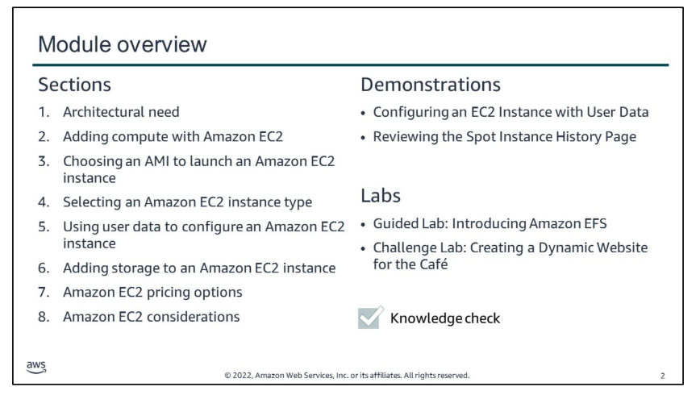
This module contains the following sections:

1.  Architectural need
2.  Adding compute with Amazon EC2
3.  Selecting an AMI to launch an EC2 instance
4.  Selecting an EC2 instance type
5.  Using user data to initialize an EC2 instance
6.  Configuring storage for an EC2 instance
7.  Amazon EC2 pricing options
8.  Amazon EC2 considerations

This module also includes:

-   A demonstration that will show you how to launch an Amazon Elastic Compute Cloud (Amazon EC2) instance with user data that installs a web server on the instance.
-   A demonstration of the Spot Instance Pricing History page.
-   A hands-on guided lab where you create a file storage system with Amazon Elastic Filesystem (Amazon EFS) and mount it on an EC2 instance.
-   A hands-on challenge lab where you will launch an EC2 instance with a web application that uses a database for the Café use case.

# 1.  Architectural need

As each module introduces new features, those parts of this larger diagram will be unveiled.

In this module, you will learn how to create an architecture for **running a dynamic web application on AWS by using Amazon EC2**. You also learn about some AWS **storage services that can be used with Amazon EC2**, including Amazon EFS.

# 2.  Adding compute with Amazon EC2

key takeaways:

-   Amazon EC2 enables you to run Microsoft Windows and Linux `virtual machines` in the cloud.
-   You can use an EC2 instance when you need `complete control of your computing resources` and want to` run any type of workload`. --> IaaS
-   When you launch an EC2 instance, you must choose an `AMI` and an `instance type`. Launching an instance involves specifying configuration parameters, including `network`, `security, storage`, and `user data` settings.

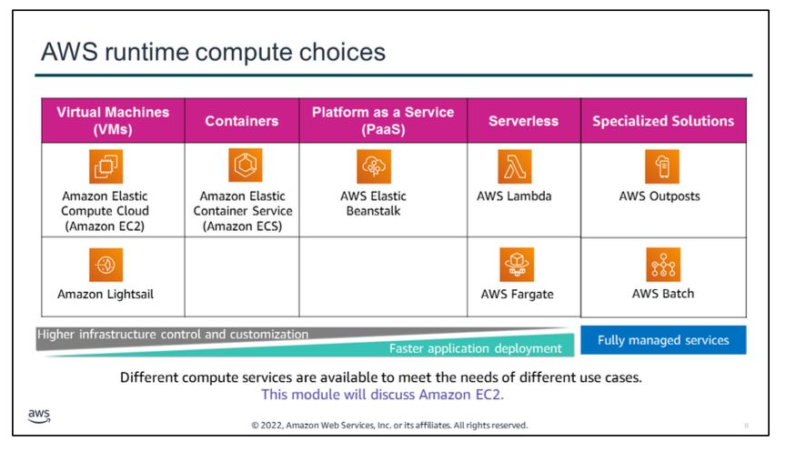

AWS offers several compute options to meet different needs. As you design the architecture to support a given type of workload, it is important that you understand the available compute options. As the diagram shows, the key runtime compute choices can be grouped into four cloud compute model categories: 
- `virtual machines (VMs); `
- `containers`; 
- `platform as a service,` which is also known as `PaaS`; 
- and `serverless`. 
In addition, you can use `specialized solutions` to address specific compute use cases.

In the `virtual machines` category, AWS offers two core services: 
- The first service is *Amazon Elastic Compute Cloud (Amazon EC2)*. It provides secure and resizable virtual servers in the cloud. 
- The second service is *Amazon Lightsail*. It provides virtual private servers to run simple workloads in a cost-effective way.

In the `containers` category, AWS offers *Amazon Elastic Container Service (Amazon ECS)*. It enables you to run *Docker* container applications on AWS.

The `PaaS` category includes *AWS Elastic Beanstalk*. It is a solution that runs web applications and services that are developed in languages such as Java, .NET, PHP, Node.js, Python, Ruby, Go, and *Docker*.

The `serverless` category includes:
- *AWS Lambda*, which is a serverless compute solution that runs Java, Go, PowerShell, Node.js, C#, Python, or Ruby code. 
- This category also includes *AWS Fargate*, which provides a serverless compute platform for *containers*.

For `specialized solutions`, 
- *AWS Outposts* provides a way to run AWS infrastructure and services *on-premises*, 
- and *AWS Batch* is a service that *runs batch jobs at any scale*.

When you select an AWS compute runtime for your workload, consider that:
- `virtual machines` and `container-based services` provide **more control** over your infrastructure and enable higher degrees of customization. 
- `PaaS` and `serverless services` enable you to **focus more on your application and less on infrastructure**. They also enable **quick deployment**. 
- The services in the `specialized solutions` category address specific types of workloads, or **hybrid cloud** and **batch**. These specialized services work well for these use cases because they are also fully managed by AWS. 

In this module, the focus will be on Amazon EC2.

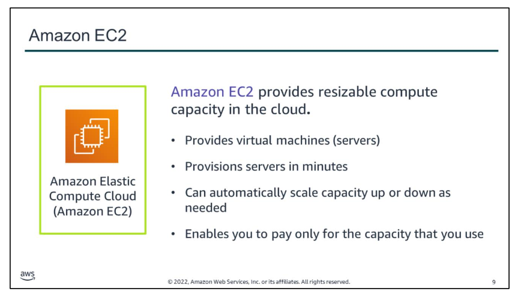

Amazon Elastic Compute Cloud (Amazon EC2) enables computing in the cloud. 
- You can use Amazon EC2 to *provision virtual servers*, and you can completely control the computing resources of those servers. 
- You can *obtain and start new server instances in minutes*. 
- You can *quickly scale capacity both up and down as your computing requirements change*. 
- *From a cost perspective, you pay only for the capacity that you use.*

Why is it called Elastic Compute Cloud?

-   Elastic because you can *easily increase or decrease the number of servers you run to support an application **automatically***. You can also *increase or decrease the size of existing* servers
-   Compute because most users run servers to host running applications or process data, which require compute resources. These resources include processing power (CPU) and memory (RAM)
-   Cloud because the EC2 instances that you run are hosted in the cloud

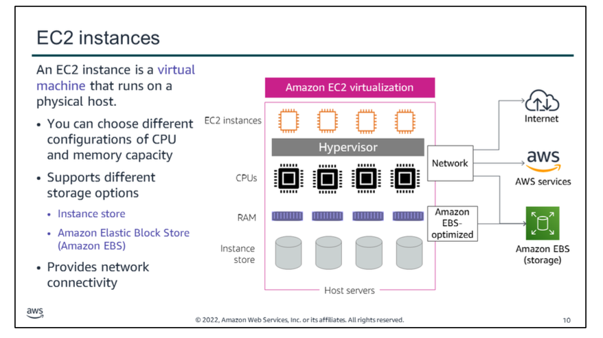
Amazon EC2 `instances` run as virtual machines on host computers that are located in AWS Availability Zones. Each virtual machine runs an operating system (OS), such as Amazon Linux or Microsoft Windows. 
You can install and run applications on the OS in each virtual machine. You can even run enterprise applications that span multiple virtual machines.

*The virtual machines run on top of a hypervisor layer that is maintained by AWS*. The `hypervisor` is the operating platform layer that provides an EC2 instance with access to *the actual physical hardware resources* that it needs to run, such as *processors, memory, and storage*.

Some EC2 instances use an `instance store`. The instance store is also known as `ephemeral storage`. It is storage that is physically attached to the host computer and provides *temporary* block-level storage to an instance.

Many EC2 instances use `Amazon Elastic Block Store (Amazon EBS)` for the *boot disk and other storage needs*. Amazon EBS provides *persistent* block storage volumes, which mean that the data will be persisted. 
For example, the data persists on that instance even when the EC2 instance is in a stopped state.

`EBS-optimized instances` provide faster access to an attached Amazon EBS volume by minimizing the I/O contention between the volume and other traffic from the instance.

EC2 instances can have `network` connectivity to other resources, such as other EC2 instances, AWS services, and the internet. 
You can configure the degree of network access to suit your needs and to balance accessibility needs with security requirements. Different instance types provide different levels of network performance

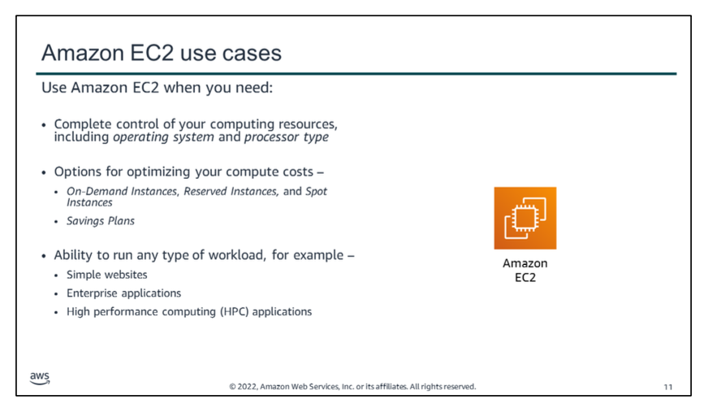
**EC2 use cases**: 
Amazon EC2 provides virtual machines where you can host the same kinds of applications that you might run on a traditional on-premises server. *Common uses for EC2 instances include web servers, application servers, database servers, and media servers.*

In particular, consider Amazon EC2 as a compute choice in situations where you need:
-   **Complete control of your computing resources** – Amazon EC2 enables you to set up and configure everything about your instances, from your `operating system to your applications`. 
  For example, you can use various operating systems that include *Microsoft Windows* and many variants of *Linux*. In addition, you can choose instances with either x86 or *Advanced RISC Machine (ARM)* processor architecture.
-   **Options for optimizing your compute costs** – Amazon EC2 offers several ways to pay for EC2 instances, including:
	- `On-Demand Instances`, 
	- `Savings Plans`, 
	- `Reserved Instances`, 
	- and `Spot Instances`. 
	- You can also pay for `Dedicated Hosts`, which provide you with EC2 instance *capacity on physical servers* that are dedicated for your use.
-   A virtual server to run any type of workload. 
For example:
		- Simple web;
		- Enterprise applications;
		- High performance computing (HPC) applications.
   
You will learn more details about Amazon EC2 computing resource choices and pricing options in later sections of this module.

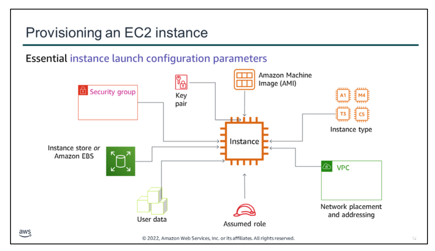

To **provision an EC2 instance**, you must make key decisions regarding its configuration details. The main parameters that you must specify to launch a secure instance include:
-   `Amazon Machine Image (AMI)` – An AMI *defines the base software configuration for an instance* and is used by Amazon EC2 to launch the instance.
-   `Instance type` – An instance type *defines a combination of CPU, memory, storage, and networking capacity* that provides a certain level of compute capability to run an application.
-   `Network placement and addressing` – When you launch an instance, you can *specify the appropriate network placement and addressing to provide the network access and security* that you want.
-   `Assumed role` – Optionally, you can attach an *AWS Identity and Access Management (IAM) role*, which grants permissions for accessing AWS services to applications that run on the instance or users that are connected to the instance.
-   `User data` – You can further *initialize or customize instance configuration by specifying a `user data script`*. This script automatically runs when the instance is launched.
-   `Storage` – You must *specify the type of storage that will be used to store the root or boot volume of the instance*.
-   `Security group` – You must also *configure a new security group or use an existing one*. The security group defines which ports network traffic is allowed on.
-   `Key pair` – A key pair is typically also specified at launch. The key pair is used for *Secure Shell (SSH)* connections or for establishing *Remote Desktop Protocol (RDP)* access to the instance.

# 3.  Selecting an AMI to launch an EC2 instance 

key takeaways:
-   An `AMI` provides the information that is needed to launch an EC2 instance
-   For best performance, use an AMI with `HVM virtualization type`
-   Only an instance launched from an Amazon EBS-backed AMI `can be stopped and started` 
-   An AMI is available in a Region

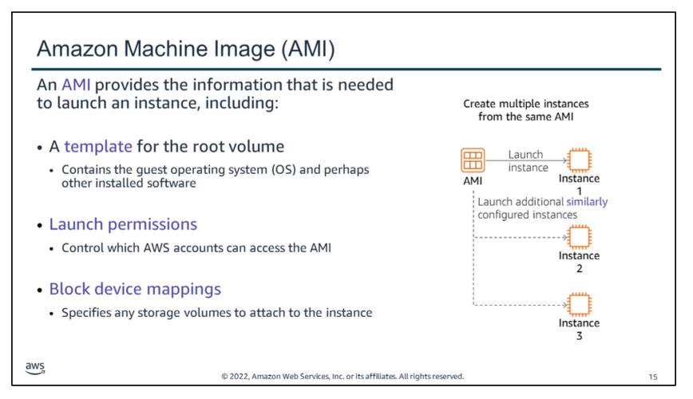
**Amazon Machine Image**
An `AMI` *provides the information that is needed to launch an instance*. You must specify a source AMI when you launch an instance. 
The AMI includes:
- a `template` for the root volume of the instance, 
- `launch permissions`, 
- and `block device mappings`.

A root volume typically *contains an operating system (OS) and everything that has been installed in that OS (applications, libraries, utilities, and others)*. Amazon EC2 copies the `template` to the root volume of the new instance and then starts it.

The `launch permissions` *control which AWS accounts can use the AMI to launch instances*. They also enable you to make the AMI available to the public.

The `block device mappings` *specify additional storage volumes (if any) to attach to the instance* when it is launched.

You can launch multiple instances from a single AMI when you need multiple instances that have the same configuration.

You can also use different AMIs to launch instances when you need instances with different configurations. 
For example, you might have one AMI to implement web server instances in your architecture, and another to implement application server instances.

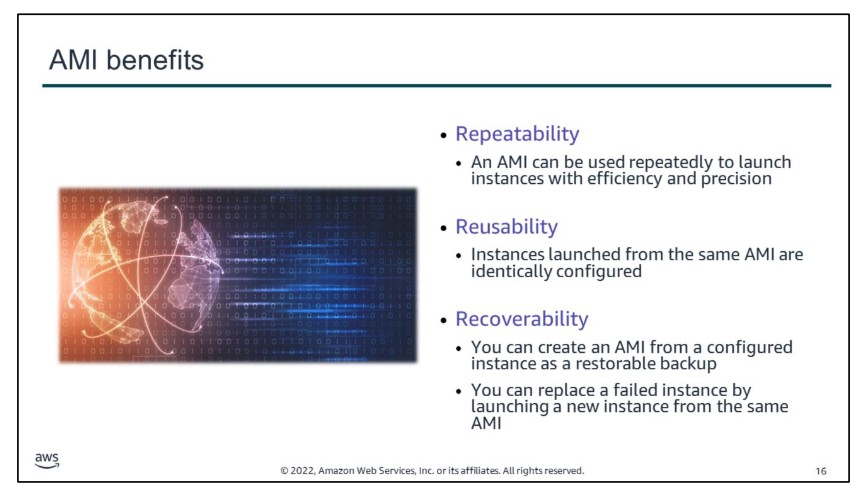

The benefits of using an AMI include `repeatability, reusability`, and `recoverability`.

AMIs enable `repeatability` because an AMI packages the full configuration and content of an EC2 instance. As such, it *can be used repeatedly to launch multiple instances with efficiency and precision*.

AMIs promote `reusability` because instances that are launched from the same AMI are exact *replicas of each other*. This design makes it *easier to build clusters of similar instances or recreate compute environments*.

AMIs also facilitate `recoverability`. 
- *If an instance fails, you can replace it by launching a new instance from the same AMI* that you used to launch the original instance.
- In addition, AMIs provide a way to *back up* a complete EC2 instance configuration, which you can use to launch a replacement instance if there is a failure.

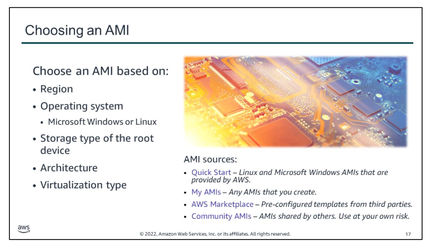
When you **choose an AMI** to launch an instance, your decision should be based on five key characteristics:

-   `Region` – Each AMI exists in a specific Region. 
  Therefore, you must select an AMI that is in the Region where you want the instance to run. You *can copy an AMI from one Region to another as needed*.
-   `Operating system` – For an AMI that is provided by AWS, you can choose between *Microsoft Windows* or a variant of *Linux*.
-   `Storage for the root device` – All AMIs are categorized as either *Amazon EBS-backed or instance store-backed*. 
  **The data on an instance store volume persists only during the lifetime of the instance, but the data on an EBS volume persists independently of the life of the instance.**
-   `Architecture` – This characteristic determines the type of processor architecture that best fits your workload. The choices are 32-bit or 64-bit, and either an x86 or Advanced RISC Machine (ARM) instruction set.
-   `Virtualization type` – AMIs use one of two types of virtualization: *paravirtual (PV) *or *Hardware Virtual Machine (HVM)*. 
  The main differences between PV and HVM AMIs include how they boot and whether they can take advantage of special hardware extensions for better performance. 
  **For best performance, use an AMI with HVM virtualization type.**

You can obtain an AMI from one of four sources:
-   `Quick Starts` are AMIs that are built by AWS. They offer the choice of either Microsoft Windows or variants of the Linux operating system. 
  The Linux options include: Amazon Linux, Ubuntu, Red Hat Enterprise Linux, SUSE Linux Enterprise Server, Fedora, Debian, CentOS, Gentoo Linux, Oracle Linux, and FreeBSD.
-   AWS also enables you to create your own AMIs (`My AMIs`). You can *create an AMI from an EC2 instance*.
-   You can also look for AMIs in the `AWS Marketplace`, which offers a digital catalog that lists thousands of software solutions. These solutions include AMIs *from software vendors for specific use cases* (third parties).
-   `Community-built AMIs` are created by people from around the world, and they can offer solutions to many different types of problems. However, they are not vetted by AWS. Therefore, use them at your **own risk**. In particular, **avoid using them in any production or corporate environment**.

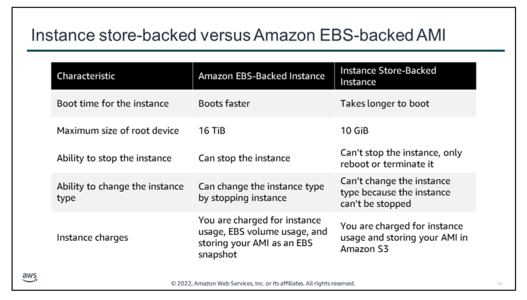
**Instance store-backed AMI vs  Amazon EBS-backed AMI** 
There are important behavior and performance differences when you launch an instance by using an instance store-backed AMI versus an Amazon EBS-backed AMI. They are as follows:

-   `Boot time for the instance`: 
  *Amazon EC2 instances that use instance storage* **take longer** to boot than *Amazon EC2 instances that use Amazon EBS* because all the image parts have to be retrieved from Amazon Simple Storage Service (Amazon S3).
-   The `maximum capacity of the root device` of an instance that is backed by Amazon EBS is 16 tebibytes (TiB) and is greater than that of an instance store-backed instance, which is 10 gibibytes (GiB).
-   You cannot stop an instance store-backed instance, only reboot or terminate it.
-   You cannot `change the instance type` of an instance store-backed instance.
-   The `cost` for an Amazon EBS-backed instance includes EBS storage charges. The cost of an instance store-backed instance includes Amazon S3 storage charges.
  Amazon S3 storage costs are usually cheaper.

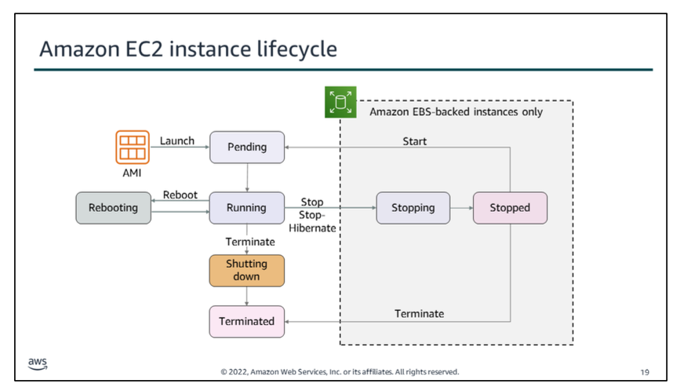
**EC2 instance lifecycle**
This diagram shows the lifecycle of an instance and highlights the extra actions and states that an Amazon EBS-backed instance allows.

When an instance is first launched from an AMI, or when you start a stopped instance, it enters the *pending* state. This state indicates that the instance is being provisioned on a host computer and is booting. The instance type that is specified in the AMI, or for the original stopped instance, determines the hardware of the host computer for the new instance.

When the instance is fully booted and ready, it exits the pending state and enters the *running* state. At this point, you can connect to your running instance over the internet and start to use it.

As soon as an instance is in a *running* state, it can be rebooted by using the Amazon EC2 console, the AWS Command Line Interface (AWS CLI), or AWS SDKs. It then moves to a *rebooting* state. A rebooted instance stays on the same physical host, and it maintains the same public Domain Name System (DNS) name and public IP address. If the instance has instance store volumes, it retains the data on those volumes.

From the *running* state, you can also terminate an instance. Terminating an instance causes the instance to go into an intermediary shutting down state before it displays a *terminated* state. 
A terminated instance remains visible in the Amazon EC2 console for some time before the virtual machine is deleted. However, you can’t connect to or recover a terminated instance.

Instances that are backed by Amazon EBS can also be stopped from a *running* state. They enter the *stopping* state before they attain the fully *stopped* state. A stopped instance does not incur the same cost as a *running* instance. Starting a *stopped* instance puts it back into the *pending* state, which moves the instance to a new host machine.

You can also hibernate (ngủ đông) an EBS-backed instance from the *running* state. 
**Doing so causes the in- memory storage, private IP address, and Elastic IP address to be saved**. They remain the same when you start the instance again, so you can pick up where you left off. 
In most cases, when you start a hibernated instance, it is moved to a new host computer. However, your instance might stay on the same host computer if the host computer has no problems.

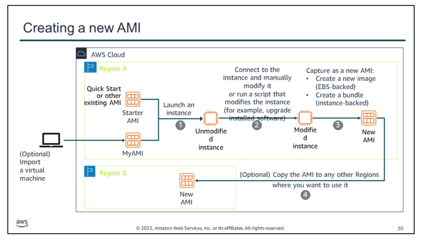
You **create an AMI** from an EC2 instance. You start with a source AMI, which can be an AMI that already exists—such as a Quick Start AMI that is provided by AWS. Or, you can start with an AMI that you build from a virtual machine that you import. You then launch an EC2 instance from this AMI (step 1).

Regardless of the option you choose (step 1), you will have what the diagram refers to as an *unmodified instance*. 
From that instance, you might then create a *golden instance*. In other words, create a virtual machine that ***you configure with the specific OS and application settings that you want*** (step 2). Then, capture it as a new AMI (step 3).

For an EBS-backed AMI, you capture the new AMI by *creating a new image*, and AWS automatically registers it for you. 
For an instance-backed AMI, you capture the new AMI by using Amazon EC2 AMI tools to create a *bundle* for the instance root volume, and upload the bundle to an Amazon S3 bucket. You then must manually register the new AMI.

After an AMI is registered, the AMI can be used to launch new instances in the same AWS Region. You can now think of the new AMI as a new starter AMI. 
Optionally, you might want to also copy the AMI to other Regions (step 4), so that you can also launch new EC2 instances in those locations.

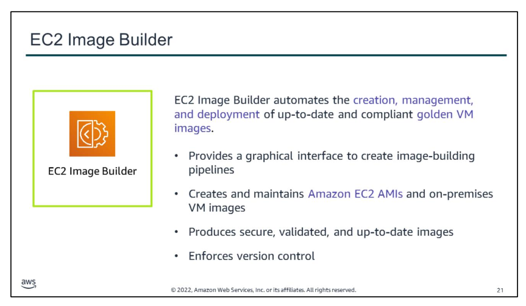

Another way to create an AMI is to use EC2 Image Builder.

EC2 Image Builder is an AWS service that simplifies the `creation, maintenance, validation, sharing, and deployment` of Linux or Microsoft Windows images. 
It provides a simple graphical interface to produce AMIs for use on AWS and to generate VM images for use on premises.

One of the benefits of using EC2 Image Builder is that it *enables you to create images with only the essential components, which can reduce your exposure to security vulnerabilities*. 
Before you use your images in production, you can use EC2 Image Builder to *validate* your images with tests that are provided by AWS or your own tests. 
Finally, it provides version control for revision management.

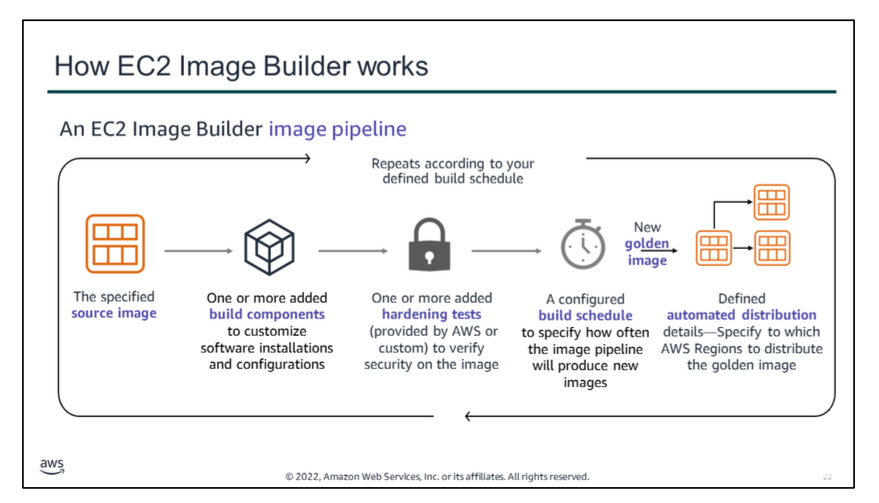
**How EC2 Image Builder works** 
You can create an `image pipeline` with EC2 Image Builder by using the AWS Management Console, AWS CLI, or application programming interfaces (APIs). 
When you use the AWS Management Console, the step-by-step wizard includes the following steps:
-   Step 1: Identify a `source image` to build your new image from (for example, choose Amazon Linux 2 or Windows Server 2019).
-   Step 2: Select `build components` software for installation or customization. You can choose from build components that are provided by Amazon (such as a component that installs Python 3), components that you have built, or components that have been shared with you.
-   Step 3: Select `hardening tests` that should be run each time the image pipeline runs, so that the image passes security checks. It also enables you to catch incompatibilities that were introduced by OS updates before deployment to AWS Regions. You can run both tests that were provided by AWS and your own tests. 
  An example of an AWS test is to test whether an AMI can run a sample application.
-   Step 4: Specify a `build schedule` to identify how often this pipeline should run, and when.
-   Step 5: Define (`automated distribution`) whether you want the image to be distributed to selected Regions.

Image Builder outputs a server image that is in one of the following supported formats: AMI, VHDX, VMDK, and OVF. 
You can configure the image that you build to be patched on an ongoing basis. You can also monitor build progress and have `Amazon EventBridge` (formerly known as `Amazon CloudWatch Events`) notify you for troubleshooting and debugging.

# 4.  Selecting an EC2 instance type

key takeaways:

-   An EC2 `instance type` defines a configuration of CPU, memory, storage, and network performance characteristics
-   As a recommendation, choose `new generation instance types in a family` because they generally have better price-to-performance ratios
-   Use the `Instance Types` page in the Amazon EC2 console and `AWS Compute Optimizer` to find the right instance type for your workload

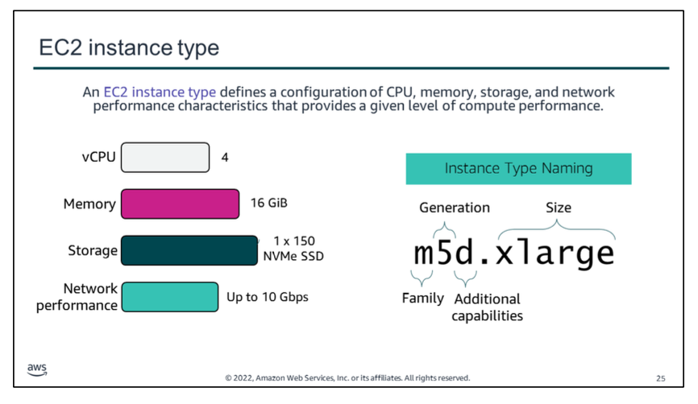
Before you can launch an instance, you must select an instance type to use. 
An **EC2 instance type** defines a configuration of CPU, memory, storage, and network performance characteristics. This configuration provides a given level of compute performance. 
The instance type that you choose will depend on:
- your workload’s performance 
- and cost requirements.

Instance type names follow a standard convention. An instance type name consists of multiple parts that describe the different characteristics of the instance type.

For example, in the `m5d.xlarge` instance type name, 
- `m` is the family name. It is followed by a number, which is `5` in this case. It represents the generation number of that type. So, an *`m5` instance is the fifth generation of the m family*. 
- In general, instances with a higher generation number are more powerful and provide a better value for the price than instances with a lower generation number.
- Following the generation number, you find an optional part that indicates *additional capabilities* of the instance type. 
  In the example, the `d` in the name indicates that *the instance type uses a solid state drive (SSD) for the root EBS volume* instead of a standard hard disk drive (HDD).
- The next part of the name, which follows a period (.) separator, **represents the size of the instance**. The instance type size defines the performance specification of an instance across the CPU, memory, storage, and network performance categories. 
  In the example, `xlarge` indicates that it is an `extra-large` instance. 

For the latest list of Amazon EC2 instance types, see the Amazon EC2 Instance Types documentation. [Amazon EC2 Instance Types - Amazon Web Services](https://aws.amazon.com/ec2/instance-types/) 

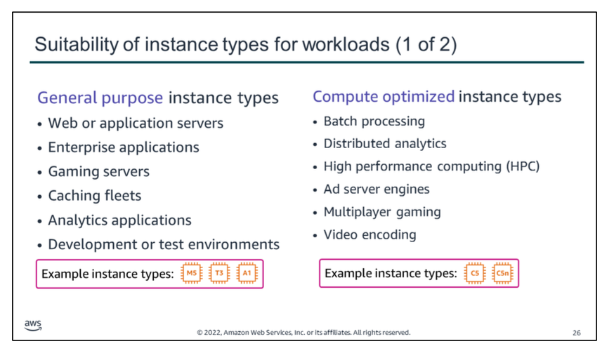
You will now learn about the **suitability of different instance types for different workloads**. 

Instance types can be categorized as:
- general purpose, 
- compute optimized, 
- memory optimized, 
- accelerated computing, 
- or storage optimized. 
You will see each of the categories in this slide and the next slide.

`General purpose` instances provide a balance of compute, memory, and networking resources. They can be used for diverse (nhiều loại khác nhau) workloads. 
These instances work well for applications that use these resources in equal proportions (cân đối nhau). Typical use cases for general purpose instances are: web or application servers, enterprise applications, gaming servers, caching fleets, analytics applications, and development or test environments.

Examples of general purpose instance types include *M5, T3, and A1* instances.

`Compute optimized` instances work well for compute-bound applications that benefit from high- performance processors. Instances that belong to this family are suited for workloads like batch processing, distributed analytics, *high performance computing* (HPC), ad server engines, multiplayer gaming, and video encoding.

Examples of compute optimized instance types include *C5 and C5n* instances.

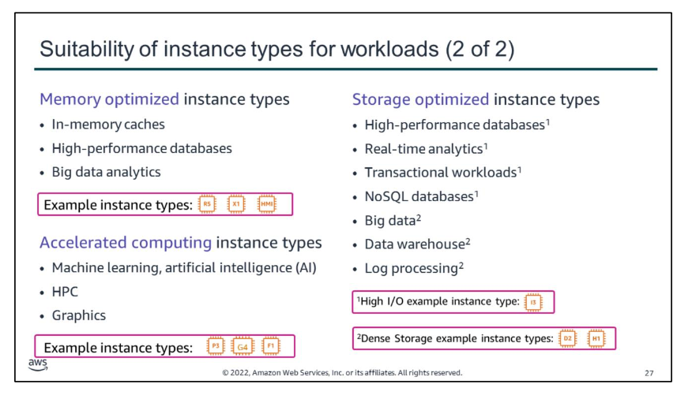

`Memory optimized` instances are designed to *deliver fast performance for workloads that process large datasets in memory*. They are suited for applications like in-memory caches, high- performance databases, and big data analytics.

Examples of memory-optimized instance types include *R5, X1, and HMI* instances.

`Accelerated computing` instances *use hardware accelerators (or co-processors) to perform functions like floating-point-number calculations, graphics processing, and data-pattern matching*. 
They do so *more efficiently than performing those functions in software that runs on CPUs*. Accelerated computing instances are suited for machine learning and artificial intelligence, HPC, and graphics workloads.

Examples of accelerated computing instance types include *P3, G4, and F1* instances.

`Storage optimized` instances are designed for workloads that *require high, sequential read/write access to very large datasets on local storage. They are optimized to deliver tens of thousands of low-latency, random IOPS*. They are suited for applications like high-performance databases, NoSQL databases, real-time analytics, transactional workloads, big data, data warehouses, and log processing.

Examples of storage optimized instance types include *I3, D2, and H1* instances.

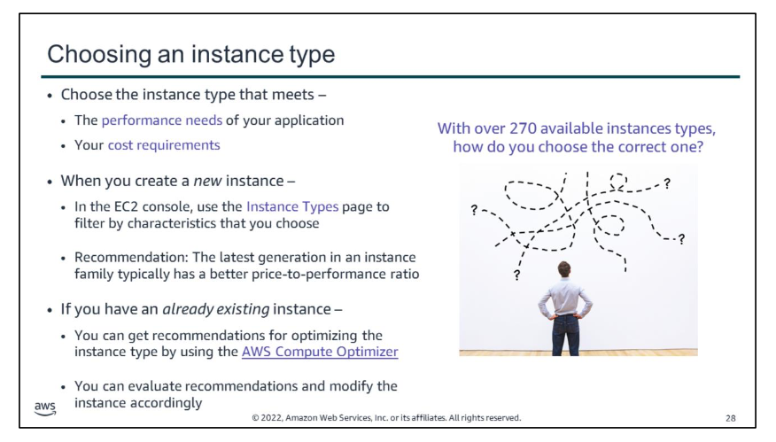
**CHOOSING AN INSTANCE TYPE**
Given the combination of instance type categories, capabilities, and options that are associated with an instance type, it’s no surprise that there are quite a few of them. 
As of March 2020, there are more than 270 instance types available. This wide selection reflects the deep and broad richness of AWS’ cloud compute offerings.

The high number of instance types make it challenging to answer the question: How do you select the right instance type for your workload?

You want to choose an instance type:
- that provides the level of performance that your application needs (`performance needs`)
- while ensuring the efficient utilization of your instance’s resources to minimize cost (`cost requirements`).

If you are creating a new instance,
- use the `Instance Types` page in the Amazon EC2 console to help you search and compare the choices. This page displays all the available instance types in a Region and provides search and filtering capabilities based on attribute values. 
- As a recommendation, when choosing an instance type in a family, select the latest generation instance type as it will typically have better price-to-performance ratio.

If you already have a running instance (`already existing instance`), 
- you can use the `AWS Compute Optimizer` service to get recommendations on how to optimize the instance type. This service can analyze your instance’s runtime behavior and make recommendations on how to optimize it. 
- You can then evaluate the recommendations and modify the instance accordingly.

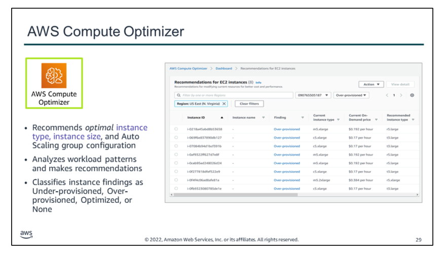

AWS Compute Optimizer is a service that analyzes the configuration and utilization metrics of EC2 instances and Auto Scaling groups. It generates optimization *recommendations to reduce the cost and improve the performance of your workloads*. You can use these recommendations to decide whether to move to a new instance type.

Compute Optimizer uses Amazon Machine Learning (Amazon ML) to analyze your workloads. Currently, it generates EC2 instance type and size recommendations for *M, C, R, T, and X instance families*. When it is activated, *Compute Optimizer will analyze your running AWS compute resources and start to deliver recommendations*.

Compute Optimizer classifies its findings for EC2 instances as:
- Under-provisioned, 
- Over- provisioned, 
- Optimized, 
- or None. 
  The None classification might occur if you have activated Compute Optimizer for less than 12 hours, when the instance has been running for less than 30 hours, or when the instance type is not supported by Compute Optimizer.

For more information, see the AWS Compute Optimizer User Guide. [What is AWS Compute Optimizer? - AWS Compute Optimizer (amazon.com)](https://docs.aws.amazon.com/compute-optimizer/latest/ug/what-is-compute-optimizer.html) 

# 5.  Using user data to initialize an EC2 instance

key takeaways:
-   `User data` enables you to pass *configuration* parameters or run an initialization script when you *launch an EC2 instance*.
-   Information about a running instance can be accessed in the instance through an `instance metadata URL`.
-   Baking configurations into an AMI `increases AMI build time`, but `decreases instance boot time`.
  Configuring an instance by using `user data decreases AMI build time, but increases instance boot time`.

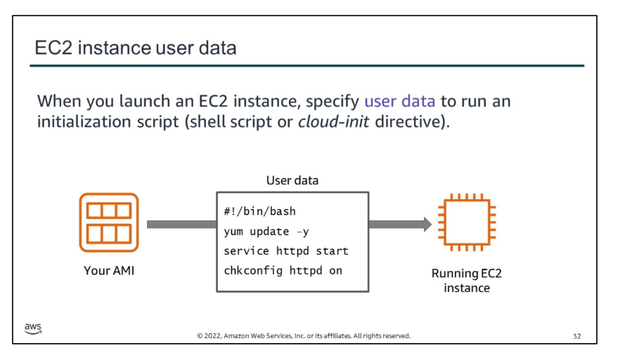
**EC2 instance user data** 
When you launch an EC2 instance, you have the option of passing `user data` to it. User data enables you to provide *a script* that can be used to *initialize it*. 
For example, you can use user data:
- to patch and update the software that is installed on the instance from the AMI, 
- fetch and install software license keys, 
- or install additional software.

*User data is implemented as a script*, which contains *shell commands* or *cloud-init *directives. 
It runs with root or Administrator privileges after the instance starts, but before it is accessible on the network. 
In the example, a user data script is provided to perform the following tasks when the instance is launched:
-   Update all packages that are installed on the instance
-   Start the installed Apache HTTP web server
-   Configure the HTTP web server to automatically start when the instance boots

The `cloud-init` package is an open source application that was built by Canonical. It is used to bootstrap **Linux instances** in cloud-computing environments, such as Amazon EC2. Amazon Linux and many other Linux variants (such as Ubuntu) contain a version of cloud-init. 
The cloud- init package configures specific aspects of a new Amazon Linux instance when it is launched, even if you do not specifically add them to the user data scripts. Most notably, it configures the `.ssh/authorized_keys` file for the ec2-user so that you can log in with your own private key. 

However, you can also specify your own cloud-init user directives by adding them as user data directives. 
Details, including sample cloud-init directives, can be found in the Running Commands on Your Linux Instance at Launch documentation.
    [Getting Started with Amazon Web Services | AWS](https://aws.amazon.com/getting-started/)

When the user data script runs, it produces messages in a log file located at `/var/log/cloud-init-output.log` on a Linux instance. For a Microsoft Windows instance, the log file is located at
    
    C:\ProgramData\Amazon\EC2-Windows\Launch\Log\UserdataExecution.log

On **Microsoft Windows instances**, user data is processed by the EC2Config or EC2Launch tools, which include Windows PowerShell scripts. Windows 2016 and more recent Windows versions include EC2Launch. Older versions of Windows include EC2Config.

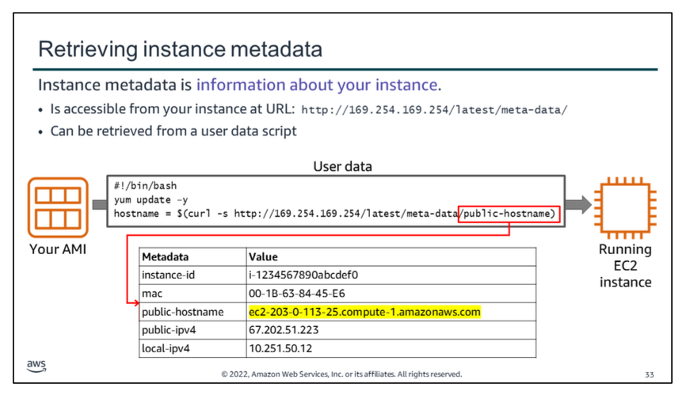
**Retrieving Instance metadata**  (Retrieve: khôi phục)

For user data to complete the launch of a new EC2 instance, it might *need to look up information about the instance itself*. 
For example, it might need to learn and share:
- the public IP address, 
- hostname, 
- or media access control (MAC) address of the new instance to complete the launch.
The Instance Metadata Service can provide that information.

`Instance metadata` is data about your instance. In many situations, you might need some information about the instance that you just launched. 
For example, in a `user data script`, you might need to know:
- the instance’s hostname 
- or public IP address to configure a connection to an external resource. 
-The Instance Metadata Service can provide that information.

Specifically, you can retrieve metadata information from your running instance by accessing the following URL: http://169.254.169.254/latest/meta-data/. *The IP address `169.254.169.254` is a link- local address, and it is valid only from the instance.*

Instance metadata provides much of the same information about the running instance that you can find in the AWS Management Console.

For example, you can discover:
- the public IP address, 
- private IP address, 
- public hostname, 
- instance ID, 
- security groups, 
- Region, Availability Zone, 
- and more. 
You can even access the user data specified at launch time for an instance by accessing the following URL: http://169.254.169.254/latest/user-data.

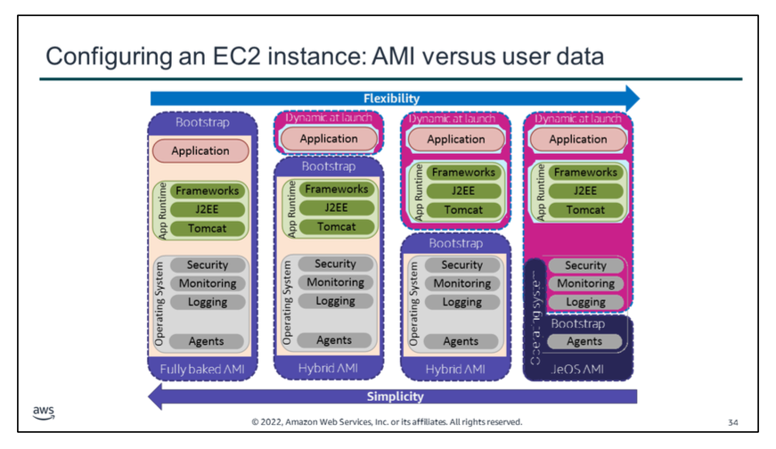
**Configuring an EC2 instance: AMI vs user data**
When you launch an EC2 instance, you must make an important architectural decision. *How much of the instance configuration should you pre-install in a base AMI, and how much should you dynamically build with user data at boot time*?

At one end of the spectrum (quang phổ), you can build an AMI that contains all the configuration for the instance. This *fully baked AMI*  includes everything to serve your workload, including the OS, the application runtime software, and the application itself. When you launch an instance with this AMI, it *provisions a fully functional instance without any additional boot-time configuration*.

At the other end of the spectrum, you can build an AMI that simply contains a minimal OS. This *Just Enough Operating System (JeOS) AMI* includes a configuration management agent that builds a fully functional system at instance launch. On first boot, the configuration agent downloads, installs, configures, and integrates all required software.

As an intermediate solution, you can build an AMI that contains a subset of the configuration that your workload needs. 
For example, the AMI could contain the OS and application runtime software only, or only the OS. This *hybrid AMI* then uses user data to complete the instance’s configuration on first boot, based on the application’s requirements.

Discovering the ideal approach typically results from considering the tradeoffs between simplicity and flexibility. Some of the factors that you should consider are:
-   **Build times** – A fully baked AMI will lengthen the amount of time it takes to produce a build.
-   **Boot times** – An AMI with an OS-only configuration will take a long time to boot when a new instance is launched. Packaging prerequisites into a custom AMI shortens boot times.  
- **Shelf life** – When you install more prerequisites on an AMI, you run a greater risk that your application will be vulnerable to a security risk if the underlying AMI is not frequently updated with security or application updates. Assess (đánh giá) the risk that updates to your dependencies pose.

In summary, each approach provides tradeoffs:

-   *Full AMI* – The applications and all dependencies are pre-installed, which shortens boot times but increases build times. Full AMIs typically have a shorter lifespan. Consider your rollback strategy.
-   *Hybrid (partially configured) AMIs* – Only prerequisite software and utilities are pre-installed, which ***leads to a longer shelf life for the AMI***. This approach provides a balance between boot speed and build time. Rollbacks become easier.
-   *OS-only AMI* – This approach is fully configurable and upgradeable over time and shortens build times. However, it makes your EC2 instances slow to boot because all required installations and configurations must be run at boot time.

Many organizations decide on a hybrid approach, where some configurations are baked into a custom base AMI and other settings are configured dynamically at launch.

For more information, see AWS AMI Design on AWS Answers. [Best practices for building AMIs - AWS Marketplace (amazon.com)](https://docs.aws.amazon.com/marketplace/latest/userguide/best-practices-for-building-your-amis.html) 
 

# 6.  Configuring storage for an EC2 instance

key takeaways:

-   Storage options for EC2 instances include `instance store, Amazon EBS, Amazon EFS, and Amazon FSx for Windows File Server`
-   For a `root volume`, use instance store or SSD-backed Amazon EBS
-   For a `data volume that serves only one instance`, use instance store or Amazon EBS storage
-   For a `data volume that serves multiple Linux instances`, use Amazon EFS
-   For a `data volume that serves multiple Microsoft Windows instances`, use Amazon FSx for Windows File Server

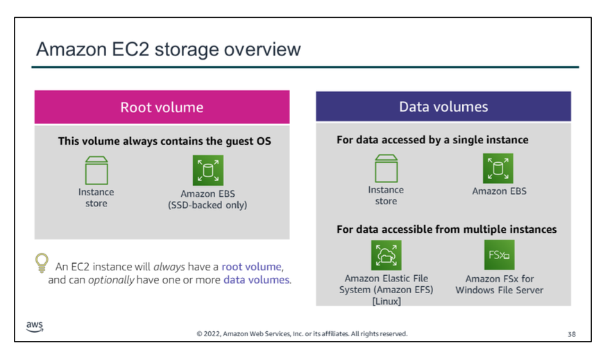
## EC2 storage overview
EC2 instances have four main storage options:
-   Instance store
-   Amazon EBS
-   Amazon Elastic File System (Amazon EFS)
-   Amazon FSx for Windows File Server

All four options can be used to store a data volume. 
However, **only an `instance store` or an `SSD- backed EBS` volume can be used to store a root volume**. 
In addition, **an `instance store` or `EBS` volume must be used by a single instance at a time**. 
In the case of an instance store volume, only the instance that the volume is added to can use it.

If you want to share a data volume among multiple instances at the same time, you can use `Amazon EFS or Amazon FSx` for Windows File Server. Amazon EFS provides a shared file system for Linux instances, but Amazon FSx provides a shared file system for Microsoft Windows instances.

In this section, you will review each of these options.
    
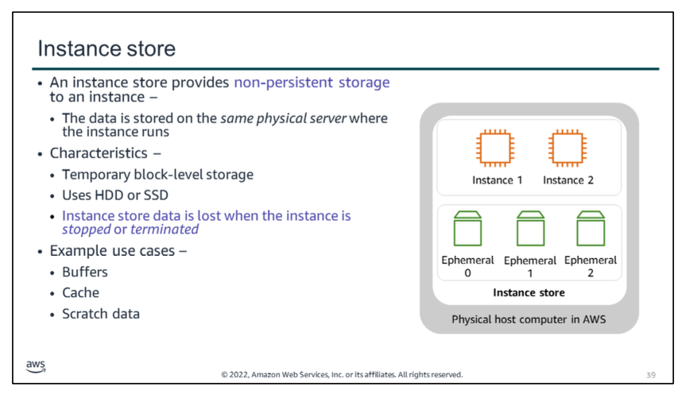

An `instance store` volume provides *temporary block-level storage* for your instance. This storage is on disks that are physically attached to the computer that hosts the running instance. 
An instance store works well for the temporary storage of information that changes frequently, such as *buffers, caches, scratch data, and other temporary content*.

An instance store *consists of one or more volumes* that are exposed as block devices. The volumes reside on either *HDDs or SSDs*. SSDs can be Serial ATA SSDs or Non-Volatile Memory Express (NVMe) SSDs. Instance stores that use NVMe have higher I/O performance. 
An instance store is dedicated to a particular instance, but the disk subsystem is shared among instances on a host computer.

The instance type determines the available sizes for an instance store and the type of hardware that is used for the instance store volumes. *Most instance types support instance stores, but not all*.

**The data in an instance store is preserved when the instance is rebooted, but not when it is terminated.** 
*Instance store-backed instances cannot be stopped.* They can only be rebooted or terminated. 
If an instance reboots, data in the instance store persists. 

For more information, see the Amazon EC2 Instance Store topic in the Amazon EC2 online documentation. [Amazon EC2 instance store - Amazon Elastic Compute Cloud](https://docs.aws.amazon.com/AWSEC2/latest/UserGuide/InstanceStorage.html) 

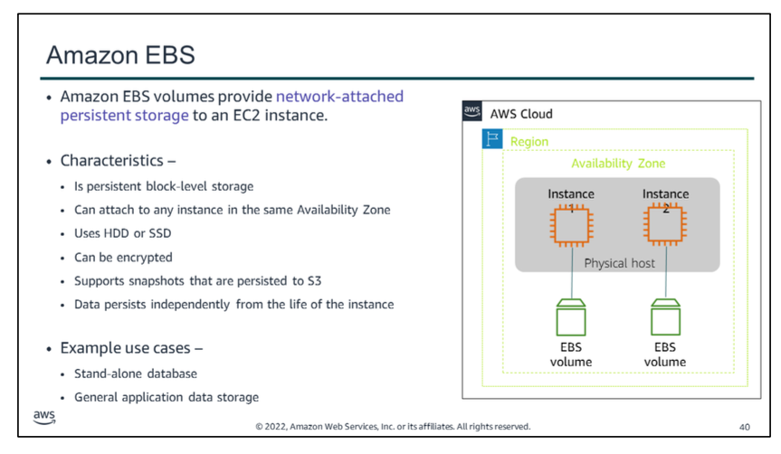
**Amazon EBS** provides *block-level storage volumes*, *similar to an external hard drive, for use with Amazon EC2 instances*.  --> S3 là object, EBS là block.
Amazon EBS volumes are highly available and reliable, and *can be network-attached to running instances in the same Availability Zone*. 

Amazon EBS volumes persist *independently from the life of the instance and can be encrypted*. 
In addition, you can *back up the data on an Amazon EBS volume to Amazon S3 by taking a point-in- time snapshot*.

Amazon EBS volumes reside on either *HDDs or SSDs* (Serial ATA SSD or NVMe SSD).

Because they are mounted on the instance, EBS volumes can provide extremely low access latency (độ trễ truy cập cực thấp). 
For this reason, *EBS volumes can be used to run a database on an EC2 instance*, for example.

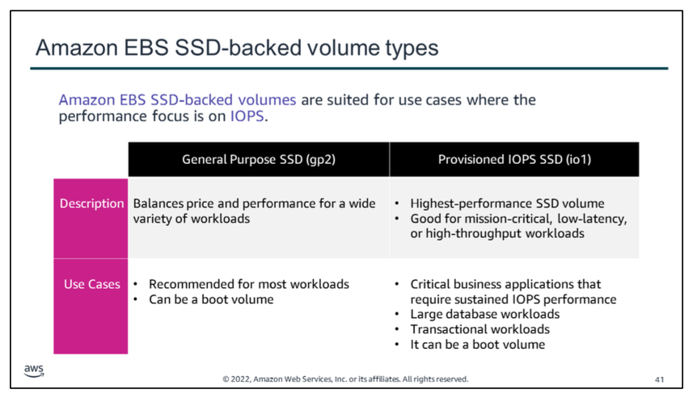
**Amazon EBS SSD-backed volume types**

Amazon EBS provides volume types that differ in performance characteristics and price to tailor storage performance and cost to the needs of different applications. They fall into two categories: HDDs and SSDs.

*SSD-backed volumes are optimized for transactional workloads that involve frequent read/write operations with small I/O size*, where the dominant performance attribute is IOPS (Input/Output Operations Per Second).

The two types of Amazon SSD-backed volumes are:
- *General Purpose SSD (gp2)* – This volume type is the **default EBS volume type for EC2 instances**. These volumes are suitable for a range of transactional workloads, including:
	- development or test environments, 
	- low-latency interactive applications, 
	- and boot volumes. 
- *Provisioned IOPS SSD (io1)* – This volume type is the **highest-performance EBS storage option**.
  It is designed for critical, I/O-intensive database and application workloads, and throughput- intensive database  and data warehouse workloads.
   Use cases (slide):
   - Critical business apps that require sustained IOPS performance
   - Large database (db) workloads
   - Transactional workloads
   - It can be a boot volume

Amazon EBS SSD-backed volumes are *ideal for both IOPS-intensive and throughput-intensive workloads that require extremely low latency*.

***Note: trong 4 types nêu ở SSD-backed và HDD-backed, chỉ General Purpose SSD (gp2) can be a boot volume***

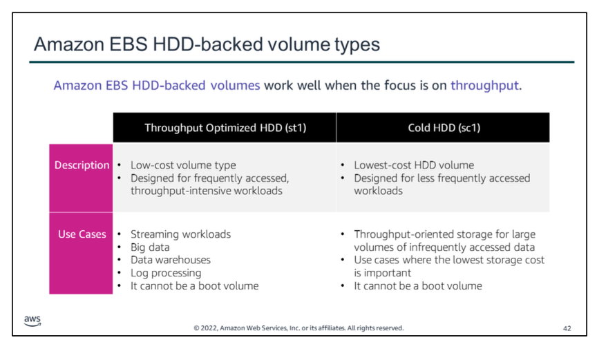
**Amazon EBS HDD-backed volume types**
HDD-backed volumes are *optimized for large streaming workloads where throughput (measured in MiB/s) is a better performance measure than IOPS*.

Amazon HDD-backed volumes come in two types:
- *Throughput Optimized HDD (st1)* – This volume type is ideal for frequently accessed, throughput-intensive workloads with large datasets and large I/O sizes.
-  *Cold HDD (sc1)* – This volume type provides **the lowest cost** per GB of all EBS volume types. It works well for less-frequently accessed workloads with large, cold datasets.  

For more information, see the Amazon EBS Volume Types topic in the Amazon EC2 User Guide. [Amazon EBS volume types - Amazon Elastic Compute Cloud](https://docs.aws.amazon.com/AWSEC2/latest/UserGuide/ebs-volume-types.html) 

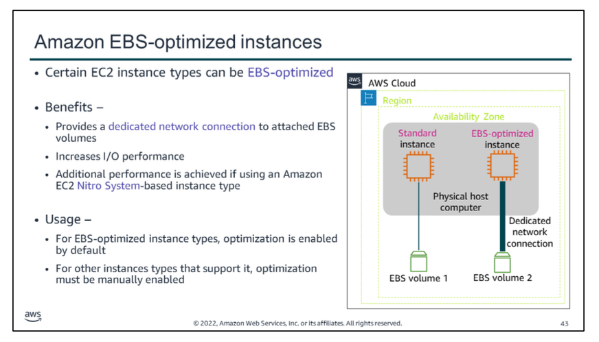
**Amazon EBS-optimized instances**
Certain EC2 instance types *can be optimized so that I/O access to an EBS volume is increased*. 
These instances are called `Amazon EBS-optimized instances`.

An EBS-optimized instance has a *dedicated network connection between itself and an EBS volume*. This optimization provides *the best performance for accessing EBS volumes by minimizing contention between Amazon EBS I/O and other network traffic from the instance*. Specifically, it provides a dedicated bandwidth to Amazon EBS, with options between 425 Mbps and 14,000 Mbps (depending on the instance type that you use). *This dedicated bandwidth provides performance consistency*. 

For example, for a `General Purpose SSD (gp2)` volume that is attached to an EBS-optimized instance, it can translate to a 10 percent improvement over its baseline performance.

*If an EC2 instance type supports **EBS optimization**, it is automatically enabled when the instance type is categorized as EBS-optimized*. 
Otherwise, you must manually enable the optimization when you launch the instance by setting its Amazon EBS-optimized attribute.

Furthermore, if an EBS-optimized instance type is built on the `AWS Nitro system`, it can benefit from additional performance increases. *This system is a collection of AWS-built hardware and software components that enable high performance, high availability, high security, and bare metal capabilities to eliminate virtualization overhead*.

For more information, see the Amazon EBS–Optimized Instances topic in the Amazon EC2 User Guide [Amazon EBS–optimized instances - Amazon Elastic Compute Cloud](https://docs.aws.amazon.com/AWSEC2/latest/UserGuide/ebs-optimized.html) 

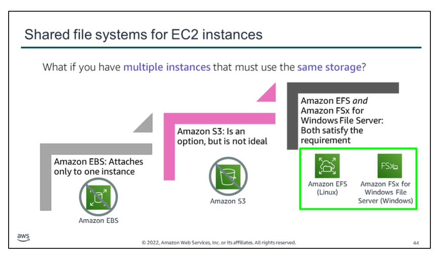

**Shared file system for EC2 instances**
*Amazon EC2 instance store and Amazon EBS provide good choices for storing both root and data volume for a single instance*. 
However, what if you need to share data among multiple instances simultaneously (đồng thời)? How do you handle an application that runs on multiple instances that must use the same file system?

Earlier in this section, you learned that an *EBS volume must be attached to only one instance at a time*. Therefore, it cannot solve the stated problem. Amazon S3 is another option, but it is an object store system, not a block store. Thus, changes in Amazon S3 overwrite entire files, not blocks of characters in files. *For making high-throughput changes to files of various sizes, a file system works better than an object store system*.

This requirement needs the performance and read/write consistency of a network file system. Amazon EFS and Amazon FSx for Windows File Server provide a shared file system for Linux instances and Windows instances. You will learn about these two services next.

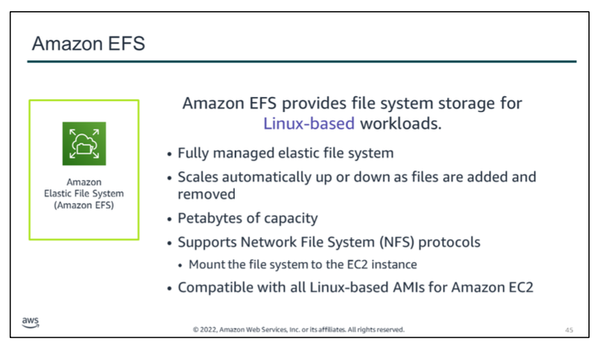

**Amazon EFS**
Amazon EFS is a *fully managed service that provides file system storage for Linux-based workloads*. Files are accessed via a file system interface (using standard operating system file I/O APIs). They support full file system access semantics, such as strong consistency and file locking. *Amazon EFS uses the `Network File System (NFS)`* version 4.x protocol. It can be used with any AMIs that support this protocol.

*Multiple EC2 instances can access an EFS file system at the same time*. 
Thus, Amazon EFS can provide a common data source for workloads and applications that run on more than one Amazon EC2 instance. 
In addition, EFS file systems can *automatically scale from gigabytes to `petabytes` of data without needing to provision storage*.

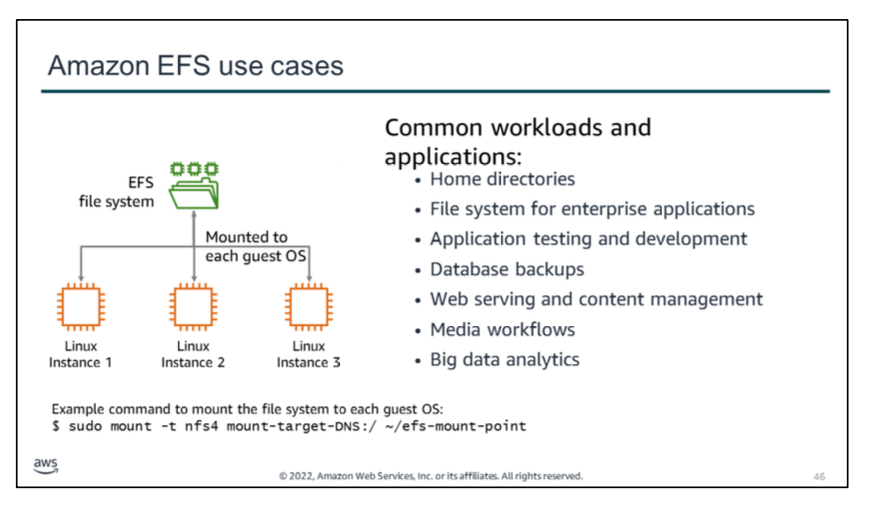
**Amazon EFS use cases**
The main use cases for Amazon EFS include:

-   *Home directories* – Provides storage for organizations that have *many users who must access and share common datasets*.
-   *File system for enterprise applications* – Provides the *scalability, elasticity, availability, and durability* to be the file store for enterprise applications and for applications that are delivered as a service.
-   *Application testing and development* – Provides a common storage repository that *enables you to share code and other files in a secure and organized way*.
-   *Database backups* – Can be mounted with NFSv4 from database servers.
-   *Web serving and content management* – Provides a durable, high-throughput file system for content management systems that store and serve information for a range of applications (such as websites, online publications, and archives).
- *Media workflows* – Provides the strong data consistency model, high throughput, and shared-file access that can reduce the time it takes to perform video editing, studio production, broadcast processing, sound design, and rendering jobs. 
  At the same time, it consolidates multiple local file repositories into a single location for all users.
-   *Big data analytics* – Provides the scale and performance for big data applications that need high throughput to compute nodes, along with read-after-write consistency and low-latency file operations.

For more information, see the Amazon EFS User Guide. [What is Amazon Elastic File System? - Amazon Elastic File System](https://docs.aws.amazon.com/efs/latest/ug/whatisefs.html) 

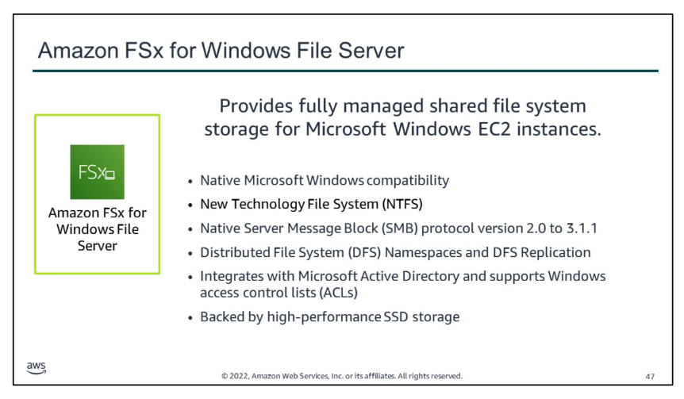

**Amazon FSx**
If you need file system-based storage for Microsoft Windows EC2 instances, *Amazon FSx for Windows File Server provides fully managed Windows file servers, backed by a fully-native Windows file system*. It is built on Microsoft Windows Server and has native support for Windows file system features and protocols including:
-   *New Technology File System (NTFS)*, the default file system of Windows servers
-   *Server Message Block (SMB)*, the open standard protocol for accessing file storage over a network
-   *Distributed File System (DFS)*, a service that enables the organization of multiple distributed SMB file shares into a distributed file system
-   *Microsoft Active Directory*, the Microsoft directory service that administers and organizes enterprise resources (including users, groups, and network resources) 
  
  *Amazon FSx uses SSD storage to provide fast performance, high levels of throughput and IOPS, and low latencies*. It also reduces the administrative overhead of setting up and provisioning file servers and storage volumes.

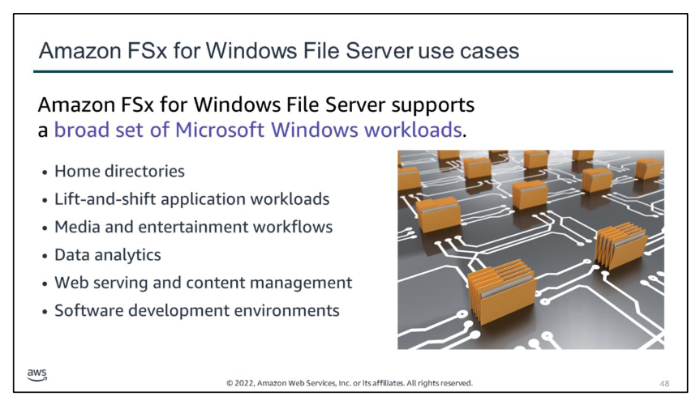
**Amazon EFS use cases**
Use cases for Amazon FSx for Windows File Server (FSx) include the following Microsoft Windows workloads:
-   *Home directories* – Create a file system that hundreds of thousands of users can access, and establish permissions at the file or folder level.
-   *Lift-and-shift applications* – It provides fully managed native Windows file shares with features, like Microsoft Active Directory integration and automatic backups.
-   *Media and entertainment workflows* – Media workflows—like media transcoding, processing, and streaming—often depend on shared Windows file storage with consistent performance. FSx for Windows File Server provides you with a shared file system with the high throughput and low latencies that these Windows workloads need.
-   *Data analytics* – By providing scalable file systems with high throughput and low latencies, FSx for Windows File Server enables you to run data-intensive analytics workloads.
-   *Web serving and content management* – Multiple web or content servers typically need access to the same files. *FSx for Windows File Server provides a file system that can be accessed across thousands of instances simultaneously*. 
-   *Software development environments* – FSx for Windows File Server enables you to move to in-cloud development with no changes to your development workflows by providing shared file storage that your developers and their environments can access.

For more information, see the Amazon FSx for Windows File Server User Guide.  [What is FSx for Windows File Server? - Amazon FSx for Windows File Server](https://docs.aws.amazon.com/fsx/latest/WindowsGuide/what-is.html) 

# 7.  Amazon EC2 pricing options

key takeaways:

-   `Amazon EC2 pricing models` include:
	- On-Demand Instances, 
	- Reserved Instances, 
	- Savings Plans, 
	- Spot Instances, 
	- and Dedicated Hosts
-   `Per-second billing` is available only for On-Demand Instances, Reserved Instances, and Spot Instances that run `Amazon Linux or Ubuntu` 
-   Use a `combination` of Reserved Instances, Savings Plans, On-Demand Instances, and Spot Instances to `optimize` Amazon EC2 compute costs

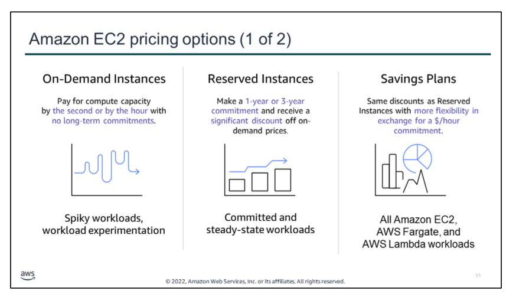
AWS offers five ways to pay for Amazon EC2 instances: *On-Demand Instances, Reserved Instances, Savings Plans, Spot Instances, and Dedicated Hosts*. 

*On-Demand Instances* offer the most flexibility, with no long-term contract and low rates. 
They are a good choice for applications with *short-term, spiky, or unpredictable workloads*. They are also suited for developing and testing applications on Amazon EC2 for the first time. With On- Demand Instances, you *pay for compute capacity by the hour or by the second*, depending on which instances you run. On-Demand Instances have the lowest upfront cost and the most flexibility. They require *no upfront commitments or long-term contracts*.

*Reserved Instances* enable you to *reserve computing capacity for a 1-year or 3-year term* with lower hourly running costs. The *discounted* usage price is fixed for as long as you own the Reserved Instance. 
Reserved Instances are a good choice if you have predictable or steady-state compute needs (for example, an instance that you know you want to keep running most or all the time for months or years). 
If you expect consistent, heavy use, they can provide substantial savings compared to On-Demand Instances.

*Savings Plans* is a *flexible pricing model that offers low prices on Amazon EC2, AWS Lambda, and AWS Fargate usage, in exchange for a commitment to a consistent amount of usage (measured in dollars per hour) for a 1-year or 3-year term*. 
It offers lower prices on EC2 instance usage compared to On-Demand Instances, regardless of *instance family, size, operating system, tenancy, or AWS Region*. 
Each type of compute usage has an On-Demand Instance rate and a Savings Plans price. 
You can get started with Savings Plans from AWS Cost Explorer in the console or by using the API or the AWS CLI.

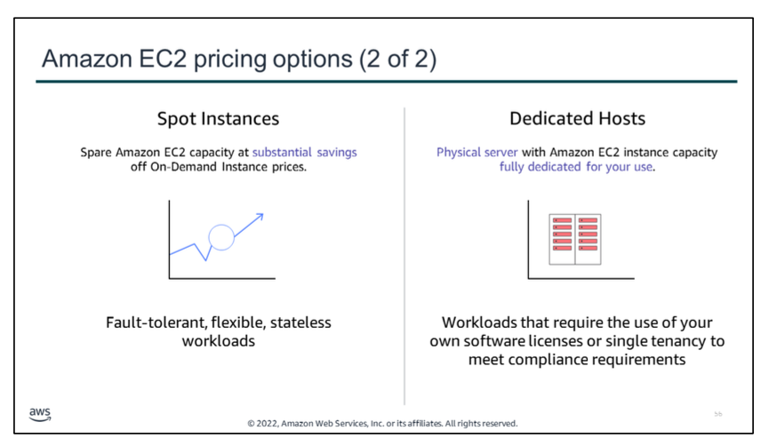
*Spot Instances* enable you to *bid on unused EC2 instances and request spare computing capacity at substantial savings*  (bid: đặt giá thầu; spare: bổ sung; substantial: đáng kể).

They are *recommended for fault-tolerant, flexible (non-time-critical), stateless workloads*. 
To use a Spot Instance,*your workload must have the ability to be stopped and restarted: Amazon EC2 can interrupt it with a 2-minute notification to meet other capacity requirements*. 
Your Spot Instance runs when capacity is available and the maximum price per hour for your request exceeds the Spot Instance price (exceed: vượt quá). 
Spot Instances are billed on:
- 1-second increments (gia tăng, thêm --> có giống với "biên"?), with a minimum of 60 seconds, if they are running the Amazon Linux or Ubuntu operating system. 
- All other operating systems are billed in 1-hour increments, rounded up to nearest hour (được làm tròn thành giờ gần nhất, vd 2h01sec  thành 3h?).

A variation (biến thể) of Spot Instances, called `Spot blocks`, *enables you to run a workload continuously for a finite duration of 1–6 hours. Spot blocks are designed to not be interrupted and will run continuously for the duration you select*, independent of the Spot Instance market price.

*Dedicated Hosts* are `physical servers` with instance capacity that is *fully dedicated to your use*. (Dedicated: chuyên dụng)
They are physically isolated (cách li) at the level of the host hardware from instances that belong to other AWS accounts. 
Dedicated Hosts are a good choice when *you have licensing restrictions for the software that you want to run on Amazon EC2, or when you have specific compliance or regulatory requirements that preclude you from using other deployment options*.

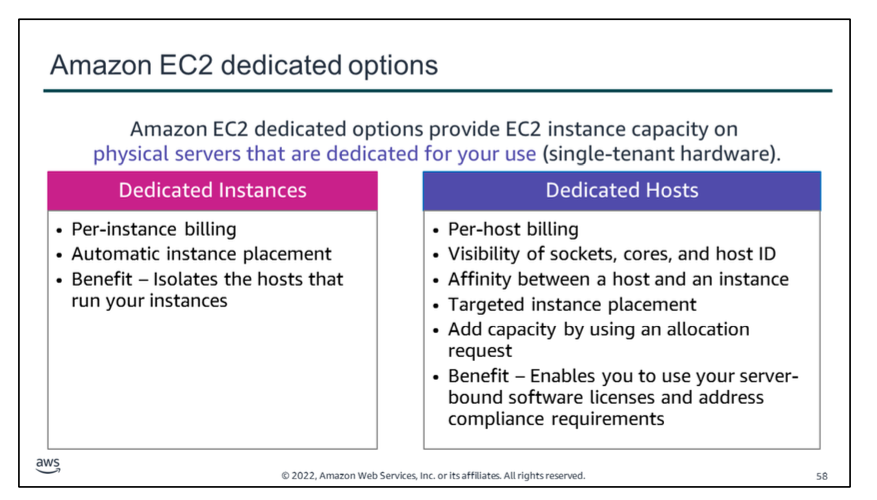

You can use `Dedicated Hosts` and `Dedicated Instances `to launch EC2 instances on physical servers that are dedicated for your use. 
Both options enable you to isolate the hosts that run your instances from the hosts that run instances for other accounts. *They also provide the same performance, security, and physical features*.

`Dedicated Hosts` give you visibility and control over how instances are placed on a physical server. 
*You can consistently deploy your instances to the same physical server over time. As a result, **Dedicated Hosts enable you to use your existing server-bound software licenses, and to address corporate compliance and regulatory requirements***.

Both options differ in the way they are billed. 
- A `Dedicated Instance` is billed *per instance*, and its pricing has two components. The two components are:
	- an hourly per-instance usage fee 
	- a dedicated per-Region fee that you pay once per hour, regardless of how many Dedicated Instances are running (regardless: bất kể).
- A `Dedicated Host` is billed *per host*. You can *choose from three different pricing models to pay for Dedicated Hosts*: On-Demand, Reservation Pricing, and Savings Plans.

To ***indicate that an instance should run as a Dedicated Instance or a Dedicated Host***, *change the instance’s tenancy attribute to dedicated or host, respectively*.  (indicate: chỉ ra; tenancy: thuê; respectively: tương ứng)

For more information, see Amazon EC2 Dedicated Hosts. [Dedicated Hosts (amazon.com)](https://aws.amazon.com/ec2/dedicated-hosts/)

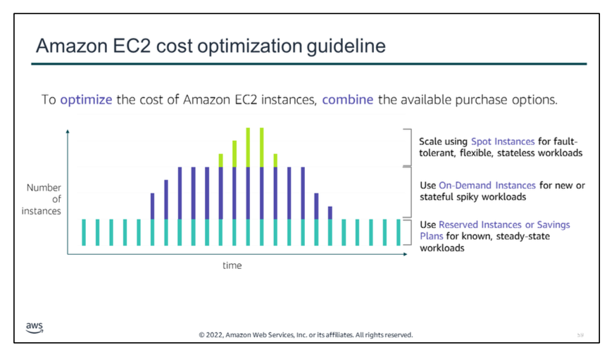
**Amazon EC2 cost optimization guideline**
Each Amazon EC2 pricing model provides a different set of benefits. As a general guideline, the recommended way to *optimize* the cost of EC2 instances is to *combine available purchase options*.
- Specifically, start by identifying the steady-state workloads in your application portfolio and run them on EC2 instances that use the *Reserved Instance or Savings Plans* pricing option. (steady: ổn định)
- Next, for your stateful spiky workloads, select EC2 instances that use the *On-Demand Instance* pricing plan. (spiky: mũi nhọn)
- Finally, use *Spot Instances* for your fault-tolerant, flexible, stateless workloads. (tolerant: chấp thuận; fault-tolerant: có khả năng chịu lỗi)

# 8.  Amazon EC2 considerations

**Placement groups**
Placement groups enable you to *control where instances run* in an AZ.

When you launch a new EC2 instance, the default behavior of Amazon EC2 is to minimize correlated failures by spreading out new instances across underlying hardware. 

**You can use placement groups to *influence the placement* of a group of *interdependent instances* so they meet the needs of your workload**: 
- Increase network performance between them
- Reduce correlate or simultaneous failure (placement: vị trí; correlated: tương quan; simultaneous: đồng thời)

Depending on the type of workload, you can create a placement group by using one of the following placement strategies:

-   *Cluster* – *Packs instances close together **inside an Availability Zone***. This strategy enables workloads to *achieve low-latency network performance*. --> độ trễ thấp, đóng gói các instances gần nhau
-   *Partition* – *Spreads your instances across logical partitions* so that groups of instances in one partition *do not share the underlying hardware with groups of instances in different partitions*. --> trải trên nhiều phân vùng hợp lý, các instances trong một phân vùng không chia sẻ phần cứng cơ bản với nhóm instances ở các phân vùng khác.
-   *Spread* – *Strictly places a small group of instances across distinct underlying hardware to **reduce correlated failures***.
  (Cluster: cụm; partition: phân vùng; spread: trải rộng; strictly: nghiêm ngặt; distinct: riêng biệt; underlying: cơ bản) --> giảm lỗi tương quan (correlated), nghiêm ngặt đặt các instances trên phần cứng cơ bản riêng biệt.

Limitations: slide

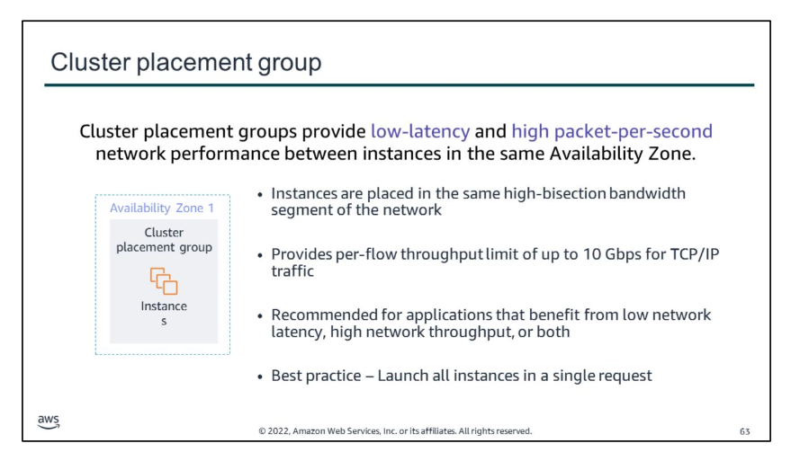

**Cluster placement groups**
The cluster placement group is *a logical grouping of instances in a single Availability Zone*. This grouping provides *low-latency* and *high packet-per-second* network performance between instances.

Instances in the same cluster placement group have a higher per-flow throughput limit of up to 10 Gbps for TCP/IP traffic. They are placed in the same high-bisection bandwidth segment of the network.

*Cluster placement groups are recommended for:
- applications that benefit from **low network latency, high network throughput, or both***. These applications include HPC applications, which **require tightly coupled node-to-node communication** (tightly: siết chặt; coupled: kết hợp). 
- Cluster placement groups are also recommended when the majority of the network traffic is between the instances in the group.

Best practice: *AWS recommends that you launch all the instances that you need in a cluster grouping all at once in a single launch request*. 
If you try to add more instances to the group later, you increase your chances of receiving an insufficient capacity error.

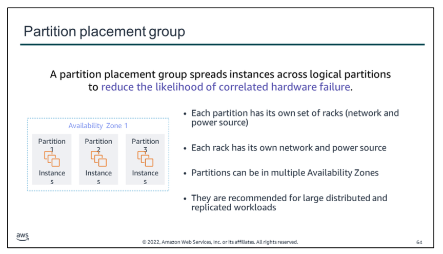
**Partition placement groups**
Partition placement groups help *reduce the likelihood of correlated hardware failures* for your application. When you use partition placement groups, Amazon EC2 divides each group into logical segments that are called partitions. (likelihood: xác suất)
Amazon EC2 ensures that *each partition in a placement group has its own set of racks*. 
*Each rack has its own network and power source*. No two partitions in a placement group share the same racks, so you can *isolate the impact of hardware failure* in your application.

*A partition placement group can have partitions in multiple Availability Zones in the same Region*. A partition placement group can have a maximum of seven partitions per Availability Zone. --> giảm thiểu khả năng xảy ra lỗi phần cứng tương quan bằng cách tạo nhiều phân vùng (partitions) trong cùng một AZ.

Partition placement groups also offer visibility into the partitions and allow topology-aware applications to use this information to make intelligent data replication decisions, which can increase data availability and durability. 
As a result, they are typically used to (Recommended for) deploy large distributed and replicated workloads, such as Apache Hadoop, Apache HBase, and Apache Cassandra. 
 (topology-aware: nhận biết cấu trúc liên kết; availability and durability: độ sẵn sàng và độ bền; distributed: phân tán; replicated: sao chép)

In the example, instances are placed into a partition placement group with three partitions in the same Availability Zone: Partition 1, Partition 2, and Partition 3. The instances in a partition do not share racks with the instances in the other partitions, so you can contain the impact of a single hardware failure to only the associated partition.

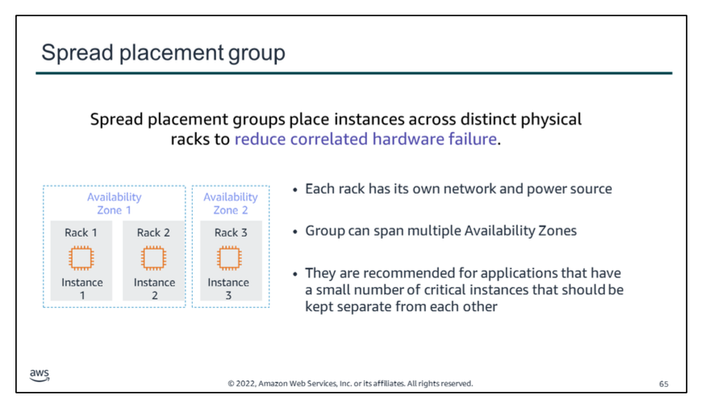

**Spread placement groups**
--> Spread placement group place instances across distinct physical racks to *reduce correlated hardware failure*.

A spread placement group is a grouping of instances that are purposely positioned on distinct underlying hardware. This grouping reduces the risk of simultaneous failures that could occur if instances shared underlying hardware.

This type of *group can span multiple Availability Zones*, up to a maximum of seven instances per Availability Zone per group.

Spread placement groups are *recommended for applications that have a small number of critical instances that should be kept separate from each other*.

# QUIZ

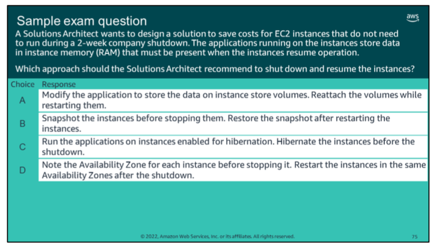

The following are the keywords to recognize: **“instance memory (RAM)”, “must be present when the instances resume operation”, “shut down and resume”**

The correct answer is C. 
Hibernation saves the contents from the instance memory (RAM) to your Amazon EBS root volume, which persists after shutdown. When you start your instance, the Amazon EBS root volume is restored to its previous state, and the RAM contents are reloaded.

# LINKS
If you want to learn more about the topics covered in this module, you might find the following additional resources helpful:

-   Amazon EC2 User Guide for Linux Instances
    
-   Amazon EC2 User Guide for Windows Instances
    
-   Amazon EC2 FAQs
    [What is Amazon EC2? - Amazon Elastic Compute Cloud](https://docs.aws.amazon.com/AWSEC2/latest/UserGuide/concepts.html) 
-   EC2 Image Builder User Guide
    
    [What is EC2 Image Builder? - EC2 Image Builder (amazon.com)](https://docs.aws.amazon.com/imagebuilder/latest/userguide/what-is-image-builder.html)
    [EC2 Image Builder FAQs - Amazon Web Services](https://aws.amazon.com/image-builder/faqs/) 
-   EC2 Image Builder FAQs
    [Amazon EC2 FAQs - Amazon Web Services](https://aws.amazon.com/ec2/faqs/) 
    
-   AWS Compute Optimizer User Guide
    [What is AWS Compute Optimizer? - AWS Compute Optimizer (amazon.com)](https://docs.aws.amazon.com/compute-optimizer/latest/ug/what-is-compute-optimizer.html) 
-   AWS Compute Optimizer FAQs
    [AWS Compute Optimizer FAQs - Amazon Web Services](https://aws.amazon.com/compute-optimizer/faqs/) 
-   How AWS Pricing Works
[How AWS Pricing Works: AWS Pricing Overview - How AWS Pricing Works (amazon.com)](https://docs.aws.amazon.com/whitepapers/latest/how-aws-pricing-works/welcome.html) 