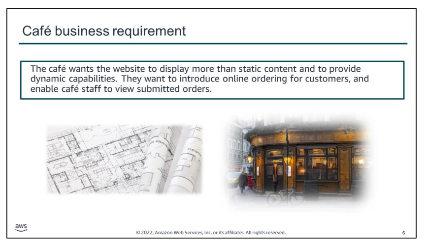
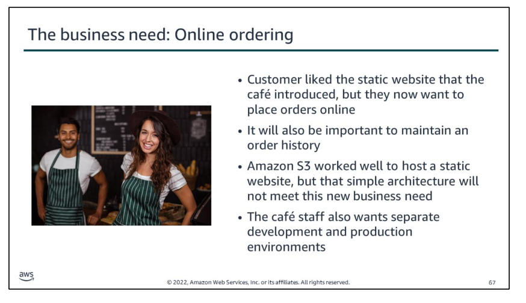
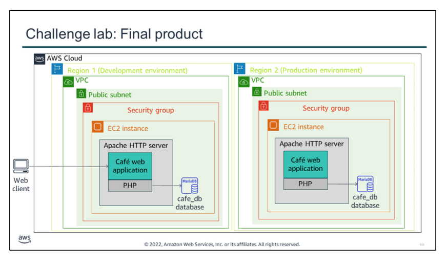

After the café launched the first version of their website, the café‘s customers told Sofía and Nikhil how nice the website looks. They liked that they could easily look up the business hours online, and browse through the available desserts before coming in to pick up food and drinks for their work colleagues. However, in addition to the praise, customers often asked Sofía and Nikhil whether they could place online orders that they could schedule for pickup.

Sofía, Nikhil, Frank, and Martha discussed the situation. They agreed that their business strategy and decisions should focus on delighting their customers and providing them with the best possible cafe experience. They want to improve their services so they can increase customer satisfaction, reduce customer wait times, and make ordering more convenient for customers who are in a hurry.

To meet these objectives, the café wants the website to display more than static content. They want to introduce online ordering for customers, and enable café staff to view submitted orders. Their current website architecture, where the website is hosted on Amazon S3, will not support the new business requirements.

Throughout this module, you will learn details about the capabilities of Amazon EC2, and how you could use it to successfully meet these new business requirements.

# Module 4 - Guided Lab: Introducing Amazon Elastic File System (Amazon EFS).

In this guided lab, you will complete the following tasks:

1.  Creating a security group to access your EFS file system
2.  Creating an Amazon EFS file system
3.  Connecting to your EC2 instance via SSH
4.  Creating a new directory and mounting the EFS file system
5.  Examining the performance behavior of your new EFS file system

It is now time to start the guided lab.

Your educator might choose to lead a conversation about the key takeaways from the guided lab after you have completed it.

 

After the café launched the first version of their website, customers told the café staff how nice the website looks. However, in addition to the praise, customers often asked whether they could place online orders.

Sofía, Nikhil, Frank, and Martha discussed the situation. They agreed that their business strategy and decisions should focus on delighting their customers and providing them with the best possible café experience.

**A business request for the café: Launching a dynamic website (Challenge #1)**

The café wants to introduce online ordering for customers, and enable café staff to view submitted orders. Their current website architecture, where the website is hosted on Amazon S3, does not support the new business requirements.

In the first part of this lab, you will take on the role of Sofía, and use Amazon EC2 to create a dynamic website for the café.

In this challenge lab, you will complete the following tasks:

1.  Analyzing the existing EC2 instance
2.  Connecting to the IDE on the EC2 instance
3.  Analyzing the LAMP stack environment and confirming that the web server is accessible
4.  Installing the café application
5.  Testing the web application
6.  Creating an AMI and launching another EC2 instance
7.  Verifying the new café instance

The diagram summarizes what you will have built after you complete the lab. This challenge lab includes some sections where specific step-by-step instructions will not be provided. In these sections, you must figure out how to successfully complete the steps so that you deploy the version of the café website that supports online orders into both AWS Regions.

