# Overview
This module includes the following sections:

1.  Architectural need
2.  Database layer considerations
3.  Amazon RDS
4.  Amazon DynamoDB
5.  Database security controls
6.  Migrating data into AWS databases

This module also includes:
-   A demonstration of Amazon Relational Database Service (Amazon RDS) automated backup and read replica configuration.
-   A guided lab where you create an Amazon RDS database and connect to it by using a simple web application.
-   A challenge lab that challenges you to migrate data from a database that runs on an Amazon Elastic Compute Cloud (Amazon EC2) instance to an Amazon RDS database.

Module objectives:
At the end of this module, you should be able to:
-   Compare database types
-   Differentiate between managed versus unmanaged services
-   Explain when to use Amazon Relational Database Service (Amazon RDS)
-   Explain when to use Amazon DynamoDB
-   Describe available database security controls
-   Describe how to migrate data into Amazon Web Services (AWS) databases
-   Deploy a database server

# 1.  Architectural need

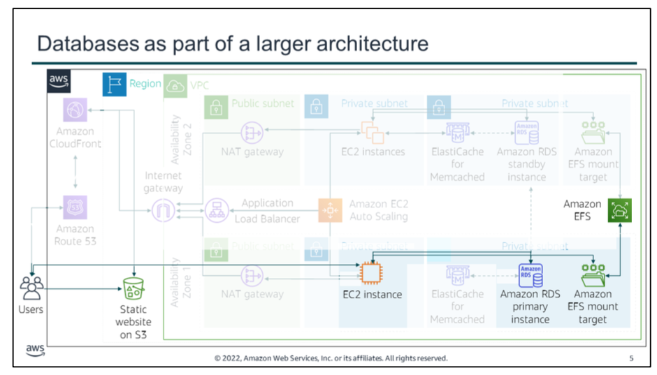

As each module introduces new features, those parts of this larger diagram will be unveiled.

In this module, you will learn how to create an architecture that uses AWS database services. Different relational and non-relational database service options—including Amazon RDS—are discussed. As you learn about the essential benefits of the various offerings, you will be able to make a more informed decision about the database service that best meets your particular architectural needs.

# 2.  Database layer considerations

key takeaways:
-   When you choose a database, consider *scalability, storage requirements*, the *type and size of objects* to be stored, and *durability requirements*
-   ***Relational databases*** have strict schema rules, provide data integrity, and support SQL
-   ***Non-relational databases*** scale horizontally, provide higher scalability and flexibility, and work well for semistructured and unstructured data

As an architect, you will often need to choose between different database types when you consider which type will best handle a particular workload. Before you choose a database, there are some key considerations that should inform your decision-making process.

First, consider the importance of ***scalability** (mở rộng)*. With traditional on-premises databases, scaling up capacity can be a difficult task even for experienced database administrators. It can take hours, days, or weeks. The impact to database performance while it scales up can be unpredictable, and might require downtime. 

However, the importance of a properly scaled database cannot be overstated. If you underprovision your database, your applications might stop working. However, if you overprovision your database, you increase your upfront costs by procuring resources that you do not need, which violates the cost-optimization principle of the AWS Well-Architected Framework. ( properly: đúng; overstated: phóng đại; underprovision >< overprovision: cung cấp thiếu, thiểu cung (?) >< cung cấp quá mức, vượt cung;  upfront: trả trước; violate: vi phạm)

Ideally, you would *choose a database solution that has the resources to handle the needed throughput at launch, and that can also be easily scaled up later if your throughput needs increase*. (handle: xử lý; throughput: thông lượng; scaled up ><scaled down: mở rộng >< thu hẹp; immediately: ngay lập tức; lower: hạ thấp;  provision: cung cấp; capacity: dung tích, sức chứa...)

Another nice-to-have capability is the *ability to scale down the provisioned database capacity if your throughput requirements or database load later decrease*. This enables you to immediately realize cost savings by lowering provisioned capacity. **An automated scaling solution could reduce costs and labor overhead**.

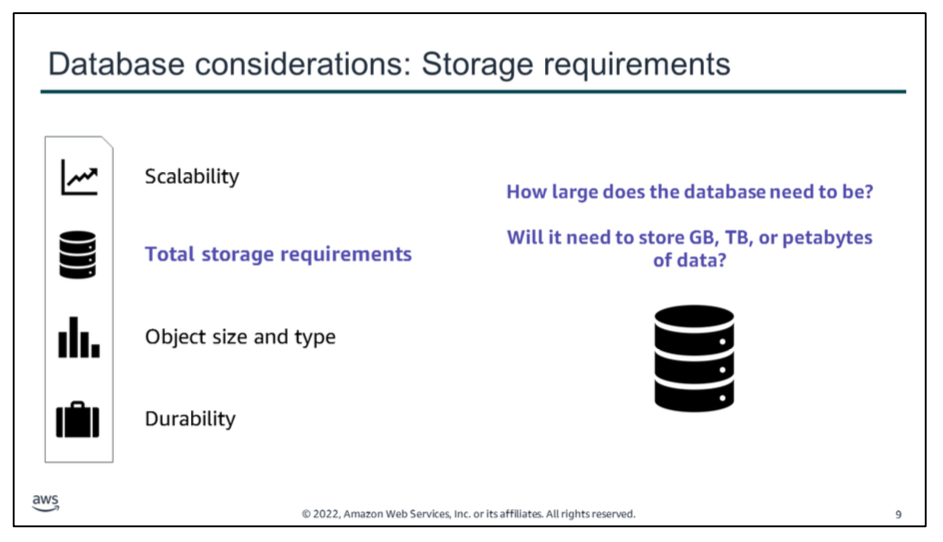
Second, when you must choose a database to handle a certain type of workload, consider the ***storage requirements*** of your workload.

How large must the database be to handle your data requirements? 
Does it need to store gigabytes? Terabytes? Petabytes?

Different database architectures support different maximum data capacities. Some database designs are ideal for traditional applications, while others are ideal for caching or session management. Still others are ideal for Internet of Things (IoT) or big data applications.

Understanding your total storage requirements is essential for choosing a database.

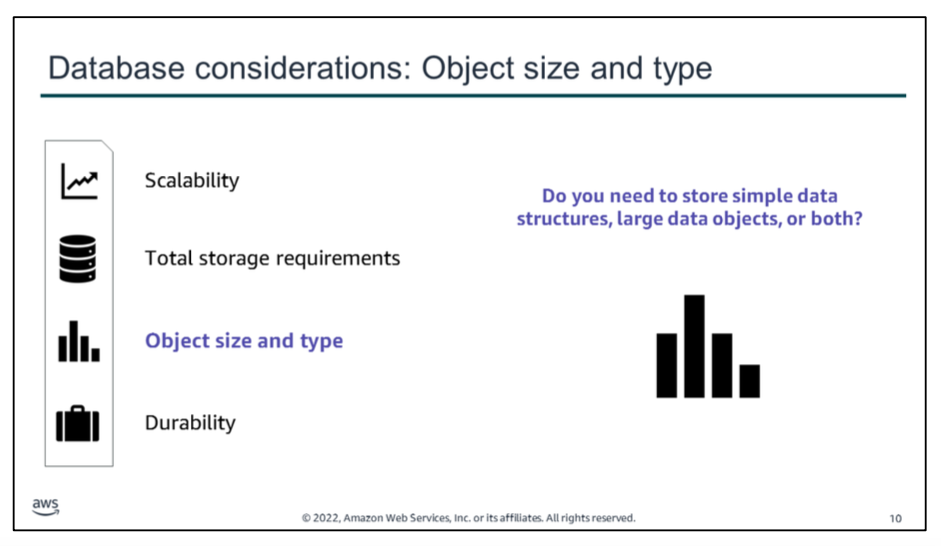
Third, when you choose a database for your specific workloads, consider the ***size and the type of the objects*** you must store.

Do you need to store simple data structures, large data objects, or both?

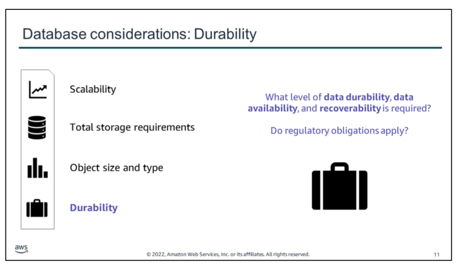
Finally, as a fourth consideration for your database choice, think about the *durability requirements* for the data you will store.

***Data durability*** refers to the assurance that your data will not be lost, and ***data availability*** refers to your ability to access your data when you want to. 

? What level of data durability and data availability do you need? If the data you will store is absolutely critical to your business, you should choose a database solution that stores multiple redundant copies of your data across multiple geographically separated physical locations. 
**This solution will usually result in an increased cost, so it is important to balance your business needs with cost considerations.** (durability: độ bền; availability: tính khả dụng; refer: đề cập; absolutely: tuyệt đối; critical: phê bình, nghiêm trọng (?); absolutely critical 
: hoàn toàn quan trọng; redundant: dư thừa;  separated: tách biệt; geographically separated physical locations: vị trí thực tế được tách biệt theo địa lý (?); residency: lưu trữ, cư trú; regulatory obligations: nghĩa vụ theo quy định; )

? Another important consideration is to know whether data residency or *regulatory obligations* apply to your data. 
For example, are there regional data privacy laws that you must comply with? If so, choose a database solution that can support compliance.

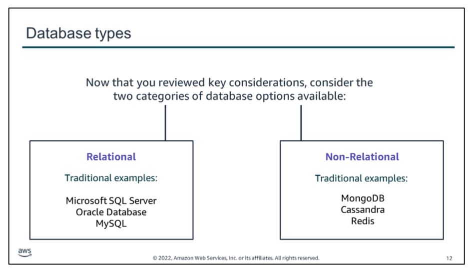

You can choose from many types of databases, many of which are purpose-built. However, database types typically fall into one of two broad categories: *relational or non-relational*.

*Relational database systems* are the most familiar type of databases to most people. 

Traditional examples include Microsoft SQL Server, Oracle Database, and MySQL.

*Non-relational databases* were developed more recently, but have been around for a few decades. They play an essential role in the modern computing landscape. 

Examples include MongoDB, Cassandra, and Redis (around: xung quanh; )

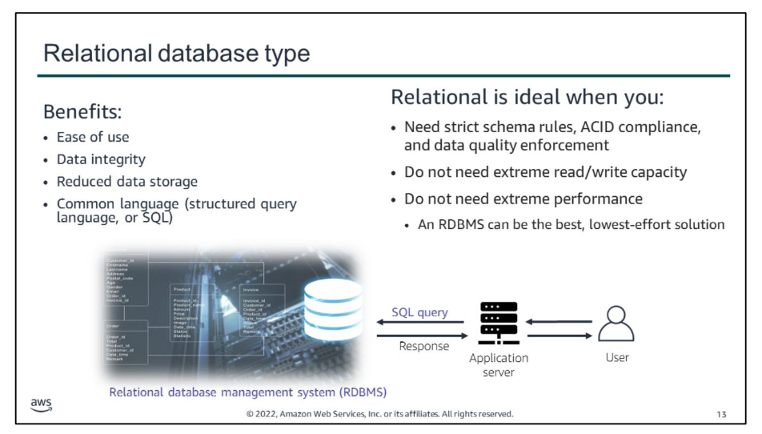
*Relational databases* are sometimes referred to as *relational database management system (RDBMS)*. They are still the single most-popular and most-used database category in the world. 
In a 2019 DB-Engines Ranking study, they were found to represent over 75 percent of the popularity score across all categories. The top four were Oracle, MySQL, Microsoft SQL Server, and PostgreSQL—which are all relational databases [DB-Engines Ranking - popularity ranking of database management systems](https://db-engines.com/en/ranking) 

Relational databases maintain their popularity for many reasons. These reasons include their *ease of use*, *data integrity* controls, excellence at *reducing overall data storage*, and their support for *structured query language (SQL)*. 
SQL is a popular language for querying or interacting with structured data stored in RDBMSs, and it is supported by most vendors.

If your use case lends itself well to:
- strict schema rules, where the schema structure is well defined and does not need to change often, a relational database would be a good choice. Relational databases transactions are also *ACID-compliant*, which means that they ensure data integrity by providing transactions that are *atomic, consistent, isolated, and durable*.  (strict: nghiêm khắc; compliant (adj): tuân theo; ACID atomic, consistent, isolated, and durable nguyên tử - nhất quán - cách li - bền vững; enforcement: bắt buộc )
- However, if your application needs *extreme read/write capacity*, a relational database might *not* be the right choice.
- Finally, *extreme performance* is a characteristic of relational databases when you compare them to *other options*. 
- However, a relational database can be the best low-effort solution for many use cases.

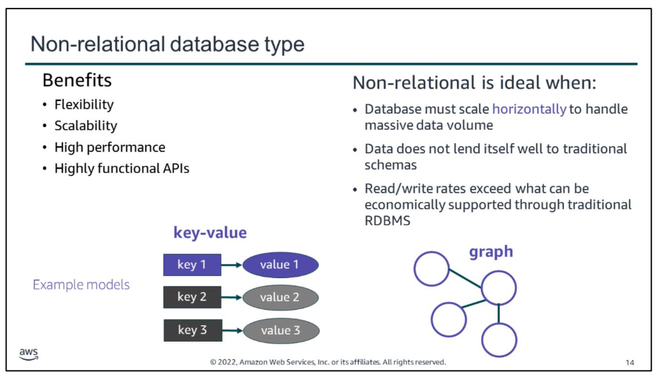
*Non-relational databases* are sometimes called *NoSQL databases*. They are different from relational databases because they are **purpose-built for specific data models and have flexible schemas for building modern applications**. Non-relational databases are widely appreciated for their *flexibility, scalability, high performance, and highly functional APIs*.

They use a variety of data models, including key-value, graph, document, in-memory, and search. NoSQL schemas are dynamic.

For example, a row does not need to contain data for each column. Also, a NoSQL database can *scale horizontally* by increasing the number of servers that it runs on.

Non-relational databases have *flexible schemas*, where each object can have a different structure. *They can store:
- structured data, such as relational database records; semistructured data, such as JavaScript Object Notation (JSON) documents; 
- and unstructured data, such as photo files or email messages*. 
Non-relational databases work well when the data might have structural inconsistencies. (schema: lược đồ, sơ đồ; inconsistency: không nhất quán;  )

Finally, non-relational databases are optimized for specific data models and access patterns that enable higher performance instead of trying to achieve the functionality of relational databases.

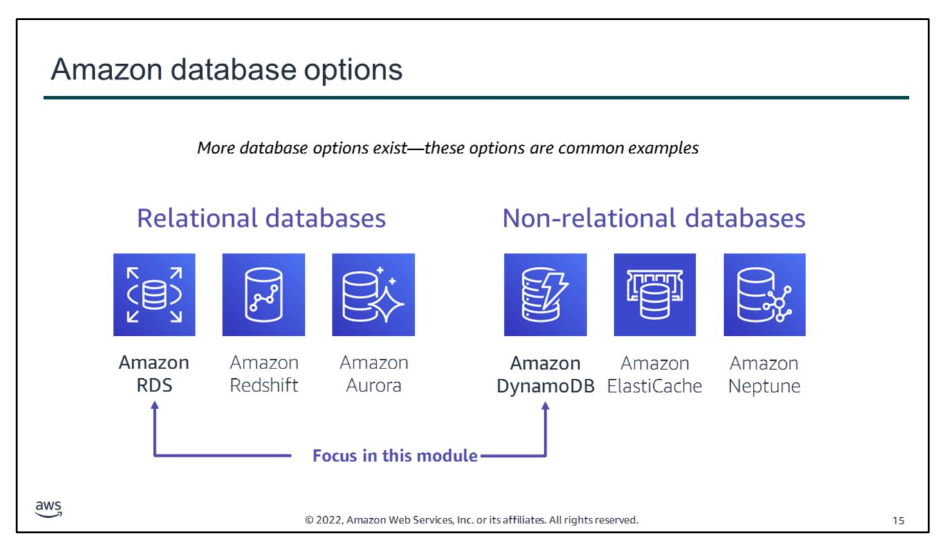
Now that you learned about the distinctions between relational and non-relational database, consider some example Amazon database offerings that fit into those two categories.

Among the more commonly used ***AWS relational database*** offerings are Amazon RDS, Amazon Redshift, and Amazon Aurora.

Similarly, some of the more commonly used ***non-relational databases*** are Amazon DynamoDB, Amazon ElastiCache, and Amazon Neptune.

In this module, you will explore both Amazon RDS and Amazon DynamoDB in more depth. 

For a full listing of database services that are available on AWS and their most common uses cases, see the AWS Databases – Overview page. [Purpose-Built Databases on AWS | Amazon Web Services](https://aws.amazon.com/products/databases/) 

# 3.  Amazon RDS vs Aurora vs Redshift

key takeaways:

-   *Managed AWS database services* handle administration tasks so you can focus on your applications
-   *Amazon RDS* supports *Microsoft SQL Server, Oracle, MySQL, PostgreSQL, Aurora, and MariaDB*
-   Amazon RDS *Multi-AZ deployments provide high availability* with automatic failover
-   You can have up to five *read replicas* per primary database to improve performance
-   *Amazon Aurora* is a fully managed, MySQL- and PostgreSQL-compatible, relational database engine
-   *Amazon Redshift* is a *data warehousing* relational database offering

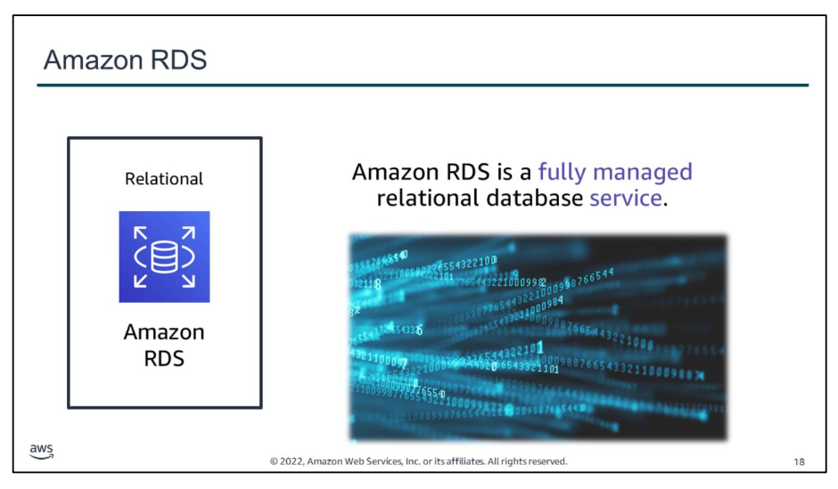
Amazon RDS is a **fully managed** relational database service that creates and operates a relational database in the cloud. 
However, before you learn more details about Amazon RDS, you will first review the advantages of Amazon RDS as a managed database service.

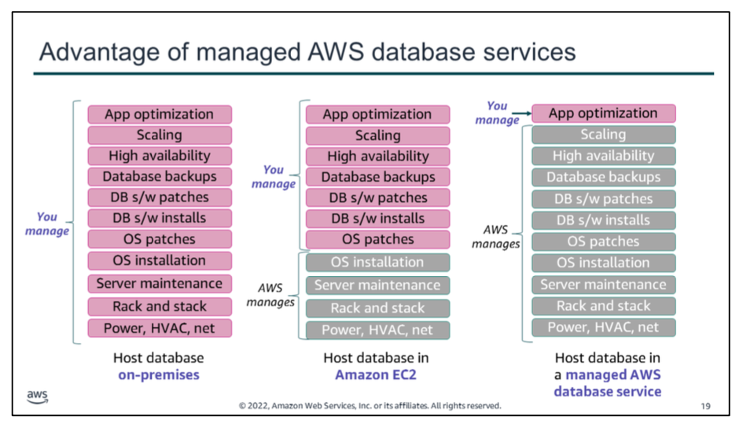
**Advantages of managed AWS database services**

You will now consider some of the advantages of using managed AWS database services.

In the use case on the left, you host the database in your **on-premises** data center. In this case, **you are responsible for everything**. 
You must power the racks of physical servers, maintain the operating systems of the servers where the databases run, and performing database software installations and patches. You must also perform backups, configure high availability and scaling solutions, and optimize the applications that use the database.

In the center use case, you install a **database on one or more Amazon EC2 instances**. In this case, **AWS handles the maintenance of the physical data center environment and the OS is pre- installed** on the EC2 instance that you launch.
However, you are still responsible for every configuration layer above the OS installation, which means that you must manage many resources manually.

The **AWS managed database** offering is in the use case on the right. These solutions provide **high availability, scalability, and database backups as built-in options that you can configure**. 
AWS is responsible for handling common and repetitive database administration tasks. 
You are only responsible for optimizing your application, and making sure that the database layer works efficiently for your application.

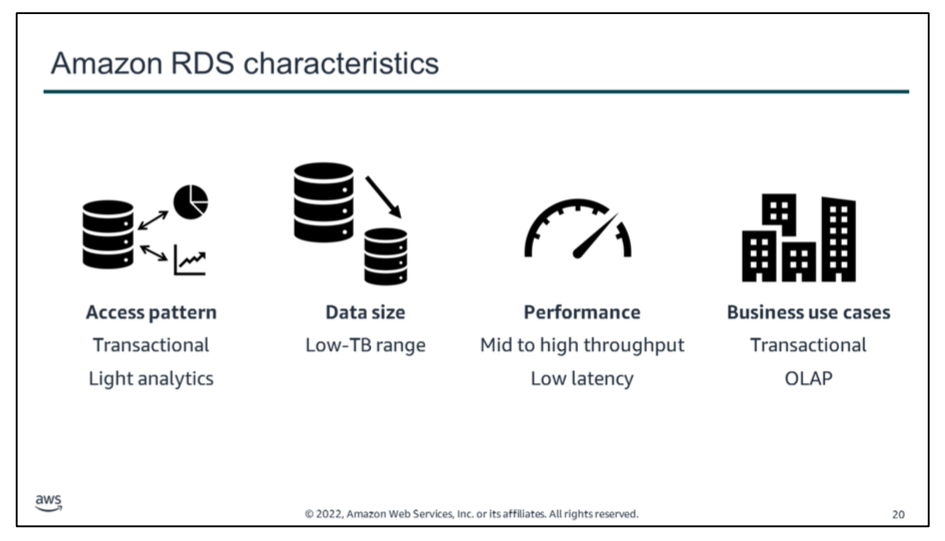
**Amazon RDS characterostic**
Amazon Relational Database Service (Amazon RDS) is a *fully managed relational database service*.

Amazon RDS is typically used when the access pattern is **transactional**, or for **light analytics**.

As a *relational database*, the ideal data size ranges up to the ***low-terabyte range***. As storage requirements grow, you can provision additional storage. 
The Amazon *Aurora engine will **automatically grow**  the size of your database volume as your database storage needs grow*. It scales up to a maximum of 64 TB, or a maximum you define. 
- The MySQL, MariaDB, Oracle, and PostgreSQL engines enable you to scale up to 32 TB of storage. 
- Microsoft SQL Server supports up to 16 TB.
Storage scaling is dynamic, with **zero downtime**. (dynamic: linh hoạt, năng động ;)

In terms of ***performance***, Amazon RDS offers two options. 
- First, it offers the *general-purpose solid state drive (SSD)*-*backed storage option* (tùy chọn lưu trữ được hỗ trợ bởi ổ đĩa trạng thái rắn đa năng). 
  The SSD option delivers a consistent baseline of 3 IOPS per provisioned GB, and it can burst up to 3,000 IOPS above the baseline.  This storage type is suitable for a *range of database workloads*.  
- There is also a *Provisioned IOPS SSD storage option* (tùy chọn lưu trữ SSD IOPS được cung cấp), which works well for *I/O-intensive transactional database workloads*.
(solid: rắn; baseline: đường/mức cơ sở; burst up: tăng vọt; intensive: nhấn mạnh, làm mạnh, chuyên sâu; )

**Performance**: Mid to high throughput; Low latency.
**Use cases**: Transactional; OLAP.

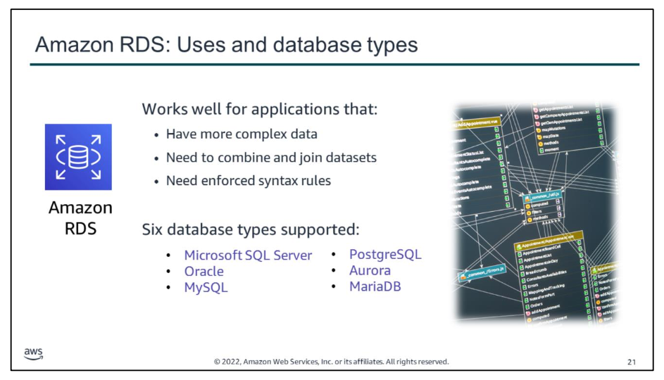
**Amazon RDS: uses and db types**
As a relational database offering, Amazon RDS is a good choice for applications that have *complex*, *well-structured data*. Amazon RDS is a good choice if your workloads *must frequently combine and join datasets*, and *must have syntax rules that are strictly enforced*. 
For example, Amazon RDS is frequently used to back traditional applications, enterprise resource planning (ERP) applications, customer relationship management (CRM) applications, and ecommerce applications.
(dataset: bộ dữ liệu (?); )
Amazon RDS is available with six database engines to choose from, including Microsoft SQL Server, Oracle, MySQL, PostgreSQL, Amazon Aurora, and MariaDB.

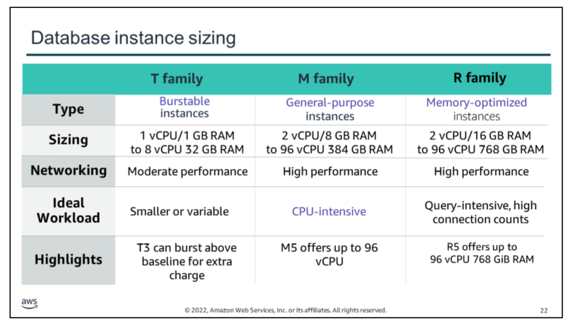
All Amazon RDS database types run on a serve. (The exception is Aurora, which can run as a serverless option). 
Amazon RDS is available on several database instance types, which are optimized for different kinds of workloads.

**The T family** of instance types provides a baseline level of CPU performance with the ability to **burst** CPU usage at any time for as long as needed. 
For example, T3 instances offer a balance of compute, memory, and network resources and work well for database workloads with moderate CPU usage that experience temporary spikes in use.

**The M family** of instances is another **general-purpose** option. However, the M family provides additional options for **CPU-intensive** workloads. M instances are a good choice for small and midsize databases for *open source or enterprise applications*.

Finally, **the R family** instances are **optimized for memory-intensive** database workloads.

Some database engines support additional database instance classes. 

For more information, see Amazon RDS DB Instances, and specifically see the Choosing the DB instance Class AWS Documentation page for instance class details.  [Amazon RDS DB instances - Amazon Relational Database Service](https://docs.aws.amazon.com/AmazonRDS/latest/UserGuide/Overview.DBInstance.html) - [DB instance classes - Amazon Relational Database Service](https://docs.aws.amazon.com/AmazonRDS/latest/UserGuide/Concepts.DBInstanceClass.html) 

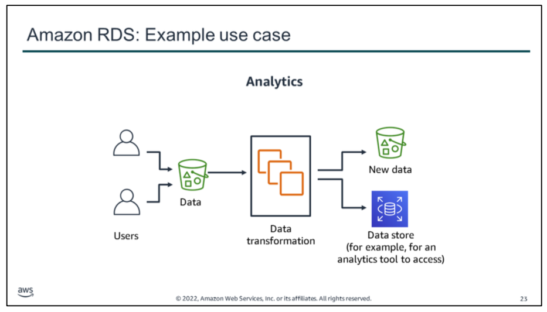

Consider an example use case where Amazon RDS is used as part of a deployed solution to a business challenge.

In this example, a company wants to gain meaningful insight from some of their business data. Users upload the data to an Amazon Simple Storage Service (Amazon S3) bucket. Then, a cluster of Amazon EC2 instances is used to transform the data. This might occur as a batch process at a regular interval. 
The transformed data is then stored in a different S3 bucket. However, some of the transformed data is also inserted into an RDS instance, which is labeled Data store. This RDS instance can then be queried by using analytics software or an AWS analytics service that can make SQL queries to access the data for business insights.
(occur: xảy ra; batch: lô, hàng loạt ; regular: thường xuyên, đều đặn, quy củ; interval: khoảng thời gian; )

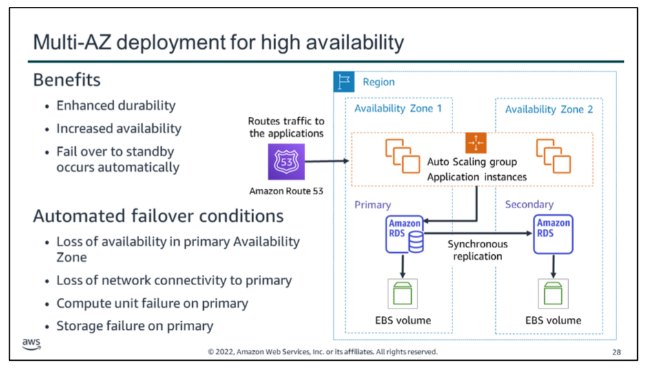

**Multi-AZ deployment for high availability**

Amazon RDS provides high availability by implementing (thực thi) a Multi-AZ approach. 
Amazon RDS automatically provisions (cung cấp) and maintains a ***synchronous*** standby instance in a different Availability Zone. The primary DB instance is *synchronously replicated across Availability Zones to the standby instance* to provide data redundancy, eliminate I/O freezes, and minimize latency spikes during system backups.
(synchronous standby instance: phiên bản dự phòng đồng bộ; provide: cung cấp; redundancy: dư thừa; eliminate: loại bỏ; spike: đầu nhọn )

Running a DB instance with high availability can *enhance availability* during planned system maintenance. 
It helps protect your databases against DB instance failure and Availability Zone disruption. It also provides **enhanced availability and durability** for database instances, making it a good choice for production database workloads.
(enhance: nâng cao; failover: chuyển đổi dự phòng; automatic failover to the standby instance: tự động chuyển đổi dự phòng sang phiên bản dự phòng; remain: di vật, còn lại; manual administrative intervention: sự can thiệp quản trị thủ công)

If there is an infrastructure failure, Amazon RDS performs an **automatic failover to the standby instance**. *You can then resume database operations when the failover is complete*. 
*The endpoint for your DB instance remains the same after a failover*, so your application can resume database operations without manual administrative intervention.

Failover conditions include:
- the *loss of availability in the primary Availability Zone*, 
- a *loss of network connectivity to the primary database*, 
- *compute unit failure on the primary instance*, or
- *storage failure on the primary instance*.

Note: 
- If *synchronous* -> standby instance (different AZ  --> increase availabitity and durability. Fail over to standby occurs automatically <=> have a trouble with the primary AZ)
- Next slide: If *asynchronous* -> read replicas (same AZ -->  increase availabitity and performance. designed for security )
  
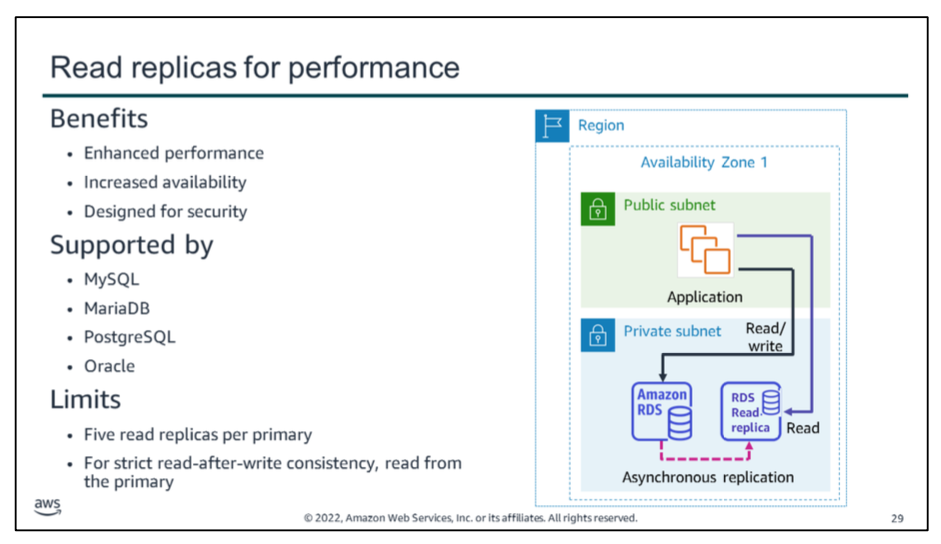
**Read replicas for performance**

Amazon RDS enables you to *use a source database instance to create a special type of database instance*, which is called a read ***replica***. Updates that are made to the source DB instance are ***asynchronously*** copied to the read replica.
(read replica: bản sao chỉ có quyền đọc; )

Using read replicas *enhances performance*. For example, you can reduce the load on your source database instance by routing read queries from your applications to the read replica. (Ví dụ: bạn có thể giảm tải cho phiên bản cơ sở dữ liệu nguồn của mình bằng cách định tuyến các truy vấn đọc từ ứng dụng của bạn tới bản sao chỉ có quyền đọc)
Read replicas also *increase availability*. For read-heavy database workloads (khối lượng công việc cơ sở dữ liệu (CSDL nặng về đọc), you can *elastically* scale out beyond the capacity *constraints* of a single database instance (*linh hoạt* mở rộng quy mô vượt ra ngoài những  *hạn chế* về năng lực của một instance CSDL). 
Read replicas can also be manually promoted to become standalone database instances, when needed.  (standalone database instances: phiên bản CSDL độc lập)

*Read replicas* are available in Amazon RDS for:
- MySQL, 
- MariaDB, 
- PostgreSQL, 
- and Oracle. 

**LIMITS**:
- Each of these database engines enables up to a maximum of *five read replicas per primary database*. 
- If you need ***strict read-after-write consistency*** (that is, what you read is always what you just wrote, even if you read immediately), then you should ***read from the main DB instance***. Otherwise, you can spread the load, and read from a read replica. (Nếu bạn cần nghiêm ngặt tính nhất quán đọc-sau-ghi  (nghĩa là bạn đọc luôn những gì bạn vừa viết, ngay cả khi bạn đọc ngay lập tức), thì bạn nên đọc từ phiên bản CSDL chính. 
  Nếu không, bạn có thể phân bổ tải và đọc từ bản sao chỉ có quyền đọc.)

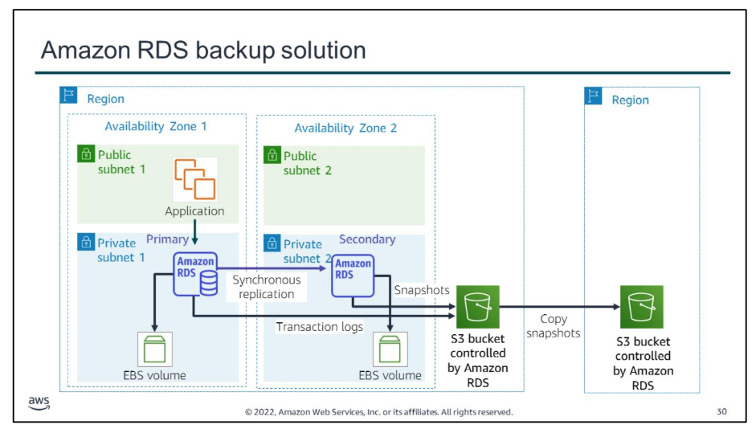
**Amazon RDS backup solution**

Now, consider an example architecture for a backup solution that is based on Amazon RDS.

Here, *snapshots and transaction logs from the RDS database are stored in an S3 bucket that is controlled by Amazon RDS*. With Amazon RDS, you can also specify it to *copy automated or manual DB to a second AWS Region*. You can also copy the snapshots to separate AWS accounts.
(separate: tách rời, phân tán; )

For more information, see Copying a Snapshot in the AWS Documentation. [Copying a DB snapshot - Amazon Relational Database Service](https://docs.aws.amazon.com/AmazonRDS/latest/UserGuide/USER_CopySnapshot.html) 

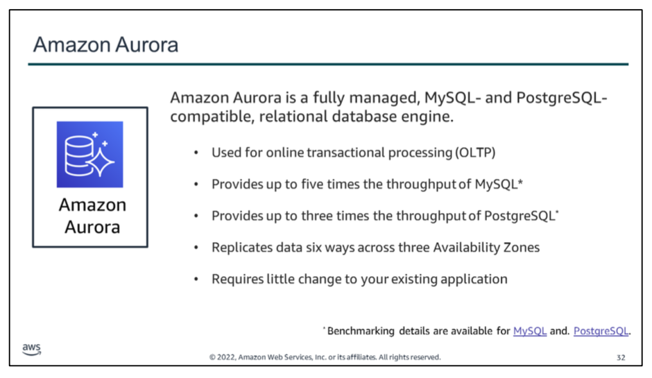
**Amazon Aurora** is one of the database engine options for Amazon RDS.

Aurora is a MySQL- and PostgreSQL-*compatible relational database* that is built for the cloud. 
It combines the *performance* and *availability* of *traditional enterprise databases* with the simplicity and cost-effectiveness of open source databases.
(compatible: tương thích, phù hợp; combine: kết hợp; traditional: truyền thống;  simplicity: tính đơn giản; cost-effectiveness: hiệu quả về chi phí)

It is up to:
- **five times faster than standard MySQL** databases 
- and **three times faster than standard PostgreSQL databases**. 
It provides the *security, availability, and reliability* of commercial databases, but at **1/10th the cost**. 

Detailed instructions on this benchmark and how to replicate it yourself are provided in the *Amazon Aurora MySQL Performance Benchmarking GuideMySQL and Amazon Aurora PostgreSQL Performance Benchmarking Guide*. [Amazon Aurora Performance Assessment Technical Guide (awsstatic.com)](https://d1.awsstatic.com/product-marketing/Aurora/RDS_Aurora_Performance_Assessment_Benchmarking_v1-2.pdf) - [Microsoft Word - AmazonAuroraPostgreSQLCompatibleBenchmarksWhitePaper_final.docx (awsstatic.com)](https://d1.awsstatic.com/product-marketing/Aurora/RDS_Aurora_PostgreSQL_Performance_Assessment_Benchmarking_V1-0.pdf)  

Aurora features a *distributed, fault-tolerant, self-healing storage system* that *automatically scales up to 64 TB per database instance*. 
It delivers *high performance and availability*, with **up to 15 low-latency read replicas**, point-in-time recovery, continuous backup to Amazon S3, and replication across **three Availability Zones**.
(distributed, fault-tolerant, self-healing: phân tán, (kháng) chịu lỗi, tự phục hồi; low-latency read replicas: những bản sao chỉ đọc có độ trễ thấp; point-in-time recovery: phục hồi tại thời điểm; continuous backup: sao lưu liên tục;   )

Aurora is often used for *online transaction processing (OLTP)*. 
OLTP systems must be able to handle a high volume of *concurrent users, and be able to run insert and update requests*. 
A common OLTP example is an order entry system. **OLTP is often contrasted with online analytics processing (OLAP)**, which is characterized by a *smaller volume of more complex queries*.

(online transaction processing (OLTP): xử lý giao dịch trực tuyến; concurrent: đồng thời; contrast: tương phản )

Note: OLTP --> Aurora; OLAP --> Redshift

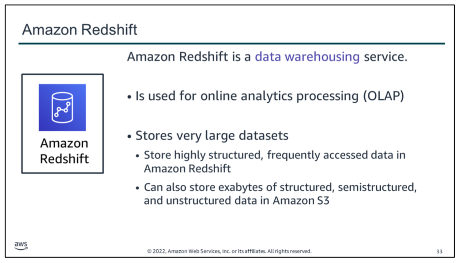

**Amazon Redshift** is a different AWS relational database offering. It does not run on Amazon RDS.

Amazon Redshift provides a petabyte-scale **data warehouse** and data lake analytics. Amazon Redshift is typically used to *store frequently accessed*, *highly structured data*. 

*Amazon Redshift can also access data directly in Amazon S3*, so you can also maintain *exabytes of structured, semistructured, and unstructured data in Amazon S3*.
(warehouse: kho -- vs repo? ; petabyte-scale **data warehouse**: kho dữ liệu quy mô petabyte;  structured, semistructured, and unstructured: có cấu trúc, bán cấu trúc và phi cấu trúc)

Amazon Redshift provides consistently fast performance, even with thousands of concurrent queries. 
It *performs consistently* whether you are *querying data in the Amazon Redshift data warehouse, or querying data in your Amazon S3 data lake*. 
You can query open file formats such as Parquet, JSON, Avro, CSV. You can also query Amazon S3 directly by using SQL.

(consistently: ổn định, nhất quán; concurrent: đồng thời; )

# 4.  Amazon DynamoDB

key takeaways:
-   Amazon DynamoDB is a fully managed non-relational `key-value` and document `NoSQL` database service.
-   DynamoDB is `serverless`, provides extreme *horizontal scaling and low latency*.
-   DynamoDB *global tables* ensure that data is replicated to multiple Regions.
-   DynamoDB provides *eventual consistency* by default (in general, it is fully consistent for reads 1 second after the write). *Strong consistency* is also an option.
    
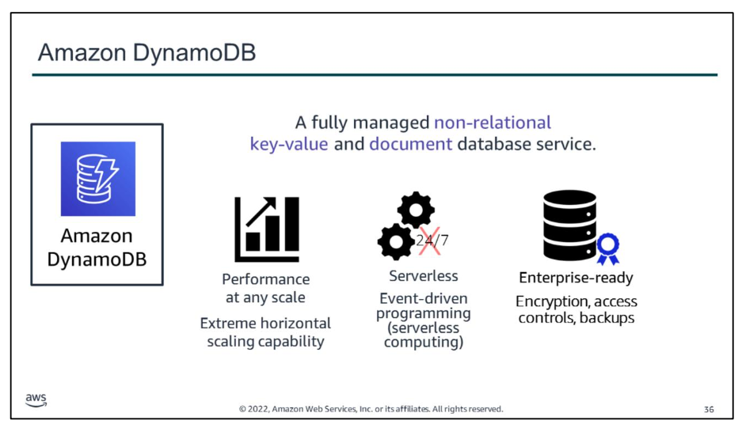
Amazon DynamoDB is a *fully managed non-relational NoSQL* database service. 
It provides fast and predictable performance with seamless scalability.

(predictable: có thể dự đoán; seamless: liền mạch; )

***Key benefits include***:  
- Performance at scale
	- It offers consistent, single-digit millisecond response times
	-   You can build applications with virtually unlimited throughput 
	  
- Serverless
	-   No servers to provision, patch (vá), or manage
	-   No software to install, maintain, or operate 
	  
- Enterprise-ready
	-   It supports ACID transactions
	-   It encrypts all data at rest by default
	-   Multi-Region replication (global tables) is available
	-   It provides fine-grained identity and access control
	-   You can perform ***full backups of data with no performance impact***
(grain: bản chất; fine-grained identity: nhận dạng chi tiết)

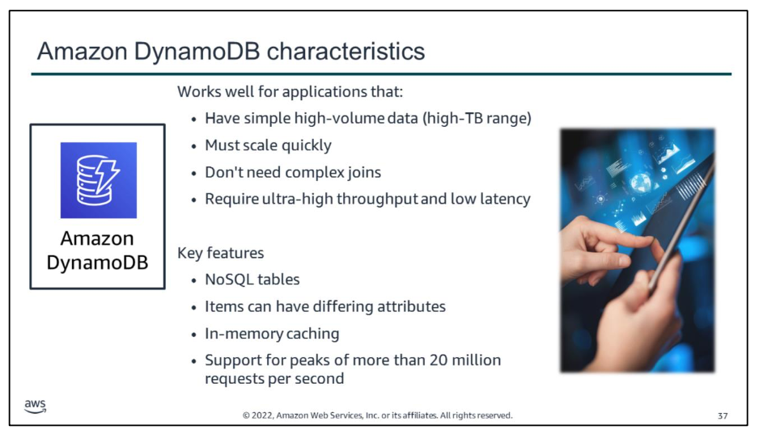
**DynamoDB characteristics**
DynamoDB works well for applications that:
- handle a *high volume of data (high-TB range)* and *must scale quickly*. 
- It also provides *ultra-high throughput and low latency*, so it is a good option for gaming, adtech, mobile, and other applications that have these requirements. 
- However, a relational database is likely a better choice if your workloads require complex joins. 
--> DynamoDB fits with "don't need complex joins"

DynamoDB tables:
- do not have fixed schemas, 
- and each item can have a different number of attributes. 
--> NoSQL tables.

Because DynamoDB provides:
- in-memory caching 
- and can handle more than 20 million requests per second. 
It is often used for applications that *must maintain session state*, for serverless web applications, and for microservices.

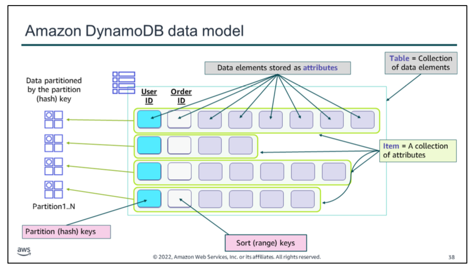
**Amazon DynamoDB data model**

Unlike relational databases—and because it is a NoSQL database—***DynamoDB does not enforce strict schemas***.
- A `DynamoDB table` holds `items`. 
- An `item` has a variable number of `attributes`. 
- Each `attribute` consists of a `key-value` pair.
(item hiểu như "dòng", có thể gồm nhiều ô. attrbute hiểu tương đương với ô, chứa một cặp key-value)

DynamoDB supports key-value GET/PUT operations that use *a user-defined primary key (partition key, also known as a hash key)*. 
***The primary key is the only required `attribute` for `items` in a `table` and it uniquely identifies each `item`***. **You specify the primary key when you create a table**. 
In addition, DynamoDB provides flexible querying by *allowing **queries on non-primary key attributes** using Global Secondary Indexes and Local Secondary Indexes*. --> DynamoDB cho phép truy vấn trên khóa chính (do ta chỉ định khi tạo table) và truy vấn trên cả các thuộc tính không phải khóa chính

(khóa chính (primary key) còn gọi là khóa phân vùng (partition key), khóa băm (hash key) ; attribute: thuộc tính; item: mục)

Auto-partitioning occurs when the dataset size grows and as provisioned capacity increases. --> tự động phân vùng diễn ra khi kích thước dataset tăng và khi dung lượng được cấp tăng lên.

Consider an example case where you create an Amazon DynamoDB table to hold order information. 
In the example, your table entries will always have a User ID and Order ID. However, some of the other details about an order—such as the user's email address—can only be collected for some orders, and not others. 
As additional items are added to the table, you can continue to collect new attributes. *These attributes can include ones that you did not anticipate when you first created the table.* This flexibility is what makes DynamoDB a good fit for rapidly changing unstructured, semistructured, and structured data.

(rapidly: nhanh chóng, dốc; )

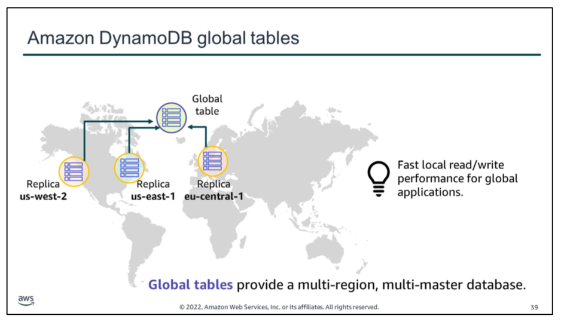
**Amazon DynamoDB global tables**

*By default, Amazon DynamoDB replicates your data across multiple Availability Zones in a single Region*. However, there might be occasions when you want to *replicate your data across multiple Regions*.

***Amazon DynamoDB global tables provide a fully managed solution for deploying a multi-region, multi-master database***. You do not need to build and maintain your own replication solution. 
When you create a global table, *you specify the AWS Regions where you want the table to be available*. DynamoDB performs all of the necessary tasks to create identical tables in these Regions. DynamoDB then propagates ongoing data changes to all the tables.

To illustrate one use case for a global table, suppose that you have a large customer base spread across three geographic areas—the US east coast, the US west coast, and western Europe. Customers must update their profile information while they use your application.

To handle this business requirement, you could create a global table that consists of your three Region- specific CustomerProfiles tables. *DynamoDB would then automatically replicate data changes among those tables*. Changes to CustomerProfiles data in one Region *would seamlessly propagate* to the other Regions. 
In addition, if one of the AWS Regions became temporarily unavailable, your customers could still access the same CustomerProfiles data in the other Regions

(propagate: tuyên truyền, truyền bá, truyền; illustrate: minh họa; suppose: giả định)

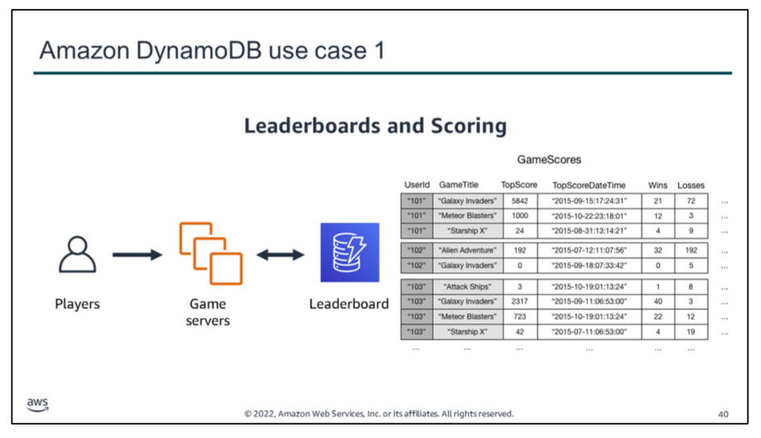
**Amazon DynamoDB use case 1**
Gaming companies use Amazon DynamoDB in all parts of their game platforms, including game state, player data, session history, and leaderboards. You can scale reliably to millions of concurrent users and requests while you also ensure consistently low latency.

In the example use case, a game score leaderboard is maintained in Amazon DynamoDB. Players who are actively connected to the game servers might see some of this information presented in whatever way the gaming user interface (UI) presents it to them. The GameScores leaderboard is constantly updated when new top scores are achieved and each top scorer's win/loss record changes. As an example, consider Electronic Arts (EA), a large video game company with more than 300 million registered players around the world. For EA, high concurrency can mean more than 100,000 requests per second and millions of daily active users. 
See DynamoDB Gaming Use Cases for more details.
[Amazon DynamoDB: Gaming use cases and design patterns | AWS Database Blog](https://aws.amazon.com/blogs/database/amazon-dynamodb-gaming-use-cases-and-design-patterns/) 

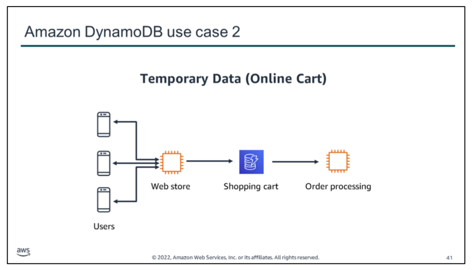
**Amazon DynamoDB use case 2**
Amazon DynamoDB was developed because customers needed a scalable and highly reliable key- value database to power essential Amazon ecommerce operations, such as the shopping cart.

In 2012, Amazon CTO Werner Vogels explained the business requirements of the Amazon shopping cart in a blog post when he announced the release of Amazon DynamoDB. "This non-relational, or NoSQL, database was targeted at use cases...such as the shopping cart....Any downtime or performance degradation...has an immediate financial impact and their fault-tolerance and performance requirements for their data systems are very strict. These services also require the ability to scale infrastructure incrementally to accommodate growth in request rates or dataset sizes. Another important requirement...was predictability."  [Amazon DynamoDB – a Fast and Scalable NoSQL Database Service Designed for Internet Scale Applications | All Things Distributed](https://www.allthingsdistributed.com/2012/01/amazon-dynamodb.html) 

The DynamoDB feature set continues to evolve. However, the core goals that inspired the development of the service remain relevant today to organizations that want to implement a processing solution for a web store shopping cart order.

(evolve: tiến hóa; )

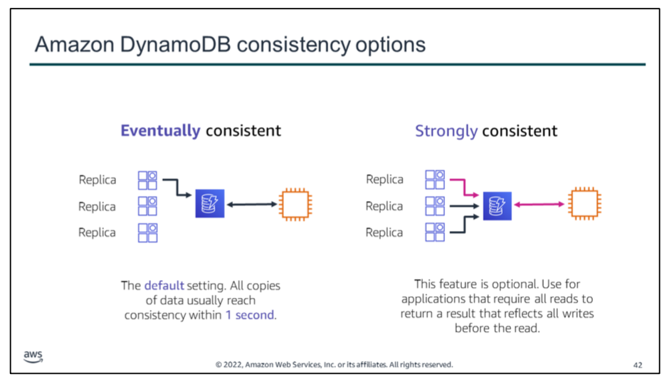
**Amazon DynamoDB  consistency options**
Read consistency represents how and when the successful write or update of a data item is reflected in a subsequent read operation of that same item. 
Amazon DynamoDB exposes logic that enables you to specify the consistency characteristics you want for each read request in your application.

(consistency: tính nhất quán ; represent: tượng trưng, đại diện ; reflect: phản chiếu, phản ánh; subsequent: đên sau, theo sau;  expose: trình bày, bóc trần; Eventually: cuối cùng;  stale: cũ; delay: chậm trễ; outage: thiếu điện, hàng hóa, ngừng hoạt động; )

**`Eventually consistent reads`**  
When you read data from a DynamoDB table, the response *might not reflect the results of a recently completed write operation*. 
*The response might include some stale data*. If you repeat your read request after a short time, the response should return the latest data.

**`Strongly consistent reads`**  
When you request a strongly consistent read, *DynamoDB returns a response with the most up-to- date data*. The response reflects the updates from all previous write operations that were successful. *A strongly consistent read might not be available if there is a network delay or outage*.

**DynamoDB uses `eventually consistent reads`, unless you specify otherwise**. Read operations (such as GetItem, Query, and Scan) provide a ConsistentRead parameter.

*If you set this parameter to `true`, DynamoDB uses `strongly consistent reads` during the operation*.

# 5.  Database security controls

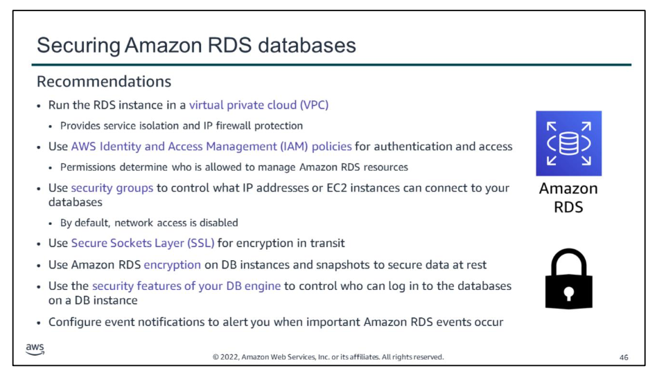
**Securing Amazon RDS db**
Security is a shared responsibility between you and AWS. 
- AWS is responsible for security **of the cloud**, which means that AWS protects the infrastructure that runs Amazon RDS. 
- Meanwhile, you are responsible for security **in the cloud**.

One security recommendation for Amazon RDS is to **run your RDS instances in a virtual private cloud (VPC)**. A VPC enables you to place your instance in a private subnet, which secures it from public routes on the internet. The VPC also *provides IP firewall protection* and enables you to securely control the applicable network configuration.

In addition, we recommend that you:
-   **Use AWS Identity and Access Management (IAM) policies for authentication and to control access**.
-   **Configure security groups to limit connections**. Open the TCP port where the database is accessible. However, you limit where those connections can originate from.
-   Use SSL connections to ensure that all communication to and from your database is secured. --> **use SSL for encryption in trasit**.
-   **Use Amazon RDS encryption to encrypt your data and database snapshots**. --> secure data at rest. 
-   **Use the security features of your DB engine**, for example, to enforce password complexity.
-   **Enable event notifications on important events that can occur on your RDS instance**. These events can include whether the instance was *shut down, a backup was started, a failover occurred, the security group was changed, or your storage space is low*.
    
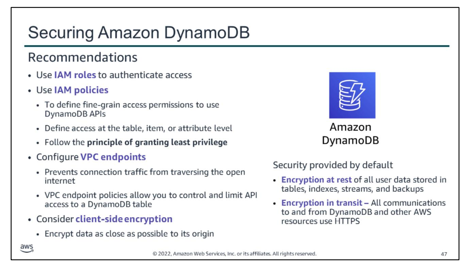
**Securing Amazon DynamoDB** 
To secure Amazon DynamoDB, many of the same best practices that you should use to secure Amazon RDS also apply.
For example, 
- **use IAM roles to secure authentication**, 
- and **use IAM policies to define access permissions**.

If you only require access to DynamoDB from within a virtual private cloud (VPC), you should **use a VPC endpoint to limit access from only the required VPC**. Doing this prevents that traffic from traversing the open internet and being subject to that environment.

(prevent: ngăn chặn; travere: đi qua, chuyển tải;)

Also, If you store sensitive or confidential data in DynamoDB, you might want to encrypt that data as close as possible to its origin so that your data is protected throughout its lifecycle.

Note that *DynamoDB provides certain security features by default*. For example, *DynamoDB protects user data stored at rest and also data in transit between on-premises clients and DynamoDB, and between DynamoDB and other AWS resources within the same AWS Region*.

Read the DynamoDB security best practices documentation for additional details.  [DynamoDB preventative security best practices - Amazon DynamoDB](https://docs.aws.amazon.com/amazondynamodb/latest/developerguide/best-practices-security-preventative.html) 

# 6.  Migrating data into AWS databases

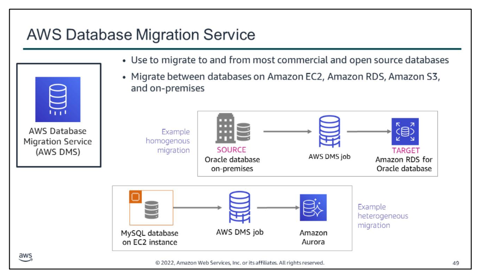
**AWS Database Migration Service (AWS DMS)**
You can use the AWS Database Migration Service (AWS DMS) to *migrate or replicate* existing databases to Amazon RDS. 
AWS DMS supports migration between the most widely used databases.

Supported **source databases** include:
- Oracle, 
- Microsoft SQL Server, 
- MySQL, 
- MariaDB, 
- PostgreSQL, 
- IBM Db2 LUW, 
- SAP, 
- MongoDB, 
- and Amazon Aurora. 
  
**Target database** engines include:
- Oracle, 
- Microsoft SQL Server, 
- MySQL, 
- PostgreSQL, 
- Amazon Redshift, 
- SAP ASE, 
- Amazon S3, 
- and Amazon DynamoDB.

AWS DMS also supports both homogenous (same engine) migrations and heterogeneous (different engines) migrations.

(homogenous: đồng nhất; heterogeneous: không đồng nhất )

The first example shown is a *homogenous* conversion, where an *on-premises Oracle database is migrated to Amazon RDS for Oracle database*.

The second example shows a *heterogeneous* migration, where *a MySQL database that runs on an Amazon EC2 instance is migrated to Amazon Aurora*.

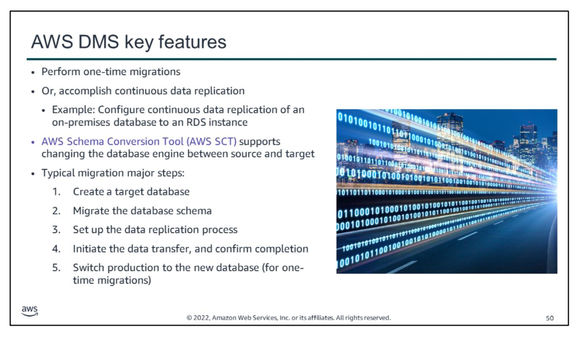
**AWS DMS key features**
AWS DMS can be used to:
- **perform one-time migrations**
- but it can also be used to **accomplish continuous data replication between two databases**. 
  For example, you could use it to configure continuous data replication of an on-premises database to an RDS instance.

(accomplish: hoàn thành; heterogeneous: không đồng nhất >< homogenous: đồng nhất; typical: đặc trưng, điển hình; involve: bao hàm, liên quan tới, kéo theo; Initiate: bắt đầu;  )

When you want to **perform a heterogeneous migration from one database engine to another**, you might want to use the `AWS Schema Conversion Tool (AWS SCT)`.

A typical database migration involves the following major steps:

1.  Create a target database
2.  Migrate the database schema
3.  Set up the data replication process
4.  Initiate the data transfer, and confirm completion
5.  Switch production to the new database (for one-time migrations)

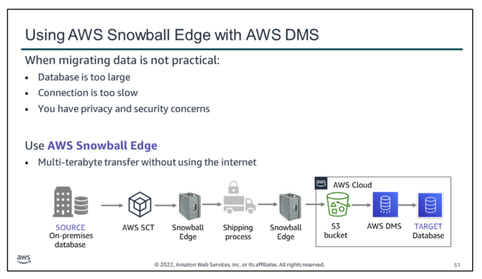
**Using AWS Snowball Edge with AWS DMS**
Larger data migrations can include many terabytes of information. This process can be difficult because of network bandwidth limits or the amount of data. AWS Database Migration Service (AWS DMS) can  
use AWS Snowball Edge and Amazon S3 to migrate large databases more quickly than other methods. [AWS Snowball | Secure Edge Computing and Offline Data Transfer | Amazon Web Services](https://aws.amazon.com/snowball/) 

AWS Snowball is an AWS service that provides an `Edge device` that you use to transfer data to the cloud at faster-than-network speeds. 
An Edge device is an appliance that is owned by AWS. It provides large amounts of on-board storage. 
The Edge device also uses 256-bit encryption and an open standard Trusted Platform Module (TPM) to ensure both security and full chain of custody for your data.

(appliance: thiết bị; custody: chăm sóc, coi giữ; full chain of custody: toàn bộ chuỗi hành trình (?); )

When you use an Edge device, the data migration process includes the following stages:
-   Use AWS SCT to extract the data locally and move it to the Edge device
-   Ship the device back to AWS
-   After AWS receives your shipment, the device automatically loads its data into an S3 bucket
-   AWS DMS takes the files and migrates the data to the target data store

# QUIZ

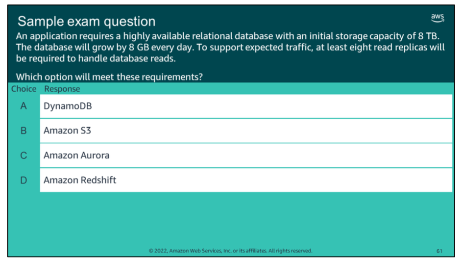
The following are the keywords to recognize: **highly available relational database, grow by 8 GB every day, and read replicas**.

The correct answer is C. Amazon Aurora is a relational database that will automatically scale to accommodate data growth.

(accommodate: làm cho thích nghi; )

Incorrect answers:
-   Answer A: DynamoDB is a NoSQL service, not a relational database.
-   Answer B: Amazon S3 is object storage, not a relational database.
-   Answer D: *Amazon Redshift does not support read replicas and will not automatically scale*.

# LINKS
If you want to learn more about the topics covered in this module, you might find the following additional resources helpful:

-   AWS Databases – Resource page 
-   Amazon RDS Getting Started Guide [Purpose-Built Databases on AWS | Amazon Web Services](https://aws.amazon.com/products/databases/) 
-   Amazon RDS FAQs
[Amazon RDS FAQs | Cloud Relational Database | Amazon Web Services](https://aws.amazon.com/rds/faqs/) 
-   Amazon DynamoDB Developer Guide
[What is Amazon DynamoDB? - Amazon DynamoDB](https://docs.aws.amazon.com/amazondynamodb/latest/developerguide/Introduction.html)
-   Amazon DynamoDB FAQs [Amazon DynamoDB FAQs | NoSQL Key-Value Database | Amazon Web Services](https://aws.amazon.com/dynamodb/faqs/) 