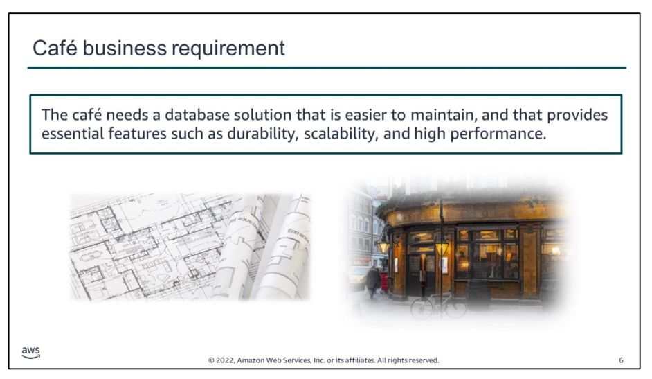
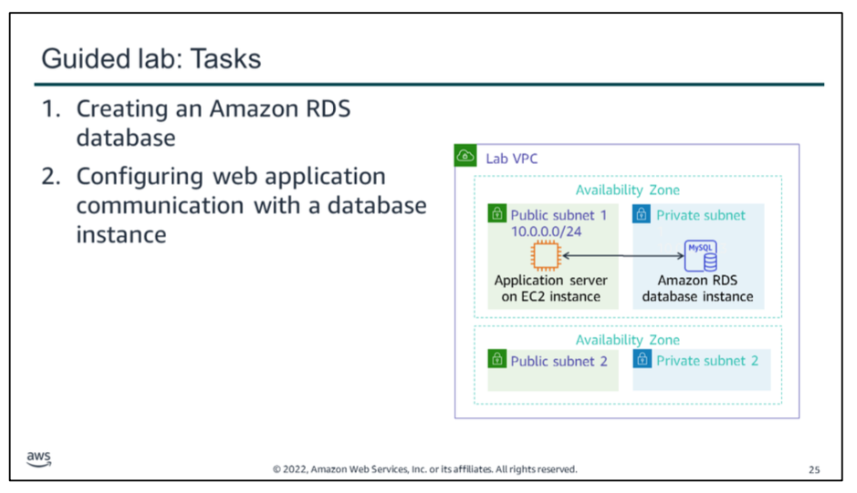
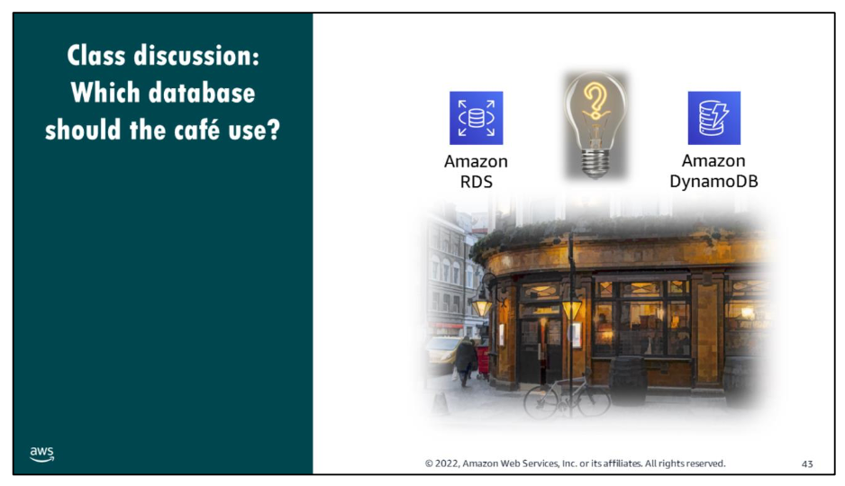
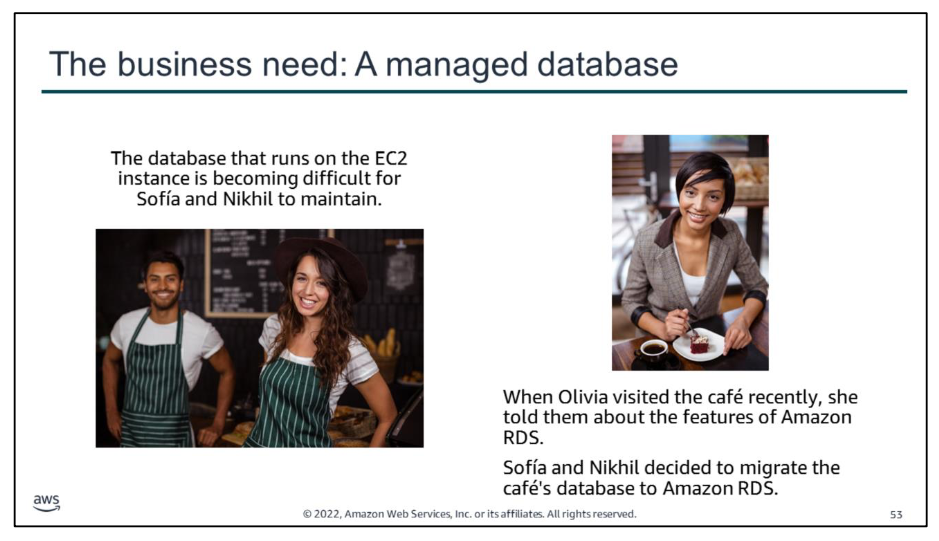
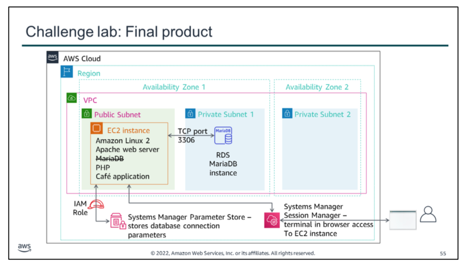

Ever since the cafe added the ability to place online orders to their website, the café staff have noticed that business has increased. In addition, they discovered that the order history that’s stored in the database—which they installed on the same EC2 instance where the web server is running—provides valuable business information. Martha uses it for accounting purposes, and Frank looks at it occasionally to get an idea of how many of each dessert type he should bake.

However, Sofía has some concerns. The database needs to be upgraded and patched, and she doesn’t always have time to do these tasks on a regular basis. Also, administering the database is a specialized skill, and training others to do it isn’t something she wants to spend time on. Meanwhile, she is also concerned that the cafe isn’t doing data backups as often as they should.

The café staff wants to reduce the labor costs associated with the technical learning investment that’s needed to manage the database themselves. Thus, they decided that they need to use a managed database solution. Ideally, they will find one that provides essential features, such as durability, scalability, and high performance.

Throughout this module, you will learn details about the different database services that AWS provides, and the capabilities that are provided by these different services. With this understanding of the available options, you should be able to choose a database solution that can successfully meet these new business requirements.

In this guided lab, you will complete the following tasks:

1.  Creating an Amazon RDS database
2.  Configuring web application communication with a database instance

**Class discussion**
Now that you know the essential key features of both Amazon RDS and DynamoDB, consider which of these two database services would be a better match for the café's use case.

In an earlier module in the course, you completed a challenge lab where you deployed a MySQL database that runs on an EC2 instance. This database hosts a table that contains details about the café's menu. It also provides the data storage layer for the orders that customers place online.

If the café team decides that they want to migrate the database layer so they can use an Amazon managed database service, which of these two database options would be a better choice?

The educator will lead your class in a conversation about this topic. You are encouraged to participate in the dialog and explain the reasoning behind your answer.

The administration of the café database is becoming difficult for Sofía and Nikhil. For example, they must work extra hours when the café is closed to do weekly database backups.

In addition, they recently struggled to install a required patch. Sofía and Nikhil almost did not complete it during the weekend afterhours window. Frank and Martha now realize that these maintenance tasks increase the business' labor costs because they must pay for the overtime hours that Sofía and Nikhil work.

Raquel, an AWS solutions architect, is a café customer and Sofía’s friend. Sofía mentioned the topic of databases to Olivia during a recent conversation. Olivia suggested that they migrate the database to Amazon RDS.

This solution will reduce the burden of manually performing common database maintenance tasks, such as backups, patch installation, and upgrades. As a fully managed service, Amazon RDS performs these tasks automatically.

In this activity, you will take on the roles of Nikhil and Sofía, and work to migrate the café database to Amazon RDS.

 In this challenge lab: you will complete the following tasks:
1.  Creating an RDS instance
2.  Analyzing the existing café application deployment
3.  Working with the database on the EC2 instance
4.  Working with the RDS database
5.  Importing the data into the RDS database instance
6.  Connecting the café application to the new database

The diagram summarizes what you will have accomplished after you complete the lab.

The café web application originally used the MariaDB that is installed on the EC2 instance. However, in the course of the lab, you create an RDS MariaDB instance, dump the data out of the database on the EC2 instance, and migrate the data into the RDS database.

To accomplish the migration, you connect to the EC2 instance by using the AWS Systems Manager Session Manager, which provides terminal access through a web browser. You use a MySQL client that is installed on the EC2 instance to connect to both databases, as needed, during the migration. Database credentials and database connection information are stored in the AWS Systems Manager Parameter Store. Thus, an IAM role is attached to the EC2 instance to allow the web application to read data out of the Parameter Store.