# OVERVIEW
This module includes the following sections:
1.  Architectural need
2.  Creating an network environment
3.  Connecting your network environment to the internet
4.  Securing your network environment

The module also includes:
-   A demonstration that will show you how manually create a virtual private cloud (VPC)
-  A guided lab where you will create a VPC on your own
-   A challenge lab where you will create a VPC, enable private resources to connect to the internet, and create a security layer to control traffic to and from private resources in your VPC.

# Module objectivies:
At the end of this module, you should be able to:
- Explain the foundational role of a virtual private cloud (VPC) in Amazon Web Services (AWS) Cloud networking
-   Identify how to connect your AWS networking environment to the internet
-   Describe how to isolate resources within your AWS networking environment
-   Create a VPC with subnets, an internet gateway, route tables, and a security group

# 1. Architectural need

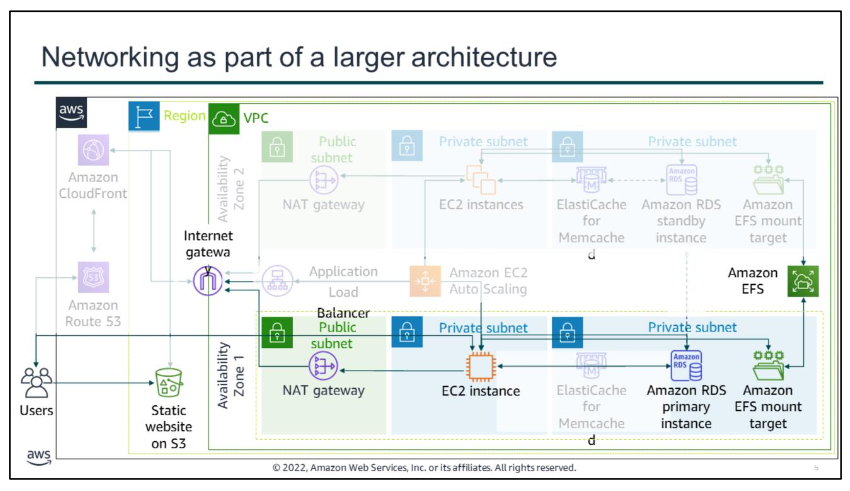
In this module, you will learn: 
- how to design a network on AWS 
- and build a VPC with subnets.
You will also learn how to connect instances in your public and private subnets to the internet.

# 2. Creating an network environment

key takeaways:
-   Amazon VPC enables you to provision VPCs, which are *logically isolated sections* of the AWS Cloud where you can launch your AWS resources.
-   A *VPC* belongs to only one Region and is divided into `subnets`.
-   A `subnet` belongs to one Availability Zone or Local Zone. It is a subset of the VPC CIDR block. (subset: tập hợp con)
-   You can create multiple VPCs within the same Region or in different Regions, and in the same account or different accounts.
-   Follow these best practices when designing your VPC:
    -   Create one subnet per Availability Zone for each group of hosts that have unique routing requirements.
    -   Divide your VPC network range evenly across all available Availability Zones in a Region.
    -   Do not allocate all network addresses at once. Instead, ensure that you reserve some address space for future use.
    -   Size your VPC CIDR and subnets to support significant growth for the expected workloads.
    -   Ensure that your VPC network range does not overlap with your organization’s other private network ranges.
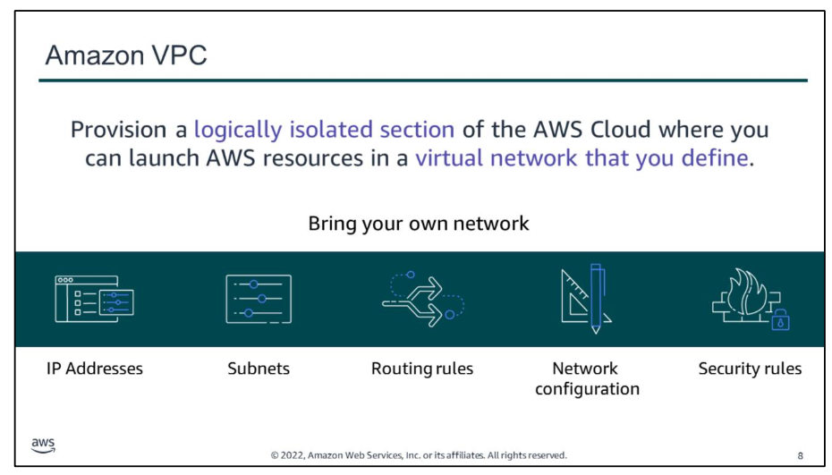
**Amazon Virtual Private Cloud (Amazon VPC)** 
is a service that enables you to provision a *logically isolated section* of the AWS Cloud (called a virtual private cloud, or VPC) where you can launch your AWS resources.

Amazon VPC gives you *control over your virtual networking resources*. 
For example: you can select your own IP address range, create subnets, and configure route tables and network gateways.
You can use both IPv4 and IPv6 in your VPC for secure access to resources and applications.

You can also *customize the network configuration for your VPC*. 
For example, you can create a public subnet for your web servers that can access the public internet. You can place your backend systems (such as databases or application servers) in a private subnet with no public internet access.

Finally, you can use multiple layers of security to help control access to Amazon Elastic Compute Cloud (Amazon EC2) instances in each subnet. These security layers include:
- security groups 
- and network access control lists (network ACLs).

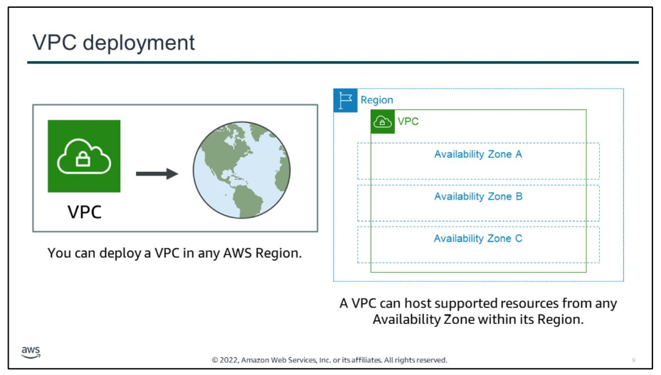
**VPC deployment**
A VPC belongs to a single AWS Region. A VPC spans all the Availability Zones in a Region, so it can host supported resources from any Availability Zone within its Region.

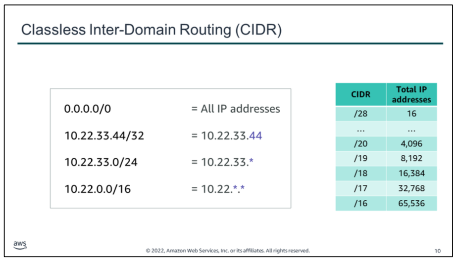
**Classless Inter-Domain Routing (CIDR)**
When you create a VPC, you provide the set of private IP addresses that you want instances in your VPC to use. You specify this set of addresses as a Classless Inter-Domain Routing (CIDR) block—for example, 10.0.0.0/16. This is the primary CIDR block for your VPC. You can assign block sizes of between /28 (16 IP addresses) and /16 (65,536 IP addresses).

Amazon VPC supports IPv4 and IPv6 addressing and has different CIDR block size limits for each. **By default, all VPCs and subnets must have IPv4 CIDR blocks**—you can't change this behavior. You can optionally associate an IPv6 CIDR block with your VPC.

Your VPC can operate in *dual-stack mode*: your resources can communicate over IPv4, or IPv6, or both. IPv4 and IPv6 addresses are independent of each other, so you must configure routing and security in your VPC separately for IPv4 and IPv6.

(dual-stack mode: chế độ ngăn xếp-kép)

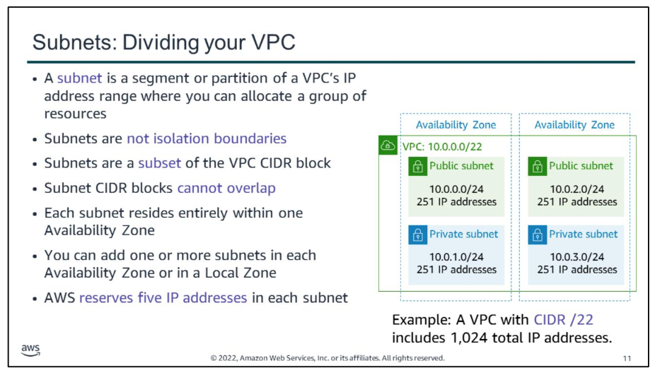
**Subnets: Dividing your VPC**
You can divide a `VPC` into one or more `subnets`. 

A `subnet` is a segment or partition of a VPC’s IP address range where you can allocate a group of resources. 
It is important to remember that subnets are not isolation boundaries around your application. Instead, they are containers for routing policies, which you will learn about in the next section of this module.

(subnet: mạng con; segment: cắt ra, phân đoạn; partition: phân chia, phân vùng; allocate: phân bổ, phân định, cấp cho ai cái gì, isolation: cô lập; boundary: ranh giới; container: thùng chứa;routing policies: chính sách định tuyến; specify: chỉ định; subset: tập hợp con; overlap: che phủ, đè lấn lên nhau; reside: cư trú; entirely: trọn vẹn; map: ánh xạ; placement: sự sắp đặt; properly: đúng đắn, hợp lý)

When you create a subnet, you specify the CIDR block for the subnet, which is a subset of the VPC CIDR block. Subnet CIDR blocks cannot overlap.

Though each *subnet must reside entirely within one Availability Zone and cannot span zones*, each *Availability Zone can have one or more subnets*. You can optionally add subnets in a Local Zone. 
When you create a subnet in a Local Zone, the VPC is also extended to that Local Zone. 

For more information about how to extend your VPC resources to a Local Zone, see Extending Your VPC Resources to AWS Local Zones in the AWS Documentation.  [Extend a VPC to a Local Zone, Wavelength Zone, or Outpost - Amazon Virtual Private Cloud](https://docs.aws.amazon.com/vpc/latest/userguide/Extend_VPCs.html) 

Because VPC *subnets are mapped to specific Availability Zones*, subnet placement is one way to ensure that Amazon EC2 instances are properly distributed across multiple locations.

*AWS reserves the first four IP addresses and the last IP address in each subnet CIDR block*. 
For example, in a subnet with CIDR block 10.0.0.0/24, AWS reserves the following five IP addresses for:
-   10.0.0.0: Network address
-   10.0.0.1: VPC local router
-   10.0.0.2: Domain Name System (DNS) resolution
-   10.0.0.3: Future use
-   10.0.0.255: Network broadcast address

For more information about VPCs and subnets, see VPCs and Subnets in the AWS Documentation. [Subnets for your VPC - Amazon Virtual Private Cloud](https://docs.aws.amazon.com/vpc/latest/userguide/configure-subnets.html) 

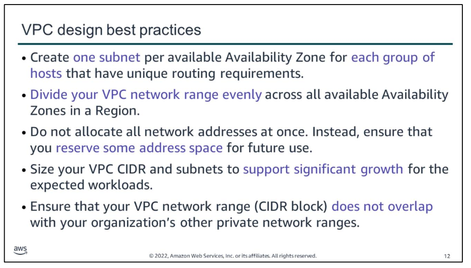
**VPC design best practices**
When you configure any computer network, consider the following universal network design principles:
-   Create *one subnet* per available Availability Zone for *each group of hosts* that have unique routing requirements.
-   *Divide your VPC network range evenly* across all available Availability Zones in a Region. (evenly: như nhau; allocate: cấp phát; significant: có ý nghĩa, đáng kể; )
-   Do not allocate all network addresses at once. Instead, ensure that you *reserve some address space* for future use.
-   Size your VPC CIDR and subnets to *support significant growth* for the expected workloads.
-   Ensure that your VPC network range (CIDR block) *does not overlap* with your organization’s other private network ranges.  

For more information about designing and sizing individual VPCs, see AWS Single VPC Design. [Amazon Virtual Private Cloud Connectivity Options (awsstatic.com)](https://d1.awsstatic.com/whitepapers/aws-amazon-vpc-connectivity-options.pdf) 

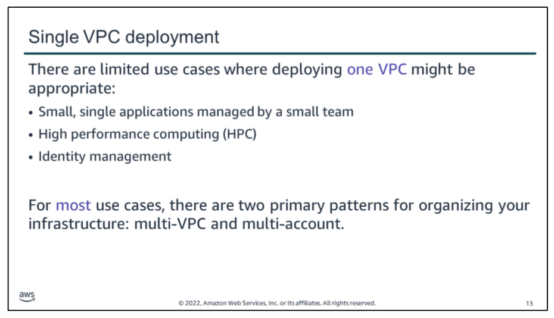
**Single VPC deployment**

When you design and create your network environment, **there are a limited number of use cases where a *single VPC environment* might be appropriate**:
-   *Small, single applications managed by a small team*
-   *High performance computing (HPC)* environments (such as physics simulations)—a single VPC environment has lower latency than one spread across multiple VPCs
-   *Identity management* environments—a single VPC might provide best security.

(simulation: sự mô phỏng; )

For most use cases, however, a ***multi-VPC environment*** is required. You *can create multiple VPCs within the same Region or in different Regions*. You can also *create multiple VPCs in the same AWS account or in different AWS accounts*.

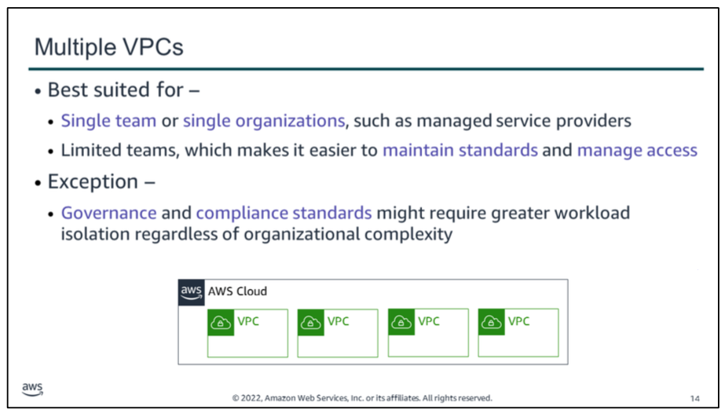
**Multiple VPCs**
Multiple VPCs are best suited for:
- a *single team or organization* that maintains full control over the provisioning and management of all resources in each application environment. 
  For example, consider a single team that develops a large ecommerce application. 
  - They might use this pattern when the developers have full access to the Development and Production environments. This pattern is also common with managed service providers (MSPs) that manage all resources in Test and Production environments.

To learn more about services and best practices for multiple-VPC deployments, see:
-   Single Region Multi-VPC Connectivity
[Amazon Virtual Private Cloud Connectivity Options (awsstatic.com)](https://d1.awsstatic.com/whitepapers/aws-amazon-vpc-connectivity-options.pdf) 
-   Multiple Region Multi-VPC Connectivity [Building a Scalable and Secure Multi-VPC AWS Network Infrastructure - AWS Whitepaper (awsstatic.com)](https://d1.awsstatic.com/whitepapers/building-a-scalable-and-secure-multi-vpc-aws-network-infrastructure.pdf) 

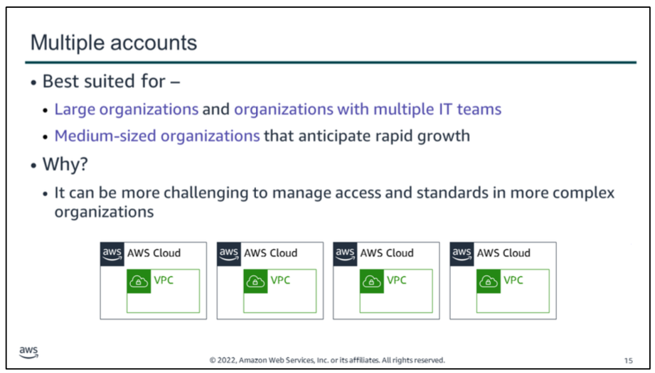
**Multiple accounts**
As mentioned, you can create multiple VPCs in the same AWS account or in different accounts.

Multiple-account patterns are best suited for enterprise customers or organizations that deploy applications managed across *multiple teams*. 
For example, consider an organization that supports two or more teams. They might use this pattern to support developers who have full access to Development environment resources, but limited or no access to the Production environment.

(anticipate: đoán trước; rapid: nhanh chóng )

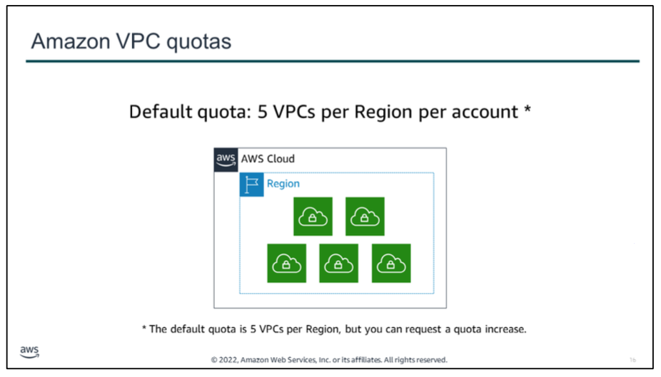
**Amazon VPC quotas**
Be aware of Amazon VPC quotas. **The default quota is 5 VPCs per Region**. However, you can request an increase for this quota.

For more information about Amazon VPC service limits, see Amazon VPC quotas in the AWS Documentation. [Amazon VPC quotas - Amazon Virtual Private Cloud](https://docs.aws.amazon.com/vpc/latest/userguide/amazon-vpc-limits.html) 

# 3. Connecting your network environment to the internet

key takeaways:
-   An *internet gateway* allows communication between instances in your VPC and the internet.
-   *Route tables* control traffic from your subnet or gateway.
-   *Elastic IP addresses* are static, public IPv4 addresses that can be associated with an instance or elastic network interface. They can be remapped to another instance in your account.
-   *NAT gateways* enable instances in the private subnet to initiate outbound traffic to the internet or other AWS services.   
-   A *bastion host* is a server whose purpose is to provide access to a private network from an external network, such as the internet.

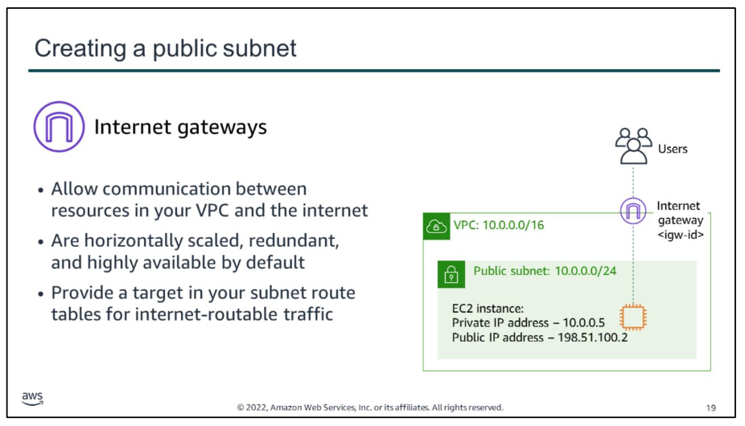
**Creating a public subnet**

Now that you know how to design and create an isolated network environment for your workloads, you will want to connect it to the internet.

An *internet gateway* is a VPC component that:
- allows communication between resources in your *VPC* and the internet. 
- It is *horizontally* scaled, *redundant*, and highly available. 
An internet gateway supports IPv4 and IPv6 traffic. 

(redundant: dư thừa; perform: thực hiện, hoàn thành, trình diễn; particular: cụ thể; )

An *internet gateway* serves two purposes:
- First, it provides a *target* in your VPC route tables for internet-routable traffic.
- Second, the internet gateway performs *network address translation (NAT)* for instances that were assigned public IPv4 addresses.

To make a *subnet public*, you must first ***create an internet gateway and attach it to your VPC***.

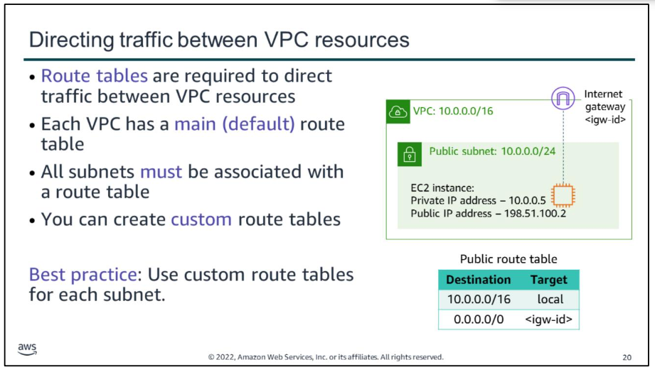
**Directing traffic between VPC resources**
Next, you must update the *route table* associated with the *subnet* you want to connect to the internet. 
A *route table* contains a set of rules, called ***routes***. Routes are used to determine where network traffic is directed.

(route table: bảng định tuyến; route: tuyến đường; determine: xác định; initially: ban đầu; launch: khởi chạy; explicitly: rõ ràng, dứt khoát; implicitly: mặc nhiên, hoàn toàn -->  the subnet is implicitly associated with: mạng con được liên kết ngầm với...)

When you create a ***VPC***, it  ***automatically has a main route table***. 
Initially, the main route table (and every route table in a VPC) *contains only a single local route that enables communication for all the resources in the VPC*. 
You can't modify the local route in a route table. 
When *you launch an instance in the VPC, the local route automatically covers that instance. You don't need to add the new instance to a route table*. 
You can create additional custom route tables for your VPC.  --> Best practice: Use custom route tables for each subnet.

***Each subnet in your VPC must be associated with a route table***, which controls the routing for the subnet. *If you don't explicitly associate a subnet with a particular route table, the subnet is implicitly associated with and uses the main route table*. 
A subnet can be associated with only one route table at a time, but you can associate multiple subnets with the same route table.

You can create custom route tables for each subnet to enable granular routing for destinations. 

(granular: dạng hạt; enable granular routing for destinations: kích hoạt định tuyến chi tiết cho các đích)

To send non-local traffic through the internet gateway to the internet, create a route with destination **0.0.0.0/0** and target `<igw-id>` in the route table associated with the subnet.

**Remapping an IP address from one instance to another**
Next, you must make sure that your instances have either public IP or Elastic IP addresses.

An *Elastic IP address*:
- is a *static and public IPv4 address* that is designed for dynamic cloud computing. (associated with your AWS account)
- You can *associate an Elastic IP address with any instance or elastic network interface* for any VPC in your account.
- With an Elastic IP address, you can mask the failure of an instance by rapidly *remapping the address to another instance in your VPC*. --> *can be remapped to another instance* in your account.
- Associating the Elastic IP address with the network interface has an advantage over associating it directly with the instance. *You can move all of the attributes of the network interface from one instance to another in a single step*. --> *are useful for redundancy when load balancers are not an option.*

(mask: mặt nạ, che đậy; rapidly: nhanh chóng; remapped: ánh xạ lại; interface: giao diện; redundancy: dư thừa; )

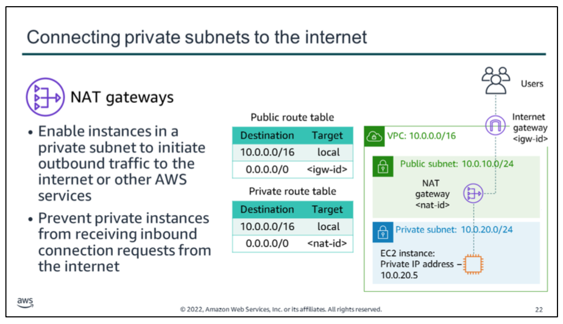
**Connecting private subnets to the internet**
To connect instances in your private subnet to the internet or other AWS services, you need a *network address translation (NAT) gateway*. 
A NAT gateway ***enables instances in a private subnet to connect to the internet or other AWS services***, but ***prevents the internet from initiating a connection with those instances***.

(prevent: ngăn ngừa; initiate: bắt đầu, khởi đẩu;  specify: xác định, chỉ rõ; reside: cư trú; )

To create a *NAT gateway*:
- you must *specify the public subnet where the NAT gateway should reside.* 
- You must also *specify an Elastic IP address to associate with the NAT gateway*. 
After you create a NAT gateway, *you must update the route table that is associated with one or more of your private subnets to point internet-bound traffic to the NAT gateway*. Thus, **instances in your private subnets can communicate with the internet**.

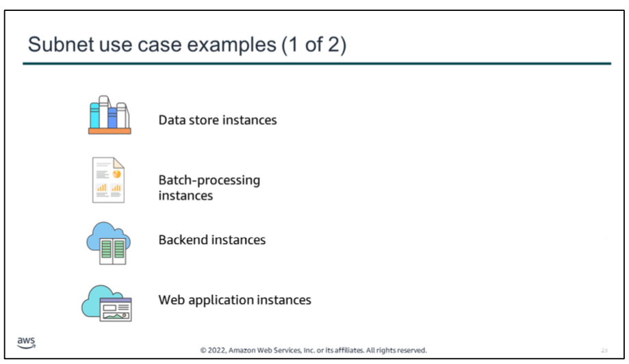
**Subnet use cases examples 01**
Take a moment to think about whether the instances in these examples should be put into a public or private subnet.

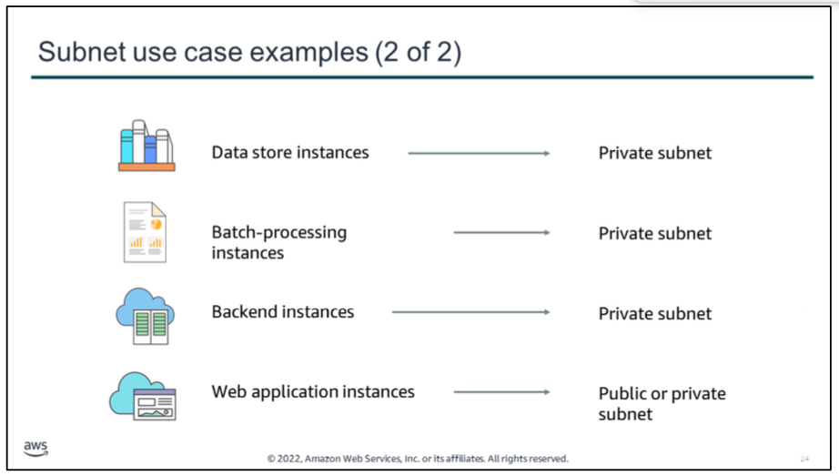
**Subnet use cases examples 02**
Data store instances, batch-processing instances, and backend instances should be put into private subnets. 
*You can put web-tier instances into a public subnet *. 

However, ***AWS recommends that you put web-tier instances inside private subnets behind a load balancer that is placed in a public subnet***. 

In some environments, you must attach web application instances to Elastic IP addresses directly (though you can also attach an Elastic IP address to a load balancer). In those cases, web application instances must be in a public subnet.
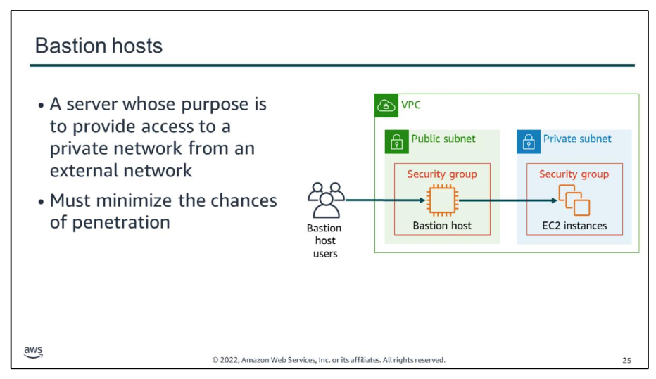
**Bastion hosts**
A bastion host:
- *is a server that provides access to a private network from an external network*, such as the internet. 
- You can use a bastion host to *minimize the chances of penetration and potential attack on resources in your private network*.

(Bastion: pháo đài; minimize: giảm thiểu; penetration: thâm nhập;  mitigate: giảm nhẹ; adapt: thích nghi; though: tuy vậy, song le; )

For example, suppose you want to allow connections from an external network to Linux instances in a private subnet of your VPC via Secure Shell, or SSH.

You can use a bastion host to mitigate the risk of allowing these external SSH connections to the instances in the private subnet. 
*A bastion host typically runs on an EC2 instance in a public subnet of your VPC*, as shown in this example. The Linux instances in the private subnet are in a security group that allows SSH access from the security group attached to the bastion host. 
Bastion host users connect to the bastion host so they can connect to the Linux instances.

Though you can adapt this architecture to meet your own requirements, **the bastion host should be the only source of SSH traffic to your Linux instances**.

For more information about this architecture, see the blog post   [How to Record SSH Sessions Established Through a Bastion Host | AWS Security Blog (amazon.com)](https://aws.amazon.com/blogs/security/how-to-record-ssh-sessions-established-through-a-bastion-host/) 
To learn how to deploy a Linux bastion host in a VPC environment on AWS, complete this Linux Bastion Hosts on AWS Quick Start. [Linux Bastion Hosts on AWS—Solution (amazon.com)](https://aws.amazon.com/solutions/implementations/linux-bastion/) 

# 4. Securing your network environment

key takeaways:
-   `Security groups` are `stateful` firewalls that act at the *instance level*
-   `Network ACLs` are stateless `firewalls` that act at the *subnet level*
-   When you set inbound and outbound rules to allow traffic to flow from the top tier to the bottom tier of your architecture, you can *chain security groups together* to isolate a security breach
-   You should structure your infrastructure with *multiple layers of defense*

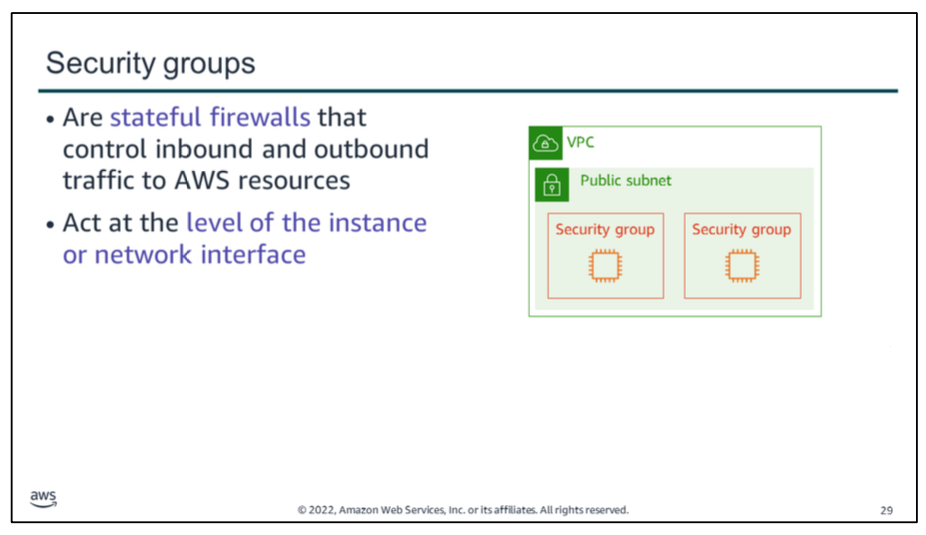
**Security groups**
Now that you know how to design and deploy a network environment, and connect it to the internet, you must isolate your applications and workloads.

You can achieve isolation by deploying the EC2 instances that host your application or workload into a security group that is attached to your VPC.

**Security groups:**
- are *stateful firewalls* --> that control inbound and outbound traffic to AWS resources.
- act at the *level of instance or network interface*.

(regardless: bất kể; initiate: bắt đầu; response: phản hồi; tightly: chặt chẽ; restrict: hạn chế;  corresponding: tương ứng; permit: cho phép; )

*`Stateful`* means that return traffic is allowed is automatically allowed, regardless of any rules. 

For example, say that you initiate an Internet Control Message Protocol (ICMP) ping command to your instance from your home computer. If your inbound security group rules allow ICMP traffic, information about the connection (including the port information) is tracked. Response traffic from the instance for the ping command is not tracked as a new request. Instead, it is tracked as an established connection. It is allowed to flow out of the instance, even if your outbound security group rules restrict outbound ICMP traffic.

*Security group rules control inbound and outbound traffic to your AWS resources*. You should tightly configure these rules to restrict traffic and ***allow access only as needed***. 
Traffic can be restricted by:
- any internet protocol, 
- service port, 
- and source or destination IP address (individual IP address or CIDR block).

**Not all traffic flows are tracked**. Consider a security group rule that permits transmission control protocol (TCP) or user datagram protocol (UDP) flows for all traffic (that is, 0.0.0.0/0). *There is also a corresponding rule in the other direction that permits the response traffic. In this case, that flow of traffic is not tracked*. The response traffic is therefore allowed to flow based on the inbound or outbound rule that permits the response traffic, and not on tracking information. 

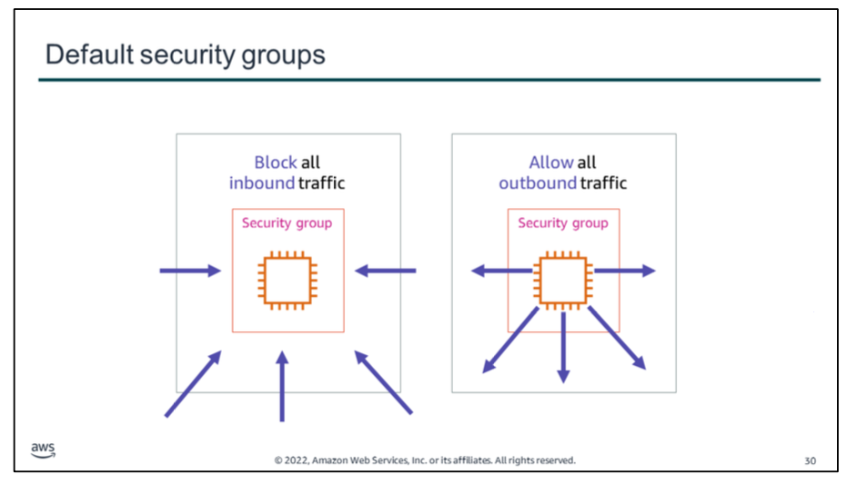
**Default Security groups**

*When you create a security group, it has no inbound rules*. This means that you *must add inbound rules to the security group to allow inbound traffic* that originates from another host to your instance. 
By default, a security group includes an outbound rule that *allows all outbound traffic*. 

You ***can remove the rule and add outbound rules that allow specific outbound traffic only***. *If your security group has no outbound rules, no outbound traffic that originates from your instance is allowed*.

(originate: bắt đầu, hình thành; )

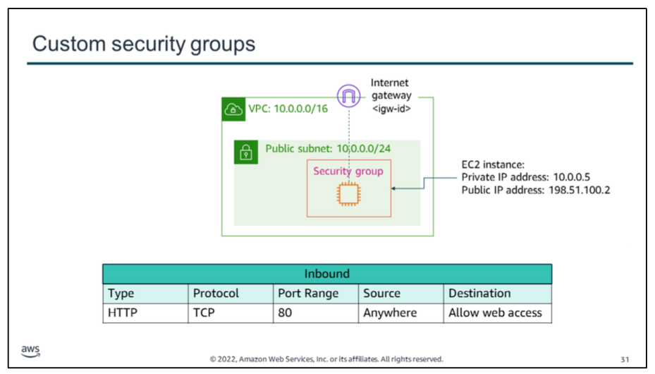
**Custom security groups**

When you create a custom security group, **you can specify *allow* rules, but not *deny* rules**. 

For example, when you *create a public subnet for the instances that host your web application*, the last step is to *create a security group that allows HTTP traffic to those instances*.

All rules are evaluated before the decision to allow traffic is made.

(evaluate: ước lượng, đánh giá; )

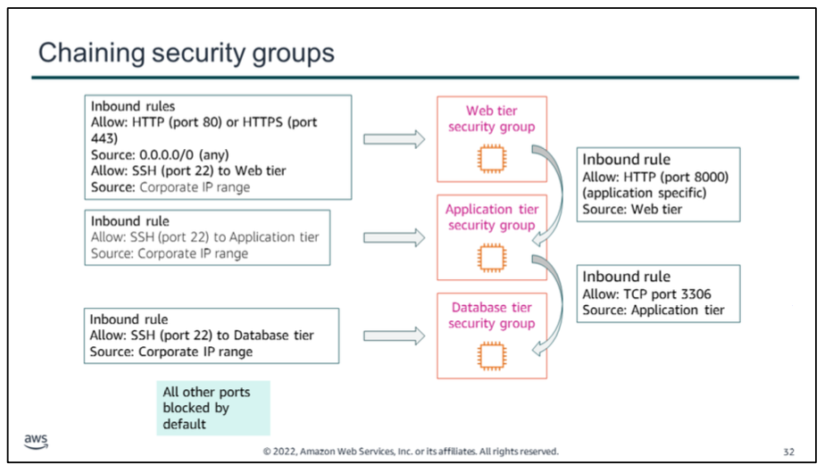
**Chaining security groups**

*Most cloud organizations create security groups with inbound rules for each functional tier*. This example shows *a chain of security groups in a typical three-tier application*. 
**The inbound and outbound rules are set up so that traffic can only flow from the top tier to the bottom tier, and back up again**. 
The security groups act as firewalls to prevent a security breach in one tier from automatically providing subnet-wide access of all resources to the compromised client.

(Chain: chuỗi; functional: chức năng; tier: tầng, lớp; prevent: ngăn ngừa; breach:  vi phạm; provide: cung cấp; compromise: dàn xếp, làm tổn thương/tổn hại; )

Security groups **can be configured to set different rules for different classes of instances**. Consider this example of a traditional three-tier architecture for a web application. 
- The group for the web servers would have port 80 (HTTP) or port 443 (HTTPS) open to the internet. 
- The group for the application servers would have port 8000 (application-specific) accessible only to the web server group. 
- The group for the database servers would have port 3306 (MySQL) open only to the application server group. 
All three groups would permit administrative access on port 22 (SSH), but only from the customer’s corporate network. 

This mechanism enables the deployment of highly secure applications.

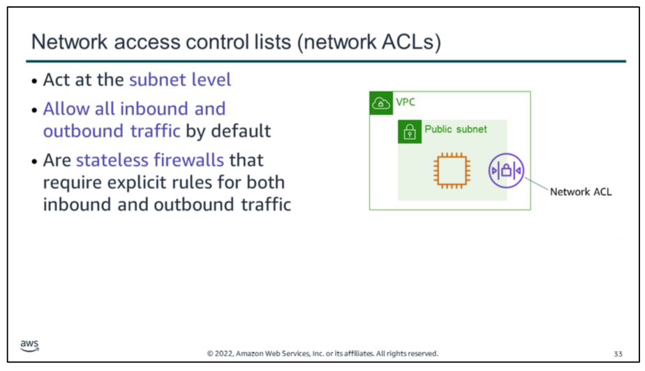
**Network access control lists (Network ACLs, NACLs)**

A *network access control list (network ACL)* is an optional layer of security for your VPC. It acts as a firewall for controlling traffic in and out of one or more subnets --> *act at the subnet level*. 
To add another layer of security to your VPC, you can set up network ACLs with rules that are similar to your security groups.

Each subnet in your VPC must be associated with a network ACL. If you don't explicitly associate a subnet with a network ACL, the subnet is automatically associated with the default network ACL. You can associate a network ACL with multiple subnets. 
However, a subnet can be associated with only one network ACL at a time. 
When you associate a network ACL with a subnet, the previous association is removed.

A network ACL *has separate inbound and outbound rules, and each rule can either allow or deny traffic*. 
Your VPC automatically comes with a modifiable default network ACL. 
**By default, NACLs allows all inbound and outbound IPv4 traffic and, if applicable, IPv6 traffic**.

Network ACLs are `stateless`, which means that no information about a request is maintained after a request is processed. Return traffic must be explicitly allowed by rules.

(explicitly: rõ ràng, dứt khoát; separate: riêng rẽ, phân tách; )

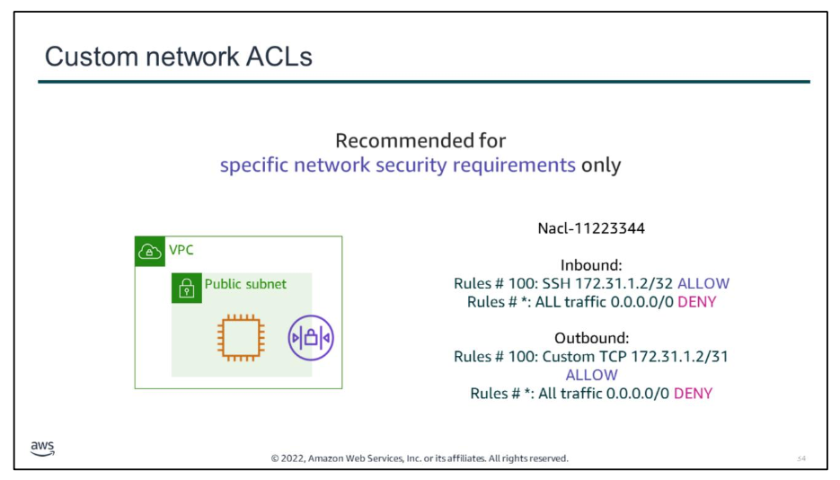
**Custom network ACLs** --> recommended for *specific network security requirements* only

You can create a *custom* network ACL and associate it with a subnet. 
**By default, each *custom network ACL* denies all inbound and outbound traffic until you add rules**.

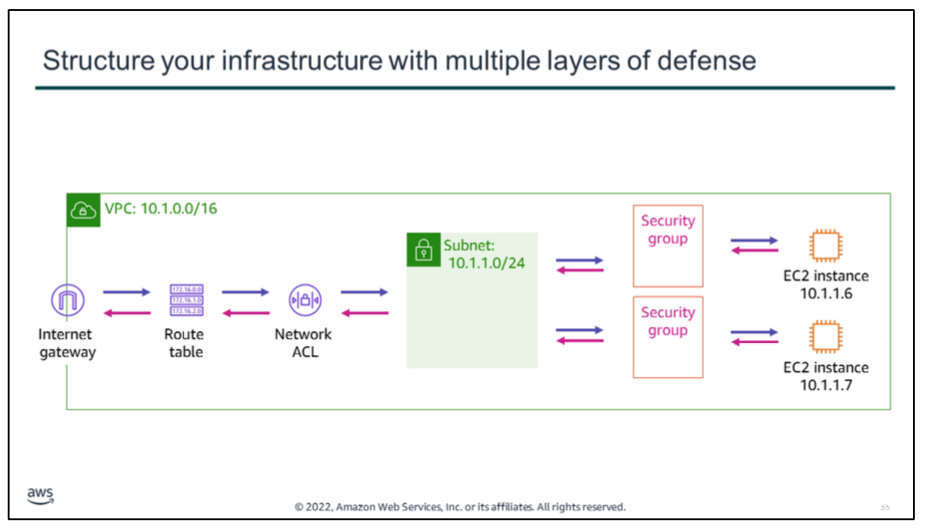
**Structure your infrastructure with multiple layers of defense**

(defense: phòng thủ, chống đỡ; expose: trình bày, bộc lộ; respectively: tương ứng, từng cái ; implement: triển khai; )

As a best practice, you should secure your infrastructure with multiple layers of defense. 
By running your infrastructure in a VPC, you can control which instances are exposed to the internet. 
You can define both security groups and network ACLs to further protect your infrastructure at the infrastructure and subnet levels, respectively. 
Additionally, you should secure your instances with a firewall at the operating system level, and follow other security best practices.

When you implement both network ACLs and security groups as a defense-in-depth way of controlling traffic, a mistake in the configuration of one of these controls will not expose the host to unwanted traffic.

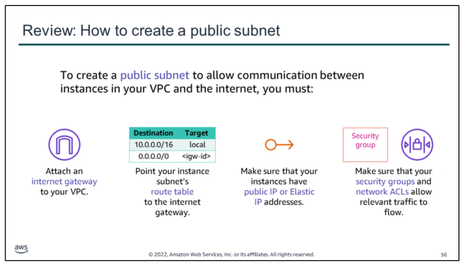
**Review: How to create a public subnet**

To review, to create a public subnet to allow communication between instances in your VPC and the internet, you must:
-   Attach an *internet gateway* to your VPC
-   Add a route to your subnet’s *route table* that directs internet-bound traffic to the internet gateway
-   Make sure that your instances have *public IP or Elastic IP* addresses
-   Make sure that your *security groups* and *network ACLs* allow relevant traffic to flow

# Quiz

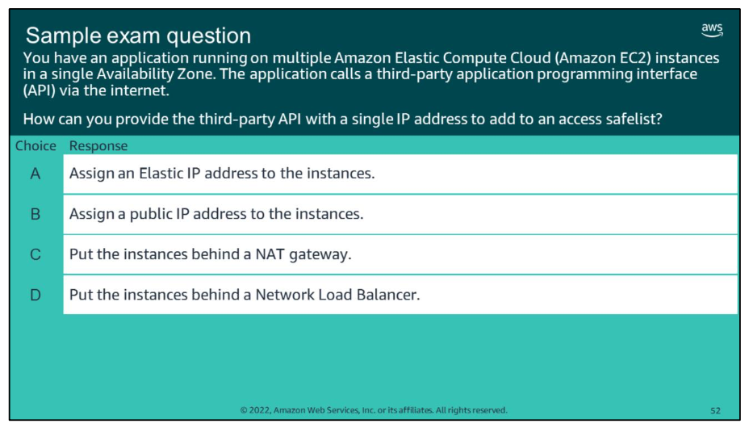

The following are the keywords to recognize: “single IP address”.

The correct answer is C: “Put the instances behind a NAT gateway.” 

Choices A and B can be eliminated because the application will end up having multiple public IP addresses, whereas a single IP address for safelisting is required. 
Choice D can also be eliminated because a Network Load Balancer will also have more than one IP address. 

Choice C is correct because a NAT gateway is accessible via a single IP address.

(eliminate: loại ra; safelist: danh sách an toàn; )
# links

If you want to learn more about the topics covered in this module, you might find the following additional resources helpful:

-   VPCs and Subnets
    [How Amazon VPC works - Amazon Virtual Private Cloud](https://docs.aws.amazon.com/vpc/latest/userguide/how-it-works.html) 
-   One to Many: Evolving VPC Design [One to Many: Evolving VPC Design | AWS Architecture Blog (amazon.com)](https://aws.amazon.com/blogs/architecture/one-to-many-evolving-vpc-design/) 
    
-   AWS Single VPC Design
    [Amazon Virtual Private Cloud Connectivity Options (awsstatic.com)](https://d1.awsstatic.com/whitepapers/aws-amazon-vpc-connectivity-options.pdf) 
-   AWS re:Invent 2018: Your Virtual Data Center: VPC Fundamentals and Connectivity Options
     [AWS re:Invent 2018: Your Virtual Data Center: VPC Fundamentals and Connectivity Options (NET201) - YouTube](https://www.youtube.com/watch?v=jZAvKgqlrjY&ab_channel=AmazonWebServices) 
-   AWS Networking Fundamentals [AWS Networking Fundamentals - YouTube](https://www.youtube.com/watch?v=hiKPPy584Mg&ab_channel=AmazonWebServices) 