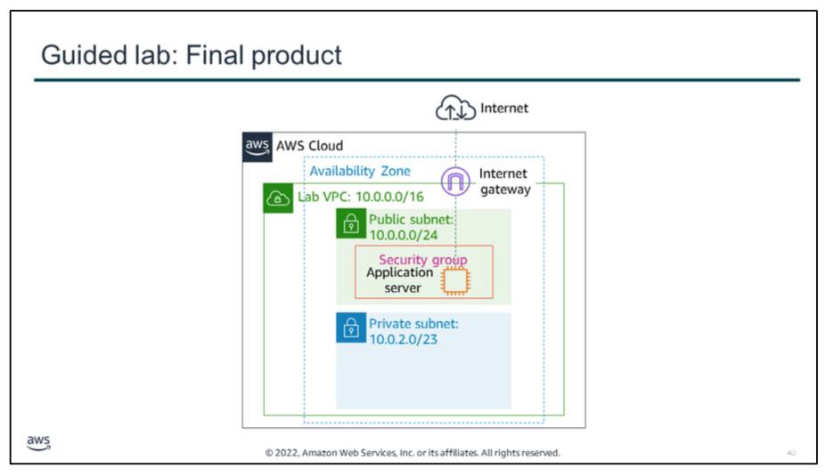
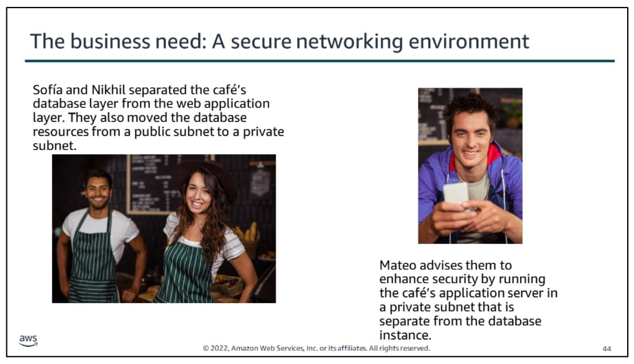
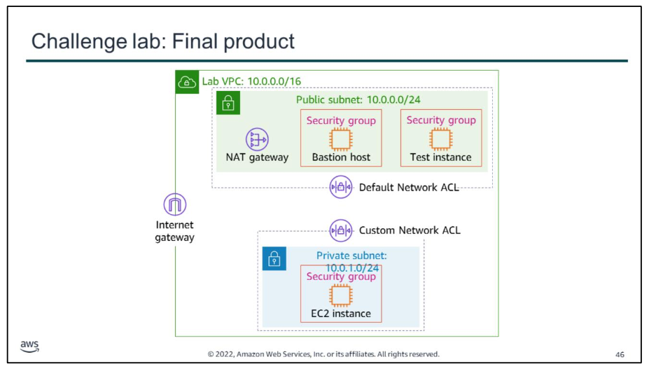

**Cafe business requirement** The cafe must be deploy and manage AWS resources in a secure, isolated network enviroment.

The café’s business has been steadily increasing. Sofía and Nikhil have become friends with a few of the café regulars, who are AWS consultants, and they have started to discuss the café’s current architecture. Olivia, one of the regulars and an AWS Solutions Architect, identified a need for the café’s online business to scale. Scaling will require additional servers to run the online ordering application, but the current subnet size is too small and can’t support this growth. Therefore, they will need to rearchitect some aspects of the network that the application runs in.

On further review of the café’s architecture, Olivia also noticed a vulnerability: the TCP port that’s used to administer the application server is accessible to the internet. Sofía explained that she and Nikhil must be able to manage and maintain the server. Olivia advises them to set up a bastion host to reduce public access to the server, and to make it more secure.

# Guided lab

Guided lab: Tasks:
Use Amazon VPC to manually create a VPC with the following components:
-   Public and private subnets
-   An internet gateway
-   A route table with a route to direct internet-bound traffic to the internet gateway
-   A security group for EC2 instances in the public subnet
-   An application server to test the VPC

The diagram summarizes what you will have built after you complete the lab.

# Challenge lab

Sofía and Nikhil have successfully created a two-tier architecture, in which they separated the café’s database layer from the web application layer. They also moved their database resources from a public subnet to a private subnet.

Mateo advises them to enhance the security of their VPC by running the café’s application server in a private subnet that is separate from the database instance.

Challenge lab, you will complete the following tasks:
1.  Creating a public subnet
2.  Creating a bastion host
3.  Allocating an Elastic IP address for the bastion host
4.  Testing the connection to the bastion host
5.  Creating a private subnet
6.  Creating a NAT gateway
7.  Creating an EC2 instance in a private subnet
8.  Configuring your SSH client for SSH passthrough
9.  Testing the SSH connection from the bastion host
10. Creating a network ACL
11. Testing your custom network ACL

The diagram summarizes what you will have built after you complete the lab.

x