# overview

This module includes the following sections:
1.  Architectural need
2.  Connecting to your remote network with AWS Site-to-Site VPN
3.  Connecting to your remote network with AWS Direct Connect
4.  Connecting VPCs in AWS with VPC peering
5.  Scaling your VPC network with AWS Transit Gateway
6.  Connecting your VPC to supported AWS services

This module also includes:
-   An activity in which you discuss how you would use `AWS Transit Gateway` to connect three virtual private clouds (VPCs)
-   A guided lab where you will create a VPC peering connection

# Module objectives
At the end of this module, you should be able to:
-   Describe how to connect an on-premises network to the Amazon Web Services (AWS) Cloud
-   Describe how to connect VPCs in the AWS Cloud
-   Connect VPCs in the AWS Cloud by using VPC peering
-   Describe how to scale VPCs in the AWS Cloud
-   Describe how to connect VPCs to supported AWS services

# 1. Architectural need

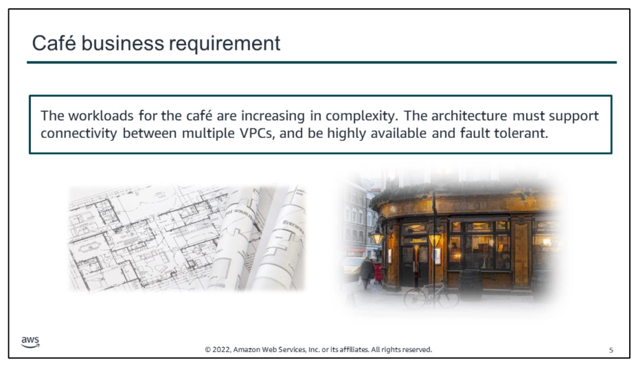
The café has started a loyalty rewards program, where a customer gets a free beverage or dessert after they purchase 10 or more similar items. When customers order online, they must provide some personally identifiable information (PII), such as an email address and credit card number. The café can’t store this information in the cloud because of compliance reasons. Thus, Sofía and Nikhil need a way to connect their on-premises database (which stores sensitive customer information) to their cloud system (which stores transactions data). They must then map the data between the two systems to offer the rewards that their customers have earned.

Additionally, for security purposes, Sofía tells Olivia that she wants to isolate the development environment in one VPC and the production environment in another VPC, but still have connectivity between the two. Olivia agrees that this is a good idea, and advises Sofía to design the networking environment so that it’s highly available and fault-tolerant.

# 2. Connecting to your remote network with AWS Site-to-Site VPN

key takeaways:
-   `AWS Site-to-Site VPN` is a *highly available* solution that enables you to securely *connect your on-premises network or branch office site to your VPC*
-   AWS Site-to-Site VPN supports both *static and dynamic routing*
-   You can *establish multiple VPN connections* from multiple customer gateway devices to a single virtual private gateway

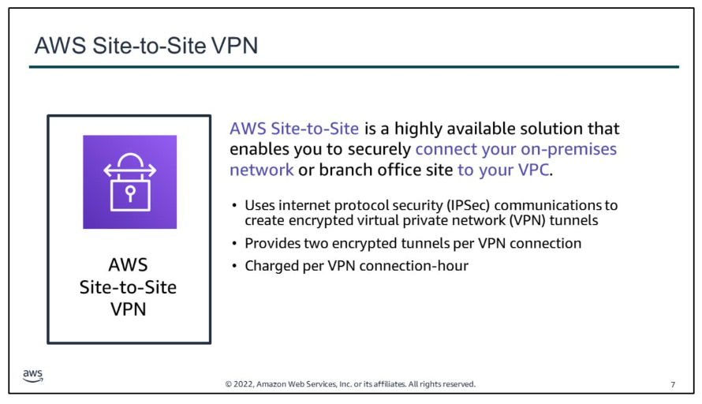
**AWS Site-to-Site Virtual Private Network (AWS Site-to-Site VPN)**

By default, *instances that you launch into a virtual private cloud (VPC) on AWS cannot communicate with your on-premises network*.

You can use `AWS Site-to-Site Virtual Private Network (AWS Site-to-Site VPN)` to *securely* *connect your on-premises network or branch office site to your VPC*. 
- Each AWS Site-to-Site VPN connection *uses internet protocol security (IPSec) communications to create encrypted VPN tunnels* between two locations. 
- A VPN tunnel is an encrypted link where data can pass from the customer network to or from AWS. The AWS side of the connection is the `virtual private gateway`. (Note that instead of a virtual private gateway, you can also create a Site-to-Site VPN connection as an attachment on a `transit gateway`. You will learn more about `AWS Transit Gateway` later in this module.) 
   The on-premises side of the connection is the `customer gateway`.

(tunnel: đường hầm; encrypted link: liên kết được mã hóa;  simultaneously: đồng thời; stream: dòng/luồng, tuôn ra; redundancy: dư thừa, dự phòng; provision: dự phòng, cung cấp)

AWS Site-to-Site VPN *provides two VPN tunnels across multiple Availability Zones* that you can use simultaneously for high availability. You can stream primary traffic through the first tunnel and use the second tunnel for redundancy. 
If one tunnel goes down, traffic will still get delivered to your VPC.

If you create a Site-to-Site VPN connection to your VPC, you are *charged for each VPN connection- hour* that your VPN connection is provisioned and available. 

For more information about pricing, see AWS Site-to-Site VPN and Accelerated Site-to-Site VPN Connection Pricing.
[AWS VPN | Pricing | Amazon Web Services (AWS)](https://aws.amazon.com/vpn/pricing/)

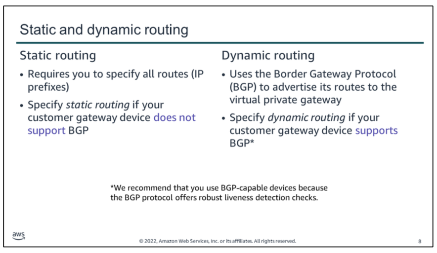
**Static and dynamic routing**

When you create a Site-to-Site VPN connection, you *must specify the **type of routing** that you plan to use and you must update the route table for your subnet*.

AWS Site-to-Site VPN supports **two types of routing**. 
The type of routing that you select depends on:
- the make 
- and model of your VPN devices.

**Dynamic routing**:
	- If your VPN device *supports Border Gateway Protocol (BGP)*, specify dynamic routing when you configure your Site-to-Site VPN connection.
	- *Uses the BGP to advertise routes to the virtual private gateway*. 
	  Dynamic routing supports a maximum of *100 propagated routes* per route table. (For current limits, see AWS Site-to-Site VPN limits.)
	  
**Static routing**
	- *If your VPN device does not support BGP*, specify static routing. 
	- *requires that you specify the routes (that is, IP prefixes)* for your network that should be communicated to the virtual private gateway. 
	  Static routing supports *50 non-propagated routes per route table by default, up to a maximum of 1,000 non-propagated routes*. (For current limits, see AWS Site-to- Site VPN limits.)

(propagate: lan truyền; robust: làm mạnh, cường tráng; liveness: sống, hoạt động; detection: sự khám phá, phát hiện; assist: giúp đỡ; failover: chuyển đổi dự phòng; )

  We recommend that you **use BGP-capable devices because the BGP protocol offers robust liveness detection checks** that can assist failover to the second VPN tunnel if the first tunnel goes down. 
  Devices that don't support BGP may also perform health checks to assist failover to the second tunnel when needed.
  
 For a list of static and dynamic routing devices that have been tested with Amazon VPC, see Customer Gateway Devices We’ve Tested in the AWS Site-to-Site VPN Network Administrator Guide. [Your customer gateway device - AWS Site-to-Site VPN (amazon.com)](https://docs.aws.amazon.com/vpn/latest/s2svpn/your-cgw.html) 

For more information about site-to-site VPN routing options, see Static and Dynamic Routing Options. [Site-to-Site VPN routing options - AWS Site-to-Site VPN (amazon.com)](https://docs.aws.amazon.com/vpn/latest/s2svpn/VPNRoutingTypes.html) 
   
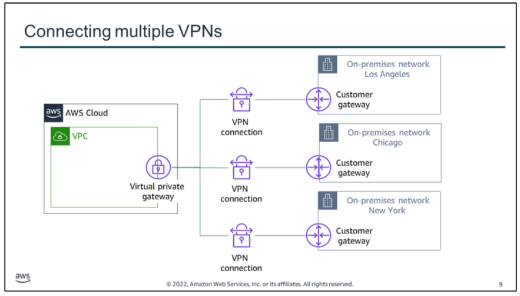
**Connecting multiple VPNs**

To maintain high availability of your customer gateway, you can set up redundant customer gateway devices.

If you have redundant customer gateway devices, each device advertises the same prefix (for example, 0.0.0.0/0) to the virtual private gateway. AWS uses BGP routing to determine the path for traffic. 
If one customer gateway device fails, the virtual private gateway directs all traffic to the working customer gateway device.

(redundant: dự phòng; advertise: thông báo, báo cho biết; prefix: tiền tố;  determine: xác định; establish: thiết lập; implement: thực hiện;  failover: chuyển đổi dự phòng; route: định tuyến; appropriate: phù hợp; reachability: khả năng tiếp cận;  )

*You can establish multiple VPN connections from multiple customer gateway devices to a single virtual private gateway using `AWS VPN CloudHub`*. This configuration can be used in different ways to implement redundancy and failover on your side of the VPN connection. [Providing secure communication between sites using VPN CloudHub - AWS Site-to-Site VPN (amazon.com)](https://docs.aws.amazon.com/vpn/latest/s2svpn/VPN_CloudHub.html) 

`AWS VPN CloudHub` operates on *a hub-and-spoke model* to **enable multiple sites to access your VPC or to securely access each other**. 
You can use it with or without a VPC. You configure each customer gateway device to advertise a site-specific prefix (such as 10.0.0.0/24, 10.0.1.0/24) to the `virtual private gateway`. 
The virtual private gateway routes traffic to the appropriate site and advertises the reachability of one site to all the other sites.
---> Hub-and-spoke (Spoke–hub distribution paradigm, H&S):  được tạm dịch là mô hình "trục bánh xe-và-nan hoa". Mô hình này được áp dụng trong ngành vận chuyển, nhất là hàng không >< Point-to-point

For more information about using AWS Site-to-Site VPN, see the following resources:

-   Site-to-Site VPN single and multiple connection examples  [Site-to-Site VPN single and multiple connection examples - AWS Site-to-Site VPN (amazon.com)](https://docs.aws.amazon.com/vpn/latest/s2svpn/Examples.html) 
-   Using redundant Site-to-Site VPN connections to provide failover [Using redundant Site-to-Site VPN connections to provide failover - AWS Site-to-Site VPN (amazon.com)](https://docs.aws.amazon.com/vpn/latest/s2svpn/vpn-redundant-connection.html) 

# 3. Connecting to your remote network with AWS Direct Connect

key takeaways:
-   `AWS Direct Connect` uses open standard 802.1q VLANs to let you establish a *dedicated, private network connection from your premises to AWS*
-   You can access any VPC or public AWS service in any Region (except China) from any supported *DX location*
-   You can *implement highly available connectivity between your data centers and your VPC* by coupling one or more DX connections that you use for primary connectivity with a lower-cost, backup VPN connection
-   To implement a *highly resilient, fault-tolerant architecture*, connect to your AWS network from multiple data centers so you can have physical location redundancy

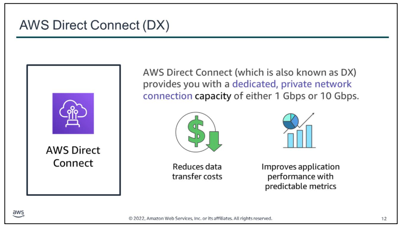
**AWS Direct Connect (DX)**

As you learned, *AWS Site-to-Site VPN* is one option for connecting your on-premises network to the AWS global network. With this option, your data is *transferred through encrypted tunnels* over the public internet.

AWS Direct Connect (or DX) is another solution that goes beyond simple connectivity over the internet. DX uses open standard 802.1q *virtual local area networks (VLANs) so you can establish a **dedicated, private network connection** from your premises to AWS*. This private connection can *reduce network costs, increase bandwidth throughput, and provide a more consistent network* experience than internet-based connections.  

Dedicated connections are available with *1-Gbps and 10-Gbps capacity*.

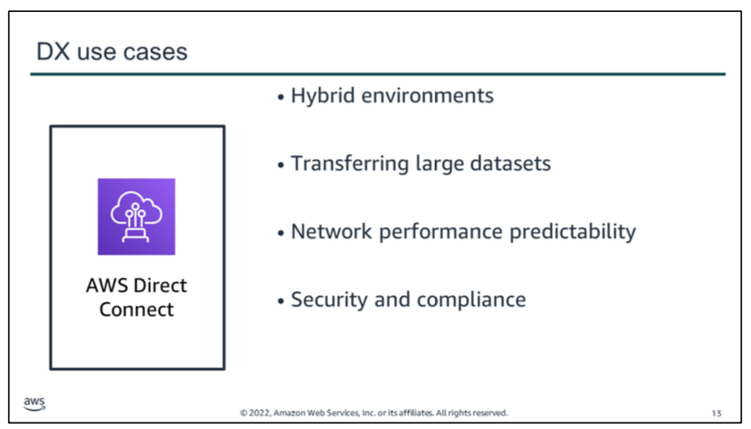
**AWS Direct Connect (DX) use cases**
DX is useful for several scenarios, for example:
-   **Hybrid environments** – For applications that require access to existing data center equipment, such as an on-premises database, DX enables you to create a hybrid environment that allows you to take advantage of the elasticity and economic benefits of AWS.
-   **Transferring large datasets** – For applications that operate on large datasets, such as high performance computing (HPC) applications, transferring large datasets over the internet between your data center and the AWS Cloud can be time consuming and expensive. For such applications, connecting to the AWS Cloud using DX is a good solution because:
    -   Network transfers will not compete for internet bandwidth at your data center.
    -   The high-bandwidth link reduces the potential for network congestion and degraded application performance.
    -   By limiting the internet bandwidth used by your application, you can reduce network fees that you pay to your internet service provider (ISP) and avoid having to pay for increased internet bandwidth commitments or new contracts. In addition, all data that is transferred over DX is charged at the reduced DX data transfer rate instead of internet data transfer rates, which can reduce your network costs.
-   **Improved application performance** – Applications that require predictable network performance can also benefit from DX. 
  Examples include applications that operate on real-time data feeds, such as audio or video streams. In such cases, a dedicated network connection can provide more consistent network performance than standard internet connectivity.
-   **Security and compliance** – Enterprise security or regulatory policies sometimes require that applications hosted on the AWS Cloud can be accessed through private network circuits only. 
  DX is a natural solution to this requirement because traffic between your data center and your application flows through the dedicated private network connection.

(elasticity: độ đàn hồi, sự mềm dẻo, tính linh hoạt; high performance computing (HPC): điện toán hiệu năng cao; congestion: tắc nghẽn; degrade: giảm sút; predictable: có thể dự đoán; regulatory: quy định; circuit: mạch; )

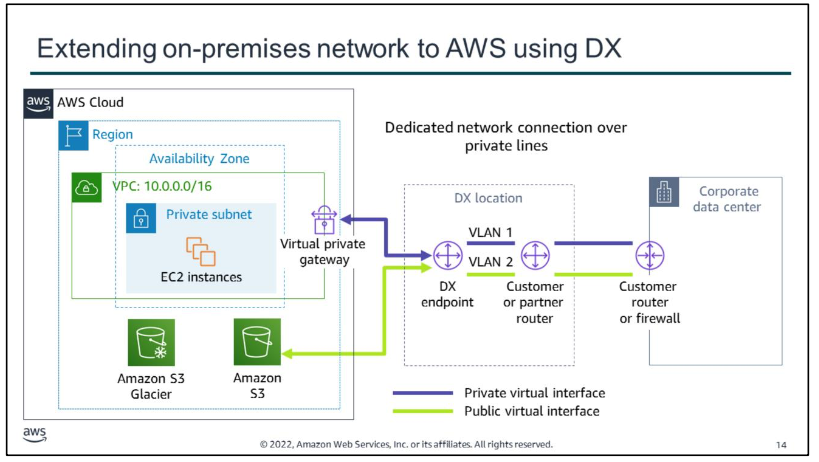
**Extending on-premises network to AWS using DX**

DX links your internal network to a DX location over a standard Ethernet fiber-optic cable. One end of the cable is connected to your router. The other end is connected to a DX router. 

With this connection, you can create *virtual interfaces* that enable direct access to AWS services. 
- A public virtual interface enables access to public AWS services, such as Amazon Simple Storage Service (Amazon S3). 
- A private virtual interface enables access to your VPC.

You can access any VPC or public AWS service in any Region (except China) from any supported DX location. 
If you do not have equipment at a DX location, you can access DX with the assistance of a DX AWS Partner Network (APN) Partner. [AWS Direct Connect | Partners | Amazon Web Services (AWS)](https://aws.amazon.com/directconnect/partners/?partner-solutions-cards.sort-by=item.additionalFields.partnerNameLower&partner-solutions-cards.sort-order=asc&awsf.partner-solutions-filter-location=*all) 

For information about DX, see What is AWS Direct Connect? [What is AWS Direct Connect? - AWS Direct Connect (amazon.com)](https://docs.aws.amazon.com/directconnect/latest/UserGuide/Welcome.html) 

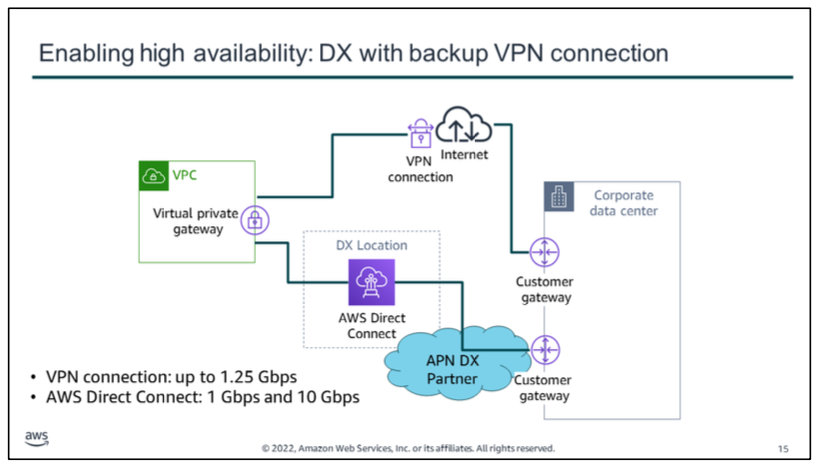
**Enabling high availability: DX with backup VPN connection**
You can implement highly available connectivity between your data centers and your VPC by:
- coupling one or more DX connections that you use for primary connectivity 
- with a lower-cost backup VPN connection.

(implement: triển khai; coupling: khớp nối; consist: bao gồm; propagation: lan truyền; appropriate: thích hợp, dành riêng; align: căn chỉnh, phù hợp;  tolerance: cho phép, sự tha thứ; )

In this example, the configuration consists of two dynamically routed connections
- one that uses DX 
- and another that uses a VPN connection
from two different customer devices. AWS provides example router configurations to help you establish both DX and dynamically routed VPN connections. 
**By default, AWS will always prefer to send traffic over your DX connection**, so you do not need additional configuration specific to AWS to define primary and backup connections. 
However, you should configure DX and VPN-specific internal-route propagation to ensure that internal systems select the appropriate paths.

This approach enables you to choose the primary network path and network provider for your AWS traffic, with the option of using a different provider for a backup VPN connection. Choose network providers and DX locations that align with your organization’s risk tolerance, financial expectations, and data center connectivity policies.

Finally, you *can use multiple DX circuits and multiple VPN tunnels between separately deployed private IP address spaces*. 
**You can also use multiple DX locations for high availability**. 
If you use multiple AWS Regions, you will also need multiple DX locations in at least two Regions. 
You might want to evaluate AWS Marketplace appliances that terminate VPNs.

**Enabling high resilency for critical workloads with DX**
***Highly resilient, fault-tolerant network connections are key to a well-architected system***. AWS recommends connecting from multiple data centers for physical location redundancy. 
When you design remote connections, consider using redundant hardware and telecommunications providers.

(resilient: có sức bật, khả năng phục hồi nhanh; fault-tolerant: chịu lỗi (fault lỗi, tolerant tha thứ, chịu được); redundancy: dư thừa, dự phòng; failover: chuyển đổi dự phòng; provision: sự dự phòng, cung cấp ; sufficient: đủ, hợp lý ; overwhelm: tràn, làm ngập; degrade: làm suy giảm; critical: nguy cấp; topology: cấu trúc liên kết (?); )

Additionally, it is a *best practice to use dynamically routed, active/active connections for automatic load balancing and failover across redundant network connections*. Provision sufficient network capacity to ensure that the failure of one network connection does not overwhelm and degrade redundant connections.

*For critical production workloads that require high resiliency, AWS recommends that you have one connection at multiple locations*. As shown in the architecture diagram, such a topology ensures resilience against connectivity failures due to a hardware failure or a complete location failure. 
You can use Direct Connect Gateway to access any AWS Region (except AWS Regions in China) from any DX location. [Working with Direct Connect gateways - AWS Direct Connect (amazon.com)](https://docs.aws.amazon.com/directconnect/latest/UserGuide/direct-connect-gateways.html) 

To learn more about additional topology guidelines to keep in mind when you connect to AWS, see AWS Direct Connect Resiliency Recommendations. [AWS Direct Connect | Create resilient hybrid networks | AWS (amazon.com)](https://aws.amazon.com/directconnect/resiliency-recommendation/) 

# 4. Connecting VPCs in AWS with VPC peering

key takeaways:
-   `VPC peering` is a *one-to-one networking connection between two VPCs* that enables you to route traffic between them privately
-   You can establish peering relationships between VPCs *across different AWS Regions*
-   VPC peering connections –
    -   Use private IP addresses
    -   Can be established between different AWS accounts
    -   Cannot have overlapping CIDR blocks
    -   Can have only one peering resource between any two VPCs
    -   Do not support transitive peering relationships
    
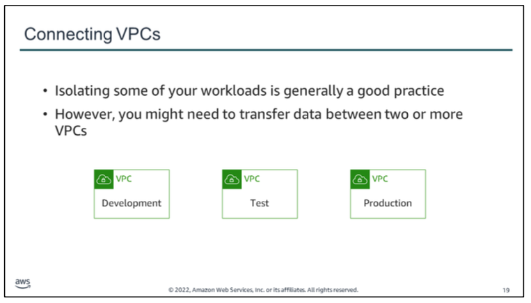
**Connecting VPCs**
*Isolating your workloads in individual VPCs is generally a good practice*.
For example, when your business or architecture becomes large enough, you might need to separate logical elements for security, for architectural purposes, or for simplicity. 
However, it can be highly *desirable to have connectivity between your VPCs* for situations when you need to transfer data between them.

(isolate: cô lập; separate: tách ra; desirable: mong muốn; )

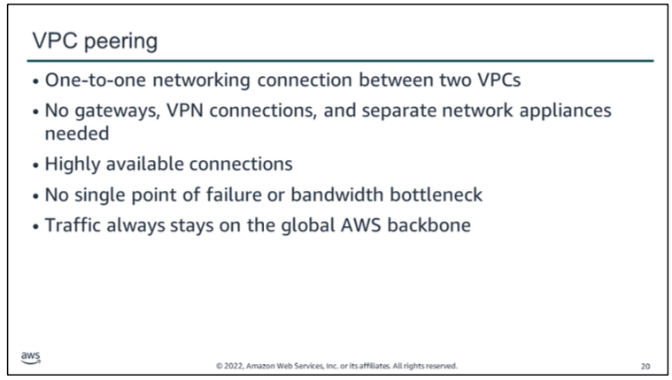
**VPC peering**
VPC peering is a *one-to-one networking connection between two VPCs* that enables you to *route traffic between them privately*. 
Instances in either VPC can communicate with each other like they are in the same network. You can create a VPC peering connection between your own VPCs, with a VPC in another AWS account, or with a VPC in a different AWS Region. 

You can establish peering relationships between VPCs across different AWS Regions. Inter-Region VPC peering provides a simple and cost-effective way to share resources between Regions or replicate data for geographic redundancy. 
Data that is transferred across inter-Region VPC peering connections is charged at the standard inter-Region data transfer rates.  --> *Highly available connections*

Inter-Region VPC peering enables VPC resources to communicate with each other using private IP addresses *without requiring gateways, VPN connections, or separate network appliances*.  
Some examples of VPC resources include Amazon Elastic Compute Cloud (Amazon EC2) instances, Amazon Relational Database Service (Amazon RDS) databases, and AWS Lambda functions that run in different Regions.

Traffic remains in the private IP address space. *All inter-Region traffic is encrypted with no single point of failure or bandwidth bottleneck*. *Traffic always stays on the global AWS backbone*. **Traffic never traverses the public internet**, which reduces threats, such as common exploits and distributed denial of service (DDoS) attacks.

(bottleneck: thắt cổ chai, tắc nghẽn; traverse: đi ngang qua; exploit: khai thác; )

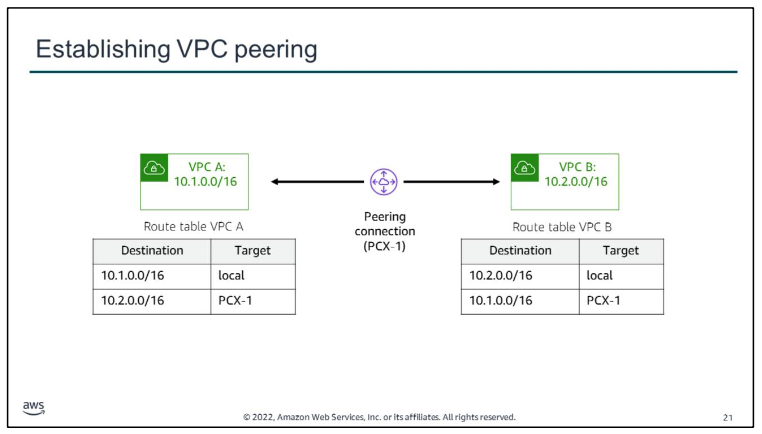
**Establishing VPC peering**
To establish a VPC peering connection, the owner of the requester VPC (or local VPC) sends a request to the owner of the VPC peer. To activate the connection, the owner of the VPC peer must accept the VPC peering connection request.

To enable the flow of the traffic between the VPC peers by using private IP addresses, *you must add a route to one or more of your VPC’s route tables*. This route must point to the IP address range of the VPC peer. The owner of the VPC peer adds a route to one of their VPC’s route tables that points to the IP address range of your VPC.

You might also need to update the security group rules that are associated with your instance so that traffic to and from the peer VPC is not restricted.

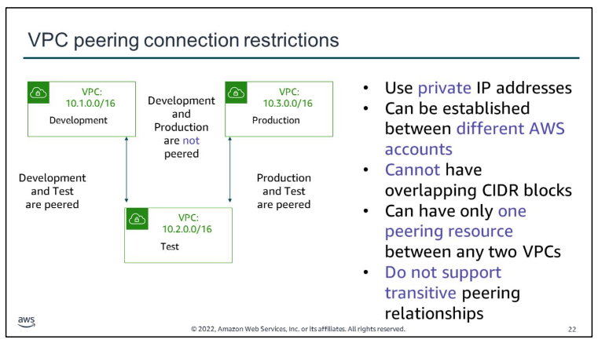
**VPC peering connection restrictions**

There are some restrictions you should be aware of when you establish VPC peering connections:
- use *private IP* addresses.
-  can be established between *different AWS accounts*. 
- The CIDR block of the VPC peer *cannot overlap with the CIDR block* of the requester.
-   You can have *only one peering resource* between any two VPCs.
-   Transitive peering is not supported. 
  For example, in the diagram, the Development and Test VPCs are peered, and the Production and Test VPCs are peered. However, this does not mean that the Production VPC is connected to the Development VPC. 
  By default, VPC peering does not allow the Production VPC to connect to the Development VPC unless they are explicitly established as peers. *Therefore, you control which VPCs can communicate with each other*.

(Transitive: bắc cầu; )

To learn more about VPC peering connection restrictions, see VPC peering limitations [Amazon Virtual Private Cloud - VPC Peering](https://docs.aws.amazon.com/pdfs/vpc/latest/peering/vpc-pg.pdf) 
    
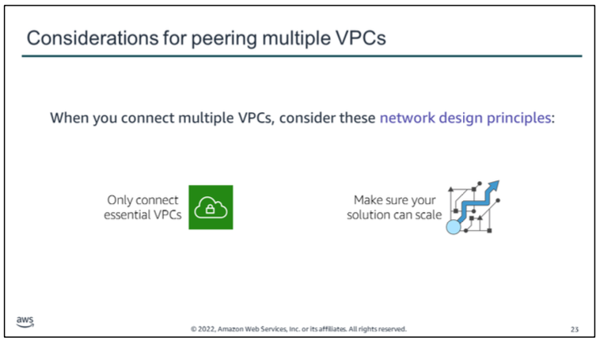
**Considerations for peering multiple VPCs **

When you connect multiple VPCs in a single AWS Region, consider these **network design principles**:
-   *Connect only those VPCs that truly must communicate with each other*
-   *Make sure that the solution you choose can scale* according to your current and future VPC connectivity needs

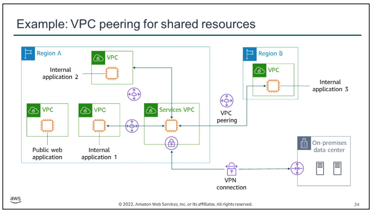
**Example: VPC peering for shared resources**

Here is an example of how you can use VPC peering for shared resources.

In this example, each department VPC in a company peers with a shared *Services VPC*. 
This VPC contains connections to Microsoft Active Directory, security scanning tools, monitoring and logging tools, and various other capabilities. 
It also provides a proxy through which the department VPCs can access some on-premises resources. 
VPC peering enables company applications that are in different VPCs to access the shared Services VPC but remain isolated from each other. 
In this example, also notice that a VPC peering connection was established between VPCs in different Regions.

# 5. Scaling your VPC network with AWS Transit Gateway
key takeaways:
-   `AWS Transit Gateway` enables you to connect your VPCs and on-premises networks to a *single gateway* (called a `transit gateway`)
-   AWS Transit Gateway uses a *hub-and-spoke model* to simplify VPC management and reduce operational costs

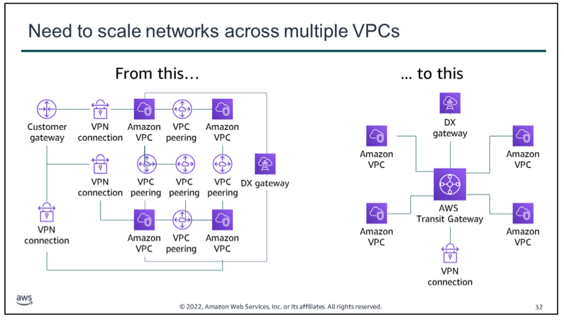
**Need to scale networks across multiple VPCs**
As you grow the number of workloads that run on AWS, you must be able to scale your networks across multiple accounts and VPCs to keep up with the growth. 
You can use `VPC peering` to connect pairs of VPCs. However, it can be operationally costly and difficult to manage point-to- point connectivity across many VPCs if you cannot centrally manage the connectivity policies. For on-premises connectivity, you must attach your VPN to each individual VPC. *This solution can be time-consuming to build and difficult to manage when the number of VPCs grows into the hundreds*.

It’s important to consider how large your environment might become over time, how well it will scale, and how you will organize your VPCs. ***To solve this problem, you can use `AWS Transit Gateway` to simplify your networking model***.

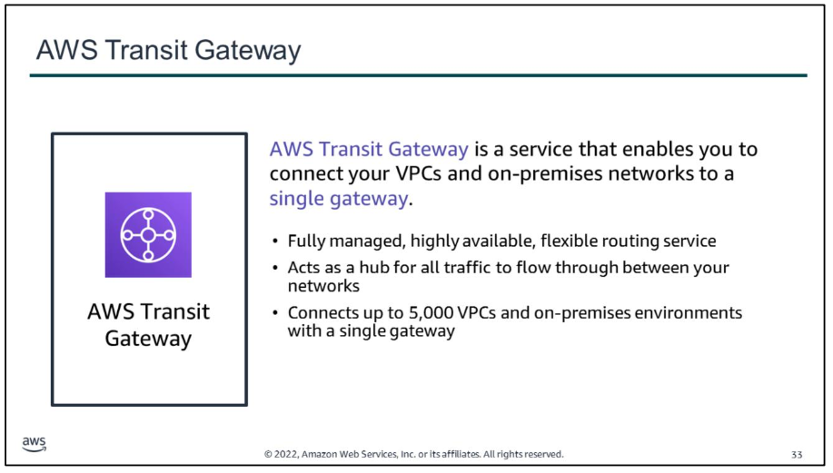
**AWS Transit Gateway**
AWS Transit Gateway is a service that *enables you to connect your VPCs and on-premises networks to a **single gateway** (called a `transit gateway`)*. 

With AWS Transit Gateway, you only need to create and manage a single connection from the central gateway into each VPC, on-premises data center, or remote office across your network.
- *Fully managed, highly available, flexible routing service*
- *Acts as a hub for all traffic to flow through between your networks*.

(hub-and-spoke model: mô hình trục và nan hoa)

*AWS Transit Gateway uses a hub-and-spoke model*. This model significantly simplifies management and reduces operational costs because each network only needs to connect to the transit gateway and not to every other network. 
Any new VPC is connected to the transit gateway, and is then automatically available to every other network that is connected to the transit gateway. 
This ease of connectivity makes it easier to scale your network as you grow.

You can use AWS Transit Gateway to *connect up to 5,000 VPCs and on-premises networks*.

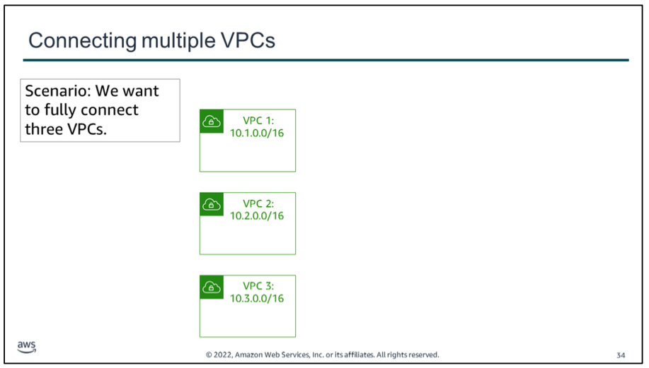
**Connecting multiple VPCs**
To understand how to connect multiple VPCs by using AWS Transit Gateway, consider this scenario. You want to fully connect three VPCs in your network. In this scenario, you learn how to deploy AWS Transit Gateway and three VPCs with non-overlapping IP address space in a single Region. You then attach the transit gateway to these VPCs.

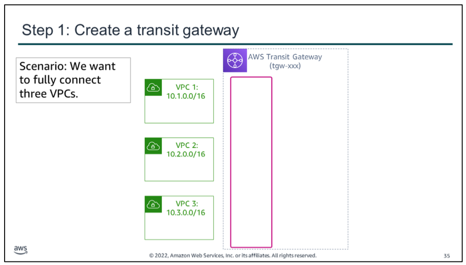
**Step 1: Create a transit gateway**

The first step for connecting multiple VPCs is to create a transit gateway. ***A transit gateway is a transit hub that you can use to interconnect your VPCs and on-premises networks***. It acts as *a Regional virtual router* for traffic that flows *between your VPCs and VPN connections*. **A transit gateway scales elastically based on the volume of network traffic**.

*You can set up a transit gateway through the Amazon VPC dashboard*. Various charges apply for using AWS Transit Gateway, so make sure that your architecture and budget can support using a transit gateway.

For more information, see What Is a Transit Gateway?  [What is a transit gateway? - Amazon VPC](https://docs.aws.amazon.com/vpc/latest/tgw/what-is-transit-gateway.html) 

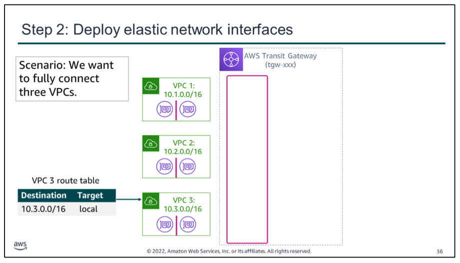
**Step 2: Deploy elastic network interfaces**

AWS Transit Gateway connects to a VPC though `elastic network interfaces` (or `ENIs`), which are **deployed into subnets**.

You must ensure that every Availability Zone that is part of the VPC *has an ENI that connects the VPC to the transit gateway*. You can do this *by selecting at least one subnet from each Availability Zone for the ENI*.

Notice in this example that the route table for VPC 3 has a single destination route that is local for VPC 3 using the 10.3.0.0/16 network.

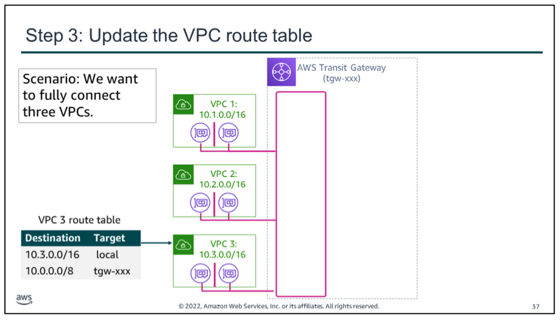
**Step 3: Update the VPC route table**
After attaching the ENIs, the next step is to *add a route in the VPC route table to send traffic that’s destined for the other VPCs in the network to the transit gateway*.

(destined: đã được định sẵn; )

In this example, the second line of the VPC 3 route table shows that *traffic destined for the 10.0.0.0/8 network is sent to the transit gateway*. 
This route enables any traffic from VPC 3 going to either VPC 1 or VPC 2 to be sent to the transit gateway, because the CIDR block 10.0.0.0/8 includes the 10.X.0.0/16 CIDR blocks, which are used by the individual VPCs.

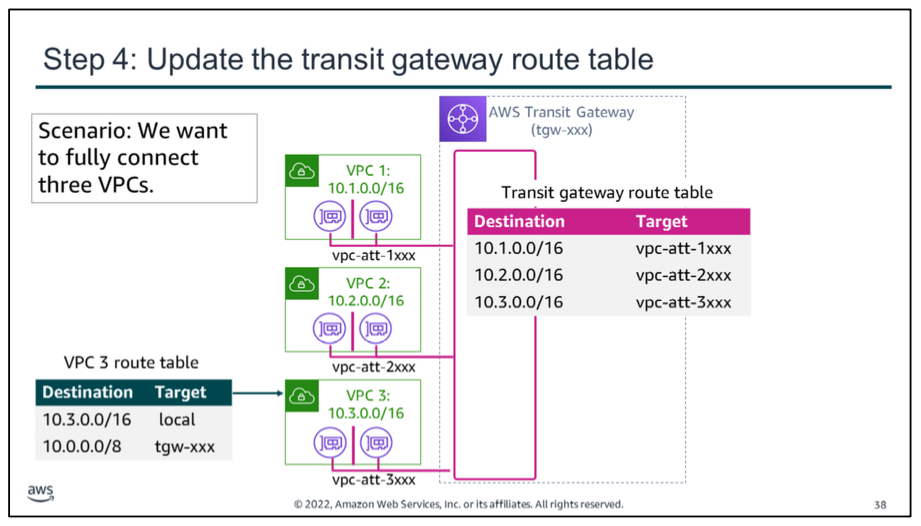
**Step 4:  Update the transit gateway route table**
Next, you *must configure the transit gateway route table to route traffic to the connected VPCs*.

When you create a transit gateway, a default transit gateway route table is created. 
*Each route in the transit gateway route table enables the transit gateway to send traffic destined for one of the VPCs to a corresponding attachment, which is a reference to the ENI that is attached to the VPC itself*.

(corresponding: tương ứng; reference: sự tham khảo; destined: đã được định sẵn)

In this example, there is a route in the transit gateway route table that sends any traffic destined for the 10.1.0.0/16 network to vpc-att-1xxx, which is the attachment for VPC 1.  --> tạm dịch: có một tuyến đường (route) trong bảng định tuyến (route table) của transit gateway gửi bất kỳ lưu lượng (traffic) đã được định sẵn cho network `10.1.0.0/16` đến  `vpc-att-1xxx` (là đính kèm của VPC1)
Similarly, any traffic destined for the other VPC networks are sent to the corresponding attachments.

For more information about how to create connected environments using AWS Transit Gateway, see Getting Started with Transit Gateways. [Getting started with transit gateways - Amazon VPC](https://docs.aws.amazon.com/vpc/latest/tgw/tgw-getting-started.html) 

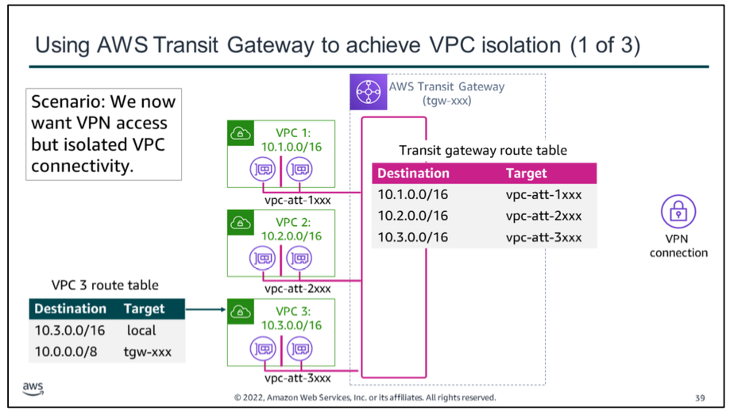
**Using AWS Transit Gateway to achieve VPC isolation (1 of 3)**

Though you can use AWS Transit Gateway to `connect` multiple VPCs, ***you can also use it to achieve `isolation` in your VPC environment***. 

In this scenario: 
- you want to connect your VPN source to your VPC environment. 
- You also want to prevent your VPCs from directly connecting to each other, leaving the VPN to decide if traffic from one VPC has to be forwarded to another.

*By setting up the route table appropriately for the transit gateway, you can prevent information sharing between the VPCs*.

(appropriately: thích hợp; )

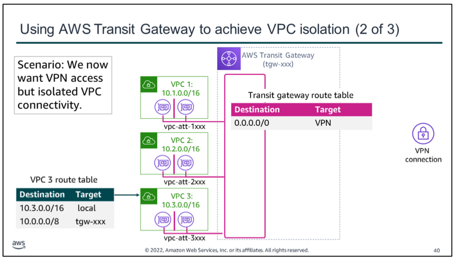
**Using AWS Transit Gateway to achieve VPC isolation (2 of 3)**
To implement this solution, *update the route in the transit gateway route table to send all known traffic to the VPN connection*.

In this example, when traffic for any of the VPCs in the 10.0.0.0/8 network is sent from VPC 3 to the transit gateway, *the transit gateway:
- *will forward the traffic to the VPN as shown on the slide*. 
- will not send the traffic to any of the other VPCs because there are no routes pointing to any of the VPC attachments.

You now have isolated and secured VPN access to your VPC environment with no cross communication between the VPCs.

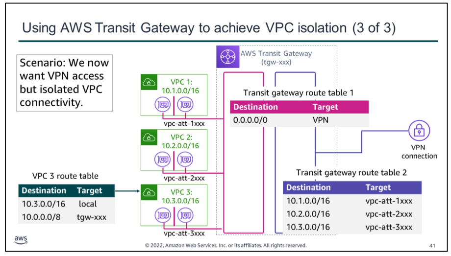
**Using AWS Transit Gateway to achieve VPC isolation (3 of 3)**
*You can **create multiple transit gateway route tables for specific interactions to direct traffic**, as you see fit*.

In this example, the second route table will direct inbound traffic from the VPN to one of the corresponding VPCs attached to the transit gateway.

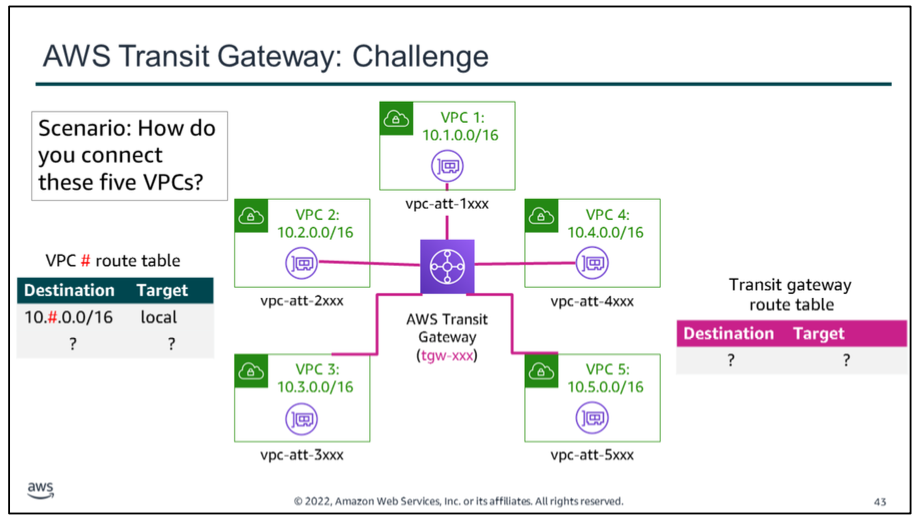
**AWS Transit Gateway: Challenge**
In this activity, you have five VPCs that you want connect to each other through AWS Transit Gateway.

Answer the following questions:
-   What routes are necessary to add to each of the VPC route tables to enable full connectivity?
-   What routes are **necessary to add to the transit gateway route table to enable full connectivity**?

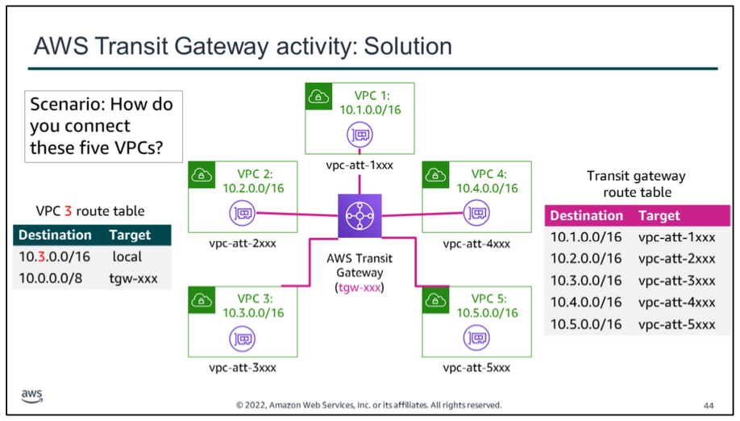
**AWS Transit Gateway activity: Solution**
What *routes must you add in each VPC route table* to **enable full connectivity**? 
- See the provided solution for the VPC 3 route table. You update the other VPC route tables in a similar way.  

What *routes must you add to the transit gateway route table* to **enable full connectivity**?
- Add a route for each VPC attachment to direct traffic to each VPC.  --> nếu ko muốn tự động fwd traffic về từng VPC thì chỉ add a route for VPN (slide **Using AWS Transit Gateway to achieve VPC isolation (2 of 3)** )

# 6. Connecting your VPC to supported AWS services

key takeaways:
-   A `VPC endpoint` enables you to *privately connect your VPC to supported AWS services and VPC endpoint services powered by AWS PrivateLink*
-   VPC endpoints *do not require* an internet gateway, NAT device, VPN connection, or AWS Direct Connect connection
-   There are two types of VPC endpoints: 
	- *interface* endpoints and 
	- *gateway* endpoints

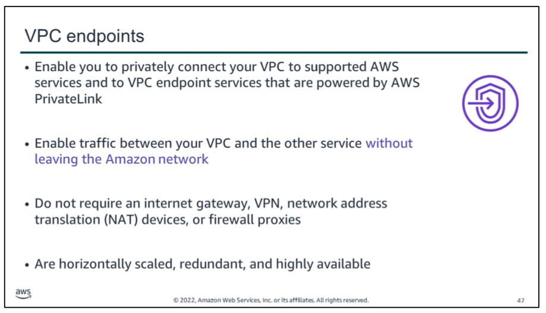
**AWS endpoints**
A VPC endpoint:
- *enables you to privately connect your VPC to supported `AWS services` and to `VPC endpoint services` that are powered by `AWS PrivateLink`*. `VPC endpoint services` that are powered by AWS PrivateLink include:
	- some AWS services, 
	- services hosted by other AWS customers and AWS Partner Network (APN) Partners in their own VPCs (which are referred to as endpoint services), 
	- and supported AWS Marketplace Partner services. 

- *Do not require an internet gateway, NAT device, VPN connection, or Direct Connect (DX) connection*. Instances in your VPC do not require public IP addresses to communicate with resources in the service. 
- *Traffic between your VPC and the other service does not leave the Amazon network*. 
- Endpoints are ***virtual devices***. They *are horizontally scaled, redundant, and highly available* VPC components. 
  Endpoints allow communication between instances in your VPC and services without imposing availability risks or bandwidth constraints on your network traffic.

(impose: gây ấn tượng mạnh mẽ, lừa gạt, bắt ai phải chịu đựng...; constraint: sự ràng buộc, hạn chế; )

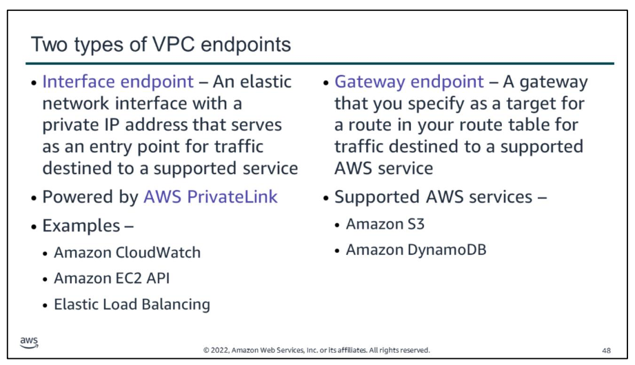
**Two types of AWS endpoints**

There are two types of VPC endpoints:
| **Interface endpoint **                                                                                                                                                                                                                                                  | Gateway endpoint                                                                                                         |
|--------------------------------------------------------------------------------------------------------------------------------------------------------------------------------------------------------------------------------------------------------------------------|--------------------------------------------------------------------------------------------------------------------------|
| an elastic network interface with a private IP address that serves as an entry point for traffic destined to a supported service.  The owner of the service is the service provider.  As the principal who creates the interface endpoint, you are the service consumer. | a gateway that you specify as a target for a route in your route table for traffic destined to a supported AWS service.  |
| Powered by AWS PrivateLink                                                                                                                                                                                                                                               |                                                                                                                          |
| For a complete list of services that are supported by interface endpoints, see VPC Endpoints – Interface Endpoints.  [AWS PrivateLink concepts - Amazon Virtual Private Cloud](https://docs.aws.amazon.com/vpc/latest/privatelink/concepts.html) 
Exampales: - CloudWatch - EC2 API - Elastic Load Balancing                                                                                          | Supported AWS services: - Amazon S3  - Amazon DynamoDB                                                                   |

Cost:
- There are no data processing or hourly charges for using gateway VPC endpoints. 
- However, *you will be billed for each hour that your VPC endpoint remains provisioned in each Availability Zone, regardless of the state of its association with the service*. 
- This hourly billing for your VPC endpoint will stop when you delete it. 
- Hourly billing will also stop if the endpoint service owner rejects your VPC endpoint’s attachment to their service. That service is subsequently deleted. 

For more information about interface endpoint pricing, see AWS PrivateLink pricing.
[AWS PrivateLink Pricing – Amazon Web Services](https://aws.amazon.com/privatelink/pricing/)

To learn more about VPC endpoints, see VPC Endpoints in the AWS Documentation. [AWS PrivateLink concepts - Amazon Virtual Private Cloud](https://docs.aws.amazon.com/vpc/latest/privatelink/concepts.html) 

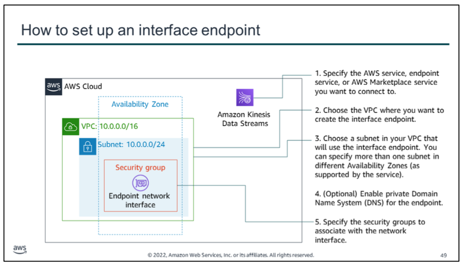
**How to set up an interface endpoints**
To set up an interface endpoint, follow these general steps from the Amazon VPC console:
-   1. *Specify the name of the AWS service, endpoint service, or AWS Marketplace service you want to connect to*.
-   2. *Choose the VPC where you want to create the interface endpoint*. 
  In that case, an endpoint network interface is created in each subnet that you specify.
-   3. *Choose a subnet in your VPC that will use the interface endpoint*. 
 *You can specify more than one subnet in different Availability Zones (as supported by the service)*. Doing so helps ensure that your interface endpoint is resilient to Availability Zone failures. 
 **When you create `an interface endpoint` for a service in your VPC, an `endpoint network interface` is created in the selected subnet. The endpoint network interface has a private IP address that serves as an entry point for traffic destined to the service**.
-   4. (Optional) *Enable private Domain Name System (DNS) for the endpoint*. 
  Doing so enables you to make requests to the service by using its default DNS hostname (which is enabled by default for endpoints created for AWS services and AWS Marketplace Partner services).
-   5. *Specify the security groups to associate with the network interface*. 
  The security group rules control the traffic to the endpoint network interface from resources in your VPC. 
  If you do not specify a security group, the default security group for the VPC is used.

Services cannot initiate requests to resources in your VPC through the endpoint. *An endpoint only returns responses to traffic that are initiated from resources in your VPC*.

For details about how to create interface endpoints, see:
-   Creating an Interface Endpoint [Access an AWS service using an interface VPC endpoint - Amazon Virtual Private Cloud](https://docs.aws.amazon.com/vpc/latest/privatelink/create-interface-endpoint.html) 
-   What is an Interface VPC Endpoint and How Can I Create Interface Endpoints for My VPC? [(1) What is an Interface VPC Endpoint and how can I create Interface Endpoint for my VPC? - YouTube](https://www.youtube.com/watch?v=caJ7zh9qzmw&ab_channel=AmazonWebServices) 

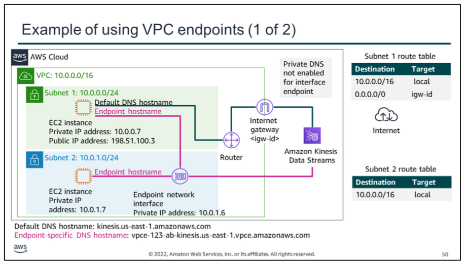
**Example of using VPC endpoints (1 of 2)**

*When you create an interface endpoint, endpoint-specific DNS hostnames are generated that you can use to communicate with the service*. 
For AWS services and AWS Marketplace Partner services, the private DNS option (enabled by default) **associates a private hosted zone with your VPC**. 

The hosted zone contains a record set for the default DNS name for the service (for example, kinesis.us-east-1.amazonaws.com) that **resolves to the private IP addresses of the endpoint network interfaces in your VPC**. 

This enables your application to make requests to the service using its default DNS hostname instead of the endpoint-specific DNS hostnames. This allows ***your existing applications to make requests to an AWS service through the interface endpoint without requiring any configuration changes***.

In this example, there is:
- an interface endpoint for Amazon Kinesis Data Streams 
- and an endpoint network interface in subnet 2. 
- Private DNS for the interface endpoint has not been enabled.
Instances in either subnet can *send requests to Amazon Kinesis Data Streams through the `interface endpoint` by using an `endpoint-specific DNS hostname`*. 

Instances in subnet 1 can communicate with Amazon Kinesis Data Streams over the public IP address space in the AWS Region by using the `service’s default DNS hostname`.

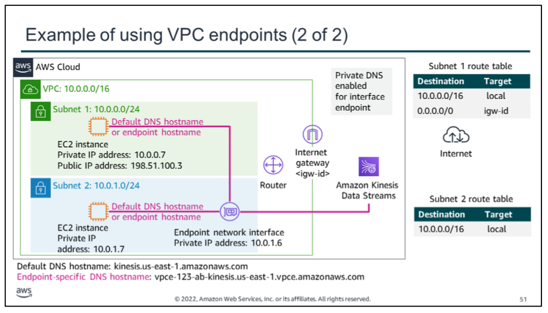
**Example of using VPC endpoints (2 of 2)**
Here, private DNS for the endpoint has been enabled. 
Instances in either subnet can use:
- either the `default DNS hostname`
- or the `endpoint-specific DNS hostname` to send requests to Amazon Kinesis Data Streams through the interface endpoint.

For more information about this example, see Private DNS for interface endpoints. [Access an AWS service using an interface VPC endpoint - Amazon Virtual Private Cloud](https://docs.aws.amazon.com/vpc/latest/privatelink/create-interface-endpoint.html) 

# quiz

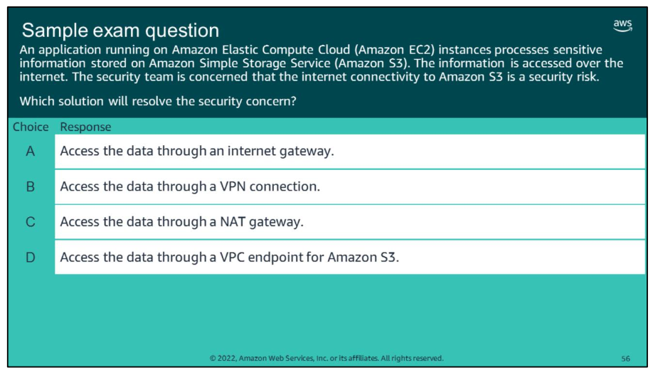
Look at the answer choices and rule them out based on the keywords.

The following are the keywords to recognize: **internet connectivity to Amazon S3 is a security risk**. 

The correct answer is D: “Access the data through a VPC endpoint for Amazon S3.”

- Choice A (“Access the data through an internet gateway”) can be eliminated because making the data stored in Amazon S3 public would be a security risk. 
- Choice B (“Access the data through a VPN connection”) can also be eliminated because **you cannot connect to Amazon S3 by VPN**. --> VPN site-to-site là kết nối giữa on-premise với AWS Cloud.
  While choice C (“Access the data through a NAT gateway”) is not wrong, you can pick only one correct answer. 
- Choice D (“Access the data through a VPC endpoint for Amazon S3.”) is more appropriate because there is no additional cost or limit to performance.

(appropriate: thích hợp; )

# links
If you want to learn more about the topics covered in this module, you might find the following additional resources helpful:
-   AWS re:Invent 2018 video: AWS VPN Solutions
    
-   AWS Knowledge Center video: How do I create a VPN with Amazon VPC? [AWS re:Invent 2018: AWS VPN Solutions (NET304) - YouTube](https://www.youtube.com/watch?v=qmKkbuS9gRs&t=4s&ab_channel=AmazonWebServices) 
    
-   How do I configure a VPN over AWS Direct Connect?
    
-   AWS re:Invent 2019 video: From one to many: Evolving Amazon VPC design

-   Building a Scalable and Secure Multi-VPC AWS Network Infrastructure whitepaper
     [Building a Scalable and Secure Multi-VPC AWS Network Infrastructure - AWS Whitepaper (awsstatic.com)](https://d1.awsstatic.com/whitepapers/building-a-scalable-and-secure-multi-vpc-aws-network-infrastructure.pdf) 
-   AWS Knowledge Center video: What is AWS Peering?
    
-   AWS re:Invent 2019 video: AWS Transit Gateway reference architectures for many VPCs 
    [AWS re:Invent 2019: [REPEAT 1] AWS Transit Gateway reference architectures for many VPCs (NET406-R1) - YouTube](https://www.youtube.com/watch?v=9Nikqn_02Oc&feature=youtu.be) 
-   AWS Knowledge Center video: What is an Interface VPC Endpoint and How Can I [What is an Interface VPC Endpoint and how can I create Interface Endpoint for my VPC? - YouTube](https://www.youtube.com/watch?v=caJ7zh9qzmw) 