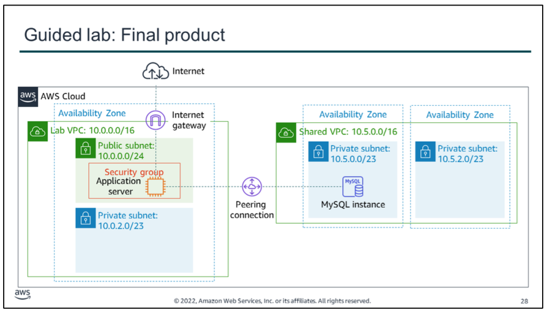

# guided lab
In this guided lab, you will complete the following tasks:
1.  Create a peering connection between two VPCs
2.  Configure route tables to send traffic to the peering connection
3.  Test the peering connection

The diagram summarizes what you will have built after you complete the lab.

s