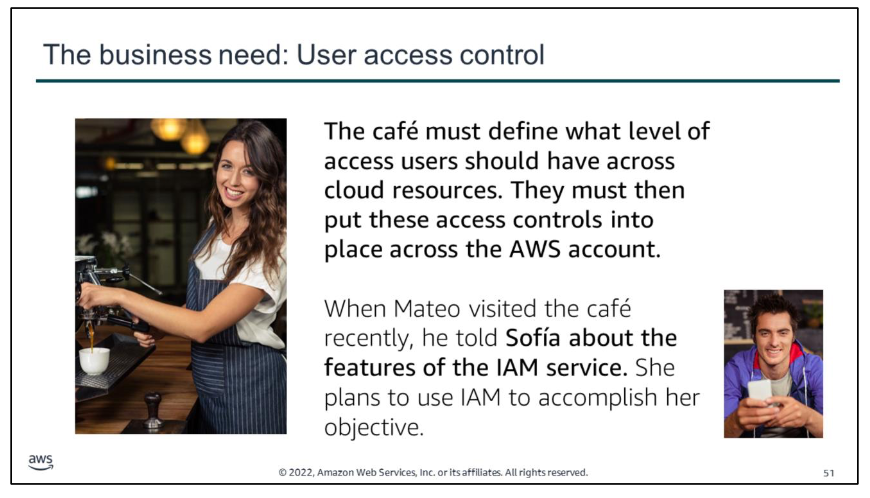
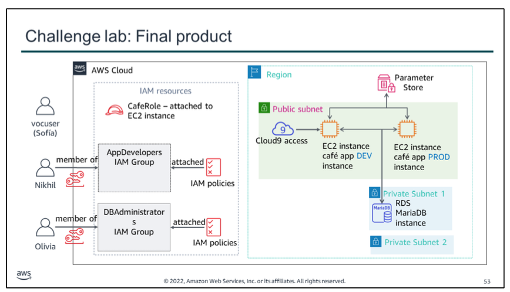

After speaking with Mateo about the café's AWS infrastructure, Sofía realized that she must address some basic security concerns about the way that the café staff has been using the AWS account.

The café is now large enough that team members who build, maintain, or access applications on AWS are specializing into roles (such as developer or database administrator). Up to now, they haven’t made an effort to clearly define what level of access each user should have based on their roles and responsibilities.

# Challengae lab
In this challenge lab, you will complete the following tasks:
1.  Configuring an IAM group with policies and an IAM user
2.  Logging in as Nikhil and testing access
3.  Configuring IAM for database administrator user access
4.  Logging in as the database administrator and resolving the database connectivity issue
5.  Using the IAM Policy Simulator and creating a custom IAM policy with the visual editor

The diagram summarizes what you will have built after you complete the lab.

try