This module contains the following sections:

1.  Architectural need
2.  Account users and IAM
3.  Organizing users
4.  Federating users
5.  Multiple accounts

This module also includes:

-   A demonstration that will show you a commonly used feature. An IAM role that grants access to other services from Amazon Web Services (AWS) is attached to an Amazon Elastic Compute Cloud (Amazon EC2) instance
-   An activity that challenges you to analyze AWS Identity and Access Management (IAM) policy documents to determine which actions the policies allow or deny
-   A challenge lab where you use IAM to configure users, groups, and access policies that are appropriate for the café use case

# module objectives
At the end of this module, you should be able to:

-   Explain the purpose of AWS Identity and Access Management (IAM) users, groups, and roles
-   Describe how to allow user federation within an architecture to increase security
-   Recognize how AWS Organizations service control policies (SCPs) increase security within an architecture
-   Describe how to manage multiple AWS accounts
-   Configure IAM users

# 1. Architectural need

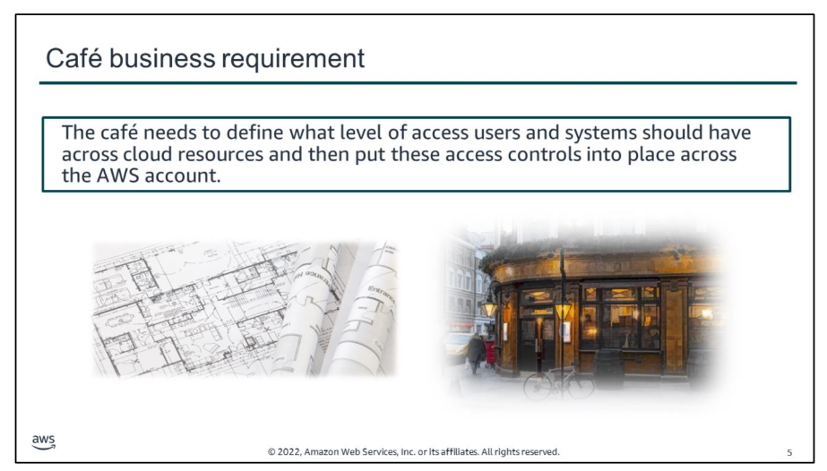

The café must define what level of access users and systems should have across their cloud resources. They must then put these access controls into place across their AWS account.

The café is large enough now that team members who build, maintain, or access applications on AWS are specializing into roles (such as developer or database administrator). Up until now, they haven’t made an effort to clearly define what level of access each user should have based on their roles and responsibilities.

Throughout this module, you will learn about IAM, which provides the features that you need to meet these new business requirements.

# 2. Account users and IAM
key takeaways:
-   Avoid using the `account root user` for common tasks. Instead, create and use IAM user credentials.
-   *Permissions* for accessing AWS account resources are defined in one or more IAM policy documents.
	- Attach IAM policies to IAM users, groups, or roles.
-   When IAM determines permissions, an explicit `Deny` will always override any `Allow` statement.
-   It is a best practice to follow the *principle of least privilege* when you grant access.

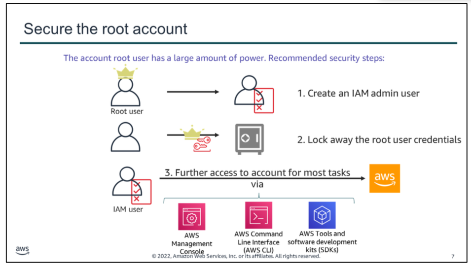
**Secure the root account**
When you first create an AWS account, you begin with a `root user`. This user can log in to the AWS Management Console with the email address that was used to create the account.

The AWS account root user has **full access to all resources in the account, including billing information, personal data in the user profile, and all resources that were created** in any AWS services in the account. **You cannot control the privileges of the AWS account root user credentials**.

AWS strongly recommends that you ***not use root user credentials for day-to-day interactions with AWS***. Instead, create one or more IAM users. Keep the root user credentials in a secure location. 
For most ongoing account access and management tasks, you can use IAM user credentials.

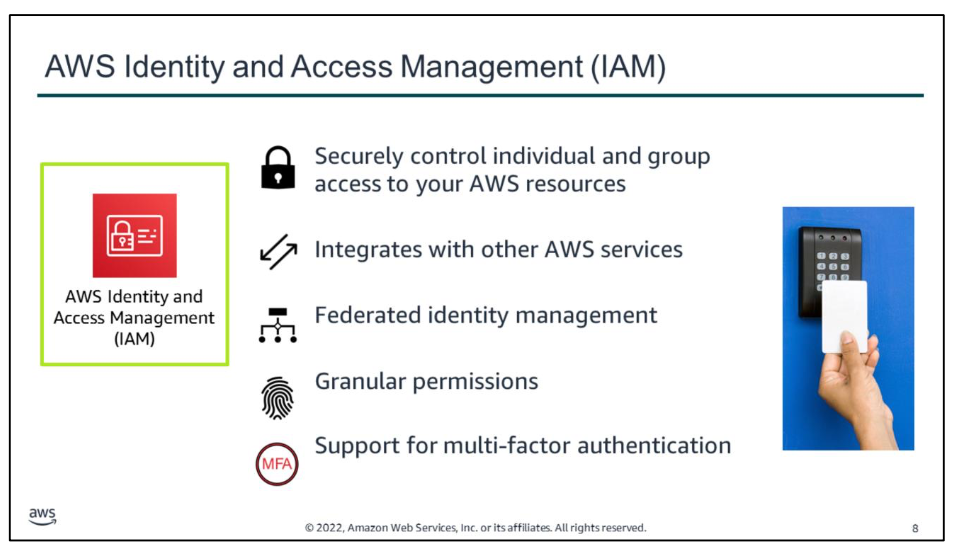
**AWS IAM**
`AWS Identity and Access Management` is also known as `IAM`. 
It is a service that allows you *configure fine-grained access control to AWS resources*. IAM enables security best practices by allowing you to *grant unique security credentials to users and groups*. These credentials specify which AWS service application programming interfaces (APIs) and resources they can access. IAM is secure by default. Users have no access to AWS resources until permissions are explicitly granted. --> *granular permissions* (quyền chi tiết)

*IAM is integrated into most AWS services*. 
You can define access controls from one place in the AWS Management Console, and they will take effect throughout your AWS environment.

You can use IAM to grant your employees and applications access to the AWS Management Console and to AWS service APIs by using your existing identity systems. AWS supports federation from corporate systems like Microsoft Active Directory and standards-based identity providers.  *--> federated identity management.*
(federation: liên kết; granular: dạng hạt; provision: cung cấp; accordingly: phù hợp)

*IAM also supports multi-factor authentication (MFA)*. If MFA is enabled and an IAM user attempts to log in, they will be prompted for an authentication code. The authentication code is delivered to an AWS MFA device. The MFA device can be a hardware MFA device. It can also be a virtual MFA device that the user accesses through an application that runs on the user's smartphone, such as Google Authenticator.

You can create accounts that have privileges similar to the AWS account root user. 
However, is **better to create administrative accounts that grant only the account permissions that are needed**.

Follow the ***principle of least privilege***. 
For example, ask yourself if your database administrator (DBA) should be able to provision EC2 instances. If the answer is no, then provision accounts accordingly.

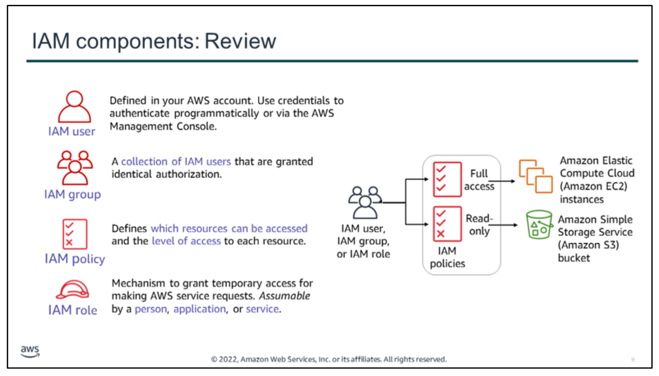
**IAM components: Review**
To understand how to use IAM to secure your AWS account, it is important to understand the role and function of each of the four IAM components.

An `IAM user` is a *person* or *application* that is defined in an AWS account, and that **must make API calls to AWS products**. 
Each user must have a unique name (with no spaces in the name) within the AWS account, and a set of security credentials that is not shared with other users. These credentials are different from the AWS account root user security credentials. 
Each user is defined in one and only one AWS account.

An `IAM group` is a collection of IAM users. 
You can use IAM groups to simplify how you specify and manage permissions for multiple users.

An `IAM policy` is a document that defines permissions to determine what users can and cannot do in the AWS account.  --> *defines **which resources can be accessed** and the **level of access** to each resource*.

An` IAM role` is a **tool** for *granting temporary access to specific AWS resources* in an AWS account.
(granting: cấp quyền; temporary: tạm thời; specific: cụ thể ) --> *assumable by a person, application, or service*.

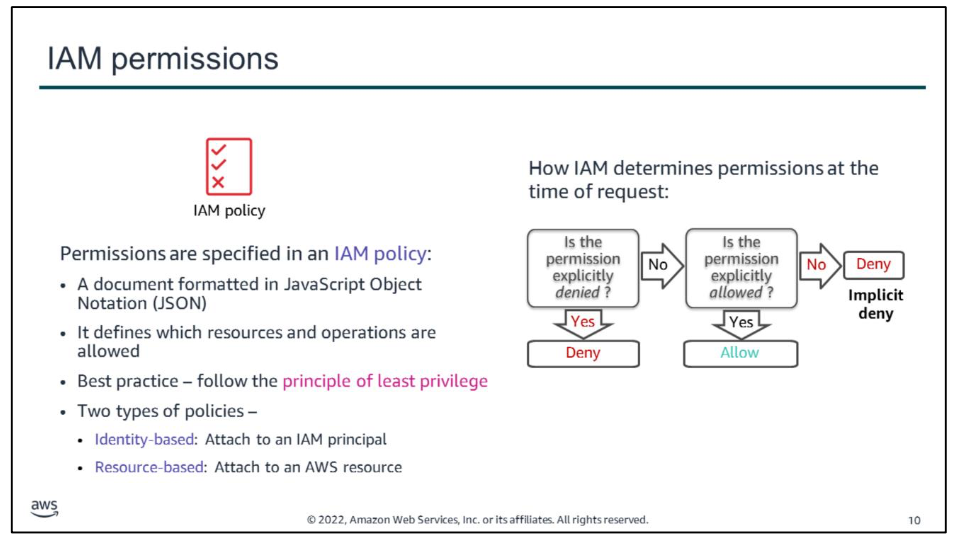
**IAM permissions**
In IAM, *permissions are defined in IAM policy documents*. 
Policies enable you to fine-tune privileges that are granted to `principals`. 
Example principals are `IAM users, IAM roles`, or other `AWS services`.

(fine-tune: tinh chỉnh, điều chỉnh; privilege: đặc quyền;  grant: cấp; principal: hiệu trưởng, người được ủy quyền/nhiệm; determine: xác định; applicable: có thể áp dụng; explicit >< implicit: rõ ràng >< ngầm; revert: trở lại; entity: sự tồn tại, đối tượng ; Simulator: thiết bị mô phỏng; troubleshooting: khắc phục/xử lý sự cố; )

When IAM determines whether a permission is allowed, 
- IAM first checks for the existence of any applicable **explicit denial policy**.  --> IAM trước tiên kiểm tra sự tồn tại của bất kỳ chính sách từ chối rõ ràng  có thể áp dụng
- If no explicit denial exists, it then checks for any applicable **explicit allow policy**. 
- If an explicit deny or an explicit allow policy does not exist, *IAM reverts to the default and denies access*. --> Nếu không tồn tại chính sách từ chối rõ ràng hoặc chính sách cho phép rõ ràng, IAM sẽ chuyển về mặc định và từ chối quyền truy cập.
**This process is referred to as an implicit deny**. *The user will be permitted to take the action only if the requested action is not explicitly denied and is explicitly allowed*. --> Quá trình này được ám chỉ là một từ chối ngầm. 
User sẽ chỉ được phép thực hiện hành động nếu hành động được yêu cầu không bị từ chối một cách rõ ràng và được cho phép một cách rõ ràng.

When you develop IAM policies, it can be difficult to determine whether access to a resource will be granted to an IAM entity. The IAM Policy Simulator is a useful tool for testing and troubleshooting IAM policies. [Testing IAM policies with the IAM policy simulator - AWS Identity and Access Management (amazon.com)](https://docs.aws.amazon.com/IAM/latest/UserGuide/access_policies_testing-policies.html) 

Policies are stored as JavaScript Object Notation (JSON) documents. They are attached:
- to an IAM principals as **identity-based policies**
- or to an AWS resources as **resource-based policies**.

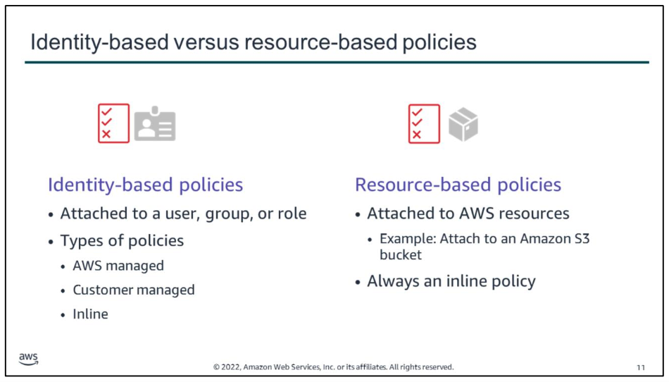
**Identity-based vs resource-based policies**

***Identity-based policies*** are permission policies that you:
- can attach to a principal (or identity), such as an IAM user, role, or group. 
	  These policies *control what actions that identity can perform, on which resources, and under what conditions*.
  - can be further categorized as:
	  - AWS managed, 
	  - customer managed, 
	  - or inline. 

*AWS managed policies* are created and managed by AWS, and you can attach them to multiple users, groups, and roles in your AWS account. If you are new to using policies, we recommend that you start by using AWS managed policies. 

*Customer managed policies* are policies that you create and manage in your AWS account. Customer managed policies provide *more precise control over your policies than AWS managed policies*. You can create and edit an IAM policy in the visual editor or by creating the JSON policy document directly. 

*Inline policies* are policies that you create and manage, and that are embedded directly into a single user, group, or role.

(precise: chính xác, nghiêm ngặt; )

***Resource-based policies*** are JSON policy documents that you:
- attach to a resource, 
	- such as an Amazon Simple Storage Service (Amazon S3) bucket. 
	These policies control *which actions a specified principal can perform on that resource and under what conditions*. 
- Always an inline policies, and there are no managed resource-based policies.

**IAM policy document structure**
IAM policies are stored in AWS as JSON documents. 
- Identity-based policies are policy documents that you attach to a user or role. 
- Resource-based policies are policy documents that you attach to a resource. 

A policy document includes one or more individual statements. 
Each statement includes information about a single permission. 
If a policy includes multiple statements, AWS applies a logical OR across the statements when it evaluates them.

(evaluate: đánh giá; indicate: chỉ ra; implied: ngụ ý, ám chỉ; )

The following are common elements found in an IAM policy document:

-   **Version** – Specify the version of the policy language that you want to use. As a best practice, use the latest 2012-10-17 version.
-   **Statement** – Use this main policy element as a container for the following elements. You can include more than one statement in a policy.
-   **Effect** – Use Allow or Deny to indicate whether the policy allows or denies access.
-   **Principal**
	  - If you create a *resource-based policy*, you must indicate the account, user, role, or federated user that you would like to allow or deny access to. 
	  - If you are creating an *IAM permissions policy to attach to a user or role*, you cannot include this element. The principal is implied as that user or role.
-   **Action** – Include a list of actions that the policy allows or denies.
-   **Resource** 
	- If you create an IAM permissions policy, you must specify a list of resources to which the actions apply. 
	- If you create a resource-based policy, this element is optional.
-   **Condition (Optional)** – Specify the circumstances where the policy grants permissions.

**ARNs and wildcards**

For **identity-based (IAM permissions) policies**, you must specify a list of resources that the actions apply to. 
- The Resource element specifies the object or objects that the statement covers. 
- Statements must include either a Resource or a NotResource element.
- Most resources have a friendly name 
  (for example, a user named Bob or a group named Developers). 
  However, the permissions policy language requires you to specify the resource or resources using the following `Amazon Resource Name (ARN)` format.

Each service has its own set of resources. Although you always use an `ARN` to specify a resource, *the details of the ARN for a resource depend on the **service** and the **resource***. 
For information about how to specify a resource, refer to the documentation for the service whose resources you are writing a statement for.  
--> (AWS Cloud) phân biệt service và resource:
- service: dịch vụ do AWS cung cấp. Mỗi service có feature đi kèm. Vd 2022, có khoảng hơn 200 services và 12000 features.
- resource: tài nguyên do AWS cung cấp. 
  Ví dụ: Ta dùng dịch vụ EC2, khởi tạo 03 EC2 instances --> 03 resources và 01 service.

You can also use *wildcards* in IAM policy documents, such as in **ARNs** or in **Actions**. You can use the wildcard character (``*``). 
An asterisk (`*`) represents any combination of zero or more characters. --> `*` đại diện cho bất kỳ kết hợp nào của zero hoặc nhiều ký tự.

For example:
- an “Action” value of "`s3:*`" applies to all S3 actions. You can also use wildcards (`*`) as part of the action name. 
- the ”Action” value of "`iam:*AccessKey*`" applies to all IAM actions that include the string AccessKey, including CreateAccessKey, DeleteAccessKey, ListAccessKeys, and UpdateAccessKey.

(wildcard: ký tự đại diện `*`; )

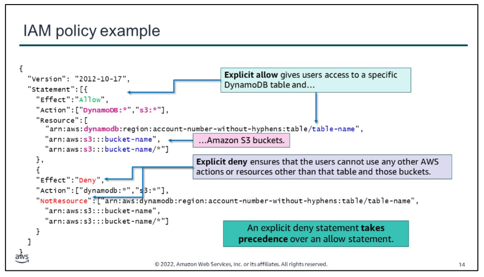
**IAM policy example**

As mentioned previously, IAM policy documents are written in JSON.

This example IAM policy grants user access only to the following resources:
-   The Amazon DynamoDB table whose name is represented by `table-name`.
-   The AWS account's S3 bucket, whose name is represented by `bucket-name` and all the objects that it contains.

The IAM policy also includes an explicit deny ("Effect":"Deny") element. 
The **NotResource** element helps to ensure that users cannot use any other DynamoDB or S3 actions or resources, except the actions and resources that are specified in the policy. 
This is the case even if permissions have been granted in another policy. ***An explicit deny statement takes precedence over an allow statemen***t.

**ACTIVITY: Examining IAM policies**
In this educator-led activity, you will be presented with example IAM policies. 
For each policy, you will be asked questions about whether the policy allows or denies particular actions. The educator will lead you in a discussion of each question and reveal the correct answers one at a time.

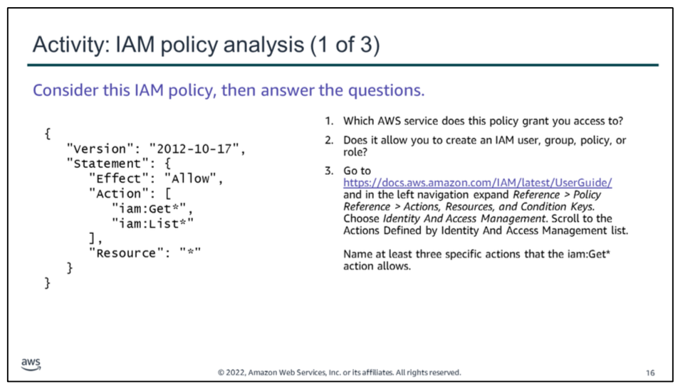
**Activity: IAM policy analysis (1 of 3)**
Look at the example IAM policy document. The educator will now ask you a series of questions to assess whether you understand what actions this policy will allow and deny.

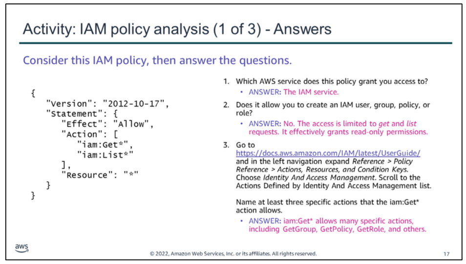
**Activity: IAM policy analysis (1 of 3) - Answers**
The answers are revealed.

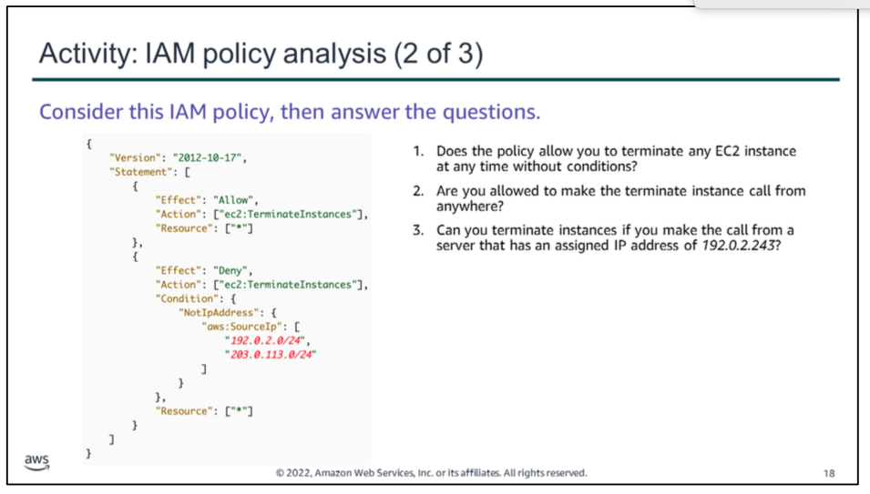
**Activity: IAM policy analysis (2 of 3)**
Analyze the second IAM policy file example. 
The first part shows 
- `Effect: Allow` 
- and Action `ec2:TerminateInstance` for resource. 

The second part shows
- `effect Deny` 
- for `action ec2:TerminateInstances` 
- with condition
	`NotIpAddress aws:SourceIp 192.0.2.0/24` and `203.0.113.0/24` for resource. 

The educator will again ask you a series of questions to assess whether you understand what actions this policy will allow and deny.

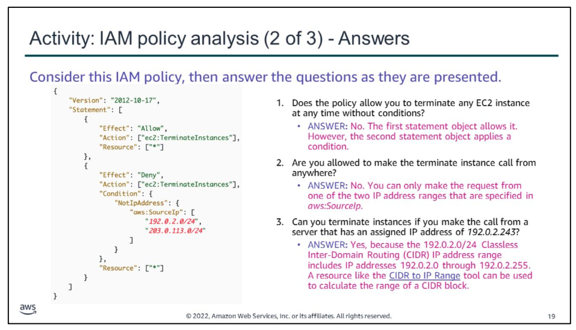
**Activity: IAM policy analysis (2 of 3) - Answers**

The answers are revealed.

**For accessibility**: 
Example policy document in JSON format. Shows a statement section with two parts. 
- Part one shows
	- Effect:Allow 
	- and Action EC2:TerminateInstance 
	- for resource `*`. 
- Part 2 shows 
	- effect Deny 
	- for action EC2:TerminateInstances 
	- with condition 
		- NotIpAddress aws:SourceIp 192.0.2.0/24 and 203.0.113.0/24 for resource `*`. 
**End of accessibility description**.

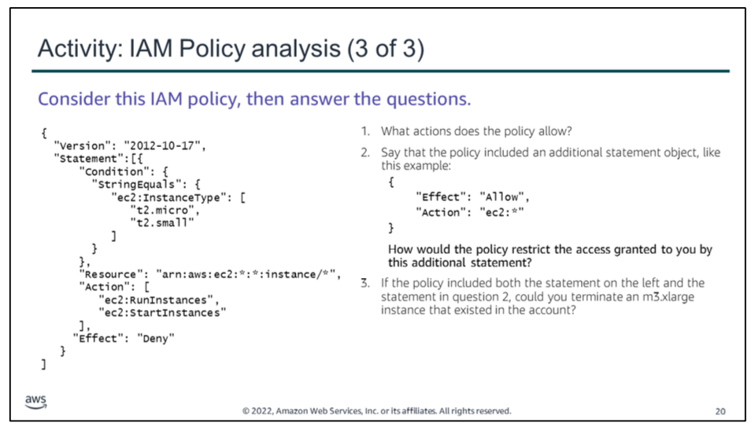
**Activity: IAM policy analysis (3 of 3)**
Observe the third and last IAM policy document example. The educator will again ask you a series of questions to assess whether you understand what actions this policy will allow and deny.

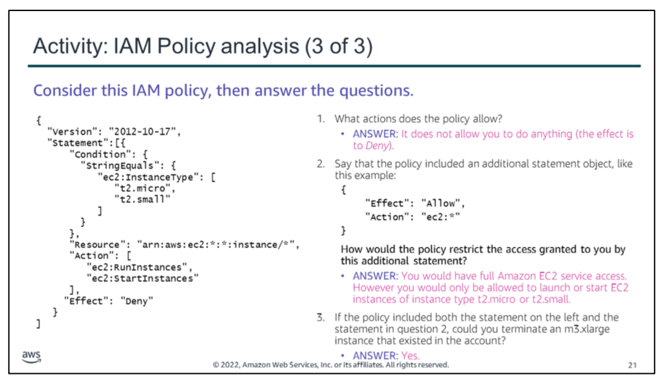
**Activity: IAM policy analysis (3 of 3)**
The answers are revealed.

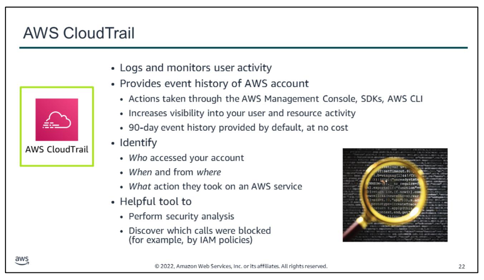
**AWS CloudTrail**

AWS CloudTrail is a service that enables *governance, compliance, and auditing of your AWS account*. 
With CloudTrail, you can continuously monitor and retain account activity that is related to actions across your AWS infrastructure. --> *logs and monitors user activity*.

It provides an event history of account activity, including:
- actions taken through the AWS Management Console, AWS SDKs, and command line tools (CLI). 
- This event history simplifies security analysis, resource change tracking, and troubleshooting.
- *Increases visibility into your user and resource activity*
- *90-day event history provided by default, at no cost*

(comprehensive: toàn diện; adhere: tham gia, bám chặt vào ; )
You can discover and troubleshoot security and operational issues by capturing a comprehensive history of changes that occurred in your AWS account within a specified period of time. 

You can identify:
- **which users and accounts** called AWS, 
- the source IP address that the calls were made from, 
- and **when** the calls occurred. 
***CloudTrail enables you to track and automatically respond to account activity that threatens the security of your AWS resources***.

With *Amazon EventBridge* (formerly known as *Amazon CloudWatch Events*) integration, you can define workflows that run when it detects events that can result in security vulnerabilities. 
For example, you can create a workflow to add a specific policy to an S3 bucket when CloudTrail logs an API call that makes that bucket public.

CloudTrail records important information about each action, including:
- who made the request, 
- the services used, 
- the actions performed, 
- parameters for the actions, 
- and the response elements that were returned by the AWS service. 
The service also helps organizations meet the compliance and auditing requirements that they must adhere to.

#  3.  Organizing users

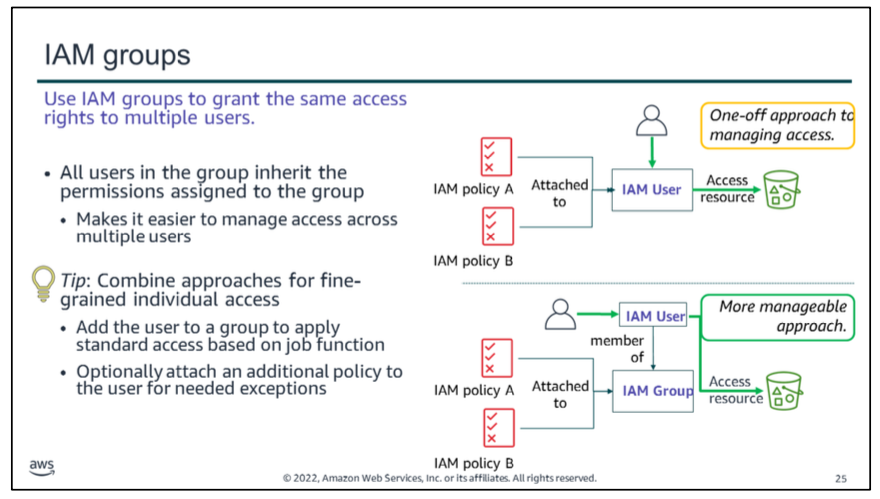
**IAM groups**

An IAM group is a collection of IAM users. Groups are a convenience that makes it *easier to manage permissions for a collection of users*, instead of managing permissions for each individual user.

(convenience: sự thuận lợi)

Manage group membership as a simple list:
-   Add users to a group or remove them from a group.
-   A user can belong to multiple groups.
-   Groups cannot belong to other groups.
-   Groups can be granted permissions by using access control policies.
-   Groups do not have security credentials and cannot access web services directly. They exist solely to make it easier to manage user permissions.

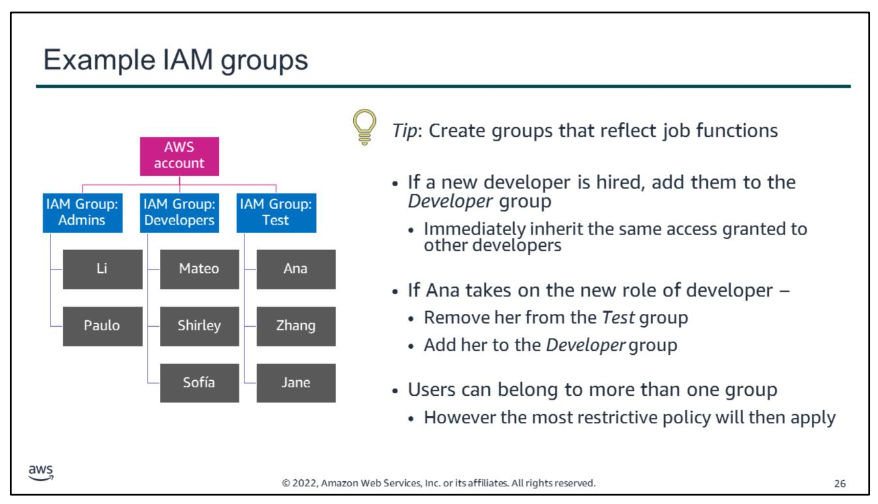
**Example IAM groups**
Typically, you will want to **create groups that reflect job functions**. 

For example, you could create:
- one group for administrators, 
- another group for developers, 
- and yet another group for the team that performs testing functions.
Then, you *attach one or more policy files to each group and add users to the groups*. 
Users have the access rights that are assigned to the group or groups that they are in, because of their group membership.

If a new developer is hired, you can add them to the existing developer group. They will get the same access that the other developers already have.

If a person, such as Ana (shown in the example) takes on a new role in the organization, you can:
- remove her from the *Test* group and add her to the *Developers* group. 
- Or, if Ana will perform both functions, you can leave her in the Test group and add her to the *Developers* group.

If you discover that developers need access to some additional resource in the account, you can update or add a policy to the *Developers* group. All members of the group will gain that additional level of access. 
**Groups make it easier to maintain consistent access rights across teams**.

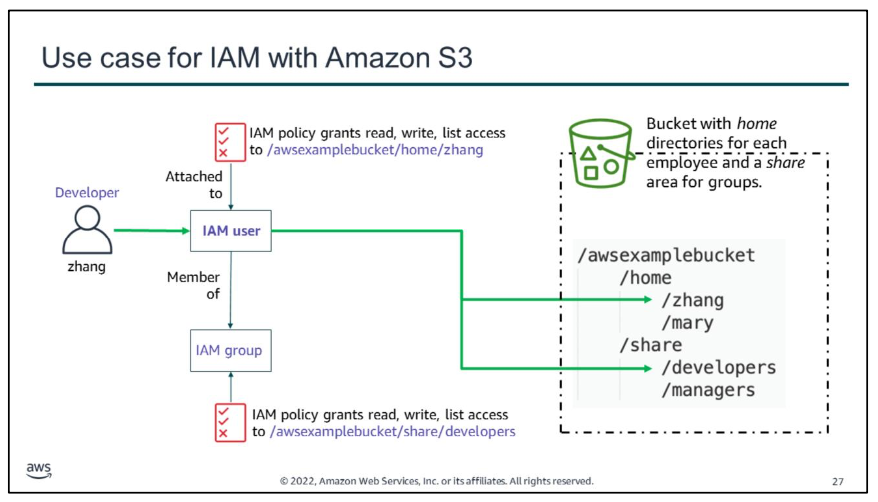
**Use case for IAM with Amazon S3**

This example demonstrates how IAM permissions might be configured on an S3 bucket.

The *awsexamplebucket* has two main directories.
- The *home* directory has subdirectories for each user, where they can store **individual** work. 
- The *share* directory has subdirectories where different **teams** can store content.

If a new team member, zhang, joins the organization as a developer, you can take three actions to grant them the proper access.
- First, add zhang to the IAM group for developers. Notice that this group has an IAM policy attached to it that grants access to `/awsexamplebucket/share/developers`.
- Next, create the `/awsexamplebucket/home/zhang` directory in Amazon S3.
- Finally, attach an IAM policy that grants access to the `/awsexamplebucket/home/zhang` directory directly to the zhang IAM user. 

Zhang's access will include both the rights that were granted from the group and also the rights that were directly attached to the IAM user principal.

# 4. Federating users
key takeaways:
-   `IAM Roles` provide temporary security credentials assumable by a person, application, or service.
-   The `AWS Security Token Service (STS)` allows you to request temporary AWS credentials.
-   With *identify federation*, user authentication occurs external to the AWS account.
	- Accomplished using STS, SAML, or Amazon Cognito.

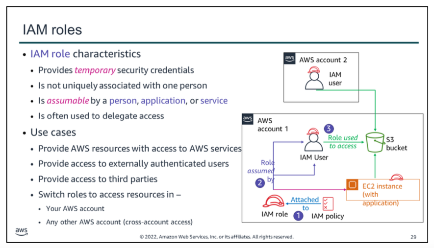
**IAM roles**
- Characteristics:
	- Provides *temporary* security credentials
	- Is not uniquely associated with one person
	- is *assumable* by a *person, application, or service*
	- is often used to delegate access
- Use cases:
	- Provide AWS resources with access to AWS services
	- Provide access to externally authenticated users
	- Provide access to third parties
	- Switch roles to access resources in -
		- Your AWS account
		- Any other AWS account (cross-account access)

An IAM role enables you to *define a set of permissions to access the resources that a user or service needs*. 
However, the permissions are not attached to an IAM user or group. Instead, **the permissions are attached to a role, and the role is assumed by the user or the service**.

(prior: trước; temporary: tạm thời; entity: thực thể;  )

When a user assumes a role, the user's prior permissions are temporarily forgotten. AWS returns temporary security credentials that the user or application can then use to make programmatic requests to AWS.

***By using IAM roles, you don’t need to share long-term security credentials for each entity that requires access to a resource, such as creating an IAM user.*** --> bằng cách sử dụng  IAM role, bạn không cần chia sẻ thông tin xác thực bảo mật dài hạn cho từng thực thể yêu cầu quyền truy cập vào tài nguyên, chẳng hạn như tạo IAM user.

For a service like Amazon EC2, applications or AWS services can programmatically assume a role at runtime.

***The principal that assumes the role could also be an IAM user, group, or role from another AWS account, including accounts that are not owned by you***. --> Người đảm nhận vai trò có thể là IAM user, group hoặc role từ một tài khoản AWS khác, bao gồm các tài khoản không thuộc sở hữu của bạn.

***By creating a role for external account access, you don’t need to manage user names and passwords for third parties. 
If you no longer want someone or some system to have access, you can modify or delete the role. 
Thus, you don’t need to create and manage accounts for people outside of your organization***. 

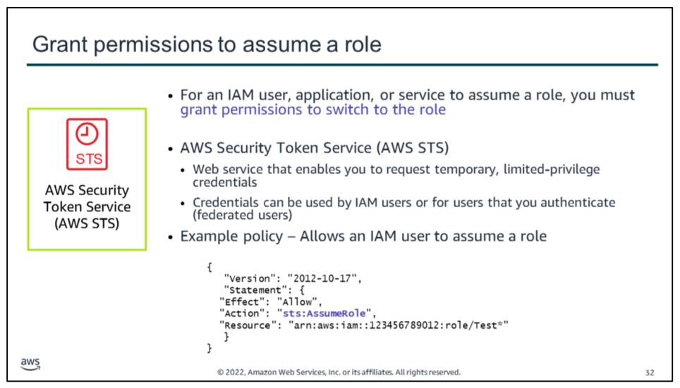
**Grant permissions to assume a role**
**AWS Security Token Service** is also known as `AWS STS`.
- *Web service that enables you to request temporary, limited-privilege credentials
- *Credentials can be used by IAM users or for users that you authenticate (federated user)*
  
It is a web service that enables an *IAM user, federated user (users that you authenticate), or application to assume an IAM role that they want*.  ---> For an IAM user, application, or service to assume a role, you must ***grant permissions to switch to the role*** 

(invoke: cầu, viện dẫn, thỉnh nguyện; )

When the AssumeRole operation of the AWS STS API is successfully invoked, 
- the web service returns the temporary, limited-privilege credentials that were requested by the IAM user or the user that was authenticated through federation. 
- Typically, the AssumeRole operation is used for cross-account access or for federation.

The example policy *allows an IAM user to assume any role* that is:
- defined in AWS account number `123456789012`, 
- as long as the role name starts with `Test`.

**Role-based access control (RBAC)**
You will now consider two different approaches to access control: 
- `role-based access control (RBAC)` 
- and `attribute-based access control (ABAC)`.
You will first learn about `RBAC`.

RBAC has been used historically on-premises and in the cloud. --> *Traditional approach to access control*:
- *Grant users specfic permissions based on job function (such as database adminstrator)
- *Create a distinct IAM role for each permission combination
- *Update permissions by adding access for each new resource (it can become time-consuming to keep updating policies)*

(distinct: riêng biệt; combination: tổ hợp; explicit: rõ ràng; )

With this model, you grant users explicit access to a set of permissions. Say that you have database administrators, network administrators, and developers. If you have one or more network administrators who are also developers, you would not create a new policy to grant those permissions. Instead, you add those users to both roles.

This approach is familiar and has many advantages. 
However, the person who maintains the permissions in this model might find that ***they must constantly update the permissions files to add access to certain `roles` each time a new `resource` is created***. 
For example, they must update a policy with an ARN each time someone creates a new resource and wants to allow users access to it. 

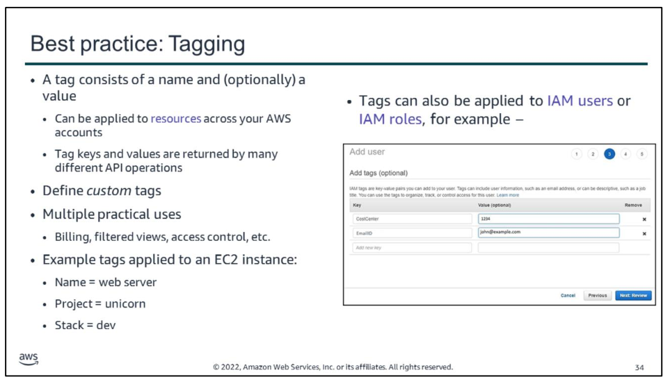
**Best practice: Tagging**
Before you consider the second approach to permissions controls, you should understand the tagging feature in AWS.

- A tag consists of a **name** and (optionally) a **value**
	- Can be applied to `resources` across your AWS accounts
	- Tag keys and values are returned by many different API operations
- Define *custom* tags
- Multiple practical uses
	- Billing, filter view, access control, etc.
- Example tags applied to an EC2 instance:
	- Name = web server
	- Project = unicorn
	- Stack = dev

AWS enables customers to assign `metadata` to their *AWS resources and identities in the form of tags*. 
Each tag is a simple label that consists of a customer-defined key and an optional value. Tags can make it easier to:
- manage, 
- search for, 
- and filter resources.

Tags have many practical uses. For example, you can create:
- *technical* tags to identify that a resource is a web server, part of a specific project, part of a specific environment (test, development, or production), among others. 
- You can also create *business* tags to identify the department or cost center that should be billed for this resource or the project that this resource is a part of.
- Finally, you can also set *security* tags, such as an identifier for the specific data- confidentiality level that a resource supports.

***You can create up to tags per resource***. 
For each resource, each tag key must be unique, and each tag key can have only one value. 
*Tag keys and values are case-sensitive* --> tag keys và value phân biệt chữ hoa-chữ thường.

***You can also add tags to IAM users and IAM roles***. 
Tags are an important part of the second access-control method that you will learn about next.

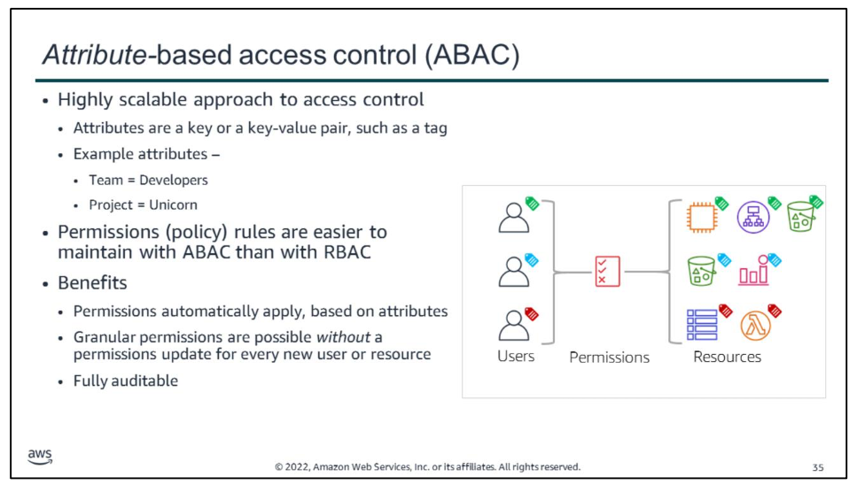
**Attribute-based access control (ABAC)**

Now that you know about the tagging feature, you will learn about the second approach to access control: `attribute-based access control (ABAC)`.
- Highly scalable approach to access control
	- *Attributes are a key or a key-value pair*, such as a *tag*
	- Example attributes -
		- Team = Developers
		- Project = Unicorn
- Permissions (policy) rules are easier to maintain with ABAC than with RBAC (ví dụ mỗi khi có tài nguyên mới, phải cập nhật role, maintain updates RBAC)
- Benefits
	- *Permissions automatically apply, based on attributes*
	- Granular permissions are possible without a permissions update for every new user or resource
	- Fully auditable

ABAC enables you to use attributes to create general permissions rules that scale with your organization.

***In this model, IAM users have attributes that you created and applied, such as one or more tags***.
*Resources also have attributes*, like matching *tags*, that you also applied to the resources.

(straightforward: thẳng thắn, cởi mở, không rắc rối; relatively: tương đối; )

With the RBAC approach, writing permissions is relatively straightforward. 
- The policy checks to see if an attribute that is applied to the IAM user is also applied to the resource that they want to access.
- When you create new IAM users and new account resources, you apply the correct tags to the users and to the resources.

***With the ABAC approach, you can grant developers access to their project resources, but you do not need to specify resources in the policy file***.

You can imagine how scalable the ABAC approach to access management can be. ***You do not need to modify your permissions settings. Permissions apply automatically when resources or users are created with the correct tags***.

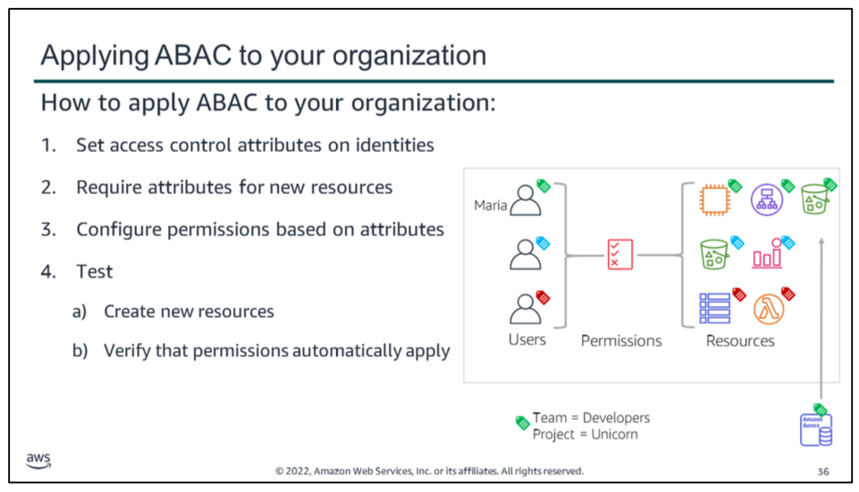
**Applying ABAC to your organization**

- Set access control attributes on identities
- Require attributes for new resources
- Configure permissions based on attributes 
- Test
	- Create new resources
	- Verify that permissions automatically apply

To apply ABAC to your organization, the first step is to *create identities, such as IAM users or IAM roles*. *These identities must have the attributes that will be used for access control purposes*. 
For example, you can apply the `Team = Developers` and `Project = Unicorn` tags to the `Maria` user.

Next, *require attributes for new resources*. You should create policies that enforce rule. For example, you could require that a `Project` attribute and a `Team` attribute are applied to any resource when it is created.

Third, *configure access permissions based on the attributes*. 
For example, say that an IAM user has the `Project = Unicorn` and `Team = Developers` tags. 
If that user tries to access a resource that has matching values for the same two tags, then the policy will allow the access. Otherwise, the policy will deny access.

Fourth, *test your configuration*. 
For example, 
- you could try to create an Amazon Aurora database instance without the required tags. The attempt should fail. 
- Try creating the database instance again with the required tags. This time, you should be able to create the resource successfully. 
- Finally, you could try to access the database instance as the `Maria` user. Your access should succeed. 
  However, your access should be denied if you try to access the database instance as a different user who does not have the matching tags.

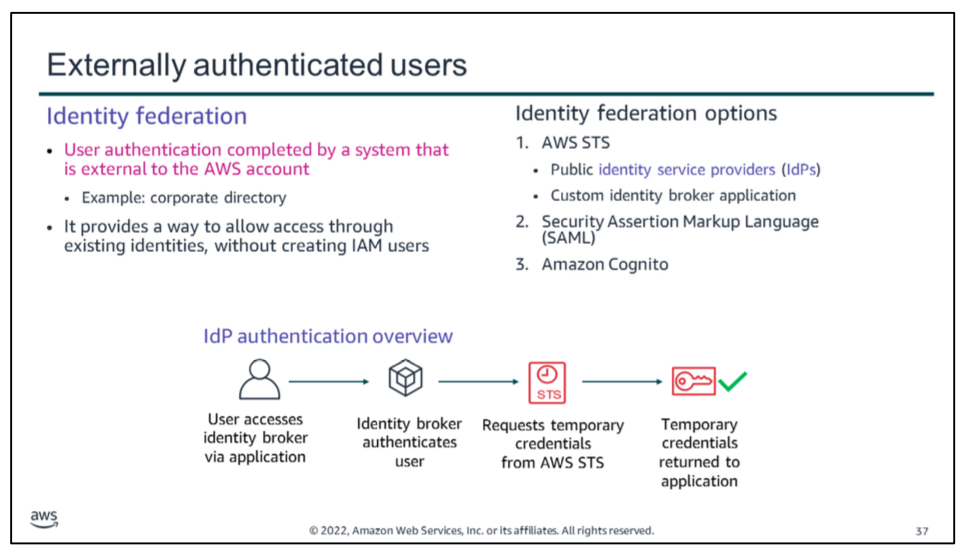
**Extermally authenticated users --> identity federation**

(identity: đồng nhất, đặc/danh tính; federation: liên đoàn, liên kết; authenticate: xác thực;  delegate: ủy quyền;  )

You will now learn about a new topic: externally authenticated users.

Identity federation
- User authentication completed by a system that is external to the AWS account
	- Example: corporate directory
- It provides a way to allow access through existing identities, without creating IAM users

*IAM supports identity federation for delegated access to the AWS Management Console or AWS APIs. With identity federation, external identities are granted secure access to resources in your AWS account without needing to create IAM users.* --> IAM hỗ trợ liên kết danh tính (identity federation) cho quyền truy cập được ủy quyền (delegated access) vào AWS Management Console hoặc AWS APIs. Với liên kết danh tính, danh tính bên ngoài được cấp quyền truy cập an toàn vào tài nguyên trong tài khoản AWS của bạn mà không cần tạo IAM users.

The graphic shows the four primary steps that occur when you use **an identity provider (IdP)** to create temporary credentials for a user or application.

Identity federation can be accomplished in one of three ways:
- The first way is to use a corporate IdP (such as Microsoft Active Directory) or a custom identity broker application. Each option uses *AWS STS*. 
	- Public identity service providers (IdPs)
	- Custom identity broker application
- The second approach is to create an integration that uses *Security Assertion Markup Language (SAML)*. 
- The third approach is to use a web identity provider, such as *Amazon Cognito*. 
  The next few slides discuss each of these three approaches.

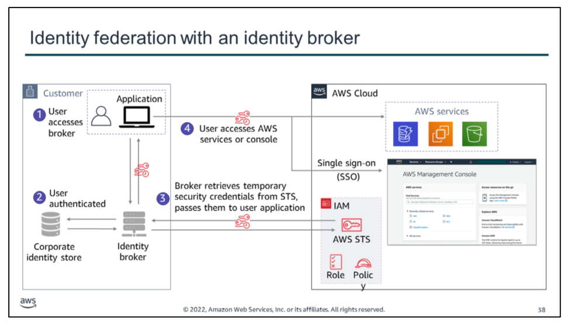
**`Identity federation` with an `identity broker`**

You will now learn how to accomplish `identity federation` by using an `identity broker`.

The process includes these steps:
1.  **A user accesses an application**. 
   The user enters their user ID and password, and submits them
2.  The **`identity broker` receives the authentication request**. 
   It then **communicates with the corporate identity store**, which might be Microsoft Active Directory or a Lightweight Directory Access Protocol (LDAP) server.
3.  If the *authentication request is successful*, the **`identity broker` makes a request to AWS STS** (Security Token Services).
   The request is to retrieve temporary AWS security credentials for the user application. *--> Identity broker retrieves temporary security credentials from STS, passes them to user application*.
   
4.  **The user application receives the temporary AWS security credentials and redirects the user to the AWS Management Console** --> *user accesses AWS services or console*. 
   The user did not need to sign directly in to AWS with a different *set of credentials* (bộ thông tin xác thực, ví dụ username-password). 
   ***This process is an example of a single-sign on (SSO) implementation. 
   The user application could also use these same temporary AWS security credentials to access AWS services if the IAM policy document allows it***.

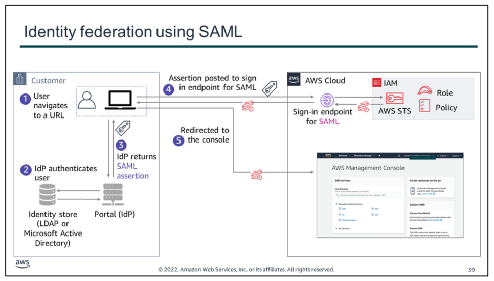
**`Identity federation` using `SAML`**

`identity service provider (IdP)`
`Security Assertion Markup Language (SAML)` ngôn ngữ đánh dấu xác nhận bảo mật

You will now learn about the second option for accomplishing identity federation. 
This approach uses the `SAML` open standard for exchanging authentication and authorization data between `IdPs` and service providers.

(against: chống lại, đối với; assertion: sự xác nhận ~ authentication ; invoke: gọi, cầu khẩn, thỉnh nguyện; construct: xây dựng; ) 

The process involves these steps:
1.  A **user** in your organization **navigates to an internal *portal* in your network**. 
   The ***portal*** also functions as the IdP that handles the SAML trust between your organization and AWS.
2.  The **IdP authenticates the user’s identity against the identity store**, which might be an LDAP server or Microsoft Active Directory.
3.  The **portal (IdP) receives the authentication response as a SAML assertion from the IdP**.
4.  The **client posts the SAML assertion to the AWS sign-in endpoint for SAML**.. The endpoint:
	   - communicates with AWS STS, 
	   - and it invokes the AssumeRoleWithSAML operation to request temporary security credentials and construct a sign-in URL.
5. The client receives the temporary AWS security credentials. **The client is redirected to the AWS Management Console** and is authenticated with the temporary AWS security credentials.
    
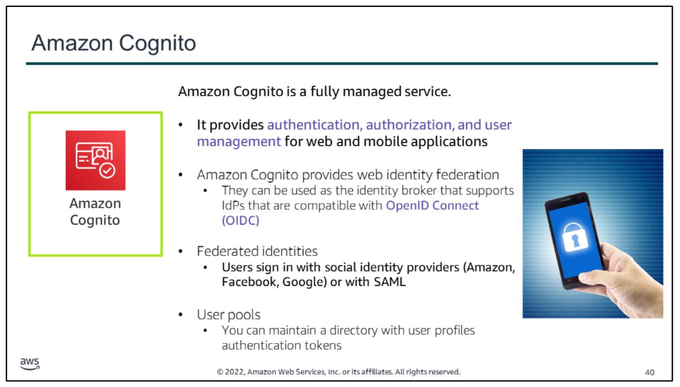
**Amazon Cognito**

(authentication: sự xác thực; authorization: sự cho phép, ủy quyền; compatible: tương thích; obtain: thu được; )

The third and final identity federation option is using `Amazon Cognito`. 
Amazon Cognito is a fully managed service
- provides *authentication, authorization, and user management* for web and mobile applications. 
- Amazon Cognito provides web identity federation
	- They can be used as the identity broker that support IdPs that are compatible with OpenID Connect (OIDC)
- Federated identities
	- Users can sign in:
		- directly with a user name and password 
		- or through a third party (social identity providers), such as Facebook, Amazon, or Google.
		- or with SAML
- User pools
	- You can maintain a directory with user profiles authentication tokens

The two main components of Amazon Cognito are *user pools* and *identity pools*.
- A **user pool** is a **user directory in Amazon Cognito**. 
  With a user pool, users can sign in to a web or mobile application through Amazon Cognito. They can also federate through a third-party IdP. 
  *All members of the user pool have a directory profile that can be accessed through an SDK*.
- **Identity pools** enable the **creation of unique identities and permissions assignment for users**. 
  With an identity pool, users can obtain temporary AWS credentials to access AWS services or resources. 
  Identity pools can communicate with Amazon Cognito user pools’ social sign-in with Facebook, Google, and Login with Amazon; and OpenID Connect (OIDC) providers.

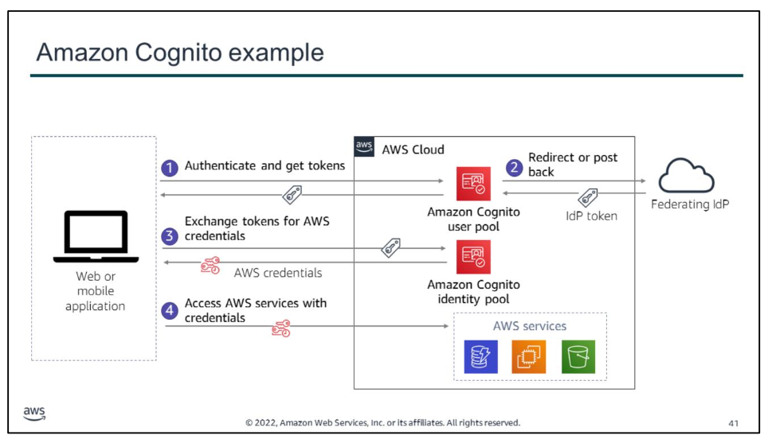
**Amazon Cognito example**

In this scenario, the goal is to authenticate a user using Amazon Cognito, and then grant that user access to another AWS service.
-   In the first step, the app user signs in through an Amazon Cognito user pool and, after successfully authenticating, receives user pool tokens.
-   Next, the app **exchanges the user pool tokens for AWS credentials through an Amazon Cognito identity pool**.
-   Finally, the **app user uses those AWS credentials to access other AWS services**.

# 5.  Multiple accounts

key takeaways:
-   You can **use multiple AWS accounts** to isolate business units, development and test environments, regulated workloads, and auditing data
-   `AWS Organizations` allows you to configure automated account creation, consolidated billing
-   You can configure access controls across accounts by using `service control policies (SCPs)` 

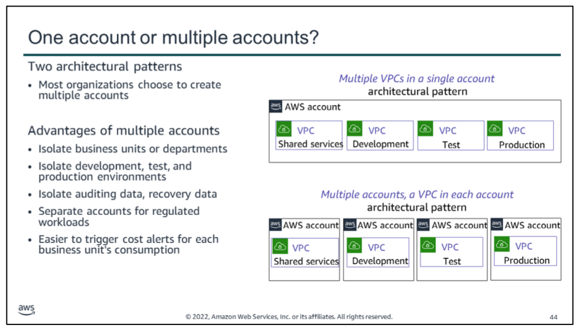
**One account or muliple accounts?**

When you use AWS to support the different teams and departments in an organization, you can choose between **two general architectural patterns** to isolate and separate the resources that each team uses.

1/ The first pattern is to  **define multiple virtual private clouds (VPCs) in a single AWS account**. 
If you prefer centralized information security management with minimum overhead, you could choose to use a single AWS account.

2/ The second pattern is to **create multiple AWS accounts and define a VPC in each account**. 
*In practice, large and small organizations tend to create multiple accounts for their organizations*. 
For example, they might *create individual accounts for various business units*. They could also *create separate accounts for their development, test, and production resources*.

(isolate: cô lập; separate: tách ra; consolidate: tổng hợp; consumption: sự tiêu thụ;  autonomous: tự trị; )

When customers use **separate AWS accounts** (usually **with consolidated billing**) for development and production resources, it enables them to **cleanly separate different types of resources**. It can also provide some security benefits.
- Isolate business units or departments
- Isolate development, test. and production enviroments
- Isolate auditing data, recovery data
- Separate accounts for regulated workloads
- Easier to trigger cost alerts for each business unit's consumption.

Alternatively, if your business maintains separate environments for production, development, and testing, you could configure three AWS accounts and have one account for each environment. 
Also, if you have multiple autonomous departments, you could also create separate AWS accounts for each autonomous part of the organization.

When you use multiple accounts, a more ***efficient strategy is to create a single AWS account for common project resources***. Common project resources might include:
- Domain Name System (DNS) services,
- Microsoft Active Directory, 
- and content management systems (CMSs).
You could also ***separate accounts for the autonomous projects or departments***. 
This strategy enables you to assign permissions and policies under each department or project account, and grant access to resources across accounts.

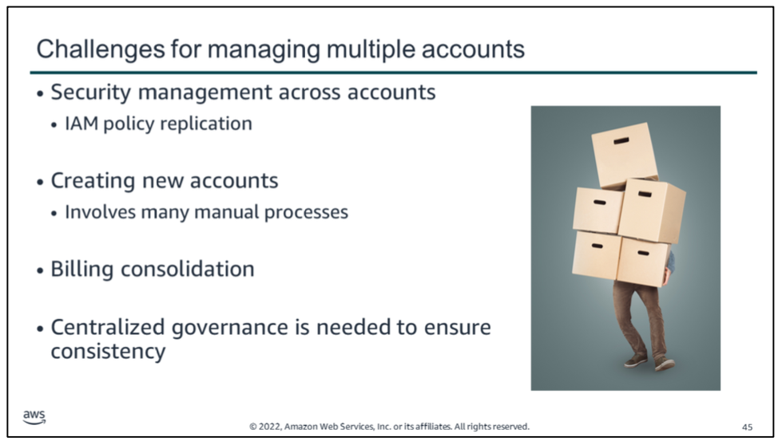
**Challenge for managing muliple accounts**
Although most organizations choose to use multiple AWS accounts, that choice comes with some challenges.
- Security management across accounts
	- IAM policy replication
- Creating new accounts
	- Involves many manual processes
- Billing consolidation
- Centralized governance is needed to ensure consistency.

(replication: bản sao; consolidation: sự hợp nhất; consistency: tính thống nhất; determine: xác định ~ define; effort: nỗ lực;  )

First, you must determine how to effectively manage security across all your accounts. 
If you **replicate the IAM policies that you defined across all accounts to ensure consistency**, it could involve custom automation, manual effort, or both.

Also, you might be constantly asked to **create more accounts**. 
It *takes time to manually create these accounts*. It also might be *difficult to track all the accounts and the purpose of each account*.

It can also be a challenge to **determine which cost center in the organization should be billed for which resources in which accounts**. 
And finally, you might also want to achieve the **centralized governance that is needed to ensure consistency**.

**Manage muliple accounts with AWS Organizations**
AWS offers a service that is designed to address these management challenges.

AWS Organizations: centrally manage and enforce policies across multiple AWS accounts
- *Group-based* account management
- *Policy-based access* to AWS services
- *Automated account creation* and management
- Consolidated billing
- API-based

(enforce: làm cho mạnh, ép buộc, bắt tuân thủ;  entity: thực thể;  )

***AWS Organizations is a managed service for account management***. 
An *organization* is an entity that you create to consolidate, centrally view, and manage all your AWS accounts. 
You determine the functionality of an organization through the feature set that you enable.

*Organizations* helps you **manage policies for multiple AWS accounts**. You can:
- use the service to create groups of accounts. 
- then attach policies to a group so that the correct policies are applied across the accounts.
- create groups of AWS accounts, and then apply different policies to each group.

*The Organizations APIs* can create new accounts programmatically and add them to a group. 
The policies that are attached to the group are automatically applied to the new account.

You can also **set up a single payment method for all the AWS accounts in your organization through consolidated billing**. With consolidated billing, you can see a combined view of charges that are incurred by all your accounts.

Finally, you can manage the use of AWS services at the API level. 
For example, you can apply a policy to a group of accounts that will only allow IAM users in those accounts to read data from S3 buckets.

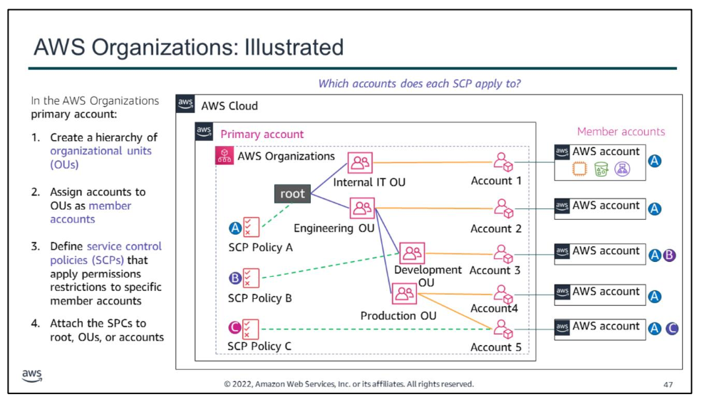
**AWS Organizations: Illustrated**
Here is an example AWS organization. It is defined inside a regular AWS account that is referred to on the slide as **the primary account** because the AWS organization is defined in it.

(illustrate: minh họa; hierarchy: hệ thống cấp bậc; beneath: ở dưới;  )

When you create an organization in the primary account, the organization automatically creates a parent container that is called **root**. 
Under each root in the organization, you can then define organizational **units**, which are also known as **OUs**. 
Each OU is a container for member **accounts**. 
**An OU can also contain other OUs, and those OUs can contain more accounts**. 

This feature enables you to create a tree-like hierarchy. You can think of the root and OUs as branches that reach out and end in accounts, which are like the leaves of the tree.

To configure access controls across accounts, you then define **service control policies (SCPs)**. 
Attach each policy to the appropriate place in the hierarchy of `OUs` and `accounts`. 
The policy flows out away from the root and it affects all OUs and accounts beneath it. 
Therefore, *if you apply an SCP to the root* (like SCP Policy A in the example), *it will apply to all OUs and accounts in the organization*. 

**You can attach an SCP to the root, to any OU, or to an individual account**.

Remember that like IAM policies, **SCPs will only grant access if it is both explicitly allowed and is not explicitly denied by any other SCP or IAM policy that applies to the user**.  --> Giống như IAM policies, SCPs sẽ chỉ cấp quyền truy cập nếu nó được cho phép rõ ràng và không bị từ chối rõ ràng bởi bất kỳ chính sách SCP hoặc IAM nào khác áp dụng cho user.

For example:
- say that SCP Policy A, which is applied to the root of the organization, sets more restrictions on a particular service or set of resources than SCP Policy C. 
- Then, users in Account 5 are subject to the more restrictive permissions set by Policy A.
Similarly, *if any IAM policies at the individual account level explicitly deny any actions for the user, these IAM policies override any permissions in the SCPs that are granted to the account*.

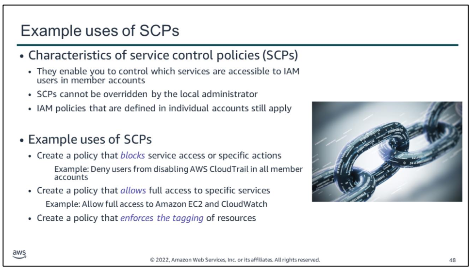
**Example uses of SCPs**

**Characteristics of SCPs:**
- They enable you to control which services are accesible to IAM uses in member accounts
- SCPs cannot be overridden by the local adminstrator
- IAM policies that are defined in individual accounts still apply
**Example uses of SCPs:**
- Create a policy that **blocks** service access or specific actions
	- Example: Deny users from disabling AWS CloudTrail in all member accounts
- Create a policy that **allows** full access to specific services
	- Example: allow full access to EC2 and CloudWatch
- Create a policy that **enforces** the **tagging** of resources.

***Service control policies (SCPs) enable you to control which services are accessible to IAM users in member accounts***. 
Say that you have specific policies that you want to apply across multiple accounts. 
***It is easier to define these policies in an SCP than to replicate these permissions settings into IAM policy documents in each account***.

**SCPs should be used with IAM policies that are defined in each individual account**. 
You can think of
- the SCPs as providing general boundaries around the services and general permissions that users should be allowed or denied access to. 
- Then, you can use IAM policies to set more granular access controls that are specific to individual accounts.

You can:
- author SCPs that block (or deny) access to certain services. 
- also define SCPs that allow access to certain services.
- Finally, you might decide to create an SCP that *enforces the tagging of resources*.
By doing so, your tagging strategy for access control or cost allocation can remain effective when new resources are created in your accounts.

# quiz

Look at the answer choices and rule them out based on the keywords.
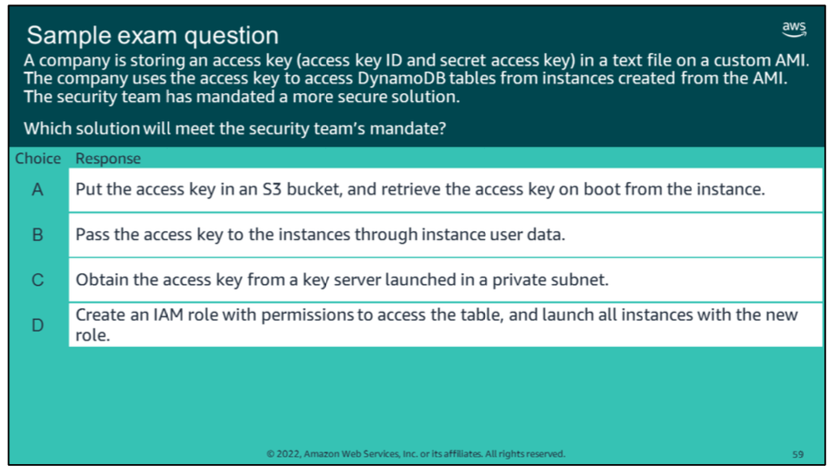
(mandate: sự ủy nhiệm; obtain: thu/đạt được )
Look at the answer choices and rule them out based on the keywords.

The following are the keywords to recognize: **“storing an access key”, “DynamoDB tables from instances”, “custom AMI”**, and “**most secure solution**”.

The correct answer is D. IAM roles for EC2 instances allow applications that run on the instance to access AWS resources without needing to create and store any access keys. Any solution that involves the creation of an access key then introduces the complexity of managing that secret.

# links
If you want to learn more about the topics covered in this module, you might find the following additional resources helpful:

-   AWS Well-Architected Framework – Security Pillar
    [Security Pillar - AWS Well-Architected Framework - Security Pillar (amazon.com)](https://docs.aws.amazon.com/wellarchitected/latest/security-pillar/welcome.html)
-   IAM FAQs
    [IAM FAQs (amazon.com)](https://aws.amazon.com/iam/faqs/) 
-   Creating IAM policies video
    [(6) AWS re:Invent 2018: [REPEAT 1] Become an IAM Policy Master in 60 Minutes or Less (SEC316-R1) - YouTube](https://www.youtube.com/watch?v=YQsK4MtsELU&ab_channel=AmazonWebServices) 
-   Identity at different layers video [AWS re:Invent 2018: [REPEAT 1] Mastering Identity at Every Layer of the Cake (SEC401-R1) - YouTube](https://www.youtube.com/watch?v=vbjFjMNVEpc&ab_channel=AmazonWebServices) 
-   Identity Providers and Federation https://docs.aws.amazon.com/IAM/latest/UserGuide/id_roles_providers.html 