# overview
This module includes the following sections:
1.  Architectural need
2.  Scaling your compute resources
3.  Scaling your databases
4.  Designing an environment that’s highly available
5.  Monitoring

This module also includes:
-   A demonstration on how to create target tracking and step scaling policies for Amazon EC2 Auto Scaling
-   A demonstration on how to deploy a highly available web application with an Application Load Balance
-   A demonstration on Amazon Route 53
-   A guided lab where you will create a highly available environment
-   A challenge lab where you will create a scalable and highly available environment for the café

# Module objectives
At the end of this module, you should be able to:
-   Use Amazon EC2 Auto Scaling within an architecture to promote elasticity
-   Explain how to scale your database resources
-   Deploy an Application Load Balancer to create a highly available environment
-   Use Amazon Route 53 for Domain Name System (DNS) failover
-   Create a highly available environment
-   Design architectures that use Amazon CloudWatch to monitor resources and react accordingly

# 1.  Architectural need

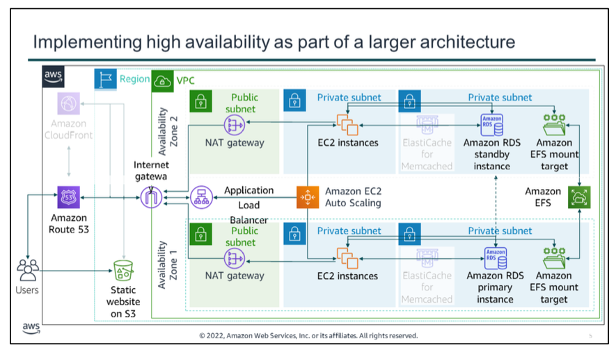
In this module, you will learn how to implement a reactive architecture that is elastic, resilient, and responsive. The components that make this architecture scalable and highly available (such as the second Availability Zone, the Application Load Balancer, Amazon EC2 Auto Scaling, and Amazon Route 53) are discussed.

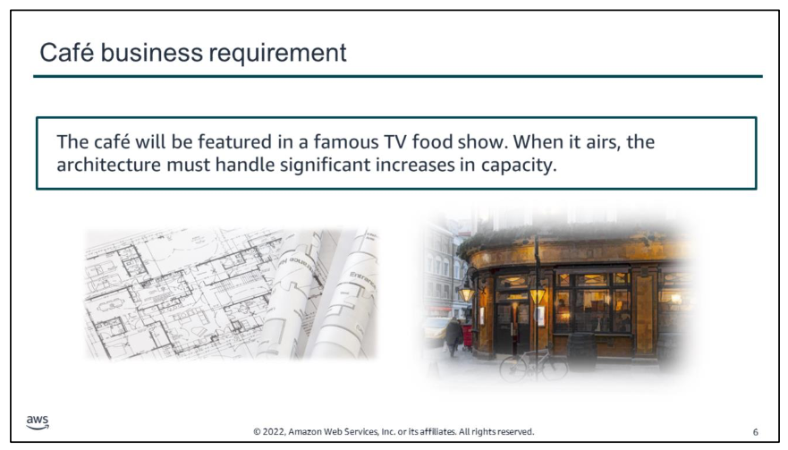
The café will soon be featured in a famous TV food show. When it airs, Sofía and Nikhil anticipate that the café’s web server will experience a temporary spike in the number of users—perhaps even up to tens of thousands of users. Currently, the café’s web server is deployed in one Availability Zone, and they are worried that it won’t be able to handle the expected increase in traffic. They want to ensure that their customers have a great experience when they visit the website, and that they don’t experience any issues, such as lags or delays in placing orders.

To ensure this experience, the website must be responsive, scale both up and down to meet fluctuating customer demand, and be highly available. It must also incorporate load balancing. Instead of overloading a single server, the architecture must distribute customer order requests across multiple application servers so it can handle the increase in demand.

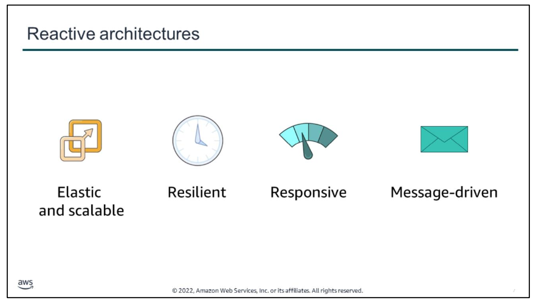
**Reactive architectures**
Modern applications must be able to:
- handle massive amounts of data,
- with no downtime 
- and with sub-second response times. 
To meet these requirements, you can implement a reactive system that is:
- elastic, 
- resilient, 
- responsive, 
- and message-driven. 
A well-designed reactive architecture can save you money and provide a better experience for your users. [The Reactive Manifesto](https://www.reactivemanifesto.org/) 

In this module, you learn how to build `reactive architectures` on AWS that are `elastic, resilient, and responsive`. You learn about `message-driven` components to build `decoupled architectures` in a later module.

# 2.  Scaling your compute resources
Key takeaways:
-   An `elastic infrastructure` can expand and contract as capacity needs change
-   Amazon ***EC2 Auto Scaling*** automatically *adds or removes* EC2 instances according to *policies that you define, schedules, and health checks*
-   Amazon EC2 Auto Scaling provides **several scaling options** to best meet the needs of your applications
-   When you configure an Auto Scaling group, you can specify the **EC2 instance types** and the combination of **pricing models** that it uses

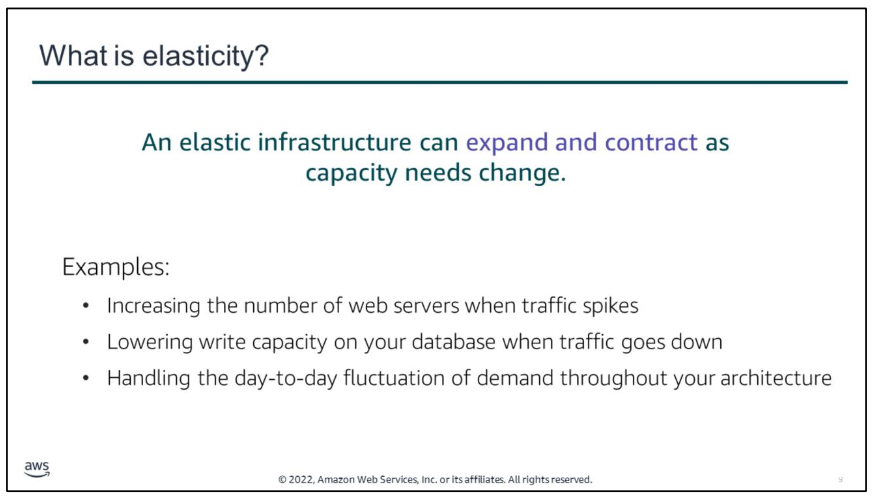
**What is Elasticity**
One characteristic of a reactive architecture is elasticity. 
***Elasticity*** means that the infrastructure ***can expand and contract when capacity needs change***. 
You can acquire resources when you need them and release resources when you do not.

(Elasticity: co giãn, đàn hồi; expand: mở rộng; contract: giao kèo, co lại; acquire: đạt được; release: giải thoát, phát hành; fluctuation: sự dao động; throughout: suốt, toàn bộ;  )

*Elasticity enables you to:
-   Increase the number of web servers when traffic to your application spikes
-   Lower the write capacity on your database when traffic goes down
-   Handle the day-to-day fluctuation of demand throughout your architecture

In the café example, elasticity is important because after the TV show airs, the website might see an immediate increase in traffic. The traffic might drop to normal levels after a week, or might increase again during holiday seasons.
    
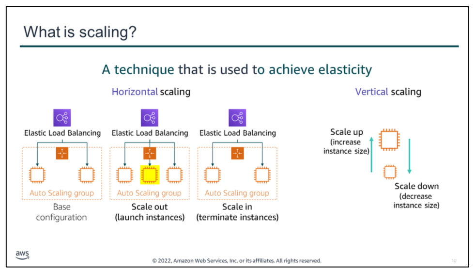
**What is Scaling?**
**Scaling** is a **technique** that is used to **achieve elasticity**. Scaling is the ability to increase or decrease the compute capacity of your application.
(scale
- scale up/down: increase/decrease  **instance size** tăng/giảm size của riêng một instance
- scale out/in: launch/terminate instances mở rộng/thu hẹp số instances )
(sufficient: hợp lý; )

Scaling has two types:

-  **Vertical scaling** is where you *increase or decrease* the *specifications of an individual resource*. 
  For example, you could upgrade a server so it has a larger hard drive or a faster CPU. 
  With Amazon Elastic Compute Cloud (Amazon EC2), you can *stop an instance and resize* it to an instance type that *has more RAM, CPU, I/O, or networking capabilities*
  
  Vertical scaling can eventually reach a limit, and it is not always a cost-efficient or highly available approach. However, it is easy to implement and can be sufficient for many use cases, especially in the short term.
- **Horizontal scaling** is where you *add or remove resources*. 
  For example, you might need to add more hard drives to a storage array or add more servers to support an application. 
  Adding resources is referred to as scaling out, and terminating resources is referred to as scaling in. 
  Horizontal scaling is a good way to build internet-scale applications that take advantage of the elasticity of cloud computing.

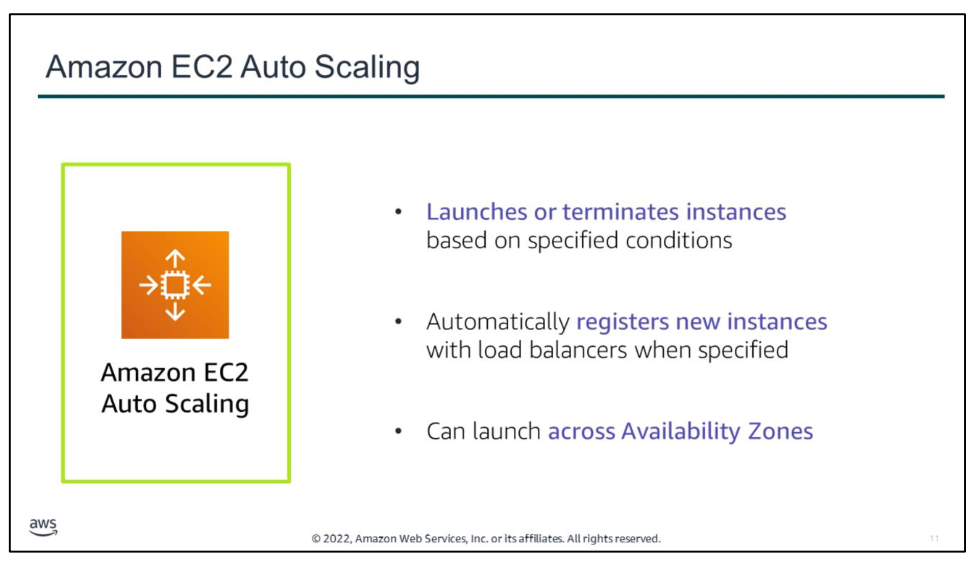
**EC2 Auto Scaling**
In the cloud, scaling can be handled automatically. 

Amazon EC2 Auto Scaling helps you maintain application availability and enables you to automatically add or remove EC2 instances according to:
- policies that you define, 
- schedules, 
- and health checks.  
--> *launches/terminates instances based on specified conditions*
If you specify scaling policies, then Amazon EC2 Auto Scaling can launch or terminate instances when demand on your application increases or decreases.
[Instance Auto Scaling – Amazon EC2 Auto Scaling – Amazon Web Services](https://aws.amazon.com/ec2/autoscaling/) 

Amazon EC2 Auto Scaling *integrates with Elastic Load Balancing*—it *automatically registers new instances with load balancers to distribute incoming traffic across the instances*.

Amazon EC2 Auto Scaling enables you to *build highly available architectures that span multiple Availability Zones in a Region*. 

You will learn more about high availability later in this module. If one Availability Zone becomes unhealthy or unavailable, Amazon EC2 Auto Scaling launches new instances in an unaffected Availability Zone. When the unhealthy Availability Zone returns to a healthy state, Amazon EC2 Auto Scaling automatically redistributes the application instances evenly across all the designated Availability Zones.

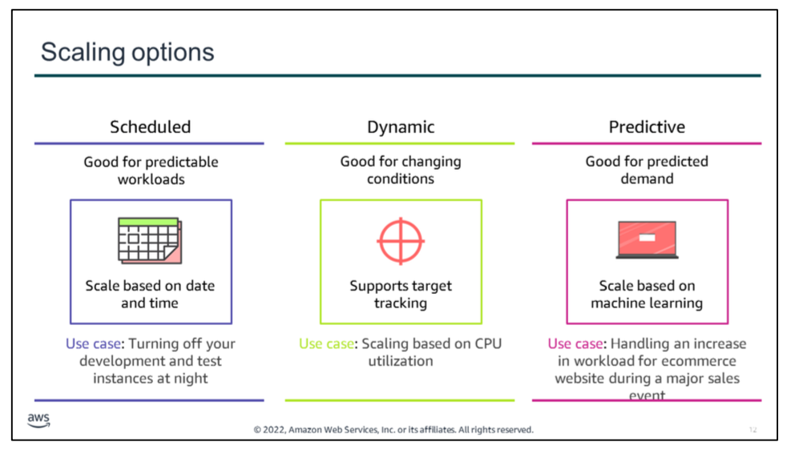
**Scaling options**
Amazon EC2 Auto Scaling provides several ways to adjust scaling to best meet the needs of your applications:

-   **Scheduled scaling** – With scheduled scaling, scaling actions are performed automatically as a function of *date and time*. This feature is *useful for predictable workloads when you know exactly when to increase or decrease the number of instances in your group*. 
  
  Use case: Turning off your development and test instances at night
  
  For example, suppose that every week, the traffic to your web application starts to increase on Wednesday, remains high on Thursday, and starts to decrease on Friday. You can plan your scaling actions based on the predictable traffic patterns of your web application. 
  To implement scheduled scaling, you create a **scheduled action**. [Scheduled scaling for Amazon EC2 Auto Scaling - Amazon EC2 Auto Scaling](https://docs.aws.amazon.com/autoscaling/ec2/userguide/ec2-auto-scaling-scheduled-scaling.html) 
    
-   **Dynamic, on-demand scaling** – This approach is a more advanced way to scale your resources. It enables you to define parameters that control the scaling process. 
*--> good for changing conditions*; supports target tracking

Use case: Scaling based on CPU utilization. 

 For example, you have a web application that currently runs on two EC2 instances. You want the CPU utilization of the Auto Scaling group to stay close to 50 percent when the load on the application changes. This option is useful for scaling in response to changing conditions, when you don't know when those conditions are going to change. *Dynamic scaling gives you extra capacity to handle traffic spikes without maintaining an excessive number of idle resources*. You can configure your Auto Scaling group to scale automatically to meet this need. [Dynamic scaling for Amazon EC2 Auto Scaling - Amazon EC2 Auto Scaling](https://docs.aws.amazon.com/autoscaling/ec2/userguide/as-scale-based-on-demand.html) 

-   **Predictive scaling** – You can use Amazon EC2 Auto Scaling with AWS Auto Scaling to implement predictive scaling, where your *capacity scales based on predicted demand*. 
  Predictive scaling uses data that is collected from your actual Amazon EC2 usage, and the data is further informed by billions of data points that are drawn from observations by AWS. *AWS then uses well-trained machine learning models to predict your expected traffic (and Amazon EC2 usage), including daily and weekly patterns*. *The model needs at least 1 day of historical data to start making predictions*.  --> *scale based on machine learning.*
  It is re-evaluated every 24 hours to create a forecast for the next 48 hours. 
  
  Use case: Handling an increase in workload for ecommerce web during a major sales event.
  
  The prediction process produces a scaling plan that can drive one or more groups of automatically scaled EC2 instances. [New – Predictive Scaling for EC2, Powered by Machine Learning | AWS News Blog (amazon.com)](https://aws.amazon.com/blogs/aws/new-predictive-scaling-for-ec2-powered-by-machine-learning/) 

***Dynamic scaling and predictive scaling can be used together to scale your infrastructure faster***. Finally, you can also add or remove EC2 instances manually. 
With **manual scaling**, you specify only the change in the maximum, minimum, or desired capacity of your Auto Scaling group. [Manual scaling for Amazon EC2 Auto Scaling - Amazon EC2 Auto Scaling](https://docs.aws.amazon.com/autoscaling/ec2/userguide/as-manual-scaling.html) 

**Dynamic scaling policy types**

- **simple scaling** - Single scaling adjustment
	- Ex use cases: new workloads, spiky workloads
- **step scaling**  - Adjusment depends on size of alarm breach
	- Ex use cases: Predictable workloads
- **target tracking scaling **
	- Ex use cases: Horizontally scalable applications, such as load-balanced applications and batch data-processing applications.

***Dynamic scaling*** means *adjusting your application’s capacity to meet changing demand so that you can optimize availability, performance, and cost*. 
The **scaling policy type** determines how the scaling action is performed:

-   With **step scaling** and **simple scaling policies**, you choose scaling metrics and threshold values for the CloudWatch alarms that trigger the scaling process. 
  You also define how your Auto Scaling group should be scaled when a threshold is in breach for a specified number of evaluation periods. 
  The main difference is that:
  - with step scaling, the current capacity of the Auto Scaling group *increases or decreases based on a set of scaling adjustments, known as step adjustments*, that vary based on the size of the alarm breach.

-   **Target tracking scaling policies** increase or decrease the current capacity of the group *based on a target value for a specific metric*. This type of scaling is similar to the way that your thermostat maintains the temperature of your home: you select a temperature, and the thermostat does the rest. 
  With target tracking scaling policies, you *select a scaling metric and set a target value*. Amazon EC2 Auto Scaling creates and manages the CloudWatch alarms that trigger the scaling policy and calculates the scaling adjustment *based on the metric and the target value*. 
  The scaling policy adds or removes capacity as required to keep the metric at, or close to, the specified target value. 
  In addition to keeping the metric close to the target value, a target tracking scaling policy also adjusts to the changes in the metric due to a changing load pattern.

To learn more about target tracking scaling policies, see the following resources:

-   Target Tracking Scaling Policies for Amazon EC2 Auto Scaling [Target tracking scaling policies for Amazon EC2 Auto Scaling - Amazon EC2 Auto Scaling](https://docs.aws.amazon.com/autoscaling/ec2/userguide/as-scaling-target-tracking.html) 
-   Set it and Forget it Auto Scaling Target Tracking Policies [Set it and Forget it Auto Scaling Target Tracking Policies - AWS Online Tech Talks - YouTube](https://www.youtube.com/watch?v=srofVz6xvkE&ab_channel=AWSOnlineTechTalks) 
-   AWS re: Invent 2017: Auto Scaling Prime Time: Target Tracking Hits the Bullseye at Netflix [AWS re:Invent 2017: Auto Scaling Prime Time: Target Tracking Hits the Bullseye at Ne (CMP311) - YouTube](https://www.youtube.com/watch?v=qOLOhvlpMyU) 

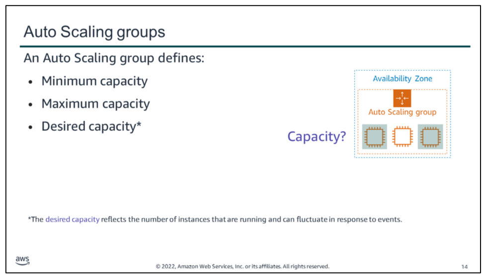
**Auto Scaling groups**
Amazon EC2 Auto Scaling helps you *ensure that you have the correct number of Amazon EC2 instances available to handle the load for your application*.

You create collections of EC2 instances, called ***Auto Scaling groups***. 
You can specify:
- the *minimum number of instances* in each Auto Scaling group, and Amazon EC2 Auto Scaling helps ensure that your group never goes below this size. 
- the *maximum number of instances* in each Auto Scaling group, and Amazon EC2 Auto Scaling helps ensure that your group never goes above this size. 
- If you specify the *desired capacity*, either when you create the group or at any time after you create it, Amazon EC2 Auto Scaling helps ensure that your group has this many instances.

(desired: mong muốn; fluctuate: dao động)

Note that the *desired capacity* is a *trigger-based setting and can fluctuate in response to events like a threshold being breached*. 
It reflects the number of instances that are running at that point. 
It can never be lower than the min value or greater than the max value. **The role of the scaling policy is to act as your automated representative and make decisions on how to adjust the desired capacity**. 
Amazon EC2 Auto Scaling then responds to the change in the desired capacity configuration.

Initially, you **set the desired capacity to tell the Auto Scaling group how many instances you want to be running at a particular time**. The number of instances that are currently running may be different than the desired value until Amazon EC2 Auto Scaling spins them up or tears them down.

**EC2 Auto Scaling: Purchasing options**
Amazon EC2 Auto Scaling enables you to scale out and scale in your infrastructure in response to changing conditions. 
When you configure an Auto Scaling group, you can specify the **EC2 instance types** that it uses. 
You can also *specify what percentage of the desired capacity should be fulfilled with **On-Demand Instances, Reserved Instances, and Spot Instances***. 
Amazon EC2 Auto Scaling then provisions **the lowest price combination of instances to meet the desired capacity based on these preferences**.
- [Amazon EC2 Instance Types - Amazon Web Services](https://aws.amazon.com/ec2/instance-types/)
- [Amazon EC2 - Secure and resizable compute capacity – Amazon Web Services](https://aws.amazon.com/ec2/pricing/) 

(provision: chuẩn bị; insufficient >< sufficient: không đủ >< đủ; )

You can use only one instance type. However, ***it is a best practice to use a few instance types to avoid trying to launch instances from instance pools that have insufficient capacity***. 
If the Auto Scaling group's request for Spot Instances cannot be fulfilled in one Spot Instance pool, it keeps trying in other Spot Instance pools instead of launching On-Demand Instances.

For more information about purchasing options, see **Auto Scaling Groups with Multiple Instance Types and Purchase Options**. [Auto Scaling groups with multiple instance types and purchase options - Amazon EC2 Auto Scaling](https://docs.aws.amazon.com/autoscaling/ec2/userguide/ec2-auto-scaling-mixed-instances-groups.html) 

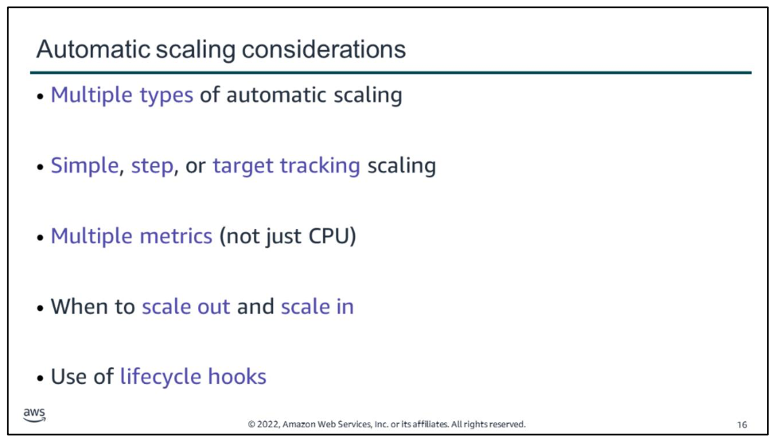
**Automatic scaling considerations**

(proportionally: cân xứng, tỷ lệ; ) 

Things for you to consider when you use Amazon EC2 Auto Scaling to scale your architecture are as follows:
-   ***Multiple types* of automatic scaling** – You might need to implement a combination of *scheduled, dynamic, and predictive scaling*.
-   Dynamic scaling policy type – 
	- **Simple scaling policies** increase or decrease the current capacity of the group *based on a single scaling adjustment*. 
	- **Step scaling policies** increase or decrease the current capacity of the group *based on a set of scaling adjustments, known as step adjustments, that vary based on the size of the alarm breach*. 
	- **Target tracking scaling policies** increase or decrease the current capacity of the group *based on a target value for a specific metric*.
-   **Multiple metrics** – Some architectures must scale on two or more metrics **(not just CPU)**. 
  AWS recommends that you use a target tracking scaling policy to scale on a metric, like average CPU utilization or the RequestCountPerTarget metric from the Application Load Balancer. Metrics that decrease when capacity increases—and increase when capacity decreases—can be used to proportionally scale out or in the number of instances that use target tracking. 
  This type of metric helps to ensure that Amazon EC2 Auto Scaling follows the demand curve for your applications closely.
-   **When to scale out and scale in** – Try to scale out early and fast, and scale in slowly over time.
-   **Use of lifecycle hooks** – Lifecycle hooks enable you to perform custom actions by pausing instances when an Auto Scaling group launches or terminates them. 
  When an instance is *paused*, it remains in a wait state either until you complete the lifecycle action by using the complete-lifecycle-action command or the CompleteLifecycleAction operation, or until the timeout period ends (1 hour by default). [Amazon EC2 Auto Scaling lifecycle hooks - Amazon EC2 Auto Scaling](https://docs.aws.amazon.com/autoscaling/ec2/userguide/lifecycle-hooks.html) 
    

#  3. Scaling your databases
key takeaways:
-   You can use **push-button scaling** to **vertically scale** compute capacity for your RDS DB instance
  
-   You can use *read replicas* or *shards* to **horizontally scale** your `RDS DB instance` 
  
-   With `Amazon Aurora`, you can choose the DB instance class size and number of Aurora replicas (up to 15)
  
-   **Aurora Serverless** scales resources automatically based on the minimum and maximu capacity specifications
  
-   Amazon DynamoDB **On-Demand** offers a pay-per-request pricing model
-   DynamoDB **auto scaling** uses Amazon Application Auto Scaling to dynamically adjust provisioned throughput capacity
-   DynamoDB **adaptive capacity** works by automatically increasing throughput capacity for partitions that receive more traffic

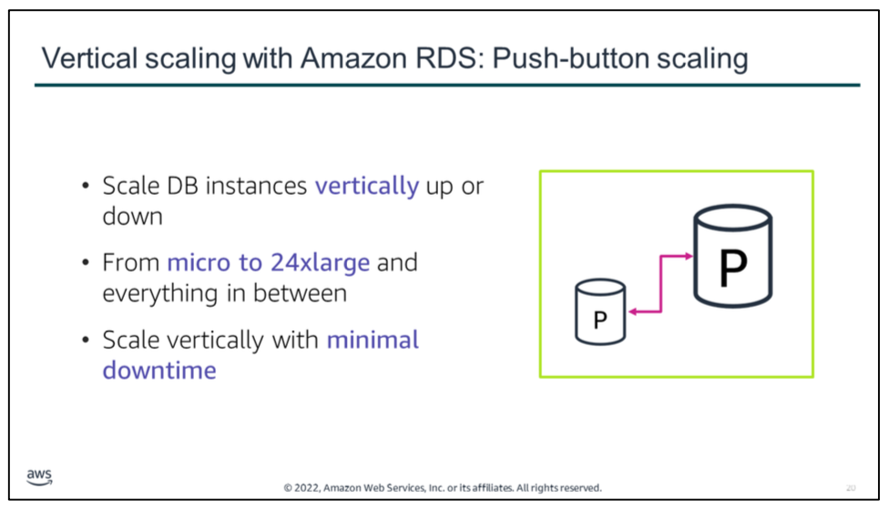
**Vertical scaling with Amazon RDS: Push-button scaling**
- *Scale DB instances **vertically** up/down
- From **micro to 24xlarge** and everything in between
- Scale vertical with **minimal downtime***

First, **consider scaling relational databases**. 
As a managed service, **Amazon Relational Database Service (Amazon RDS)** scales your relational database so that it can keep up with the increasing demands of your application.  [Fully Managed Relational Database - Amazon RDS - Amazon Web Services](https://aws.amazon.com/rds/) 

You can **vertically scale your Amazon RDS database (DB) instance by changing the Amazon RDS `instance class`**. 
*If you decide to scale the compute resources that are available to your DB instance up or down*, *be aware that your database is temporarily unavailable while the DB instance class is modified*. 
This period of unavailability typically lasts only a few minutes. 
It occurs during the maintenance window for your DB instance, unless you specify that the modification should be applied immediately.

When you scale your database instance up or down, **your storage size remains the same and it is not affected by the change**. 
*You can separately modify your DB instance to increase the allocated storage space or improve the performance by **changing the storage type***—for example, from `General Purpose solid state drive (SSD)` to `Provisioned input/output operations per second (IOPS) SSD`. 
Instead of manually provisioning storage, you can also use **Amazon RDS Storage Autoscaling** to automatically scale storage capacity in response to growing database workloads.

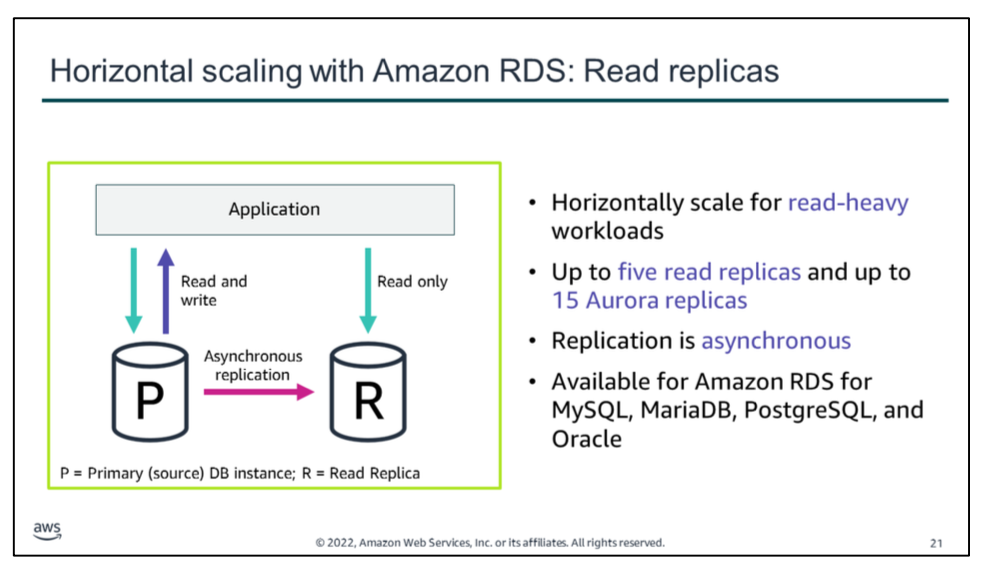
**Horizontal scaling with Amazon RDS: Read replicas** 
- *horizontally scale for **read-heavy** workloads
- Up to **five read replicas** and up to **15 Aurora replicas**
- Replication is **asynchronous**
- Available for Amazon RDS for MySQL, MariaDB, PostgreSQL, and Oracle*

In addition to vertical scaling, you can scale your database horizontally.

Amazon RDS uses the MariaDB, MySQL, Oracle, and PostgreSQL DB engines' built-in replication functionality to create a special type of DB instance called a `read replica` from a `source DB instance`. 

Updates that are made to the source DB instance are `asynchronously` copied to the `read replica`. 
You can reduce the load on your source DB instance by routing read queries from your applications to the read replica.

*To improve the performance of read-heavy database workloads, you can use read replicas to horizontally scale your source DB instance*. 
*You can create one or more replicas (up to **five**) of a given source DB instance and serve high-volume application-read traffic from multiple copies of your data, which **increases aggregate read throughput***.

(aggregate: tổng hợp; )

*If there is a disaster, you can increase the availability of your database by **promoting a read replica to a standalone DB instance***.

For more information about read replicas, see **Working with Read Replicas**. [Working with read replicas - Amazon Relational Database Service](https://docs.aws.amazon.com/AmazonRDS/latest/UserGuide/USER_ReadRepl.html) 

For more information about how to scale your RDS DB instance, see the following resources:

-   Modifying an Amazon RDS DB Instance in the AWS Documentation [Modifying an Amazon RDS DB instance - Amazon Relational Database Service](https://docs.aws.amazon.com/AmazonRDS/latest/UserGuide/Overview.DBInstance.Modifying.html) 
-   Scaling Your Amazon RDS Instance Vertically and Horizontally AWS Database Blog post [Scaling Your Amazon RDS Instance Vertically and Horizontally | AWS Database Blog](https://aws.amazon.com/blogs/database/scaling-your-amazon-rds-instance-vertically-and-horizontally/) 

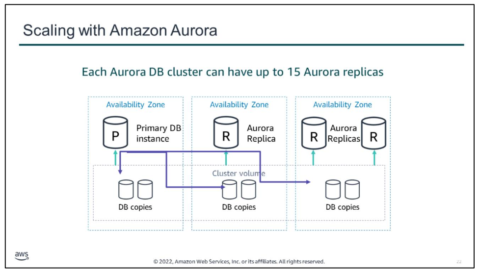
**Scaling with Amazon Aurora**

**Amazon Aurora** further extends the benefits of read replicas by employing an SSD-backed virtualized storage layer that is purpose-built for database workloads. 

Amazon Aurora is a MySQL and PostgreSQL-compatible relational database engine built for the cloud. 

Amazon RDS manages your Amazon Aurora databases and handles tasks such as provisioning, patching, backup, recovery, failure detection, and repair. 

Amazon Aurora features a *distributed, fault-tolerant, self- healing storage system that  **automatically scales up to 64 TB** per database instance*. 
It delivers:
- high performance and availability,
- **point-in-time recovery**,
- continuous backup to Amazon Simple Storage Service (Amazon S3), 
- and replication across three Availability Zones. 
[Fully MySQL and PostgreSQL Compatible Managed Database Service | Amazon Aurora | AWS](https://aws.amazon.com/rds/aurora/) 

(further: thêm nữa; )

An Amazon **`Aurora DB cluster`** consists of one or more DB instances and the *`cluster volume` that manages the data for those DB instances*.  

Two types of DB instances make up an Aurora DB cluster:

-   **Primary DB instance** – Supports read and write operations, and performs all the data modifications to the cluster volume. 
  Each Aurora DB cluster has one primary DB instance.
  
-   **Aurora Replica** – Connects to the same storage volume as the primary DB instance and supports only read operations. 
  ***Each Aurora DB cluster can have up to 15 Aurora replicas in addition to the primary DB instance***.
  
You can choose your DB instance class size and add Aurora replicas to increase read throughput. 

If your workload changes, you can modify the DB instance class size and change the number of Aurora replicas. 
This model works well when the database workload is predictable, because you can adjust capacity manually based on the expected workload.

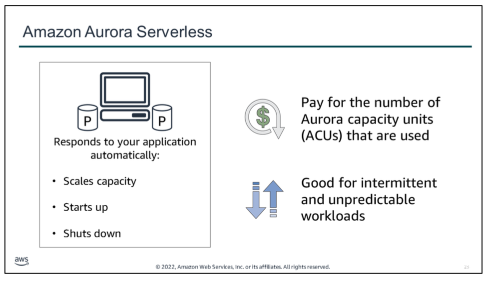
**Amazon Aurora Serverless**
- Responds to your application automatically:
	- Scales capacity
	- Starts up
	- Shuts down
- Pay for the number of `Aurora capacity units (ACUs)` that are used
- Good for intermittent and unpredictable workloads

(intermittent: gián đoạn, trục trặc ; infrequent: không thường xuyên; fleet: đội, nhóm;  )

However, in some environments, *workloads can be intermittent and unpredictable*. 
There can be periods of heavy workloads that might last only a few minutes or hours, and also long periods of light activity, or even no activity. 
Some examples are retail websites with intermittent sales events, reporting databases that produce reports when needed, development and testing environments, and new applications with uncertain requirements. 
In these cases and many others, it can be difficult to configure the correct capacity at the right time. It can also result in higher costs when you pay for capacity that isn't used.

**Aurora Serverless** is an on-demand, automatically scaling configuration for Amazon Aurora. 
Aurora Serverless enables your database:
- to automatically start up, shut down, 
- and scale capacity up or down based on your application's needs.
It enables you to run your database in the cloud without managing any database instances. 
Aurora Serverless can be used for infrequent, intermittent, or unpredictable workloads. [Amazon Aurora Serverless | MySQL PostgreSQL Relational Database | Amazon Web Services](https://aws.amazon.com/rds/aurora/serverless/) 

You create a `database endpoint` without specifying the DB instance class size. 
You specify Aurora capacity units (ACUs). Each ACU is a combination of processing and memory capacity. 

Database storage automatically scales from 10 Gibibytes (GiB) to 64 Tebibytes (TiB), the same as storage in a standard Aurora DB cluster. 

The database endpoint connects to a proxy fleet that routes the workload to a fleet of resources.
Aurora Serverless scales the resources automatically based on the minimum and maximum capacity specifications.

You pay on a per-second basis for the database capacity that you use when the database is active, and you can migrate between standard and serverless configurations. **You pay for the number of ACUs used**.

For more information about Aurora Serverless, see **How Aurora Serverless Works**. [What is Amazon Aurora? - Amazon Aurora](https://docs.aws.amazon.com/AmazonRDS/latest/AuroraUserGuide/CHAP_AuroraOverview.html) 

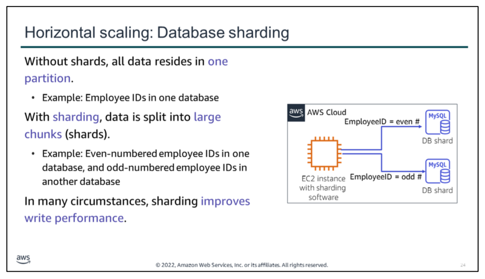
**Horizontal scaling: Database sharding**
- Without `shards`, all data resides in one partition
	- Ex: Employee IDs in one database
- With `sharding`, data is split into **large chunks** (shards)
	- Ex: Even-numbered employee IDs in one db, and odd-numbered employee IDs in another db
- In many circumstances, sharding **improves write performance.**

**Sharding**, also known as **horizontal partitioning**, is a popular scale-out approach for relational databases that improves write performance. --> `Sharding`, theo cách hiểu truyền thống, **là một loại phân vùng tách các cơ sở dữ liệu lớn thành các phần nhỏ hơn, nhanh hơn được gọi là shard**  (Một `shard` theo định nghĩa chỉ là một phần nhỏ của một phân vùng lớn hơn) 

(Sharded: mảnh vỡ, phân mảnh ; split: tách ra; drawback: hạn chế ; incur: chịu; )

Sharding is a technique that *splits data into smaller subsets and distributes them across a number of physically separated database servers*. 
Each `server` is referred to as `a database shard`. 
Database shards usually have the same type of hardware, database engine, and data structure to generate a similar level of performance. 
However, they have **no knowledge of each other**, which is the key characteristic that differentiates `sharding` from other scale-out approaches, such as `database clustering` or `replication`.

***A sharded database architecture offers scalability and fault tolerance***. 
With sharding, data can be split across as many database servers as necessary. Further, if one database shard has a hardware issue or goes through failover, no other shards are impacted because the single point of failure or slowdown is physically isolated. 

The drawback to this approach is that because the data is spread across shards, **data mapping and routing logic must be specifically engineered to read or join data from multiple shards**. 
These types of queries can incur higher latency compared to a nonsharded database.

For more information about sharding with Amazon RDS, read this AWS Database Blog post.  [Sharding with Amazon Relational Database Service | AWS Database Blog](https://aws.amazon.com/blogs/database/sharding-with-amazon-relational-database-service/) 

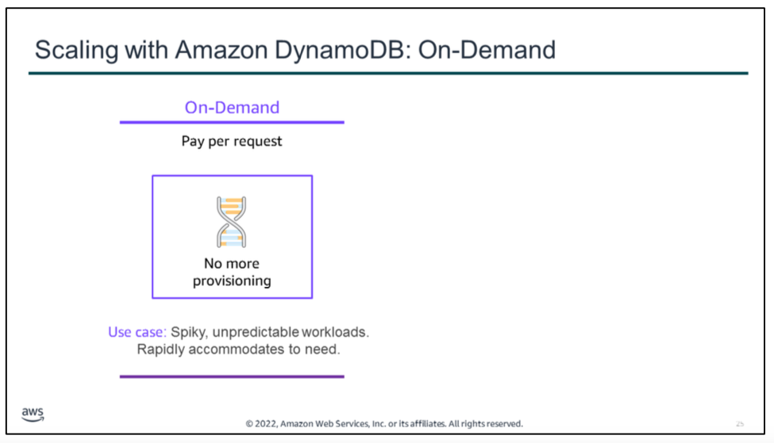
**Scaling with Amazon DynamoDB: On-Demand**

For unpredictable workloads that require a nonrelational database, Amazon DynamoDB On- Demand is a flexible billing option for DynamoDB. It can serve thousands of requests per second without capacity planning. It has a **pay-per-request** pricing model, instead of a provisioned pricing model.

DynamoDB On-Demand can observe any increase or scale of traffic level. 
If the level of traffic hits a new peak, DynamoDB adapts rapidly to accommodate the workload. 
This feature is useful if your workload is difficult to predict or has large spikes over a short duration. 
--> *Use case: Spiky, unpredictable workloads. Rapidly accommodates to need*

(accommodate: thích hợp; )

*You can change a table from provisioned capacity to on-demand once per day*. **You can go from on-demand capacity to provisioned as often as you want**.

To learn more about Amazon DynamoDB On-Demand, read this AWS News Blog post.  [Amazon DynamoDB On-Demand – No Capacity Planning and Pay-Per-Request Pricing | AWS News Blog](https://aws.amazon.com/blogs/aws/amazon-dynamodb-on-demand-no-capacity-planning-and-pay-per-request-pricing/) 

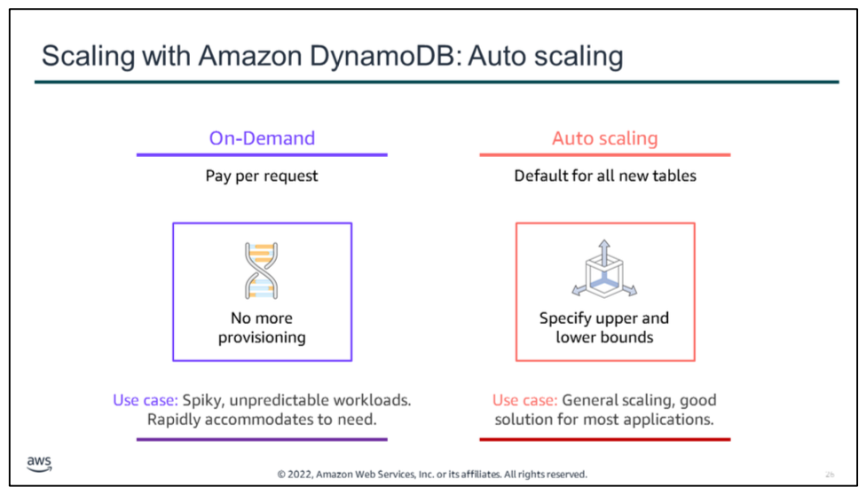
**Scaling with Amazon DynamoDB: Auto scaling**
(reads the slide)

**Amazon DynamoDB** also has a feature called **auto scaling** that’s enabled by **default**. 
*Amazon DynamoDB auto scaling automatically adjusts read and write throughput capacity in response to dynamically changing request volumes, with zero downtime*.
 
With DynamoDB auto scaling, you set:
- your desired throughput utilization target 
- and minimum and maximum limit
—DynamoDB auto scaling handles the rest.

(utilization: sự sử dụng; deviate: trệch hướng, độ lệch; )
DynamoDB auto scaling *works with Amazon CloudWatch to continuously monitor actual throughput consumption*. 
It automatically scales capacity up or down when actual utilization deviates from your target.

**The use of DynamoDB auto scaling incurs no additional cost, beyond what you already pay for DynamoDB and CloudWatch alarms.**

For more information about DynamoDB auto scaling, see  [Managing throughput capacity automatically with DynamoDB auto scaling - Amazon DynamoDB](https://docs.aws.amazon.com/amazondynamodb/latest/developerguide/AutoScaling.html) 

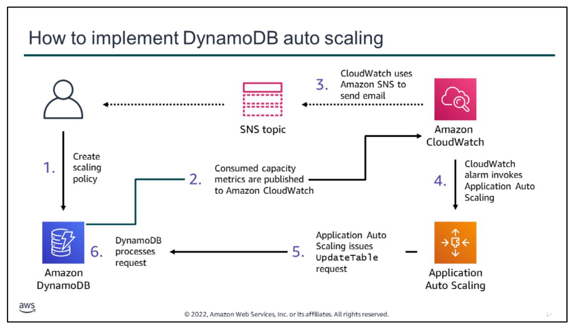
**How to implement DynamoDB: Auto scaling**
Amazon DynamoDB auto scaling uses the *Application Auto Scaling* service to dynamically adjust provisioned throughput capacity on your behalf, in response to actual traffic patterns. 
This service *enables a table or a global secondary index (GSI) to increase its provisioned read and write capacity to handle sudden increases in traffic, without throttling*. When the workload decreases, **Application Auto Scaling decreases the throughput so that you don't pay for unused provisioned capacity**.

(throttle: bóp cổ, thắt họng; exceed: vượt, trội; fall: hạ, xuống thấp; invoke: cầu khẩn; issue: đưa ra, phát hành, xuất phát, là hậu quả; )

To implement DynamoDB auto scaling, perform the following steps:

1. **Create a scaling policy** for your DynamoDB table or GSI. 
   The scaling policy specifies whether you want to scale read capacity or write capacity (or both), and the minimum and maximum provisioned capacity unit settings for the table or index.
   
2. DynamoDB publishes consumed capacity metrics to Amazon CloudWatch. --> Consumed capacity metrics are published to Amazon CloudWatch
   
3. If the table's consumed capacity *exceeds* your target utilization (or *falls* below the target) for a specific length of time, Amazon CloudWatch triggers an alarm. 
   You can use Amazon Simple Notification Service (Amazon SNS) to view the alarm in the Amazon CloudWatch console and receive notifications.
5. The CloudWatch alarm *invokes* Application Auto Scaling to *evaluate your scaling policy*.
6. Application Auto Scaling *issues* an **UpdateTable** request to DynamoDB adjust your table's provisioned throughput.
7. DynamoDB *processes* the **UpdateTable** request and dynamically increases (or decreases) the table's provisioned throughput capacity so that it approaches your target utilization.

For more information about how to implement DynamoDB auto scaling, Managing Throughput Capacity Automatically with DynamoDB Auto Scaling. [Managing throughput capacity automatically with DynamoDB auto scaling - Amazon DynamoDB](https://docs.aws.amazon.com/amazondynamodb/latest/developerguide/AutoScaling.html) 

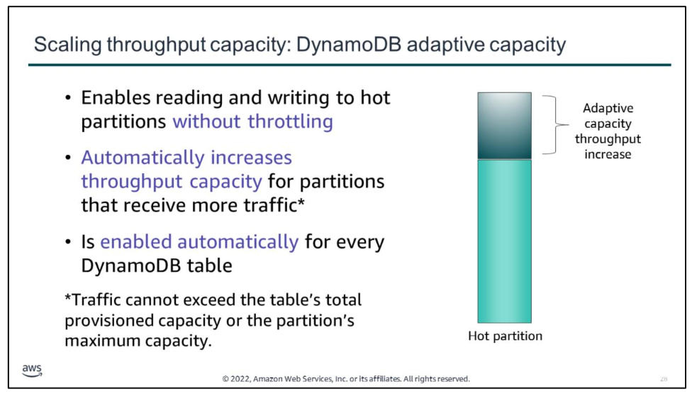
**Scaling throughput capacity: DynamoDB adaptive capacity**
- Enables reading and writing to hot partitions **without throttling**
- **Automatically increases throughput capacity** for partitions that receive more traffic. (traffic cannot exceed the table's total provisioned capacity or the partition's max capacity)
- is **enabled automatically** for every DynamoDB table

(throttling: bóp cổ, tắc nghẽn (?); imbalance: thiếu cân bằng;  extreme: cực đoan; accommodate: điều tiết, thích hợp; explicitly: rõ ràng; )

**It's not always possible to distribute read and write activity evenly across partitions all the time**. 
When data access is imbalanced, one partition can receive a higher volume of read and write traffic compared to other partitions (called a *hot partition*). 
In extreme cases, throttling can occur if a single partition receives:
- more than 3,000 read capacity units (RCUs) 
- or 1,000 write capacity units (WCUs).

To better accommodate uneven access patterns, DynamoDB adaptive capacity enables your application to continue reading and writing to hot partitions without being throttled. *The traffic, however, cannot exceed your table’s total provisioned capacity or the partition maximum capacity.* 
Adaptive capacity works by automatically increasing throughput capacity for partitions that receive more traffic.

*Adaptive capacity is enabled automatically for every DynamoDB table*, so you don't need to explicitly enable or disable it.

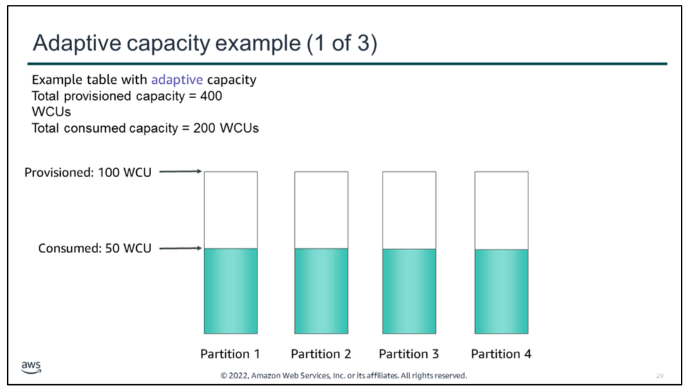
**Adaptive capacity example (1 of 3)**
This diagram illustrates how adaptive capacity works.

(sustain: duy trì, nhận; )

The example table is provisioned with 400 WCUs evenly shared across four partitions, so that each partition can sustain up to 100 WCUs per second.

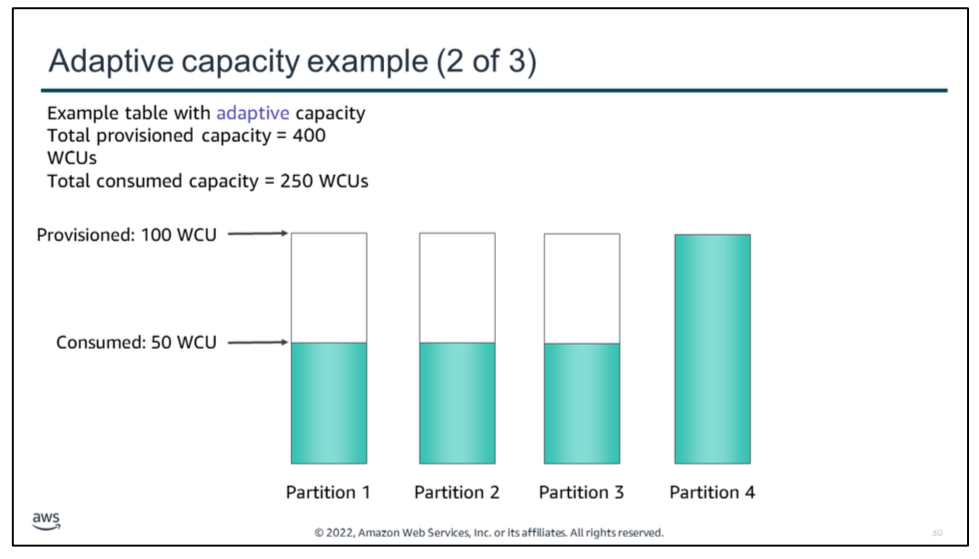
**Adaptive capacity example (2 of 3)**
- Partitions 1, 2, and 3 each receive write traffic of 50 WCUs per second. 
- Partition 4 receives 150 WCUs per second. 
  This hot partition can accept write traffic when it still has unused burst capacity, but eventually it throttles traffic that exceeds 100 WCUs per second.

(burst: nổ tung; )

**Adaptive capacity example (3 of 3)**
DynamoDB adaptive capacity responds by increasing the capacity for Partition 4 so that it can sustain the higher workload of 150 WCUs per second without being throttled.

For more information about DynamoDB adaptive capacity, see Understanding DynamoDB Adaptive Capacity.

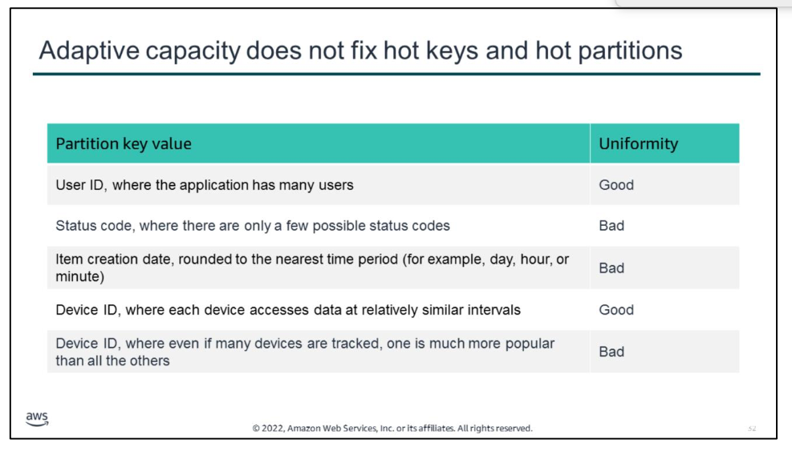
**Adaptive capacity does not fix hot keys and hot partitions**

(partition: sự chia ra, bức vách ngăn; portion: chia phần; determine: xác định; affect: ảnh hưởng; underlying: nằm dưới, cơ bản; evenly: đều, ngang bằng;  throttling: bóp cổ, tắc nghẽn; distinct: khác biệt, rõ ràng; )
The partition key portion of a table's primary key determines the logical partitions where a table's data is stored. --> tạm dịch: partition key portion của một khóa chính (primary key) của table xác định các phân vùng logic, nơi dữ liệu của một table được lưu trữ 

**This determination in turn affects the underlying physical partitions**. Provisioned I/O capacity for the table is *divided evenly among these physical partitions*. 
--> Therefore, ***a partition key design that doesn't distribute I/O requests evenly can create `hot partitions` that result in throttling and use your provisioned I/O capacity inefficiently***.

The optimal usage of a table's provisioned throughput depends on:
- the workload patterns of individual items, 
- and also on the design of the partition key. 
It doesn't mean that you must access all partition key values to achieve an efficient throughput level. It doesn’t even mean that the percentage of accessed partition key values must be high. 
It does mean that *the more distinct partition key values that your workload accesses, the more those requests are spread across the partitioned space*. 
In general, ***you use your provisioned throughput more efficiently when the ratio of accessed partition key values to total partition key values increases***.

The table shows a comparison of the provisioned throughput efficiency of some common partition key schemas. (SLIDE)

For more information about designing partition keys, see Designing Partition Keys to Distribute Your Workload Evenly. [Designing partition keys to distribute your workload - Amazon DynamoDB](https://docs.aws.amazon.com/amazondynamodb/latest/developerguide/bp-partition-key-uniform-load.html) 
 

# 4. Designing an environment that’s highly available
key takeaways:
-   You can design your network architectures to be *highly available* and *avoid single points of failure*
-   Route 53 offers a variety of routing options that can be combined with *DNS failover* to enable a *variety of low-latency, fault-tolerant architectures*

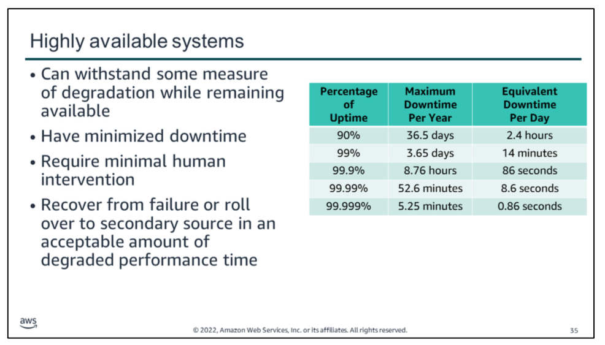
**Highly available systems**

*It is a best practice to avoid single points of failure when you design and build solutions*. To follow this best practice, you want to design your architecture to be highly available.

(withstand: chống lại, chịu đựng; degradation: sự thoái hóa; remain: vẫn còn; intervention: sự can thiệp; )

A highly available system is one that:
- can withstand some measure of degradation while remaining available. 
- downtime is minimized as much as possible, 
- and minimal human intervention is required.

**A highly available system enables resiliency in a reactive architecture**.
A resilient workload can recover when it’s stressed by load (more requests for service), attacks, or component failure. 
A resilient workload:
- recovers from a failure, 
- or it rolls over to a secondary source within an acceptable amount of degraded performance time.

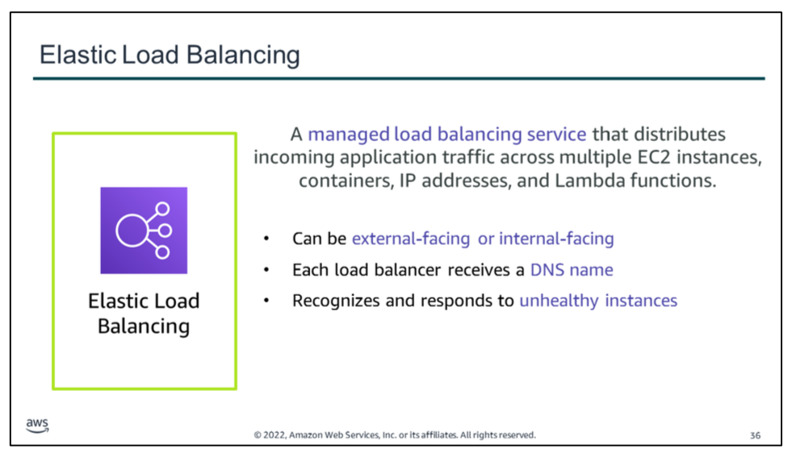
**Elastic Load Balancing** (ELB)

Elastic Load Balancing is a key component of creating a highly available architecture.

ELB **automatically distributes incoming application traffic across multiple targets, such as :
- EC2 instances, 
- containers, 
- IP addresses, 
- and Lambda functions**.
*It can handle the varying load of your application traffic in a single Availability Zone or across multiple Availability Zones*.

ELB offers three types of load balancers. 
Load balancers can be:
- external-facing and distribute inbound public traffic. 
- They can also be internal-facing and distribute private traffic.
--> Load balancers có thể **external-facing/ internal-facing**, có thể phân phối inbound public traffic / private traffic. 

Each load balancer **receives a default Domain Name System (DNS) name**.

Finally, **ELB automatically distributes incoming traffic across multiple targets in multiple Availability Zones and only sends traffic to healthy targets**. 
To discover the availability of your EC2 instances, the load balancer periodically sends pings, attempts connections, or sends requests to test the EC2 instances. These tests are called health checks. 
Each registered EC2 instance must respond to the target of the health check with an HTTP status code 200 to be considered healthy by your load balancer. --> *recognizes and responds to unhealthy instances.*

(attempt: thử ; )

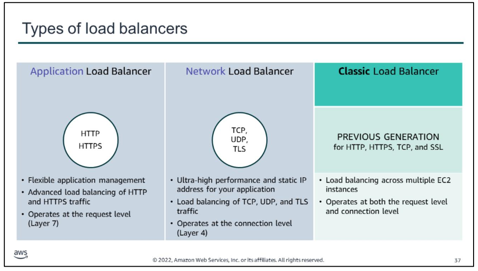
**Types of load balancers**

ELB offers three types of load balancers that all feature the high availability, automatic scaling, and robust security needed to make your applications fault-tolerant.

1/ An **Application Load Balancer** 
- operates at the `application` level (Open Systems Interconnection, or OSI, model layer 7). 
- It *routes traffic to targets*—EC2 instances, containers, IP addresses, and Lambda functions—*based on the content of the request*. 
- It works well for the advanced load balancing of `HTTP` and Secure HTTP (`HTTPS`) traffic. 
- An Application Load Balancer provides advanced request routing that is targeted at the delivery of modern application architectures, including microservices and container-based applications. --> *Flexible application management*
- An Application Load Balancer simplifies and improves the security of your application by ensuring that the latest Secure Sockets Layer/Transport Layer Security (SSL/TLS) ciphers and protocols are used at all times.

(cipher: mật mã; sudden: đột ngột; volatile: hay thay đổi;  )

2/ A **Network Load Balancer** :
- operates at the `network` transport level (OSI model layer 4), 
- routing connections to targets such as EC2 instances, containers, and IP addresses.  --> no Lambda functions
- It works well for load balancing both *Transmission Control Protocol (TCP) and User Datagram Protocol (UDP) traffic.* --> and TLS?
- can handle ***millions of requests per second***, while maintaining *ultra-low latencies*. 
- is optimized to handle sudden and volatile network traffic patterns. 
- *Ultra-high performance and static IP address for your application*

3/ A **Classic Load Balancer**:
- is an older implementation
- provides basic load balancing across multiple EC2 instances, 
- operates at *both the application level and network transport level*. 
- supports the load balancing of applications that use HTTP, HTTPS, TCP, and SSL. 
- When possible, AWS recommends that you use a dedicated Application Load Balancer or Network Load Balancer.

Using VPC peering:
- you can access internal load balancers (including Classic Load Balancers, Application Load Balancers, and Network Load Balancers) from another VPC. 
- is available for intra-Region and inter-Region connectivity for local or cross-account VPCs.

To learn more about the differences between the three types of load balancers, see Product comparisons on the **Elastic Load Balancing features page**. [Network Traffic Distribution – Elastic Load Balancing – Amazon Web Services](https://aws.amazon.com/elasticloadbalancing/features/) 

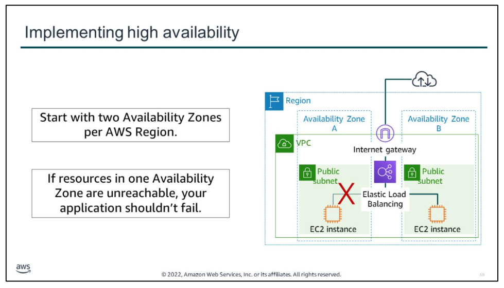
**Implementing highly available**

To build a highly available application, it is a best practice to ***launch resources in multiple Availability Zones (start with 02 AZs per AWS Region) and use a load balancer to distribute traffic among those resources***. --> *If resources in one AZ are unreachable, your application shouldn't fail.*
Running your applications across multiple Availability Zones provides greater availability if there is a failure in a data center.

In the basic pattern here,
- two web servers run on EC2 instances that are in different Availability Zones. 
- The instances are positioned behind an Elastic Load Balancing load balancer that distributes traffic between them. 
- If one server becomes unavailable, the load balancer is configured to stop distributing traffic to the unhealthy instance and start routing traffic to the healthy instance. 
That way, the application is still available if there is a data center failure in one of the Availability Zones.

Most applications can be designed to support two Availability Zones per AWS Region. 
- *If you use data sources that only support primary or secondary failover, then your application might not benefit from the use of more Availability Zones*. Because Availability Zones are spread out physically, you won't receive much benefit from duplicating your resources in three or more Availability Zones in one AWS Region.
- For heavy Amazon EC2 Spot Instance usage—or data sources that go beyond active/passive, such as Amazon DynamoDB—there might be a benefit to using more than two Availability Zones.

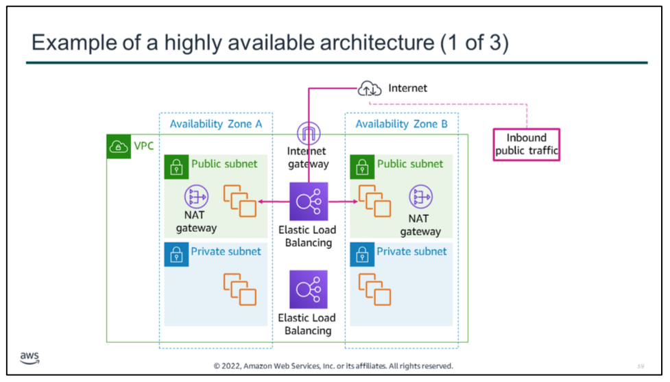
**Example of a highly available architecture (1 of 3)**
Like the architecture that you just considered, EC2 instances are positioned behind a load balancer, which distributes inbound public traffic between them. 
If one of the servers becomes unavailable, the load balancer is configured to stop distributing traffic to the unhealthy instances and start routing traffic to the healthy ones.

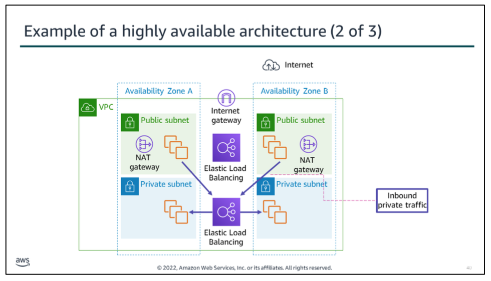
**Example of a highly available architecture (2 of 3)**
You can include a second load balancer in your architecture to route inbound traffic from the instances in the public subnets to the instances in the private subnets.

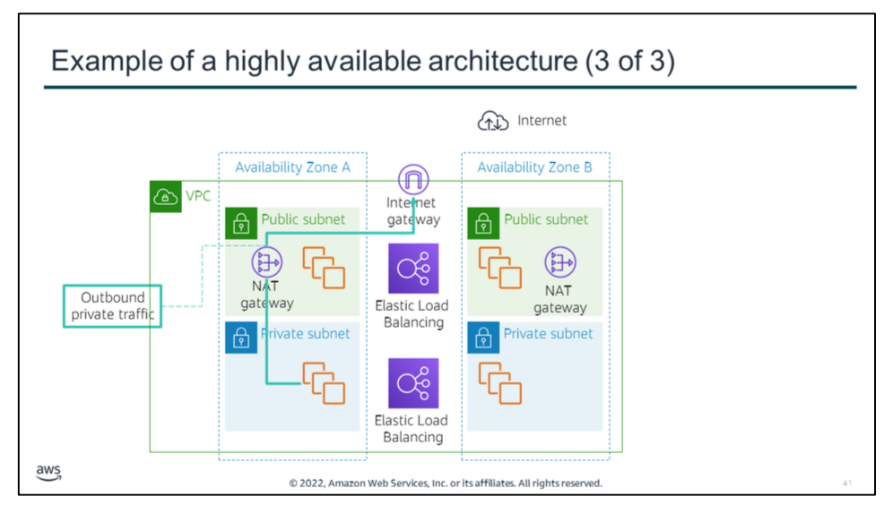
**Example of a highly available architecture (3 of 3)**

If you have resources in multiple Availability Zones and they share one NAT gateway—and if the NAT gateway’s Availability Zone is down—resources in the other Availability Zones lose internet access. ***It’s a best practice to have NAT gateways in both Availability Zones to ensure high availability***.

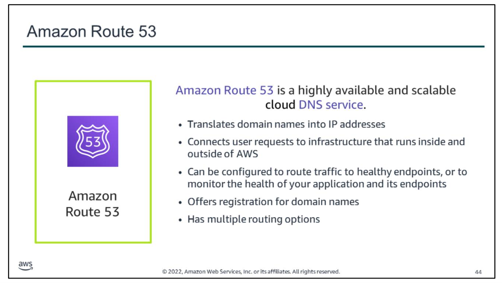
**Amazon Route 53**
You can also implement multi-Region high availability and fault tolerance in your network architecture by using Amazon Route 53.

Amazon Route 53 is a **highly available and scalable cloud DNS service**. 
- is designed to provide a reliable and cost-effective way to route users to internet applications.
- **translates domain names** like example.com **into the numeric IP addresses** (such as 192.0.2.1) that computers use to connect to each other.
- effectively **connects user requests to infrastructure that runs in AWS** (such as EC2 instances, ELB load balancers, or S3 buckets) and **outside of AWS**.
- **can be configured** DNS health checks **to route traffic  to healthy endpoints, or to independently monitor the health of your application and its endpoints**.
- also **offers domain name registration**. 
  You can purchase and manage domain names such as example.com, and Amazon Route 53 automatically configures DNS settings for your domains.
- **offers various routing options**, which can be combined with DNS failover to enable low-latency, fault-tolerant architectures. 
  For details about Amazon Route 53 routing options, see [Choosing a routing policy - Amazon Route 53](https://docs.aws.amazon.com/Route53/latest/DeveloperGuide/routing-policy.html) 

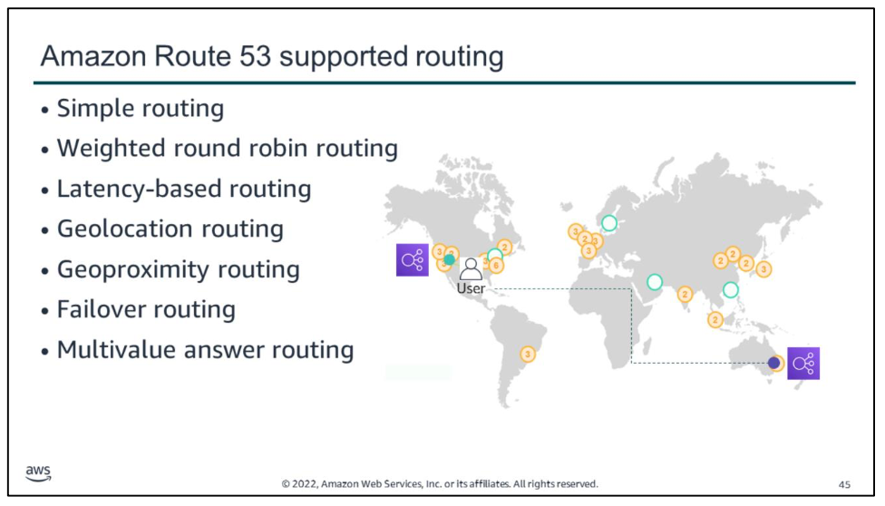
**Amazon Route 53 supported routing**

tham khảo: 
[Routing Policy trong Route 53 (Phần 2) - KungFu Tech](https://kungfutech.edu.vn/bai-viet/aws/routing-policy-tiep) 
[Amazon Route 53 là gì? | DevelopersIO (classmethod.jp)](https://dev.classmethod.jp/articles/amazon-route-53-la-gi/) 
[(5) Route53 là gì? Làm thế nào để chuyển Name Server từ Domain provider sang Route53 (viblo.asia)](https://viblo.asia/p/route53-la-gi-lam-the-nao-de-chuyen-name-server-tu-domain-provider-sang-route53-924lJb7mlPM)
[AWS : VPC, S3, Route53 Part 3 - VTI TechBlog!](https://vtitech.vn/aws-part-3-vpc-s3-route53/) 

| Geolocation routing                                                                                                                                                                                          | Geoproximity routing                                                                                                                                                                                                                                                                                       |
|--------------------------------------------------------------------------------------------------------------------------------------------------------------------------------------------------------------|------------------------------------------------------------------------------------------------------------------------------------------------------------------------------------------------------------------------------------------------------------------------------------------------------------|
| Sử dụng đinh tuyến dựa vào **vị trí địa lý phía client**.                                                                                                                                                        | Sử dụng khi bạn muốn định tuyến lưu lượng dựa trên vị trí của tài nguyên của mình                                                                                                                                                                                                                          |
| Bạn có thể định nghĩa user ở khu vực Asia sẽ request đến IP_A, user khu vực EU sẽ request đến IP_B chẳng hạn.--> Chúng ta cần tạo một record "Default" để sử dụng cho các user không được định nghĩa vị trí. | Có thể thay đổi lưu lượng traffic bằng cách định nghĩa  `bias`. Cần dùng Route 53 Traffic Flow (advanced) để dử dụng tính năng này  Use-case: Ví dụ Facebook có 2 máy chủ ở Việt Name có IP là A và B, A được đặt ở Hà Nội và B đặt ở HCM. Bias sẽ quy định user ở Huế, Đà Năng sẽ truy cập đến máy chủ nào |

Amazon Route 53 supports several types of routing policies, which determine how Amazon Route 53 responds to queries:

1/ **Simple routing (*round* robin)** 
Distributes the number of requests as **evenly** as possible between all participating servers.

2/ **Weighted round robin routing** (định tuyến vòng tròn có `trọng số`)
Enables you to assign `weights` to resource record sets to specify the frequency that different responses are served at. 
You might want to use this capability to do A/B testing, which is when you send a small portion of traffic to a server where you made a software change. 
For instance, suppose you have two record sets that are associated with one DNS name: 
- one with weight 3 
- and one with weight 1. 
In this case, 
- 75 percent of the time, Amazon Route 53 will return the record set with weight 3,
- and 25 percent of the time, Amazon Route 53 will return the record set with weight 1. 
`Weights` can be any number between 0 and 255.

3/ **Latency-based routing (LBR)** 
Use when *you have resources in multiple AWS Regions and you want to route traffic to the Region that provides the best latency*. 

*Latency routing works by routing your customers to the AWS endpoint* (for example, EC2 instances, Elastic IP addresses, or load balancers) that *provides the fastest experience based on actual performance measurements of the different AWS Regions where your application runs*.

4/ **Geolocation routing** --> định tuyến dựa vào vị trí địa lý của user

Enables you to choose the resources that serve your traffic **based on the geographic location of your users** (the origin of the DNS queries). 
*When you use geolocation routing, you can localize your content and present some or all of your website in the language of your users*. 
You can also *use geolocation routing to restrict the distribution of content to only the locations where you have distribution rights*. 
Another possible use is for balancing the load across endpoints in a predictable, easy-to-manage way, so that each user location is consistently routed to the same endpoint.

5/ **Geoproximity routing** 

Enables you to route traffic *based on the physical distance between your users and your resources*, if you are using *Route 53 Traffic Flow*. 
You can also route more or less traffic to each resource by specifying a positive or negative bias. 
When you create a traffic flow policy, you can specify either an AWS Region (if you are using AWS resources) or the latitude and longitude for each endpoint.

6/ **Failover routing (DNS failover)** 
*Use when you want to configure active-passive failover.* 
Route 53 can help detect when your website has an `outage`, and redirect your users to alternate locations where your application is operating properly. 
**When you enable this feature, Route 53 health- checking agents monitor each location or endpoint of your application to determine its availability**. 
You can use this feature to increase the availability of your customer-facing application.

7/ **Multivalue answer routing** 
Use if you want to *route traffic approximately randomly to multiple resources, such as web servers*. 
You can create one multivalue answer record for each resource. 
You can also optionally associate a Route 53 health check with each record. 

For example, suppose that you manage:
- an HTTP web service with 12 web servers that each have their own IP address. 
- No one web server could handle all of the traffic. 
- However if you create a dozen multivalue answer records, Route 53 responds to DNS queries with up to eight healthy records in response to each DNS query.
- Route 53 gives different answers to different DNS resolvers. 
- If a web server becomes unavailable after a resolver caches a response, client software can try another IP address in the response.

(approximately: xấp xỉ; )

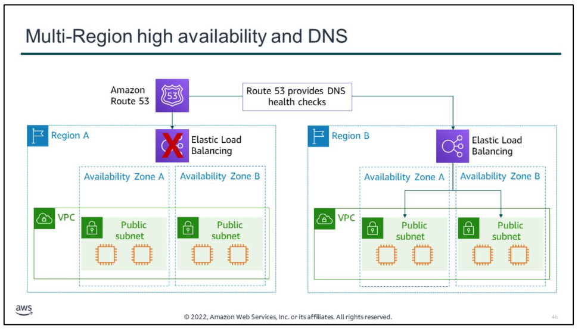
**Multi-Region highly available and DNS**

With **DNS failover routing**, Route 53 can help detect an outage of your website and redirect your users to alternate locations where your application is operating properly. 
***When you enable this feature, Route 53 health-checking agents monitor each location or endpoint of your application to determine its availability.*** 
You can use this feature to increase the availability of your customer- facing application.

# 5. Monitoring
key takeaways:
-   **AWS Cost Explorer, AWS Budgets, AWS Cost and Usage Report**, and the **Cost Optimization Monitor** can help you understand and manage the **cost of your AWS infrastructure**.
-   **CloudWatch** collects monitoring and operational data in the form of logs, metrics, and events.
  It visualizes the data by using automated dashboards so you can get a unified view of your AWS resources, applications, and services that run in AWS and on-premises.
-   **EventBridge** is a serverless event bus service that makes it easy to connect your applications with data from a variety of sources. 
  EventBridge ingests a stream of real-time data from your own applications, SaaS applications, and AWS services. It then routes that data to targets.

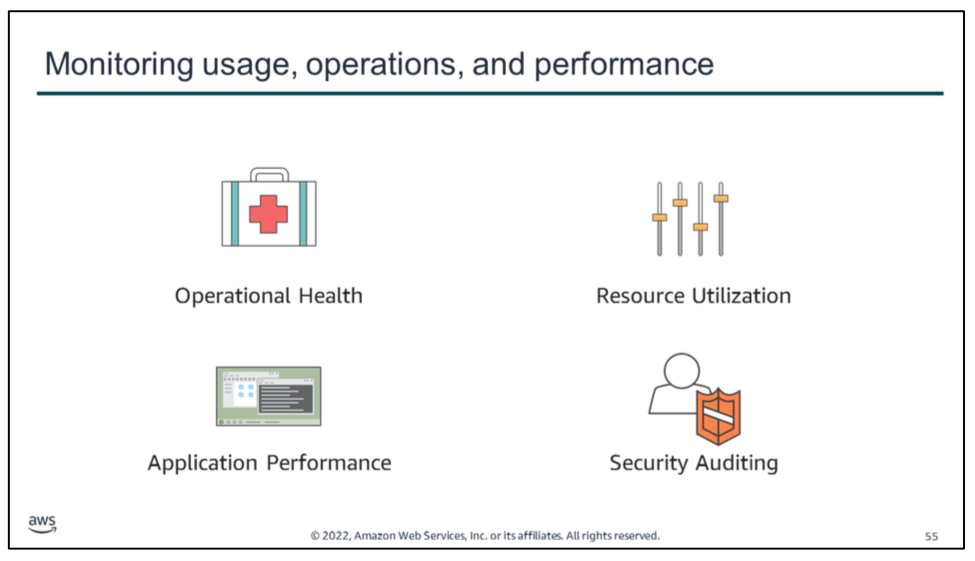
**Monitoring usage, operations, and performance**
Monitoring is an essential component of a reactive architecture.

Monitoring can help you:
-   Track how your resources are *operating* and performing
-   Track *resource utilization* and *application performance* to make sure that your infrastructure is meeting demand
-   Decide what permissions to set for your AWS resources to achieve the *security* goals that you want

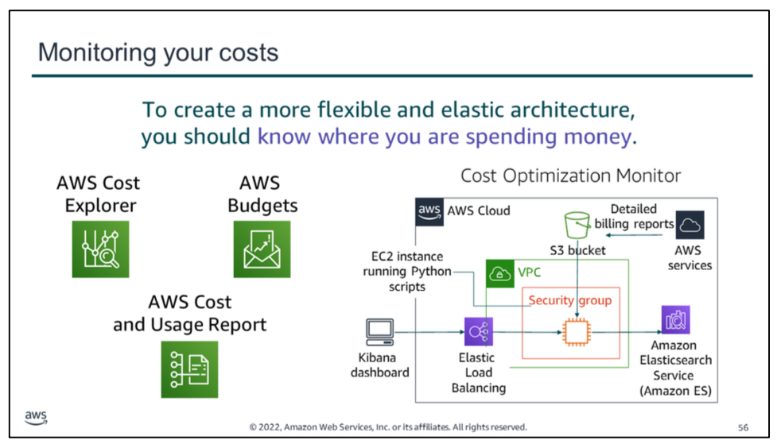
**Monitoring your costs**
To create a more flexible and elastic architecture, you should know where you are spending money.
(comprehensive: toàn diện; )

Monitoring can also help you to understand and manage the cost of your AWS infrastructure. AWS provides monitoring and reporting tools, including the following:

1/ **AWS Cost Explorer** 
- helps you visualize, understand, and manage your AWS costs and usage with daily or monthly granularity. 
- You can use it to view data up to the last 13 months, which enables you to see *patterns in how you spend AWS resources over time*.
[AWS Cost Explorer - Amazon Web Services](https://aws.amazon.com/aws-cost-management/aws-cost-explorer/) 

2/ **AWS Budgets** 
- enables you to *set custom budgets* that alert you when your costs or usage exceed (or are forecasted to exceed) your budgeted amount 
 [Managing your costs with AWS Budgets - AWS Cost Management (amazon.com)](https://docs.aws.amazon.com/cost-management/latest/userguide/budgets-managing-costs.html) 

3/ **AWS Cost and Usage Report** 
- contains the most comprehensive set of AWS cost and usage data available, including *additional metadata about AWS services, pricing, and reservations*. [Access Comprehensive Cost and Usage Information – AWS Cost & Usage Reports – Amazon Web Services](https://aws.amazon.com/aws-cost-management/aws-cost-and-usage-reporting/) 

4/ **The Cost Optimization Monitor**
- is a solution architecture that automatically processes detailed billing reports to provide granular metrics that you can search, analyze, and visualize in a dashboard that you can customize. 
- The solution provides you with insight into service usage and cost, which you can break down by period, account, resource, or tags.
[Cost Optimization Monitor | Implementations | AWS Solutions AWS Solutions (amazon.com)](https://aws.amazon.com/solutions/implementations/cost-optimization-monitor/) 
--> This Solutions Implementation is no longer available. Find other AWS Solutions using our [AWS Solutions Library](https://aws.amazon.com/solutions/). 

To learn more about how you can monitor the cost of your AWS infrastructure, see **AWS Cost Management Services**. [AWS Cloud Financial Management | Amazon Web Services](https://aws.amazon.com/aws-cost-management/) 

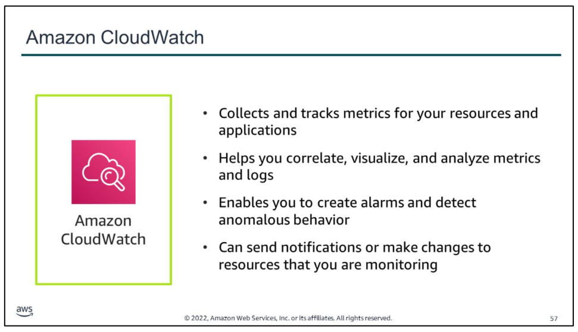
**Amazon CloudWatch**

Amazon CloudWatch is a monitoring and observability service that is built for DevOps engineers, developers, site reliability engineers, and information technology managers. 
CloudWatch provides you with `data` and `actionable insights` to:
- monitor your applications, 
- respond to system- wide performance changes, 
- optimize resource utilization, 
- and get a unified view of operational health.

(anomalous: bất thường; unified: hợp nhất; gain: gia tăng; utilization: sử dụng;  )

You can use CloudWatch to:
- **collect and track metrics**, which are variables that you can measure **for your resources and applications**.
- **Helps you correlate, visualize, and analyze metrics and logs**
- **create CloudWatch alarms** --> that watch metrics and send notifications. 
- and **detect anomalous behavior** --> Also, when a threshold is breached, CloudWatch can automatically change the resources that you are monitoring.

For example, you can monitor the CPU usage and the disk reads and writes of your EC2 instances. 
- You can then use this data to determine whether you should launch additional instances to handle increased load. 
- You can also use this data to stop under-used instances to save money.

In addition to monitoring the *built-in metrics that come with AWS*, you can monitor *your own custom metrics*. 
With CloudWatch, you gain system-wide visibility into resource utilization, application performance, and operational health.

For more information about CloudWatch, see What is Amazon CloudWatch?  [What is Amazon CloudWatch? - Amazon CloudWatch](https://docs.aws.amazon.com/AmazonCloudWatch/latest/monitoring/WhatIsCloudWatch.html) 

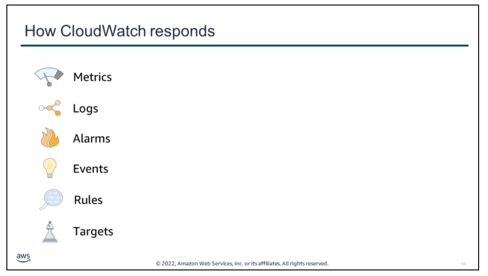
**How CloudWatch responds**
You can use several CloudWatch components to monitor your resources and applications, and to respond to events.

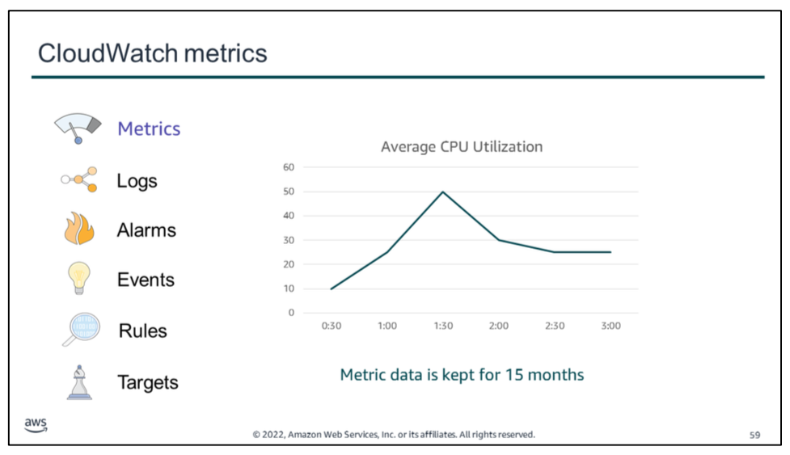
**CloudWatch metrics**
`Metrics` are data about the performance of your systems. 
By default, many AWS services provide metrics for resources, such as EC2 instances, Amazon Elastic Block Store (Amazon EBS) volumes, and Amazon RDS DB instances. 
You can also enable detailed monitoring of some resources, such as your EC2 instances, or publish your own application metrics. 
CloudWatch can load all the metrics in your account (both AWS resource metrics and application metrics that you provide) for search, graphing, and alarms.

**Metric data is kept for 15 months**, which enables you to view both up-to-the-minute data and historical data.

For more information about metrics, see  [Using Amazon CloudWatch metrics - Amazon CloudWatch](https://docs.aws.amazon.com/AmazonCloudWatch/latest/monitoring/working_with_metrics.html)  

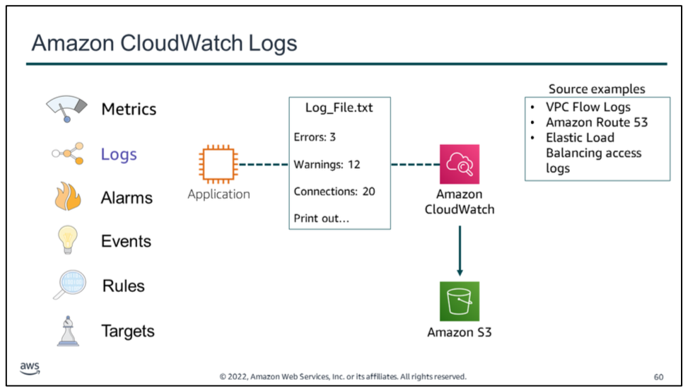
**Amazon CloudWatch Logs**

You can use Amazon CloudWatch Logs to monitor, store, and access your log files from sources such as EC2 instances, AWS CloudTrail, Route 53, and other AWS services.

For example, you can use CloudWatch Logs to monitor applications and systems by using `log data`. 
`CloudWatch Logs` can track the number of errors that occur in your application logs. It sends a notification when the rate of error exceeds a threshold that you specify.

Additionally, you can use `CloudWatch Logs Insights` to analyze your logs in seconds. It gives you fast, interactive queries and visualizations. 
You can use line or stacked area charts to visualize query results, and add those queries to a CloudWatch Dashboard.

For more information about CloudWatch Logs, see the following resources:

-   Amazon CloudWatch Logs
    [What is Amazon CloudWatch Logs? - Amazon CloudWatch Logs](https://docs.aws.amazon.com/AmazonCloudWatch/latest/logs/WhatIsCloudWatchLogs.html)
-   Amazon CloudWatch Logs Insights [New – Amazon CloudWatch Logs Insights – Fast, Interactive Log Analytics | AWS News Blog](https://aws.amazon.com/blogs/aws/new-amazon-cloudwatch-logs-insights-fast-interactive-log-analytics/) 

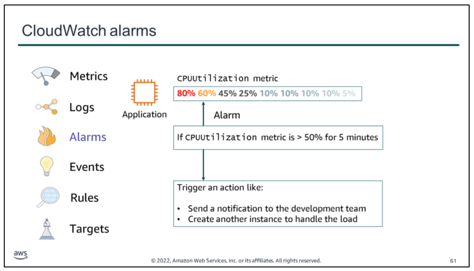
**CloudWatch alarms**

You can use an alarm to automatically *initiate* actions on your behalf. 

An `alarm` watches a single metric over a specified time period. 
It performs one or more specified actions, based on the value of the metric relative to a threshold over time. 
The action is a notification that is sent to an Amazon SNS topic or an Auto Scaling policy. You can also add alarms to dashboards.

(initiate: bắt đầu; )

Alarms *invoke* actions for sustained state changes only. 
CloudWatch alarms do not invoke actions merely because they are in a particular state. 
*The state must have changed and been maintained for a specified number of periods*.

In the example that is shown, 
- an alarm is *triggered* when the **CPUUtilization metric** (that is, the percentage of allocated EC2 compute units that are currently in use on the instance) is *greater than 50 percent for 5 minutes*. 
- The alarm *triggers an action*, such as:
	- running an Auto Scaling policy 
	- or sending a notification to the development team. 
  
  [List the available CloudWatch metrics for your instances - Amazon Elastic Compute Cloud](https://docs.aws.amazon.com/AWSEC2/latest/UserGuide/viewing_metrics_with_cloudwatch.html) 

**Actions can also be run when an alarm is *not* triggered**.  

For more information about CloudWatch alarms, see [Using Amazon CloudWatch alarms - Amazon CloudWatch](https://docs.aws.amazon.com/AmazonCloudWatch/latest/monitoring/AlarmThatSendsEmail.html) .

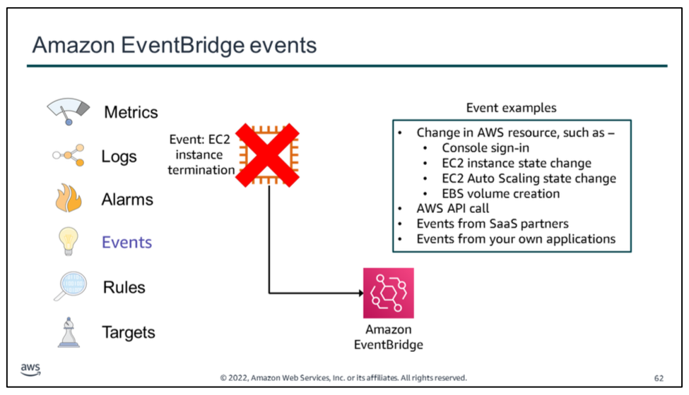
**Amazon EventBridge events**
Amazon EventBridge (formerly called Amazon CloudWatch Events):
- ingests a stream of *real-time data* from your own applications, software-as-a-service (SaaS) applications, and AWS services. 
- It then *routes that data to targets*, such as AWS Lambda.

(ingest: ăn, nhập; indicate: chỉ ra; )

An `event` indicates `a change in an environment`. It can be an AWS environment, a SaaS partner service or application, or one of your own custom applications or services. 

Event examples: 
- Change in AWS resource, such as:
	- Console sign-in
	- (EC2 instance state change) Amazon EC2 generates an `event` when the state of an EC2 instance changes from pending to running, 
	-  (EC2 Auto Scaling state change)  Amazon EC2 Auto Scaling generates `events` when it launches or terminates instances. 
	- EBS volume creation
- AWS CloudTrail publishes `events` when you make API calls. 
- You can also set up scheduled `events` that are generated on a periodic basis.
- Events from Saas partners
- Events from your own applications

Existing CloudWatch Events users can access their existing default *bus*, *rules*, and *events* in the new *EventBridge* console and in the *CloudWatch Events* console. EventBridge uses the same CloudWatch Events API, so all your existing CloudWatch Events API usage remains the same.

For more information about EventBridge, see   [What Is Amazon EventBridge? - Amazon EventBridge](https://docs.aws.amazon.com/eventbridge/latest/userguide/eb-what-is.html) 

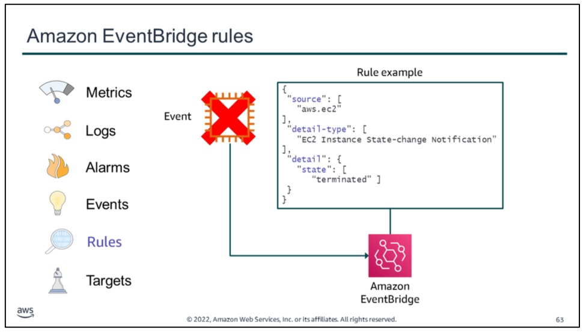
**Amazon EventBridge rules**

You can ***set up routing rules to determine where to send your data to build application architectures that react—in real time—to all your data sources***.

A `rule` matches incoming events and routes them to `targets` for processing. 
*A single rule can route to multiple targets, which are all processed in parallel.* 
Rules are not processed in a particular order. Thus, different parts of an organization can look for and process the events that are of interest to them. 
A rule can customize the JavaScript Object Notation (JSON) that is sent to the target by passing only certain parts, or by overwriting it with a constant.

(parallel: song song; )

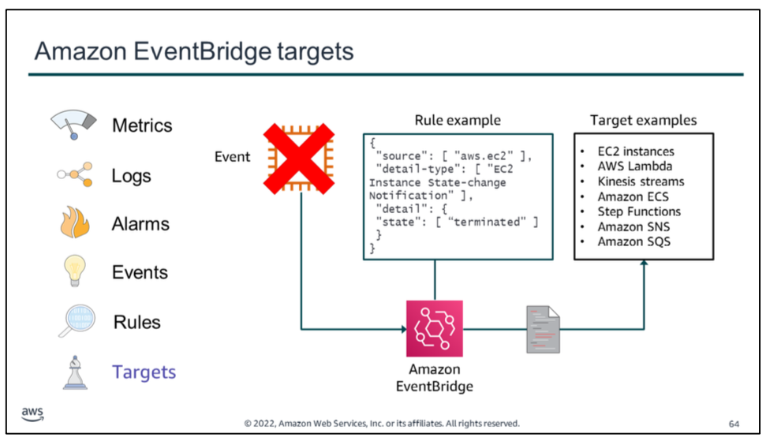
**Amazon EventBridge targets**
A `target` processes `events`. 
Targets can include:
- EC2 instances, 
- Lambda functions, 
- Amazon Kinesis streams, 
- Amazon Elastic Container Service (Amazon ECS) tasks, 
- AWS Step Functions state machines, 
- SNS topics, Amazon Simple Queue Service (Amazon SQS) queues, 
- and built-in targets. 
A target receives events in JSON format.

When *you create a `rule`, you associate it with a specific `event bus`*, and **the rule is matched only to events received by that event bus**.

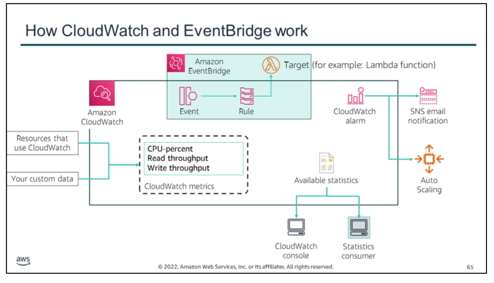
**How CloudWatch and EventBridge work**

This architecture shows how CloudWatch and EventBridge work, at a high level.

**CloudWatch acts as a metrics repository.**
- An AWS service—such as Amazon EC2—puts metrics into the repository, and you retrieve statistics based on those metrics.
- If you put your own custom metrics into the repository, you can also retrieve statistics on these metrics.
- You can use the metrics to calculate statistics, and then present the data graphically in the CloudWatch console.
- You can create a rule in **EventBridge** that matches incoming events and routes them to targets for processing.
- You can configure alarm actions to `stop`, `start`, or `terminate` an EC2 instance when certain criteria are met. 
- In addition, you can create alarms that initiate Amazon EC2 Auto Scaling and Amazon SNS actions on your behalf.

# quiz
Look at the answer choices and rule them out based on the keywords.
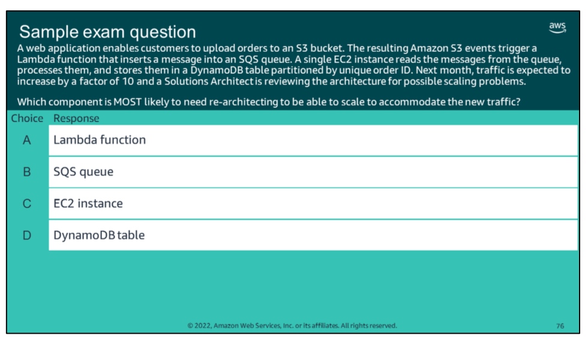

The following are the keywords to recognize: “**a single EC2 instance**” and “**able to scale**”.

The correct answer is C: EC2 instance. 
A single EC2 instance does not scale and is a single point of failure in the architecture. A better solution would be to have EC2 instances in an Auto Scaling group across two Availability Zones, and have them read messages from the queue. 
The other responses are all managed services that can be configured to scale, or that scale automatically.

# links
If you want to learn more about the topics covered in this module, you might find the following additional resources helpful:

-   Set it and Forget it: Auto Scaling Target Tracking Policies
    [(31) Set it and Forget it Auto Scaling Target Tracking Policies - AWS Online Tech Talks - YouTube](https://www.youtube.com/watch?v=srofVz6xvkE&ab_channel=AWSOnlineTechTalks)
-   Introduction to Amazon Elastic Load Balancer – Application
    
-   Configuring Auto Scaling Group with ELB Elastic Load Balancer [[ AWS 9 ] Configuring Auto Scaling Group with ELB Elastic Load Balancer - YouTube](https://www.youtube.com/watch?v=aOAqH48Cyc8&ab_channel=JustmeandOpensource) 
    
-   What Is an Application Load Balancer? [What is an Application Load Balancer? - Elastic Load Balancing (amazon.com)](https://docs.aws.amazon.com/elasticloadbalancing/latest/application/introduction.html) 