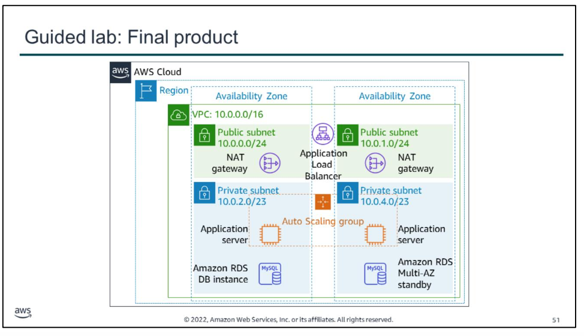
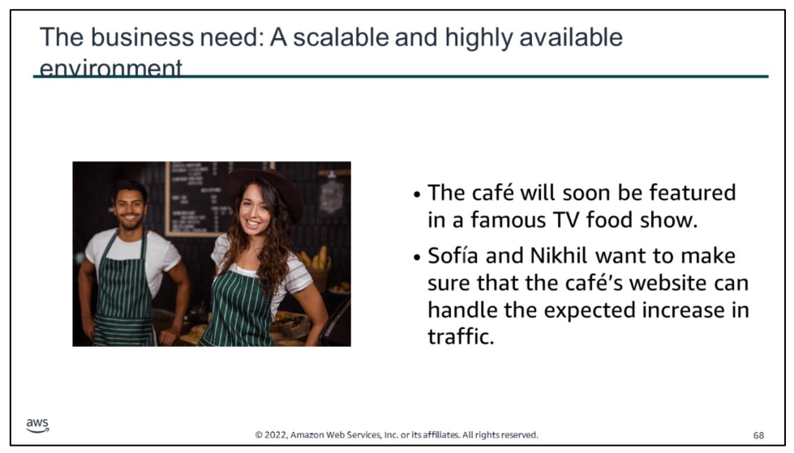
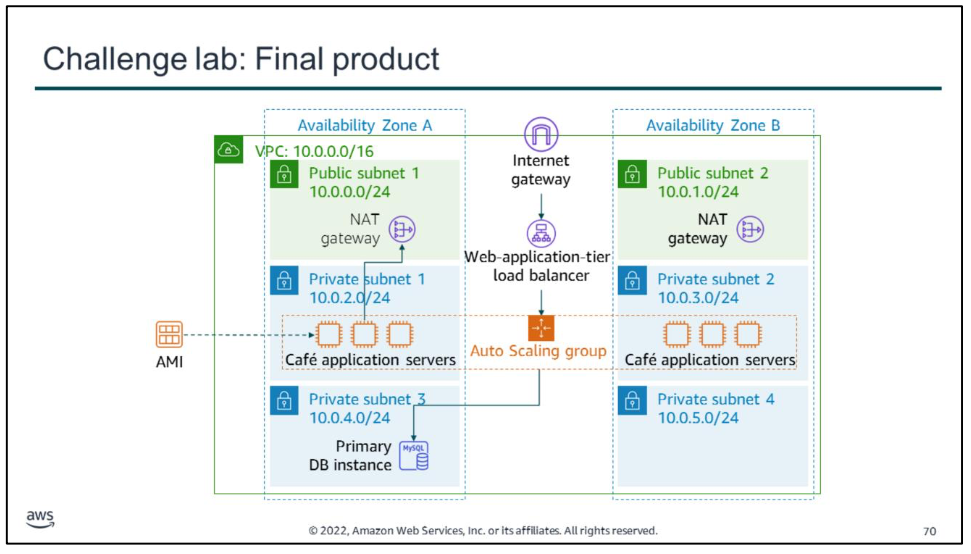

# Guided lab
In this guided lab, you will complete the following tasks: 
1. Inspect a provided VPC  
2. Create an Application Load Balancer  
3. Create an Auto Scaling group
4. Test the application for high availability

The diagram summarizes what you are going to build in the lab.

# Challenge lab

The café will soon be featured in a famous TV food show. When it airs, Sofía and Nikhil anticipate that the café’s web server will experience a temporary spike in the number of users—perhaps even up to tens of thousands of users. Currently, the café’s web server is deployed in one Availability Zone, and they are worried that it won’t be able to handle the expected increase in traffic. They want to ensure that their customers have a great experience when they visit the website, and that they don’t experience any issues, such as lags or delays in placing orders.

To ensure this experience, the website must be responsive, scale both up and down to meet fluctuating customer demand, and be highly available. It must also incorporate load balancing. Instead of overloading a single server, the architecture must distribute customer order requests across multiple application servers so it can handle the increase in demand.

In this challenge lab, you will complete the following tasks:
1.  Creating a NAT gateway for the second Availability Zone
2.  Creating a bastion host instance in a public subnet
3.  Creating a launch template
4.  Creating an Auto Scaling group
5.  Creating a load balancer
6.  Testing the web application
7.  Testing automatic scaling under load

The diagram summarizes what you will have built after you complete the lab.

try 